# 🏛️ BÁCH KHOA TOÀN THƯ HỢP NHẤT: OCP JAVA SE 25 (1Z0-831) & DSA FAANG MASTER BIBLE

> **Quy mô Tổng thể**: 19 Chuyên đề Hợp nhất | **~7,500+ Dòng Kiến Thức Toàn Diện** | **215+ Câu hỏi Trắc Nghiệm & Tình Huống**  
> **Ngôn ngữ**: Tiếng Việt (Thuật ngữ chuyên ngành Tiếng Anh chuẩn Quốc Tế JLS & JVM Internals) | **Phiên bản**: Java 25 LTS  
> **Mục tiêu**: Đảm bảo đỗ OCP Java SE 25 (1Z0-831) với điểm số 90%+ và chinh phục thuật toán phỏng vấn Big Tech / FAANG.

---

## 🧭 CẤU TRÚC HỢP NHẤT 4 TRỤ CỘT TRI THỨC


---

# PHẦN I: LỘ TRÌNH CHIẾN LƯỢC & TỔNG QUAN

# 📜 Lộ Trình OCP Java SE 25 Developer — Exam 1Z0-831

> **Chứng chỉ**: Oracle Certified Professional: Java SE 25 Developer
> **Mã đề**: 1Z0-831
> **Số câu hỏi**: 50 (multiple-choice & scenario-based)
> **Thời gian**: 120 phút
> **Điểm đạt**: 68% (≥ 34/50 câu đúng)
> **Phí thi**: ~\$245 USD
> **Thời gian chuẩn bị**: 3–4 tháng (2–3 giờ/ngày)

---

## 📋 Tổng Quan Lộ Trình

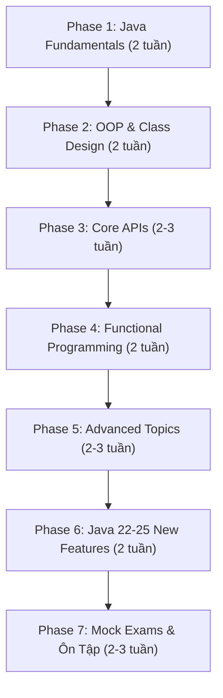

---

## 🎯 Exam Objectives — Tổng Quan Các Domain

| # | Domain | Trọng số ước tính | Ưu tiên |
|---|---|---|---|
| 1 | Handling Date, Time, Text, Numeric, Boolean Values | ~8% | 🟡 |
| 2 | Controlling Program Flow | ~8% | 🟡 |
| 3 | Java OOP (Classes, Interfaces, Enums, Records) | ~12% | 🔴 |
| 4 | Exception Handling | ~6% | 🟡 |
| 5 | Working with Arrays & Collections | ~10% | 🔴 |
| 6 | Streams & Lambda Expressions | ~12% | 🔴 |
| 7 | Java I/O API | ~6% | 🟡 |
| 8 | JDBC | ~4% | 🟢 |
| 9 | Concurrency & Multithreading | ~10% | 🔴 |
| 10 | Localization | ~4% | 🟢 |
| 11 | Modules (JPMS) | ~6% | 🟡 |
| 12 | Sealed Classes & Pattern Matching | ~6% | 🔴 |
| 13 | Records & Advanced OOP | ~4% | 🟡 |
| 14 | **Java 22–25 New Features** | ~4–6% | 🔴 |

> [!IMPORTANT]
> Trọng số ước tính dựa trên phân tích các kỳ thi OCP trước đó và thông tin từ Enthuware/Selikoff. Oracle không công bố trọng số chính xác, nhưng **OOP, Streams, Concurrency** luôn là 3 domain chiếm nhiều câu hỏi nhất.

---

## Phase 1: Java Fundamentals (2 tuần)

### 1.1 Data Types & Variables

| Chủ đề | Chi tiết cần nắm | Mức trap question |
|---|---|---|
| Primitive types | 8 kiểu (byte, short, int, long, float, double, char, boolean), giới hạn giá trị | ⚠️ Cao |
| Wrapper classes | Autoboxing/Unboxing, `Integer.valueOf()` caching (-128 to 127) | ⚠️ Cao |
| Type Casting | Widening vs Narrowing, implicit vs explicit, overflow behavior | ⚠️ Rất cao |
| `var` (LVTI) | Local Variable Type Inference — khi nào được/không được dùng | ⚠️ Trung bình |
| Text Blocks | `"""..."""`, escaping, indentation, trailing whitespace | ⚠️ Trung bình |
| String Pool | `==` vs `.equals()`, `intern()`, immutability | ⚠️ Cao |

**Bài tập thực hành:**
```java
// Câu hỏi điển hình — output là gì?
Integer a = 127, b = 127;
Integer c = 128, d = 128;
System.out.println(a == b);   // ?
System.out.println(c == d);   // ?

// Text block indentation
String text = """
        Hello
    World
        """;
// Bao nhiêu leading spaces?
```

### 1.2 Operators & Control Flow

| Chủ đề | Chi tiết cần nắm |
|---|---|
| Operator precedence | Thứ tự ưu tiên toán tử, đặc biệt `&&` vs `\|\|` vs `&` vs `\|` |
| Switch expressions | Arrow syntax `->`, `yield`, exhaustiveness |
| Pattern matching in switch | `case Integer i`, guarded patterns `when` |
| Loop constructs | `for`, enhanced `for`, `while`, `do-while`, break/continue with labels |

> [!WARNING]
> **Trap phổ biến**: Switch expressions PHẢI exhaustive (cover tất cả cases). Thiếu `default` khi switch trên `int` → **compilation error**.

---

## Phase 2: OOP & Class Design (2 tuần)

### 2.1 Core OOP

| Chủ đề | Chi tiết | Trap level |
|---|---|---|
| Constructors | Chaining, `this()`, `super()`, default constructor | ⚠️ Rất cao |
| **Flexible Constructor Bodies** 🆕 | Statements TRƯỚC `super()`/`this()` (Java 22+) | ⚠️ Cao |
| Inheritance | Method overriding rules, covariant return types | ⚠️ Cao |
| Polymorphism | Runtime vs compile-time, virtual method invocation | ⚠️ Cao |
| Abstract classes vs Interfaces | `default` methods, `static` methods, `private` methods in interfaces | ⚠️ Trung bình |
| Access modifiers | `private`, package-private, `protected`, `public` — khi nào accessible | ⚠️ Cao |

### 2.2 Records

```java
// Record — compact, immutable data carrier
public record Point(int x, int y) {
    // Compact constructor (validation)
    public Point {
        if (x < 0 || y < 0) throw new IllegalArgumentException();
    }
    
    // Custom method
    public double distanceTo(Point other) {
        return Math.sqrt(Math.pow(x - other.x, 2) + Math.pow(y - other.y, 2));
    }
}
```

**Quy tắc quan trọng của Record:**
- ❌ Không thể `extends` class khác (implicitly extends `java.lang.Record`)
- ✅ Có thể `implements` interfaces
- ❌ Không thể có instance fields ngoài components
- ✅ Có thể có static fields, static methods, instance methods
- ✅ Compact constructor không có tham số `()`
- ✅ Tự động có `equals()`, `hashCode()`, `toString()`

### 2.3 Sealed Classes & Interfaces

```java
public sealed interface Shape permits Circle, Rectangle, Triangle {}

public final class Circle implements Shape { /*...*/ }
public non-sealed class Rectangle implements Shape { /*...*/ }
public sealed class Triangle implements Shape permits EquilateralTriangle {/*...*/}
public final class EquilateralTriangle extends Triangle { /*...*/ }
```

**Quy tắc:**
- Permitted subclass PHẢI: `final`, `sealed`, hoặc `non-sealed`
- Permitted subclass PHẢI nằm trong cùng module (hoặc cùng package nếu unnamed module)
- Switch trên sealed type có thể exhaustive mà KHÔNG cần `default`

### 2.4 Pattern Matching

```java
// instanceof pattern matching
if (obj instanceof String s && s.length() > 5) {
    System.out.println(s.toUpperCase());
}

// Switch pattern matching
String describe(Shape shape) {
    return switch (shape) {
        case Circle c    -> "Circle r=" + c.radius();
        case Rectangle r -> "Rect " + r.width() + "x" + r.height();
        case Triangle t  -> "Triangle";
    };
    // Không cần default vì Shape là sealed!
}

// Record pattern (deconstruction)
if (obj instanceof Point(int x, int y)) {
    System.out.println("x=" + x + ", y=" + y);
}

// Guarded pattern
case Integer i when i > 0 -> "positive";
```

### 2.5 Nested Classes

| Loại | Static? | Access outer? | Khởi tạo |
|---|---|---|---|
| Static nested class | ✅ | Chỉ static members | `new Outer.Inner()` |
| Inner class (non-static) | ❌ | Tất cả members | `outer.new Inner()` |
| Local class | ❌ | Effectively final vars | Trong method |
| Anonymous class | ❌ | Effectively final vars | Inline |

---

## Phase 3: Core APIs (2–3 tuần)

### 3.1 String & StringBuilder

| Method | String | StringBuilder | Lưu ý |
|---|---|---|---|
| `charAt(int)` | ✅ | ✅ | IndexOutOfBoundsException |
| `substring(int, int)` | ✅ | ✅ | endIndex exclusive |
| `indexOf(String)` | ✅ | ✅ | Returns -1 if not found |
| `replace(...)` | ✅ | ✅ | String: returns new; SB: mutates |
| `strip()` / `trim()` | ✅ | ❌ | `strip()` handles Unicode whitespace |
| `indent(int)` | ✅ | ❌ | Thêm/bớt leading spaces |
| `stripIndent()` | ✅ | ❌ | Dùng với text blocks |
| `formatted(...)` | ✅ | ❌ | Như `String.format()` nhưng instance method |

### 3.2 Date & Time API (`java.time`)

| Class | Mô tả | Ví dụ |
|---|---|---|
| `LocalDate` | Ngày (không có giờ, không timezone) | `2026-08-31` |
| `LocalTime` | Giờ (không có ngày) | `14:30:00` |
| `LocalDateTime` | Ngày + Giờ (không timezone) | `2026-08-31T14:30:00` |
| `ZonedDateTime` | Ngày + Giờ + Timezone | `2026-08-31T14:30+07:00[Asia/Ho_Chi_Minh]` |
| `Instant` | Thời điểm chính xác trên timeline (UTC) | `2026-08-31T07:30:00Z` |
| `Duration` | Khoảng thời gian (giờ/phút/giây) | `PT2H30M` |
| `Period` | Khoảng thời gian (năm/tháng/ngày) | `P1Y2M3D` |
| `DateTimeFormatter` | Format/parse | `ofPattern("dd/MM/yyyy")` |

> [!CAUTION]
> `LocalDate`, `LocalTime`, `LocalDateTime` đều **immutable**. Các method như `plusDays()`, `withMonth()` đều trả về **object mới**. Quên assign lại = bug kinh điển trong đề thi.

```java
LocalDate date = LocalDate.of(2026, 1, 31);
date.plusMonths(1);          // KHÔNG thay đổi date!
date = date.plusMonths(1);   // Đúng → 2026-02-28
```

### 3.3 Arrays & Collections

**Collections Framework — Key interfaces:**

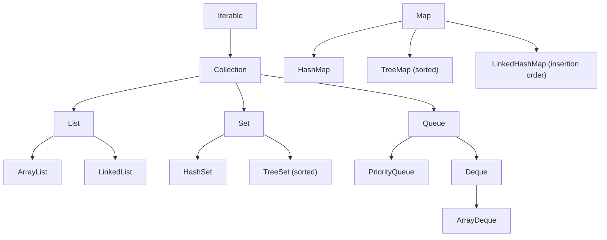

**Các method Map quan trọng (hay ra đề):**

```java
Map<String, Integer> map = new HashMap<>();

// Merge — combine values
map.merge("key", 1, Integer::sum);

// computeIfAbsent — lazy init
map.computeIfAbsent("key", k -> new ArrayList<>()).add("value");

// computeIfPresent — update existing
map.computeIfPresent("key", (k, v) -> v + 1);

// getOrDefault
map.getOrDefault("missing", 0);

// replaceAll
map.replaceAll((k, v) -> v * 2);
```

**Comparable vs Comparator:**

```java
// Comparable — natural ordering (trong chính class)
record Student(String name, int age) implements Comparable<Student> {
    public int compareTo(Student other) {
        return Integer.compare(this.age, other.age);
    }
}

// Comparator — external ordering
Comparator<Student> byName = Comparator.comparing(Student::name)
    .thenComparingInt(Student::age)
    .reversed();
```

### 3.4 Generics

| Concept | Syntax | Khi nào dùng |
|---|---|---|
| Upper bound | `<? extends Animal>` | Read (producer) — PECS: Producer Extends |
| Lower bound | `<? super Dog>` | Write (consumer) — PECS: Consumer Super |
| Unbounded | `<?>` | Chỉ đọc, chấp nhận mọi type |
| Type erasure | — | Compile-time check → runtime `Object` |

> [!TIP]
> **PECS** (Producer Extends, Consumer Super) — quy tắc vàng cho wildcards. Nếu chỉ **đọc** từ collection → `extends`. Nếu **ghi** vào → `super`.

---

## Phase 4: Functional Programming (2 tuần)

### 4.1 Functional Interfaces & Lambda

| Interface | Method | Mô tả | Ví dụ |
|---|---|---|---|
| `Predicate<T>` | `boolean test(T)` | Kiểm tra điều kiện | `s -> s.length() > 5` |
| `Function<T,R>` | `R apply(T)` | Chuyển đổi T → R | `String::length` |
| `Consumer<T>` | `void accept(T)` | Xử lý, không trả về | `System.out::println` |
| `Supplier<T>` | `T get()` | Cung cấp, không nhận | `() -> new ArrayList<>()` |
| `UnaryOperator<T>` | `T apply(T)` | T → T | `String::toUpperCase` |
| `BinaryOperator<T>` | `T apply(T,T)` | (T,T) → T | `Integer::sum` |
| `BiFunction<T,U,R>` | `R apply(T,U)` | (T,U) → R | `String::substring` |
| `BiPredicate<T,U>` | `boolean test(T,U)` | Kiểm tra 2 tham số | `String::startsWith` |

**Chaining Functional Interfaces:**
```java
Predicate<String> notEmpty = s -> !s.isEmpty();
Predicate<String> startsWithA = s -> s.startsWith("A");

// Compose
Predicate<String> combined = notEmpty.and(startsWithA);

Function<String, String> trim = String::trim;
Function<String, String> upper = String::toUpperCase;
Function<String, String> pipeline = trim.andThen(upper);
```

### 4.2 Stream API — Mastery Level

**Stream Pipeline:**

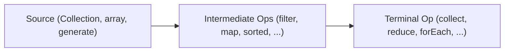

**Intermediate Operations (Lazy):**

| Operation | Type | Ví dụ |
|---|---|---|
| `filter` | `Stream<T>→Stream<T>` | `.filter(s -> s.length() > 3)` |
| `map` | `Stream<T>→Stream<R>` | `.map(String::toUpperCase)` |
| `flatMap` | `Stream<T>→Stream<R>` | `.flatMap(Collection::stream)` |
| `distinct` | `Stream<T>→Stream<T>` | `.distinct()` |
| `sorted` | `Stream<T>→Stream<T>` | `.sorted(Comparator.reverseOrder())` |
| `peek` | `Stream<T>→Stream<T>` | `.peek(System.out::println)` |
| `limit` / `skip` | `Stream<T>→Stream<T>` | `.limit(5).skip(2)` |
| `mapToInt/Long/Double` | `Stream<T>→IntStream...` | `.mapToInt(String::length)` |
| `takeWhile` / `dropWhile` | `Stream<T>→Stream<T>` | `.takeWhile(x -> x < 5)` |

**Terminal Operations:**

| Operation | Return type | Ví dụ |
|---|---|---|
| `forEach` | `void` | `.forEach(System.out::println)` |
| `collect` | `R` | `.collect(Collectors.toList())` |
| `toList()` | `List<T>` (unmodifiable) | `.toList()` |
| `reduce` | `Optional<T>` or `T` | `.reduce(0, Integer::sum)` |
| `count` | `long` | `.count()` |
| `min` / `max` | `Optional<T>` | `.min(Comparator.naturalOrder())` |
| `findFirst` / `findAny` | `Optional<T>` | `.findFirst()` |
| `allMatch/anyMatch/noneMatch` | `boolean` | `.anyMatch(String::isEmpty)` |

**Collectors nâng cao (HAY RA ĐỀ):**

```java
// groupingBy
Map<String, List<Student>> byCity = students.stream()
    .collect(Collectors.groupingBy(Student::city));

// groupingBy + downstream collector
Map<String, Long> countByCity = students.stream()
    .collect(Collectors.groupingBy(Student::city, Collectors.counting()));

Map<String, Double> avgAgeByCity = students.stream()
    .collect(Collectors.groupingBy(Student::city,
        Collectors.averagingInt(Student::age)));

// partitioningBy
Map<Boolean, List<Student>> partition = students.stream()
    .collect(Collectors.partitioningBy(s -> s.age() >= 18));

// toMap
Map<String, Integer> nameToAge = students.stream()
    .collect(Collectors.toMap(Student::name, Student::age,
        (v1, v2) -> v1));  // merge function cho duplicate keys

// joining
String names = students.stream()
    .map(Student::name)
    .collect(Collectors.joining(", ", "[", "]"));

// teeing (combine 2 collectors)
var result = students.stream()
    .collect(Collectors.teeing(
        Collectors.minBy(Comparator.comparingInt(Student::age)),
        Collectors.maxBy(Comparator.comparingInt(Student::age)),
        (min, max) -> "Youngest: " + min + ", Oldest: " + max
    ));
```

### 4.3 Optional

```java
Optional<String> opt = Optional.ofNullable(getValue());

// ✅ Correct usage
opt.ifPresent(System.out::println);
opt.ifPresentOrElse(System.out::println, () -> System.out.println("empty"));
String result = opt.orElse("default");
String result2 = opt.orElseGet(() -> computeDefault());
String result3 = opt.orElseThrow(); // NoSuchElementException
opt.map(String::toUpperCase).filter(s -> s.length() > 3).ifPresent(...);

// ❌ Anti-patterns (thi hay bẫy)
opt.get();                    // Tránh — throws NoSuchElementException
if (opt.isPresent()) {...}    // Code smell — dùng ifPresent() thay thế
Optional.of(null);            // NullPointerException!
```

---

## Phase 5: Advanced Topics (2–3 tuần)

### 5.1 Exception Handling

```java
// Multi-catch — exceptions KHÔNG được có quan hệ kế thừa
try {
    // risky code
} catch (IOException | SQLException e) {
    // e là effectively final → không thể reassign
    logger.error(e.getMessage());
}

// try-with-resources
try (var reader = new BufferedReader(new FileReader("file.txt"));
     var writer = new BufferedWriter(new FileWriter("out.txt"))) {
    // resources auto-closed in reverse order
} // Suppressed exceptions nếu cả try và close đều throw
```

> [!WARNING]
> **Trap**: Trong `try-with-resources`, nếu cả `try` block và `close()` đều throw exception → exception từ `close()` trở thành **suppressed exception** (lấy bằng `getSuppressed()`). Đề thi hay hỏi thứ tự close và suppressed exceptions.

### 5.2 Concurrency & Multithreading

| Concept | Class/Interface | Ghi chú |
|---|---|---|
| Creating threads | `Thread`, `Runnable`, `Callable<V>` | `Callable` trả về giá trị |
| Thread pool | `ExecutorService`, `Executors` | `newFixedThreadPool()`, `newCachedThreadPool()` |
| Future | `Future<V>` | `get()` blocks, `isDone()`, `cancel()` |
| Synchronization | `synchronized`, `Lock`, `ReentrantLock` | `Lock` linh hoạt hơn `synchronized` |
| Atomic classes | `AtomicInteger`, `AtomicReference` | Lock-free thread safety |
| Concurrent collections | `ConcurrentHashMap`, `CopyOnWriteArrayList` | Thread-safe collections |
| **Virtual Threads** 🆕 | `Thread.ofVirtual()`, `Thread.startVirtualThread()` | Lightweight, managed by JVM |
| Parallel streams | `.parallelStream()`, `.parallel()` | Cẩn thận side-effects & ordering |
| `CyclicBarrier` | `CyclicBarrier(int, Runnable)` | Đồng bộ N threads |

```java
// Virtual Threads (Java 21+)
try (var executor = Executors.newVirtualThreadPerTaskExecutor()) {
    IntStream.range(0, 10_000).forEach(i -> {
        executor.submit(() -> {
            Thread.sleep(Duration.ofSeconds(1));
            return i;
        });
    });
}
// ExecutorService implements AutoCloseable → auto shutdown
```

### 5.3 Java I/O

| Class | Purpose | Byte/Char |
|---|---|---|
| `FileInputStream` / `FileOutputStream` | Đọc/ghi byte | Byte |
| `BufferedInputStream` / `BufferedOutputStream` | Buffered byte I/O | Byte |
| `FileReader` / `FileWriter` | Đọc/ghi character | Char |
| `BufferedReader` / `BufferedWriter` | Buffered character I/O | Char |
| `ObjectInputStream` / `ObjectOutputStream` | Serialization | Byte |
| `PrintWriter` | Formatted text output | Char |

**NIO.2 (`java.nio.file`):**

```java
Path path = Path.of("data", "file.txt");   // hoặc Paths.get(...)

// Đọc file
List<String> lines = Files.readAllLines(path);
String content = Files.readString(path);
Stream<String> lazyLines = Files.lines(path); // lazy!

// Ghi file
Files.writeString(path, "content");
Files.write(path, List.of("line1", "line2"));

// File operations
Files.exists(path);
Files.isDirectory(path);
Files.copy(source, target, StandardCopyOption.REPLACE_EXISTING);
Files.move(source, target);
Files.delete(path);         // throws if not exists
Files.deleteIfExists(path); // returns boolean

// Walk directory
try (Stream<Path> walk = Files.walk(path, 3)) {
    walk.filter(Files::isRegularFile)
        .filter(p -> p.toString().endsWith(".java"))
        .forEach(System.out::println);
}

// Find files
try (Stream<Path> found = Files.find(path, 5,
        (p, attrs) -> attrs.isRegularFile() && p.toString().endsWith(".java"))) {
    found.forEach(System.out::println);
}
```

### 5.4 JDBC

```java
// Modern JDBC pattern
String url = "jdbc:mysql://localhost:3306/mydb";

try (Connection conn = DriverManager.getConnection(url, user, pass);
     PreparedStatement ps = conn.prepareStatement(
         "SELECT * FROM students WHERE age > ? AND city = ?")) {
    
    ps.setInt(1, 18);
    ps.setString(2, "Hanoi");
    
    try (ResultSet rs = ps.executeQuery()) {
        while (rs.next()) {
            String name = rs.getString("name");   // by column name
            int age = rs.getInt(2);                // by column index (1-based!)
        }
    }
}
```

> [!NOTE]
> JDBC trong OCP thi không quá sâu. Nắm vững: `Connection` → `PreparedStatement` → `ResultSet`, auto-close order, column index starts at **1** (không phải 0).

### 5.5 Localization

```java
// Locale
Locale locale = Locale.of("vi", "VN");  // Java 19+
Locale locale2 = new Locale.Builder()
    .setLanguage("vi").setRegion("VN").build();

// ResourceBundle
ResourceBundle rb = ResourceBundle.getBundle("messages", locale);
String greeting = rb.getString("welcome");

// NumberFormat
NumberFormat nf = NumberFormat.getCurrencyInstance(locale);
String price = nf.format(1000000); // "1.000.000 ₫"

// DateTimeFormatter with Locale
DateTimeFormatter dtf = DateTimeFormatter
    .ofLocalizedDate(FormatStyle.FULL)
    .withLocale(locale);
```

**Resource bundle loading order** (quan trọng, hay ra đề):
1. `messages_vi_VN.properties`
2. `messages_vi.properties`
3. `messages_en_US.properties` (default locale)
4. `messages_en.properties`
5. `messages.properties`

### 5.6 Modules (JPMS)

```java
// module-info.java
module com.myapp {
    requires java.sql;              // dependency
    requires transitive java.logging; // transitive dependency
    exports com.myapp.api;          // export package
    exports com.myapp.internal to com.myapp.tests; // qualified export
    opens com.myapp.model;          // reflection access
    provides com.myapp.spi.Plugin 
        with com.myapp.impl.MyPlugin; // service provider
    uses com.myapp.spi.Plugin;      // service consumer
}
```

| Directive | Mô tả |
|---|---|
| `requires` | Phụ thuộc vào module khác |
| `requires transitive` | Phụ thuộc + truyền cho module đọc module này |
| `exports` | Cho phép access package ở compile-time & runtime |
| `opens` | Cho phép reflection access (runtime only) |
| `provides...with` | Cung cấp implementation cho service |
| `uses` | Sử dụng service |

---

## Phase 6: Java 22–25 New Features 🆕 (2 tuần)

> [!IMPORTANT]
> Phần này là "delta" giữa OCP Java 21 (1Z0-830) và OCP Java 25 (1Z0-831). Nếu đã có kiến thức Java 21, tập trung vào phase này.

### 6.1 Flexible Constructor Bodies (JEP 482)

```java
public class Student extends Person {
    private final String studentId;
    
    public Student(String name, int age, String studentId) {
        // ✅ Java 25: Có thể viết code TRƯỚC super()
        if (name == null || name.isBlank()) {
            throw new IllegalArgumentException("Name required");
        }
        this.studentId = studentId;  // ✅ Assign own fields trước super()
        
        super(name, age);  // Gọi super() sau validation
    }
}
```

**Quy tắc:**
- ✅ Có thể validate arguments trước `super()`/`this()`
- ✅ Có thể assign `this.field` trước `super()`
- ❌ KHÔNG thể đọc `this.field` trước `super()` (field chưa fully initialized)
- ❌ KHÔNG thể gọi instance methods trước `super()`

### 6.2 Instance Main Methods & Compact Source Files (JEP 495/JEP 494)

```java
// Trước Java 25 — verbose
public class Hello {
    public static void main(String[] args) {
        System.out.println("Hello World");
    }
}

// Java 25 — Compact source file
void main() {
    println("Hello World");  // IO.println() auto-imported
}
```

**Launch protocol (thứ tự ưu tiên tìm main method):**
1. `static void main(String[] args)`
2. `static void main()`
3. `void main(String[] args)` (instance)
4. `void main()` (instance)

### 6.3 Unnamed Variables & Patterns (JEP 456)

```java
// Unnamed variable _ — khi không cần dùng biến
try {
    // ...
} catch (Exception _) {  // không cần tên biến
    System.out.println("Error occurred");
}

// Trong enhanced for
for (var _ : collection) {
    count++;
}

// Trong pattern matching
if (obj instanceof Point(int x, _)) {
    System.out.println("x = " + x);  // chỉ cần x, bỏ qua y
}

// Trong lambda
map.forEach((_, value) -> System.out.println(value));
```

### 6.4 Module Import Declarations (JEP 494)

```java
// Import toàn bộ public API của module
import module java.base;    // imports java.util.*, java.io.*, java.time.*, ...
import module java.sql;     // imports java.sql.*, javax.sql.*

// Giúp giảm số lượng import statements
```

### 6.5 Stream Gatherers (JEP 485)

```java
import java.util.stream.Gatherers;

// Built-in Gatherers
List<List<Integer>> windows = Stream.of(1, 2, 3, 4, 5)
    .gather(Gatherers.windowFixed(3))
    .toList();
// [[1, 2, 3], [4, 5]]

List<List<Integer>> sliding = Stream.of(1, 2, 3, 4, 5)
    .gather(Gatherers.windowSliding(3))
    .toList();
// [[1, 2, 3], [2, 3, 4], [3, 4, 5]]

// fold — like reduce but with initial value and finisher
var sum = Stream.of(1, 2, 3)
    .gather(Gatherers.fold(() -> 0, Integer::sum))
    .findFirst().orElse(0);

// scan — running accumulation
var running = Stream.of(1, 2, 3, 4)
    .gather(Gatherers.scan(() -> 0, Integer::sum))
    .toList();
// [1, 3, 6, 10]

// mapConcurrent — parallel mapping with virtual threads
var results = urls.stream()
    .gather(Gatherers.mapConcurrent(10, this::fetchUrl))
    .toList();
```

### 6.6 Scoped Values (JEP 487)

```java
// Thay thế ThreadLocal — immutable, virtual thread friendly
private static final ScopedValue<String> USER = ScopedValue.newInstance();

void handleRequest(String username) {
    ScopedValue.runWhere(USER, username, () -> {
        processRequest();  // USER.get() → username
    });
}

void processRequest() {
    String user = USER.get();  // Đọc giá trị từ scope cha
    // Nếu gọi ngoài runWhere → NoSuchElementException
    // USER.isBound() → check trước khi get
}
```

### 6.7 Structured Concurrency (JEP 505, Preview)

```java
// Quản lý nhóm subtasks — nếu 1 fail thì cancel tất cả
try (var scope = StructuredTaskScope.open(Joiner.awaitAll())) {
    Subtask<String> user = scope.fork(() -> fetchUser());
    Subtask<String> order = scope.fork(() -> fetchOrder());
    scope.join();
    
    return new Response(user.get(), order.get());
}
```

---

## 📚 Tài Liệu Tham Khảo

### Sách (Xếp theo ưu tiên)

| # | Sách | Tác giả | Mục đích | Ưu tiên |
|---|---|---|---|---|
| 1 | **OCP Java SE 25 Developer Study Guide (1Z0-831)** | Scott Selikoff, Jeanne Boyarsky | Study guide chính thức nhất, bao quát toàn bộ exam objectives | 🔴 BẮT BUỘC |
| 2 | **OCP Java SE 21 Developer Study Guide (1Z0-830)** | Selikoff & Boyarsky | Nền tảng core (nếu chưa có sách Java 25) | 🟡 Nên có |
| 3 | **Effective Java** (3rd Edition) | Joshua Bloch | Best practices, hiểu sâu Java | 🟢 Bổ sung |
| 4 | **Java: The Complete Reference** (13th+) | Herbert Schildt | Tra cứu API chi tiết | 🟢 Tra cứu |

### Mock Tests & Practice Exams

| Platform | Mô tả | Giá | Ưu tiên |
|---|---|---|---|
| **Enthuware** (1Z0-831) | Mock tests chất lượng cao nhất, sát đề thật | ~\$10 | 🔴 BẮT BUỘC |
| **MyExamCloud** (1Z0-831) | Practice tests + study notes | ~\$20 | 🟡 Nên có |
| **Udemy Practice Tests** | Nhiều bộ đề, giá rẻ khi sale | ~\$15 | 🟡 Bổ sung |
| **Oracle MyLearn** | Official training path từ Oracle | \$\$\$ | 🟢 Nếu có budget |

> [!TIP]
> **Enthuware** là tài liệu mock test **KHÔNG THỂ THIẾU**. Hầu hết người đậu OCP đều dùng Enthuware. Giá chỉ ~\$10 nhưng chất lượng cao hơn nhiều tài liệu đắt tiền. Mua sớm và làm đi làm lại.

### Video / Online Courses

| Resource | Nội dung | Link |
|---|---|---|
| **Selikoff & Boyarsky** (YouTube/Blog) | Tips từ chính tác giả study guide | selikoff.net |
| **Coding with John** (YouTube) | Giải thích concepts dễ hiểu | YouTube |
| **Jakob Jenkov** (jenkov.com) | Tutorials Java concurrency, NIO, modules | jenkov.com |
| **Baeldung** | Tutorials chi tiết từng API | baeldung.com |
| **dev.java** | Official Java tutorials từ Oracle | dev.java |

### Community & Forums

| Forum | Mô tả |
|---|---|
| **CodeRanch** (coderanch.com) | Diễn đàn Java certification lớn nhất, tác giả sách hay trả lời |
| **r/java** (Reddit) | Tin tức và thảo luận Java |
| **r/OracleCertification** (Reddit) | Chia sẻ kinh nghiệm thi |

---

## 📅 Lịch Học Gợi Ý (14 tuần)

| Tuần | Chủ đề | Hoạt động chính |
|---|---|---|
| **1** | Data types, Operators, var, Text Blocks | Đọc Study Guide Ch.1–2, code ví dụ |
| **2** | Control flow, Switch expressions, Pattern matching in switch | Đọc Ch.3, làm review questions |
| **3** | OOP: Constructors, Inheritance, Polymorphism | Đọc Ch.4–5, focus constructor chaining |
| **4** | Records, Sealed Classes, Nested Classes | Đọc Ch.6–7, code từng pattern |
| **5** | Strings, StringBuilder, Date/Time API | Đọc Ch.8, viết utility methods |
| **6** | Arrays, Collections, Generics, Comparable/Comparator | Đọc Ch.9–10, focus Map methods |
| **7** | Lambda, Functional Interfaces, Method References | Đọc Ch.11, viết lambda chains |
| **8** | Stream API (Intermediate + Terminal ops) | Đọc Ch.12, giải 30+ bài stream |
| **9** | Stream Collectors, Optional, Parallel Streams | Focus Collectors.groupingBy, partitioning |
| **10** | Exception Handling, I/O, NIO.2 | Đọc Ch.13–14, try-with-resources drill |
| **11** | Concurrency, Virtual Threads, Atomic classes | Đọc Ch.15, viết concurrent programs |
| **12** | JDBC, Localization, Modules | Đọc Ch.16–18, JDBC + ResourceBundle drill |
| **13** | **Java 22–25 New Features** + Ôn weak areas | Focus Flexible Constructors, Gatherers, Scoped Values |
| **14** | **Mock Exams** (Enthuware full tests) | Làm 4–6 full mock tests, review từng câu sai |

> [!IMPORTANT]
> **Quy tắc 70-30**: Dành 70% thời gian cho sách + code thực hành, 30% cho mock tests. Trong 2 tuần cuối, đảo lại: 70% mock tests + review.

---

## 🧠 Chiến Lược Làm Bài Thi

### Quản lý thời gian
- **120 phút / 50 câu = ~2.4 phút/câu**
- Đọc kỹ câu hỏi — nhiều trap ở wording ("does NOT compile", "choose TWO")
- **Mark & Move**: Không stuck quá 3 phút/câu → mark lại, quay về sau

### Các dạng trap phổ biến

| Trap | Ví dụ | Tip |
|---|---|---|
| **Compilation error ẩn** | Missing import, wrong access modifier | Check `import`, access levels first |
| **Immutable objects** | `String`, `LocalDate` — method returns new object | Tìm `=` assignment |
| **Off-by-one** | `substring(1,3)` → 2 chars, not 3 | endIndex is exclusive |
| **Autoboxing NPE** | `Integer i = null; int j = i;` → NPE | Check null before unboxing |
| **Stream reuse** | Stream dùng lại → `IllegalStateException` | Stream chỉ dùng 1 lần |
| **Var limitations** | `var x = null;` → compile error | var cần inferred type |
| **try-with-resources** | Close order, suppressed exceptions | Close reverse order |
| **"Select TWO/THREE"** | Bỏ sót → mất hết điểm câu đó | Đọc kỹ số lượng đáp án |

### Mindset ngày thi
1. ✅ Đọc **TOÀN BỘ** code trong câu hỏi — kể cả import
2. ✅ Check compilation errors TRƯỚC khi nghĩ về output
3. ✅ Đếm số đáp án cần chọn
4. ✅ Loại trừ đáp án sai trước
5. ❌ ĐỪNG overthink — đáp án thường straightforward hơn bạn nghĩ

---

## 🎯 Checklist Trước Ngày Thi

### Kiến thức Core
- [ ] Nắm vững tất cả 8 primitive types và giới hạn giá trị
- [ ] Hiểu rõ autoboxing, unboxing, Integer caching
- [ ] Thuộc nằm lòng method chaining trên String, StringBuilder
- [ ] Master Date/Time API — immutability, Duration vs Period
- [ ] Phân biệt rõ `Comparable` vs `Comparator`
- [ ] Collections: biết khi nào dùng `List`, `Set`, `Map`, `Queue`

### Functional & Streams
- [ ] Viết lambda / method reference không cần suy nghĩ
- [ ] Thuộc tất cả functional interfaces (Predicate, Function, Consumer, Supplier, ...)
- [ ] Master Collectors: `groupingBy`, `partitioningBy`, `toMap`, `teeing`
- [ ] Hiểu parallel streams và pitfalls

### OOP & Modern Java
- [ ] Records: compact constructor, restrictions
- [ ] Sealed classes: `sealed`, `permits`, `non-sealed`
- [ ] Pattern matching: `instanceof`, switch, record patterns, guarded patterns
- [ ] Flexible Constructor Bodies (Java 22–25) — rules
- [ ] Unnamed variables `_`

### Advanced
- [ ] Concurrency: `ExecutorService`, `Future`, virtual threads, `synchronized`
- [ ] I/O: biết khi nào dùng byte stream vs char stream vs NIO.2
- [ ] Modules: `requires`, `exports`, `opens`, `provides...with`
- [ ] Exception: try-with-resources, suppressed exceptions, multi-catch
- [ ] Stream Gatherers: `windowFixed`, `windowSliding`, `fold`, `scan`

### Mock Tests
- [ ] Hoàn thành ít nhất **4 full mock tests** từ Enthuware
- [ ] Đạt **≥ 75%** consistently trên mock tests
- [ ] Review và hiểu **mọi câu sai** — không chỉ đáp án đúng mà cả **tại sao các đáp án khác sai**
- [ ] Thời gian hoàn thành mock ≤ 100 phút (để có buffer 20 phút review)

---

> [!TIP]
> **Lời khuyên cuối**: OCP không phải đề thi kiến thức — mà là đề thi **chi tiết và edge cases**. Người biết Java giỏi vẫn có thể trượt nếu không quen dạng câu hỏi. Làm Enthuware mock tests là cách tốt nhất để làm quen với "style" câu hỏi Oracle. Chúc bạn thi đậu! 🎉


---

# 🗺️ Lộ Trình Nghiên Cứu DSA — Phỏng Vấn FAANG/Big Tech

> **Ngôn ngữ**: Java
> **Mục tiêu**: Vượt qua vòng phỏng vấn kỹ thuật tại các công ty Big Tech
> **Thời gian ước tính**: 3–6 tháng (2–3 giờ/ngày)

---

## 📋 Tổng Quan Lộ Trình

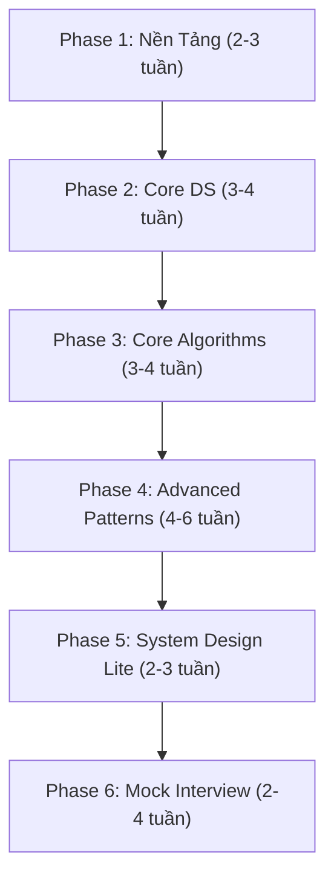

---

## Phase 1: Nền Tảng (2–3 tuần)

### 1.1 Big-O & Complexity Analysis
| Khái niệm | Mô tả | Ưu tiên |
|---|---|---|
| Time Complexity | O(1), O(log n), O(n), O(n log n), O(n²), O(2ⁿ) | 🔴 Bắt buộc |
| Space Complexity | Bộ nhớ phụ, stack space trong đệ quy | 🔴 Bắt buộc |
| Amortized Analysis | ArrayList resize, HashMap rehash | 🟡 Nên biết |
| Best / Worst / Average | Phân biệt 3 case | 🔴 Bắt buộc |

> [!TIP]
> **Mẹo phỏng vấn**: Luôn phân tích complexity **trước khi code**. Interviewer đánh giá cao việc bạn nêu trade-off giữa time và space.

**Bài tập**:
- [ ] Phân tích complexity của tất cả các thuật toán sort
- [ ] So sánh O(n log n) vs O(n²) với n = 10⁶

### 1.2 Java Collections Framework — Nắm vững API

| Data Structure | Java Class | Thao tác chính | Time Complexity |
|---|---|---|---|
| Dynamic Array | `ArrayList<E>` | get, add, remove | O(1), O(1)*, O(n) |
| Linked List | `LinkedList<E>` | addFirst, addLast, remove | O(1), O(1), O(1) |
| Stack | `ArrayDeque<E>` | push, pop, peek | O(1) |
| Queue | `ArrayDeque<E>` | offer, poll, peek | O(1) |
| HashMap | `HashMap<K,V>` | put, get, remove | O(1) avg |
| TreeMap | `TreeMap<K,V>` | put, get, floorKey, ceilingKey | O(log n) |
| HashSet | `HashSet<E>` | add, contains, remove | O(1) avg |
| PriorityQueue | `PriorityQueue<E>` | offer, poll, peek | O(log n), O(log n), O(1) |

> [!IMPORTANT]
> **Đừng dùng `Stack` class** trong Java — nó là legacy. Dùng `ArrayDeque` thay thế. Tương tự, ưu tiên `ArrayDeque` hơn `LinkedList` cho Queue.

---

## Phase 2: Cấu Trúc Dữ Liệu Cốt Lõi (3–4 tuần)

### 2.1 Arrays & Strings
| Pattern | Bài LeetCode tiêu biểu | Độ khó |
|---|---|---|
| Two Pointers | Two Sum II (#167), 3Sum (#15), Container With Most Water (#11) | 🟢🟡 |
| Sliding Window | Longest Substring Without Repeating (#3), Minimum Window Substring (#76) | 🟡🔴 |
| Prefix Sum | Subarray Sum Equals K (#560), Product of Array Except Self (#238) | 🟡 |
| Kadane's Algorithm | Maximum Subarray (#53) | 🟡 |
| String Manipulation | Valid Anagram (#242), Group Anagrams (#49) | 🟢🟡 |

**Số bài nên giải**: 25–30 bài

### 2.2 Hash Maps & Hash Sets
| Pattern | Bài LeetCode tiêu biểu | Độ khó |
|---|---|---|
| Frequency Count | Top K Frequent Elements (#347), First Unique Character (#387) | 🟡 |
| Two Sum Pattern | Two Sum (#1), 4Sum II (#454) | 🟢🟡 |
| Mapping/Grouping | Group Anagrams (#49), Isomorphic Strings (#205) | 🟡 |

**Số bài nên giải**: 10–15 bài

### 2.3 Linked List
| Pattern | Bài LeetCode tiêu biểu | Độ khó |
|---|---|---|
| Fast & Slow Pointers | Linked List Cycle (#141), Middle of LL (#876) | 🟢 |
| Reverse | Reverse Linked List (#206), Reverse Nodes in k-Group (#25) | 🟢🔴 |
| Merge | Merge Two Sorted Lists (#21), Merge K Sorted Lists (#23) | 🟢🔴 |
| Dummy Head | Remove Nth Node From End (#19), Partition List (#86) | 🟡 |

**Số bài nên giải**: 10–15 bài

### 2.4 Stack & Queue
| Pattern | Bài LeetCode tiêu biểu | Độ khó |
|---|---|---|
| Monotonic Stack | Next Greater Element (#496), Daily Temperatures (#739), Largest Rectangle in Histogram (#84) | 🟡🔴 |
| Matching/Validation | Valid Parentheses (#20), Decode String (#394) | 🟢🟡 |
| Min Stack | Min Stack (#155) | 🟡 |
| BFS with Queue | (xem phần Graph) | — |

**Số bài nên giải**: 10–12 bài

---

## Phase 3: Thuật Toán Cốt Lõi (3–4 tuần)

### 3.1 Sorting & Searching
| Thuật toán | Time | Space | Khi nào dùng |
|---|---|---|---|
| Merge Sort | O(n log n) | O(n) | Stable sort, linked list |
| Quick Sort | O(n log n) avg | O(log n) | In-place, general purpose |
| Counting Sort | O(n + k) | O(k) | Integers trong range nhỏ |
| Binary Search | O(log n) | O(1) | Sorted array, monotonic function |

**Binary Search Patterns (CỰC KỲ QUAN TRỌNG)**:
| Pattern | Bài LeetCode | Độ khó |
|---|---|---|
| Classic BS | Binary Search (#704) | 🟢 |
| BS on Answer | Koko Eating Bananas (#875), Split Array Largest Sum (#410) | 🟡🔴 |
| Search Rotated | Search in Rotated Sorted Array (#33) | 🟡 |
| Find Boundary | First Bad Version (#278), Find Peak Element (#162) | 🟢🟡 |

> [!IMPORTANT]
> Binary Search xuất hiện trong **~30% câu hỏi phỏng vấn**. Phải nắm thật chắc template: `while (lo < hi)` vs `while (lo <= hi)` và khi nào dùng cái nào.

**Số bài nên giải**: 15–20 bài

### 3.2 Recursion & Backtracking
| Pattern | Bài LeetCode | Độ khó |
|---|---|---|
| Subsets | Subsets (#78), Subsets II (#90) | 🟡 |
| Permutations | Permutations (#46), Permutations II (#47) | 🟡 |
| Combinations | Combination Sum (#39), Letter Combinations (#17) | 🟡 |
| Board Search | Word Search (#79), N-Queens (#51), Sudoku Solver (#37) | 🟡🔴 |

> [!TIP]
> Backtracking = DFS + Pruning. Luôn vẽ cây đệ quy (recursion tree) trước khi code.

**Số bài nên giải**: 12–15 bài

### 3.3 Trees (Binary Tree, BST)
| Pattern | Bài LeetCode | Độ khó |
|---|---|---|
| DFS Traversal | Inorder (#94), Preorder (#144), Postorder (#145) | 🟢 |
| BFS / Level Order | Level Order Traversal (#102), Zigzag (#103) | 🟡 |
| Recursive thinking | Maximum Depth (#104), Balanced BT (#110), Diameter (#543) | 🟢🟡 |
| BST Properties | Validate BST (#98), Kth Smallest (#230), LCA of BST (#235) | 🟡 |
| Path Problems | Path Sum (#112), Binary Tree Max Path Sum (#124) | 🟢🔴 |
| Construction | Construct BT from Preorder & Inorder (#105) | 🟡 |
| Serialization | Serialize and Deserialize BT (#297) | 🔴 |

> [!IMPORTANT]
> Trees là **chủ đề được hỏi nhiều nhất** trong phỏng vấn. Phải giải ít nhất 20 bài tree.

**Số bài nên giải**: 20–25 bài

### 3.4 Heap / Priority Queue
| Pattern | Bài LeetCode | Độ khó |
|---|---|---|
| Top K | Kth Largest Element (#215), Top K Frequent (#347) | 🟡 |
| Merge K Streams | Merge K Sorted Lists (#23) | 🔴 |
| Running Median | Find Median from Data Stream (#295) | 🔴 |
| Scheduling | Task Scheduler (#621), Meeting Rooms II (#253) | 🟡 |

**Số bài nên giải**: 8–10 bài

---

## Phase 4: Advanced Patterns (4–6 tuần)

### 4.1 Graph
| Pattern | Bài LeetCode | Độ khó |
|---|---|---|
| BFS | Number of Islands (#200), Rotting Oranges (#994) | 🟡 |
| DFS | Clone Graph (#133), Pacific Atlantic Water Flow (#417) | 🟡 |
| Topological Sort | Course Schedule (#207), Alien Dictionary (#269) | 🟡🔴 |
| Union-Find | Number of Connected Components (#323), Redundant Connection (#684) | 🟡 |
| Shortest Path (Dijkstra) | Network Delay Time (#743), Cheapest Flights (#787) | 🟡🔴 |

> [!TIP]
> Graph problems thường được **ngụy trang** (ví dụ: matrix = implicit graph, word ladder = BFS trên strings). Nhận diện pattern là kỹ năng then chốt.

**Số bài nên giải**: 15–20 bài

### 4.2 Dynamic Programming (DP)
| Pattern | Bài LeetCode | Độ khó |
|---|---|---|
| 1D DP | Climbing Stairs (#70), House Robber (#198), Coin Change (#322) | 🟢🟡 |
| 2D DP | Unique Paths (#62), Longest Common Subsequence (#1143), Edit Distance (#72) | 🟡🔴 |
| Knapsack | Partition Equal Subset Sum (#416), Target Sum (#494) | 🟡 |
| Interval DP | Burst Balloons (#312) | 🔴 |
| String DP | Longest Palindromic Substring (#5), Word Break (#139), Regular Expression Matching (#10) | 🟡🔴 |
| DP on Trees | House Robber III (#337) | 🟡 |
| State Machine | Best Time to Buy and Sell Stock series (#121, #122, #123, #188, #309) | 🟡🔴 |

> [!CAUTION]
> DP là chủ đề **khó nhất** và **dễ nản nhất**. Chiến lược: bắt đầu với bài dễ, vẽ bảng DP bằng tay, rồi mới code. Đừng cố nhớ solution — hãy hiểu **cách tìm ra** recurrence relation.

**Phương pháp giải DP**:
1. **Xác định state**: Bài toán con cần biến gì? → `dp[i]`, `dp[i][j]`, ...
2. **Xác định base case**: Khi nào kết quả hiển nhiên?
3. **Xác định transition**: `dp[i] = f(dp[i-1], dp[i-2], ...)`
4. **Xác định answer**: `dp[n]` hay `max(dp[...])`?
5. **(Optional) Optimize space**: Rolling array, 1D thay 2D

**Số bài nên giải**: 25–30 bài

### 4.3 Greedy
| Pattern | Bài LeetCode | Độ khó |
|---|---|---|
| Interval | Merge Intervals (#56), Non-overlapping Intervals (#435) | 🟡 |
| Two Pointers Greedy | Jump Game (#55), Gas Station (#134) | 🟡 |
| Sorting + Greedy | Assign Cookies (#455), Queue Reconstruction (#406) | 🟡 |

**Số bài nên giải**: 8–10 bài

### 4.4 Trie
| Pattern | Bài LeetCode | Độ khó |
|---|---|---|
| Basic Trie | Implement Trie (#208) | 🟡 |
| Trie + DFS | Word Search II (#212), Design Add and Search Words (#211) | 🔴 |

**Số bài nên giải**: 4–5 bài

---

## Phase 5: System Design Lite (2–3 tuần)

> [!NOTE]
> Với vị trí Junior/Mid, phần này có thể nhẹ hơn. Với Senior+, cần đầu tư nhiều hơn.

### Design-oriented DS problems
| Bài | LeetCode | Khái niệm |
|---|---|---|
| LRU Cache | #146 | HashMap + Doubly Linked List |
| LFU Cache | #460 | HashMap + TreeMap/LinkedHashSet |
| Design Twitter | #355 | OOP + Heap + HashMap |
| Insert Delete GetRandom O(1) | #380 | ArrayList + HashMap |
| Time Based Key-Value Store | #981 | TreeMap / Binary Search |

**Số bài nên giải**: 5–8 bài

---

## Phase 6: Mock Interview & Ôn Tập (2–4 tuần)

### Chiến lược phỏng vấn
1. **Clarify** (1–2 phút): Hỏi lại input/output, constraints, edge cases
2. **Approach** (3–5 phút): Nêu brute force → optimize, phân tích complexity
3. **Code** (15–20 phút): Viết code clean, đặt tên biến rõ ràng
4. **Test** (3–5 phút): Chạy dry-run với example, edge case
5. **Optimize** (nếu còn thời gian): Cải thiện space/time

### Lịch Mock Interview
- **Tuần 1–2**: Tự mock — set timer 45 phút, giải 2 bài (1 Medium + 1 Hard)
- **Tuần 3–4**: Mock với người khác (Pramp, Interviewing.io, bạn bè)

---

## 📚 Tài Liệu Tham Khảo

### Sách
| Sách | Mục đích | Ưu tiên |
|---|---|---|
| **Cracking the Coding Interview** (Gayle McDowell) | Tổng quan phỏng vấn + bài tập cơ bản | 🔴 Bắt buộc |
| **Elements of Programming Interviews in Java** (Aziz et al.) | Bài tập nâng cao, Java-specific | 🟡 Rất tốt |
| **Algorithm Design Manual** (Skiena) | Hiểu sâu thuật toán, real-world applications | 🟡 Nên đọc |
| **Introduction to Algorithms (CLRS)** | Reference cho lý thuyết | 🟢 Tra cứu |

### Online Platforms
| Platform | Dùng cho | Link |
|---|---|---|
| **LeetCode** | Luyện bài chính | leetcode.com |
| **NeetCode 150** | Danh sách bài curated cho phỏng vấn | neetcode.io |
| **Blind 75** | 75 bài kinh điển nhất | — |
| **AlgoExpert** | Video giải thích chi tiết | algoexpert.io |
| **Interviewing.io** | Mock interview với engineers thật | interviewing.io |

### Video Courses (Miễn phí)
| Kênh | Nội dung | Ngôn ngữ |
|---|---|---|
| **NeetCode** (YouTube) | Giải thích LeetCode rõ ràng, có roadmap | English |
| **Abdul Bari** (YouTube) | Thuật toán cơ bản, animation trực quan | English |
| **Back to Back SWE** (YouTube) | Deep dive từng chủ đề | English |
| **William Fiset** (YouTube) | Graph algorithms chi tiết | English |

---

## 📅 Lịch Học Gợi Ý (16 tuần)

| Tuần | Chủ đề | Số bài/tuần |
|---|---|---|
| 1–2 | Big-O, Arrays, Strings, Two Pointers | 10–12 |
| 3–4 | HashMap, Sliding Window, Linked List | 10–12 |
| 5–6 | Stack, Queue, Binary Search | 10–12 |
| 7–8 | Trees (BT + BST) | 12–15 |
| 9–10 | Graph (BFS, DFS, Topological Sort) | 10–12 |
| 11–13 | Dynamic Programming | 15–20 |
| 14 | Heap, Trie, Greedy | 8–10 |
| 15 | Design Problems (LRU Cache, etc.) | 5–8 |
| 16 | Mock Interviews, Ôn tập weak areas | — |

> **Tổng cộng: ~120–150 bài LeetCode**

---

## 🎯 Checklist Trước Phỏng Vấn

- [ ] Giải xong Blind 75 hoặc NeetCode 150
- [ ] Có thể implement từ đầu: LinkedList, HashMap, Trie, Graph (adjacency list)
- [ ] Thành thạo Binary Search template (không cần nhìn mẫu)
- [ ] Giải được bài DP trung bình trong 25 phút
- [ ] Đã mock interview ít nhất 5 lần
- [ ] Nắm vững Java Collections API (khi nào dùng gì)
- [ ] Biết đặt câu hỏi clarification tốt
- [ ] Có thể phân tích time/space complexity ngay khi nêu approach

---

> [!TIP]
> **Nguyên tắc vàng**: Chất lượng quan trọng hơn số lượng. Hiểu **tại sao** một solution hoạt động quan trọng hơn việc nhớ solution đó. Sau khi giải xong mỗi bài, hãy tự hỏi: "Mình có thể giải bài tương tự mà không cần xem lại solution không?"


---

# PHẦN II: GIÁO TRÌNH HỢP NHẤT TỪNG PHASE (LÝ THUYẾT + JVM CHUYÊN SÂU + QUIZ)

## 📘 PHASE 1: NỀN TẢNG JAVA, KIỂU DỮ LIỆU & BỘ NHỚ JVM
### 1. Giáo trình Chuẩn & Cú pháp
# Phase 1: Nền tảng Java (Java Fundamentals) - Luyện thi OCP Java SE 25 (1Z0-831)

Tài liệu này bao gồm các kiến thức nền tảng của Java, được thiết kế đặc biệt để giúp bạn vượt qua kỳ thi OCP Java SE 25. Trọng tâm sẽ là các chi tiết kỹ thuật, các trường hợp ngoại lệ (edge cases) và các "bẫy" thường gặp trong bài thi.

---

## 1.1 Các kiểu dữ liệu nguyên thủy (Primitive Data Types) & Wrapper Classes

Java có 8 kiểu dữ liệu nguyên thủy. Hãy nhớ kỹ kích thước và phạm vi của chúng:

| Kiểu | Kích thước | Ký tự mặc định | Giá trị mặc định |
|---|---|---|---|
| `boolean` | Không xác định chính xác | N/A | `false` |
| `byte` | 8-bit | N/A | `0` |
| `short` | 16-bit | N/A | `0` |
| `char` | 16-bit | N/A (Unsigned) | `'\u0000'` |
| `int` | 32-bit | N/A | `0` |
| `long` | 64-bit | `L` hoặc `l` | `0L` |
| `float` | 32-bit | `F` hoặc `f` | `0.0f` |
| `double` | 64-bit | `D` hoặc `d` (tùy chọn) | `0.0d` |

### Literals (Giá trị hằng)
Bạn có thể biểu diễn số nguyên ở nhiều hệ cơ số:
- **Binary (Nhị phân):** Bắt đầu bằng `0b` hoặc `0B` (VD: `0b1010`)
- **Octal (Bát phân):** Bắt đầu bằng `0` (VD: `012` = 10 trong hệ thập phân)
- **Hexadecimal (Thập lục phân):** Bắt đầu bằng `0x` hoặc `0X` (VD: `0xA`)
- **Underscores (Dấu gạch dưới):** Dùng để dễ đọc (VD: `1_000_000`).

> [!WARNING]
> **BẪY:** Không được đặt dấu gạch dưới ở đầu, cuối một số, hoặc liền kề với dấu thập phân (`.`), hoặc liền kề với tiền tố hệ cơ số (`0x`, `0b`).
> Ví dụ LỖI: `_100`, `100_`, `3._14`, `0x_A`.

### Wrapper Classes, Autoboxing/Unboxing và Integer Caching
Autoboxing tự động chuyển đổi kiểu nguyên thủy sang Wrapper (VD: `int` -> `Integer`). Unboxing thì ngược lại.

> [!IMPORTANT]
> **Integer Caching:** Java cache các đối tượng `Integer` trong khoảng từ **-128 đến 127**.

```java
Integer a = 127;
Integer b = 127;
System.out.println(a == b); // true (vì nằm trong cache)

Integer c = 128;
Integer d = 128;
System.out.println(c == d); // false (tạo object mới)
System.out.println(c.equals(d)); // true (so sánh giá trị)
```

> [!WARNING]
> **BẪY Unboxing:** Cẩn thận với `NullPointerException` khi unbox một Wrapper có giá trị `null`.
> ```java
> Integer val = null;
> int primitive = val; // Ném NullPointerException tại runtime
> ```

---

## 1.2 Ép kiểu (Type Casting)

### Widening (Ép kiểu ngầm định - Implicit)
Chuyển từ kiểu nhỏ sang kiểu lớn hơn (VD: `int` -> `long`). Java tự động thực hiện.
`byte -> short -> int -> long -> float -> double` (`char` cũng có thể implicit sang `int`).

### Narrowing (Ép kiểu tường minh - Explicit)
Chuyển từ kiểu lớn sang kiểu nhỏ, có nguy cơ mất mát dữ liệu hoặc tràn số (overflow). Bắt buộc phải ép kiểu.

```java
long l = 1000L;
int i = (int) l;
```

> [!CAUTION]
> **Toán tử gán phức hợp (Compound Assignment Operators):** Các toán tử như `+=`, `-=`, `*=` tự động thực hiện ép kiểu tường minh ngầm!
> ```java
> short s = 10;
> s = s + 5; // LỖI BIÊN DỊCH: s + 5 trả về int, không thể gán trực tiếp cho short
> s += 5;    // HỢP LỆ: Tương đương với s = (short)(s + 5)
> ```

---

## 1.3 String, StringBuilder, Text Blocks

### String Immutability và String Pool
`String` trong Java là bất biến (immutable). String literals được lưu trong String Pool.

```java
String s1 = "hello";
String s2 = "hello";
String s3 = new String("hello");

System.out.println(s1 == s2);      // true (cùng tham chiếu trong Pool)
System.out.println(s1 == s3);      // false (s3 là object mới trên Heap)
System.out.println(s1.intern() == s3.intern()); // true
```

### Các method quan trọng của String
- `strip()`, `trim()`: Loại bỏ khoảng trắng. `strip()` sử dụng định nghĩa Unicode chuẩn hơn so với `trim()`.
- `indent(int n)`: Thêm hoặc bớt thụt lề.
- `isBlank()` vs `isEmpty()`.

### StringBuilder
Mutable, không an toàn luồng (thread-safe) (dùng `StringBuffer` nếu cần thread-safe).

```java
StringBuilder sb = new StringBuilder("Java");
sb.append(" 25").reverse(); // "52 avaJ"
```

### Text Blocks (Java 15+)
Sử dụng `"""` để khai báo String nhiều dòng.

```java
String html = """
        <html>
            <body>
                <p>Hello</p>
            </body>
        </html>"""; 
```
- **Thụt lề:** Khoảng trắng chung ở đầu các dòng sẽ bị tự động loại bỏ (incidental whitespace).
- Vị trí đóng `"""` quyết định khoảng trắng phía sau cuối cùng.
- Ký tự `\` ở cuối dòng giúp nối dòng tiếp theo thành một dòng duy nhất.
- Ký tự `\s` đại diện cho một khoảng trắng tường minh (ngăn chặn việc cắt bỏ khoảng trắng thừa ở cuối dòng).

---

## 1.4 `var` (Local Variable Type Inference)

`var` cho phép compiler suy luận kiểu dữ liệu. Chỉ áp dụng cho **biến cục bộ**.

> [!WARNING]
> **BẪY - Nơi KHÔNG thể dùng `var`:**
> - Khai báo trường (fields/instance variables) trong class
> - Tham số của phương thức hoặc hàm tạo
> - Kiểu trả về của phương thức
> - Khai báo biến mà không khởi tạo ngay (VD: `var x; x = 10;` -> Lỗi biên dịch)
> - Khởi tạo với `null` (VD: `var x = null;` -> Lỗi biên dịch)
> - Gán trực tiếp một mảng mà không có từ khóa `new` (VD: `var arr = {1, 2, 3};` -> Lỗi, phải là `var arr = new int[]{1, 2, 3};`)

```java
var map = new HashMap<String, Integer>(); // Hợp lệ, map là HashMap<String, Integer>
var list = new ArrayList<>(); // Hợp lệ, nhưng list là ArrayList<Object>
var lambda = (String s) -> s.length(); // Lỗi biên dịch! var không thể suy luận trực tiếp lambda
```

---

## 1.5 Toán tử (Operators)

### Short-circuit vs Non-short-circuit
- `&&` và `||`: Short-circuit (ngắt đoản mạch) - Nếu phần bên trái đã đủ quyết định kết quả, phần bên phải sẽ KHÔNG được thực thi.
- `&` và `|`: Luôn luôn thực thi cả hai bên.

```java
int x = 0;
boolean a = (x > 0) && (++x > 0); 
System.out.println(x); // In ra 0 vì ++x không chạy

int y = 0;
boolean b = (y > 0) & (++y > 0);
System.out.println(y); // In ra 1 vì ++y được thực thi
```

### `instanceof` Pattern Matching
Tránh ép kiểu thừa thãi.
```java
Object obj = "Java 25";
if (obj instanceof String s && s.length() > 5) {
    System.out.println(s.toUpperCase()); // s được định nghĩa và dùng ngay!
}
```

---

## 1.6 Điều khiển luồng (Control Flow)

### `switch` Expression và Pattern Matching (Java 21+)
`switch` hiện tại có thể trả về giá trị (Expression) và hỗ trợ cú pháp mũi tên `->`.

```java
int day = 3;
String type = switch (day) {
    case 1, 2, 3, 4, 5 -> "Weekday";
    case 6, 7 -> "Weekend";
    default -> {
        System.out.println("Invalid");
        yield "Unknown"; // Dùng yield thay cho return để trả về giá trị trong block
    }
};
```

> [!IMPORTANT]
> `switch` Expression bắt buộc phải bao quát TẤT CẢ các trường hợp (exhaustive). Bạn gần như luôn cần `default` trừ khi dùng `enum` hoặc `sealed classes`.

### Pattern Matching for switch (Java 21+) với `when` guard
```java
Object obj = 120;
String msg = switch(obj) {
    case Integer i when i > 100 -> "Large integer";
    case Integer i -> "Small integer";
    case String s -> "String";
    default -> "Unknown";
};
```

### Unreachable Code
Mã không thể đạt tới sẽ gây lỗi biên dịch.
```java
while (false) { 
    System.out.println("Hi"); // Lỗi biên dịch: Unreachable code
}
```

---

# Practice Quiz

**Câu 1:** Xem xét đoạn mã sau:
```java
int val = 012;
System.out.println(val);
```
Kết quả in ra là gì?
A) 12
B) 012
C) 10
D) Lỗi biên dịch

**Câu 2:** Biểu thức nào sau đây gây lỗi biên dịch? (Chọn HAI)
A) `long x = 10; int y = 2 * (int)x;`
B) `short s = 5; s = s * 2;`
C) `float f = 3.14;`
D) `double d = 3.14f;`
E) `char c = 65;`

**Câu 3:** Đoạn mã sau có kết quả gì?
```java
Integer a = 100;
Integer b = 100;
Integer c = 500;
Integer d = 500;
System.out.println((a == b) + " " + (c == d));
```
A) true true
B) false false
C) true false
D) false true

**Câu 4:** Dòng nào sau đây khởi tạo biến bằng `var` hợp lệ? (Chọn HAI)
A) `var name = null;`
B) `var list = new ArrayList<String>();`
C) `var nums = {1, 2, 3};`
D) `var text = """
    Hello
    """;`
E) `var x = 10, y = 20;`

**Câu 5:** Kết quả của đoạn mã sau?
```java
String s1 = "Java";
s1.concat(" 25");
s1.toUpperCase();
System.out.println(s1);
```
A) Java
B) Java 25
C) JAVA
D) JAVA 25

**Câu 6:** Khai báo số nguyên nào sau đây hợp lệ?
A) `int a = _1000;`
B) `int b = 10_00.00_0;`
C) `int c = 1_000_000;`
D) `int d = 1000_;`

**Câu 7:** Xem xét đoạn mã sau.
```java
int a = 5;
int b = 10;
boolean result = (a++ > 5) && (++b > 10);
System.out.println(a + " " + b);
```
Kết quả in ra là gì?
A) 6 11
B) 6 10
C) 5 10
D) 5 11

**Câu 8:** Cú pháp `switch` nào sau đây hợp lệ trong Java 21+?
```java
int x = 2;
int y = switch (x) {
    case 1 -> 10;
    case 2 -> { yield 20; }
    default -> 30;
};
```
A) Hợp lệ, `y` nhận giá trị 20.
B) Lỗi biên dịch ở `yield 20;`.
C) Lỗi biên dịch vì thiếu `break;`.
D) Lỗi biên dịch ở mũi tên `->`.

**Câu 9:** Chuyện gì xảy ra với đoạn mã sau?
```java
Object obj = "Hello";
if (obj instanceof String s && s.length() > 3) {
    System.out.println(s.substring(1));
} else {
    System.out.println(s);
}
```
A) In ra "ello"
B) In ra "Hello"
C) Lỗi biên dịch
D) Ném ngoại lệ RuntimeException

**Câu 10:** Cho đoạn mã sau:
```java
StringBuilder sb = new StringBuilder("123");
sb.append("45").reverse().delete(1, 3);
System.out.println(sb);
```
Kết quả in ra là gì?
A) 521
B) 543
C) 541
D) 12345

**Câu 11:** Khai báo Text Block nào sau đây bị LỖI biên dịch?
A)
```java
String a = """
  hello""";
```
B)
```java
String b = """hello
""";
```
C)
```java
String c = """
    hello \
    world""";
```
D)
```java
String d = """
    """;
```

**Câu 12:** Vòng lặp nào sau đây là vòng lặp vô hạn hợp lệ? (Chọn HAI)
A) `for(;;) {}`
B) `while() {}`
C) `do {} while (true);`
D) `for(int i=0; i<10;) {}`

**Câu 13:** Đoạn mã sau in ra gì?
```java
int x = 10;
long y = 10L;
System.out.println(x == y);
```
A) true
B) false
C) Lỗi biên dịch vì khác kiểu
D) Ném ngoại lệ

**Câu 14:** Khi sử dụng Pattern Matching for switch (Java 21+), nguyên tắc thứ tự các case là gì?
A) Không quan trọng thứ tự.
B) Các case hẹp (ràng buộc nhiều hơn) phải đứng TRƯỚC các case rộng hơn.
C) Các case rộng hơn phải đứng trước các case hẹp.
D) Các case phải sắp xếp theo thứ tự bảng chữ cái của tên lớp.

**Câu 15:** Đoạn mã sau in ra gì?
```java
Integer x = null;
if (x > 0) {
    System.out.println("Positive");
} else {
    System.out.println("Not positive");
}
```
A) Positive
B) Not positive
C) Lỗi biên dịch
D) Ném NullPointerException tại runtime

---

# Đáp án và giải thích

1. **C** - `012` bắt đầu bằng `0` nên là hệ bát phân (octal). 1*8^1 + 2*8^0 = 8 + 2 = 10.
2. **B, C** - (B) `s * 2` trả về `int`, không thể gán lại cho `short` nếu không ép kiểu hoặc dùng `*=`. (C) `3.14` mặc định là `double`, không thể gán cho `float` mà không có hậu tố `f`.
3. **C** - Cache của `Integer` chỉ lưu giá trị từ -128 đến 127. 100 nằm trong khoảng này nên cùng tham chiếu (`a == b` là true). 500 nằm ngoài, tạo 2 object mới (`c == d` là false).
4. **B, D** - (A) Không thể gán null cho `var`. (C) Cần `new int[]{1,2,3}`. (E) Không thể khai báo nhiều biến trên một dòng với `var`.
5. **A** - `String` là bất biến. Các phương thức `concat` và `toUpperCase` trả về một chuỗi mới, nhưng không được gán lại cho `s1`. Giá trị `s1` vẫn là "Java".
6. **C** - Dấu gạch dưới ở đầu (A), ở cuối (D), và trong số thập phân nhưng khai báo là int (B) đều lỗi. C hợp lệ.
7. **B** - Toán tử `&&` bị short-circuit. `a++` trả về 5, so sánh `5 > 5` là false. Do đó vế sau `++b > 10` KHÔNG ĐƯỢC CHẠY. `a` tăng lên 6, `b` giữ nguyên 10.
8. **A** - Cú pháp hoàn toàn hợp lệ. Khi dùng khối `{}` trong switch expression, phải dùng `yield` để trả về giá trị thay vì `return`.
9. **C** - Lỗi biên dịch ở khối `else`. Biến `s` được tạo ra trong câu lệnh `if` do Pattern Matching, nhưng theo quy tắc scoping (phạm vi), nó chỉ tồn tại trong nhánh mà điều kiện đúng (khối `if`). Trong `else`, `s` không tồn tại.
10. **A** - Ban đầu "123". Sau `append` -> "12345". Sau `reverse()` -> "54321". `delete(1, 3)` xóa ký tự ở index 1 và 2 ('4' và '3'). Kết quả còn "521".
11. **B** - Mở block `"""` bắt buộc phải được theo sau ngay lập tức bởi một dòng mới (newline). Không thể có ký tự nào cùng dòng với `"""` mở (ngoại trừ khoảng trắng có thể bỏ qua).
12. **A, C** - (B) `while()` thiếu điều kiện là lỗi cú pháp. (D) không lặp vô hạn vì điều kiện `i<10` sẽ kết thúc nếu i được thay đổi trong thân. A và C là cú pháp hợp lệ cho lặp vô hạn.
13. **A** - Toán tử `==` tự động gán kiểu mở rộng (widening) `x` thành `long` để so sánh với `y`. `10L == 10L` trả về `true`.
14. **B** - Switch pattern matching yêu cầu "Dominance checking". Các case chung chung (như `Object` hoặc `Integer i`) phải để ở dưới cùng. Nếu để case chung lên trước, các case hẹp hơn bên dưới sẽ thành "Unreachable code" và gây lỗi biên dịch.
15. **D** - Cố gắng so sánh `x > 0`. `x` là một `Integer` và có giá trị `null`. Để thực hiện so sánh số học `>`, Java sẽ tự động unbox `x` thành `int`. Việc gọi unboxing trên một đối tượng `null` ném ra `NullPointerException`.


### 2. Lý thuyết Chuyên sâu JVM & Bytecode
# Phase 1: Java Fundamentals - Deep Theory Supplement

Tài liệu này cung cấp kiến thức chuyên sâu (Deep Theory) cho Phase 1 của kỳ thi OCP Java SE 25 (1Z0-831). Chúng ta sẽ đi sâu vào cách JVM hoạt động dưới mảng (under the hood), lý do tại sao các quy tắc ngôn ngữ (JLS - Java Language Specification) được thiết kế như vậy, và các edge cases phức tạp nhất.

---

## 1. JVM Memory Model cho Primitives & Objects

### 1.1 Stack vs Heap

Trong Java, bộ nhớ chủ yếu được chia thành Stack và Heap:
- **Stack (Thread Stack):** Mỗi thread có một stack riêng. Stack lưu trữ các local variables (biến cục bộ) và các frame của method calls. Kích thước stack cố định và việc cấp phát/giải phóng diễn ra tự động khi vào/ra method.
- **Heap:** Là vùng nhớ dùng chung cho toàn bộ JVM, nơi tất cả các đối tượng (objects) và mảng (arrays) được khởi tạo.

> [!NOTE]
> Các biến nguyên thủy (primitives) khai báo dưới dạng local variables sẽ nằm hoàn toàn trên Stack. Các biến tham chiếu (references) cũng nằm trên Stack, nhưng bản thân đối tượng mà chúng trỏ tới sẽ nằm trên Heap. Nếu primitive là instance variable của một đối tượng, nó sẽ nằm trên Heap cùng với đối tượng đó.

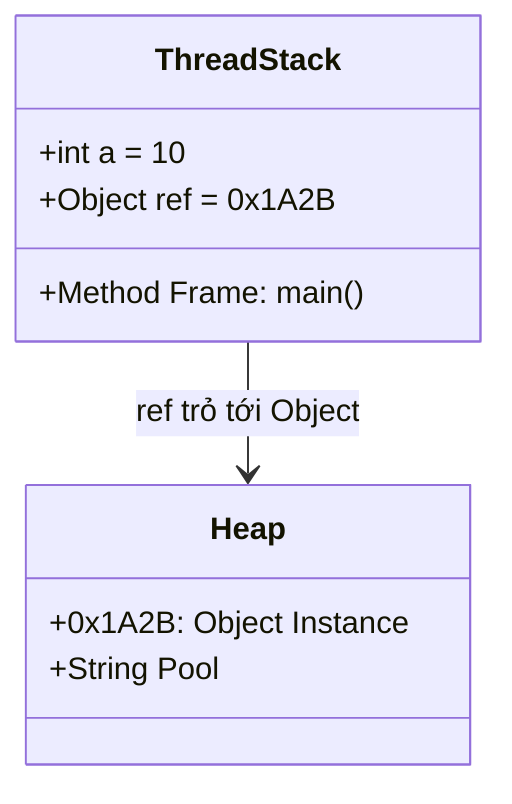

### 1.2 String Pool Internals

String Pool là một vùng nhớ đặc biệt dành riêng cho các chuỗi. Trước Java 7, nó nằm ở vùng PermGen, nhưng từ Java 7 trở đi, nó đã được chuyển vào **Heap**.

Cơ chế Interning:
Khi bạn tạo một chuỗi literal (ví dụ `String s = "hello";`), JVM sẽ kiểm tra xem "hello" đã tồn tại trong String Pool chưa. Nếu có, JVM trả về tham chiếu đến chuỗi đó. Nếu chưa, JVM tạo một object mới trong Pool.
Nếu bạn tạo bằng từ khóa `new` (ví dụ `new String("hello")`), nó luôn tạo ra một object mới trên Heap, nằm ngoài Pool (tuy nhiên literal "hello" bên trong hàm tạo vẫn có thể nằm trong Pool). Bạn có thể đưa một chuỗi vào Pool thủ công thông qua phương thức `intern()`.

### 1.3 Tại sao String là Immutable?

> [!IMPORTANT]
> Immutability của String trong Java không phải là sự ngẫu nhiên mà là thiết kế cốt lõi vì 4 lý do chính:
> 1. **Security:** String được dùng làm tham số cho network connections, file paths, class loading. Nếu String là mutable, một tham số có thể bị thay đổi sau khi được validation, dẫn đến lỗ hổng bảo mật.
> 2. **String Pool:** Để String Pool hoạt động hiệu quả, nhiều tham chiếu phải trỏ cùng vào một object. Nếu object này bị thay đổi, tất cả các tham chiếu khác sẽ bị ảnh hưởng.
> 3. **Thread Safety:** Immutable objects mặc nhiên thread-safe. Các luồng không thể thay đổi giá trị của nó.
> 4. **Hash Caching:** Vì String không thay đổi, mã băm (hash code) của nó được tính một lần và cache lại. Điều này làm cho String cực kỳ hiệu quả khi dùng làm key trong `HashMap`.

### 1.4 StringBuilder vs StringBuffer Internals

Cả hai đều dùng một mảng `byte[]` (hoặc `char[]` ở các phiên bản cũ) để lưu trữ. Khi vượt quá capacity, mảng mới sẽ được tạo.
- **Capacity growth strategy:** Capacity mới thường bằng `(oldCapacity * 2) + 2`.
- `StringBuffer` có các phương thức được đồng bộ hóa (synchronized), an toàn cho đa luồng nhưng chậm.
- `StringBuilder` không đồng bộ hóa, nhanh hơn và là lựa chọn ưu tiên trong môi trường single-thread.

---

## 2. Type System Deep Dive

### 2.1 JLS Type Promotion Rules (JLS 5.6)

Khi thực hiện phép toán số học với các kiểu dữ liệu nhỏ hơn `int` (như `byte`, `short`, `char`), Java luôn **tự động thăng kiểu (promote)** chúng lên `int` trước khi thực hiện phép toán.

```java
byte b1 = 10;
byte b2 = 20;
// byte b3 = b1 + b2; // LỖI COMPILATION!
int result = b1 + b2; // Đúng. b1 và b2 được promote lên int
```

### 2.2 Compound Assignment vs Simple Assignment (JLS 15.26.2)

Tại sao `b = b + 1` lỗi nhưng `b += 1` lại hợp lệ?

> [!TIP]
> Toán tử gán phức hợp (Compound Assignment) như `+=`, `-=`, `*=` ngầm định chứa một phép ép kiểu (implicit cast).
> `E1 op= E2` tương đương với `E1 = (T) ((E1) op (E2))`, trong đó T là kiểu của E1.

```java
byte b = 10;
b = (byte) (b + 1); // Tương đương với b += 1;
```

### 2.3 Bảng Widening và Narrowing Conversions

| Từ Kiểu | Widening (Tự động) | Narrowing (Cần Cast) |
|---|---|---|
| `byte` | `short, int, long, float, double` | `char` |
| `short` | `int, long, float, double` | `byte, char` |
| `char` | `int, long, float, double` | `byte, short` |
| `int` | `long, float, double` | `byte, short, char` |
| `long` | `float, double` | `byte, short, char, int` |

> [!WARNING]
> Khi ép kiểu hẹp (Narrowing), bạn có thể mất dữ liệu (data loss) hoặc thay đổi dấu nếu giá trị vượt quá giới hạn của kiểu mục tiêu.

### 2.4 Constant Folding

```java
byte b = 10 + 20; // Hợp lệ, dù 10 + 20 là phép toán int
```
Tại sao hợp lệ? Trình biên dịch (Compiler) thực hiện **Constant Folding**. Nó tính `10 + 20` thành `30` tại compile-time. Vì `30` nằm trong giới hạn của `byte` (-128 đến 127), việc gán này hợp lệ.

### 2.5 Float vs Double Precision (IEEE 754)

`float` và `double` không thể biểu diễn chính xác một số phân số thập phân (như 0.1). Chúng sử dụng chuẩn IEEE 754 (nhị phân).
Do đó, `0.1 + 0.2` trong nhị phân sẽ tạo ra sai số làm tròn, kết quả không phải chính xác là `0.3`.

### 2.6 Char as Unsigned 16-bit Integer

`char` là kiểu nguyên thủy **duy nhất** trong Java là unsigned (không dấu). Giới hạn của nó là từ 0 đến 65535.
Có thể thực hiện các phép toán số học trên `char`:

```java
char c = 'A'; // 65
c++; // Trở thành 'B' (66)
int val = c; // Widening, val = 66
```

---

## 3. String Internals

### 3.1 Compact Strings (JEP 254 - Java 9+)

Trước Java 9, `String` lưu trữ dữ liệu trong một `char[]`, mỗi ký tự chiếm 2 bytes. Nhưng đa số các chuỗi chỉ chứa ký tự Latin-1 (chiếm 1 byte).
Từ Java 9, `String` được thay đổi:
- Dùng `byte[] value` thay vì `char[]`.
- Thêm cờ `byte coder` để đánh dấu chuỗi đang dùng **LATIN1** (1 byte/ký tự) hay **UTF16** (2 bytes/ký tự).
Điều này giúp tiết kiệm bộ nhớ đáng kể.

### 3.2 String Concatenation: `StringConcatFactory`

Trước Java 9, toán tử `+` được compiler biên dịch thành `StringBuilder.append()`.
Từ Java 9 (JEP 280), compiler dùng lệnh `invokedynamic` trỏ đến `StringConcatFactory`. Điều này cho phép JVM tối ưu hóa chiến lược nối chuỗi tại runtime mà không cần biên dịch lại mã nguồn, tăng hiệu suất đáng kể.

### 3.3 Thay đổi của `substring()` từ Java 7

Trước Java 7, `substring()` trả về một String mới chia sẻ cùng `char[]` với chuỗi gốc (nhưng offset và count khác). Điều này gây ra memory leak nếu bạn giữ `substring` nhỏ nhưng chuỗi gốc khổng lồ không thể bị garbage collected.
Từ Java 7 Update 6, `substring()` luôn sao chép dữ liệu cần thiết sang một mảng `byte[]` hoặc `char[]` mới, đảm bảo chuỗi gốc có thể bị thu gom rác.

### 3.4 String Methods Deep Dive

- `chars()`, `codePoints()`: Trả về `IntStream` của các ký tự. Quan trọng khi làm việc với các ký tự Unicode nằm ngoài BMP (cần 2 surrogate chars).
- `transform(Function)`: Hàm tiện ích (Java 12) áp dụng Function lên chuỗi.
- `translateEscapes()`: Đánh giá các escape sequence (như `\n`, `\t`) trong chuỗi.

### 3.5 Text Blocks Whitespace Algorithm (JLS 3.10.6)

Khi sử dụng Text Blocks `"""`, JVM cần phân biệt khoảng trắng ngẫu nhiên (incidental whitespace) để căn lề và khoảng trắng cần thiết.
Thuật toán:
1. Tính khoảng trắng dẫn đầu (leading whitespace) của mọi dòng không trống.
2. Lấy giá trị nhỏ nhất làm lề (margin).
3. Xóa số lượng khoảng trắng bằng lề từ mọi dòng.
4. Xóa các khoảng trắng theo sau (trailing whitespace).

---

## 4. Operator Evaluation Deep Dive

### 4.1 Evaluation Order

> [!CAUTION]
> Các toán hạng luôn được đánh giá từ **trái sang phải** trước khi toán tử được áp dụng, bất chấp mức độ ưu tiên (precedence).

```java
int[] a = {1, 2, 3};
int i = 1;
a[i] = i = 2; // a[1] được đánh giá thành tham chiếu vị trí trước, sau đó i = 2
// Kết quả a = {1, 2, 3}, không phải {1, 2, 2} như nhiều người nghĩ!
```

### 4.2 Numeric Overflow

Java không throw exception khi tràn số (overflow/underflow) đối với kiểu nguyên (integer). Thay vào đó, nó **wrap around** (cuộn vòng).

```java
int max = Integer.MAX_VALUE; // 2147483647
System.out.println(max + 1); // -2147483648
```

### 4.3 Toán tử `==`

- **Primitives:** So sánh giá trị sau khi đã promote lên kiểu lớn nhất.
- **References:** So sánh địa chỉ bộ nhớ.
- **Autoboxing:** Cẩn thận với Integer Caching. Mặc định `Integer` cache từ -128 đến 127.
```java
Integer a = 127, b = 127; System.out.println(a == b); // true (cached)
Integer c = 128, d = 128; System.out.println(c == d); // false (new objects)
```

---

## 5. Control Flow Internals

### 5.1 Switch Under the Hood

JVM dùng 2 bytecodes cho `switch`:
1. `tableswitch`: O(1) time complexity. Dùng khi các case values liên tiếp hoặc gần nhau (ví dụ 1, 2, 3, 5). JVM tạo một mảng nhảy (jump table).
2. `lookupswitch`: O(log N) time complexity. Dùng khi các values thưa thớt (ví dụ 10, 1000, 5000). JVM dùng binary search trên các keys.

### 5.2 Switch Expressions Exhaustiveness

Đối với Switch Expressions (trả về giá trị), trình biên dịch bắt buộc tính bao quát (exhaustiveness). Mọi giá trị đầu vào có thể có đều phải có một case hoặc `default` xử lý.
Nếu dùng Enum hoặc Sealed classes, nếu bạn liệt kê đủ các nhánh, bạn không cần `default`.

### 5.3 Pattern Matching & Flow Scoping (JLS 14.30.2)

Khi dùng `instanceof` với pattern matching, biến pattern chỉ nằm trong scope (phạm vi) ở những nơi mà điều kiện **chắc chắn đúng**.

```java
Object obj = "Hello";
if (!(obj instanceof String s)) {
    return; // Ở đây s KHÔNG trong scope
}
System.out.println(s.length()); // Ở đây s TRONG scope! (Vì nếu không phải String, hàm đã return)
```

### 5.4 Dominance Rules trong Switch

Thứ tự các case rất quan trọng. Một case rộng (superclass) không được che khuất một case hẹp (subclass).

```java
switch (obj) {
    case Object o -> ... // DOMINANCE ERROR nếu đặt lên trước String
    case String s -> ... // Lỗi biên dịch vì case này không bao giờ đạt tới được
}
```

### 5.5 Guard Expressions (`when`)

Trong switch pattern, từ khóa `when` dùng làm guard.
`case String s when s.length() > 0:`
Guard chỉ được đánh giá NẾU pattern match. Không có side effects nào xảy ra đối với guard của một nhánh nếu pattern của nhánh đó không khớp.

### 5.6 For-each Loop Desugaring

Compiler biến đổi (desugar) vòng lặp for-each khác nhau tùy vào loại tập hợp.
- **Mảng (Array):** Dùng vòng lặp for với index thông thường.
- **Iterable (Collections):** Dùng `Iterator`.

```java
// Mã gốc
for (String s : list) { }

// Sau khi desugar
for (Iterator<String> i = list.iterator(); i.hasNext(); ) {
    String s = i.next();
}
```

---

## 6. var Type Inference Details

### 6.1 Inference là Kiểu Chính Xác (Exact Type)

Trình biên dịch suy luận kiểu chính xác, không phải interface rộng.
```java
var list = new ArrayList<String>(); 
// Kiểu của list là ArrayList<String>, không phải List<String>.
```

### 6.2 var với Generics (Diamond Operator)

> [!WARNING]
> Nếu dùng `var` kết hợp `<>`, compiler không có đủ thông tin, nó sẽ suy luận thành `Object`.

```java
var list = new ArrayList<>(); // Kiểu là ArrayList<Object>!
```

### 6.3 var với Ternary Operator

Kiểu của biến sẽ là kiểu chung gần nhất (Common Supertype) của cả hai nhánh.

```java
var obj = (condition) ? 10 : "Hello"; // Kiểu obj được suy luận là Serializable & Comparable<?>
```

### 6.4 var Bắt Được Anonymous Classes

Đây là một khả năng đặc biệt. Khác với khai báo thông thường bị giới hạn bởi kiểu đa hình, `var` cho phép bạn gọi các method mới được định nghĩa riêng trong anonymous class!

```java
var myObj = new Object() {
    String name = "Test";
    void sayHi() { System.out.println("Hi"); }
};
myObj.sayHi(); // Gọi được bình thường! (Nếu khai báo Object myObj thì không gọi được)
```

---

## Bài Tập Thực Hành Chuyên Sâu (10 Hard Questions)

**Q1:** Đoạn mã sau in ra gì?
```java
public class Test {
    public static void main(String[] args) {
        int a = 10;
        int b = a += a -= a += 5;
        System.out.println(a);
    }
}
```
**Đáp án & Giải thích:**
In ra `5`. 
Theo JLS 15.26.2, toán hạng trái được đánh giá trước, lưu vị trí bộ nhớ.
`a += (a -= (a += 5))`
- `a += 5` -> `a = 15`, kết quả 15.
- `a -= 15` -> tương đương `a = 10 - 15 = -5`. (toán hạng trái của `-=` được đánh giá từ trước là 10)
- `a += -5` -> tương đương `a = 10 + (-5) = 5`. (toán hạng trái của `+=` ngoài cùng đánh giá từ trước là 10)
Kết quả: 5.

**Q2:** Sự khác biệt giữa `String.intern()` và lưu chuỗi bình thường?
**Giải thích:** `intern()` đẩy chuỗi vào String Pool. Nếu Pool đã có chuỗi giống hệt (theo `equals`), nó trả về tham chiếu từ Pool, nếu chưa, nó thêm chuỗi hiện tại vào Pool.

**Q3:** Tại sao đoạn mã sau sinh lỗi biên dịch?
```java
final var x;
x = 10;
```
**Giải thích:** `var` bắt buộc phải có biểu thức khởi tạo (initializer) ngay tại thời điểm khai báo để suy luận kiểu. Không thể khai báo trước rồi gán sau.

**Q4:** Biểu thức sau đúng hay sai: `"a" + "b" == "ab"`?
**Giải thích:** True. Do Constant Folding, `"a" + "b"` được compiler tính gộp thành literal `"ab"` lúc compile. Cả hai đều trỏ vào cùng một object trong String Pool.

**Q5:** Kết quả của đoạn mã này là gì?
```java
byte b = 127;
b++;
System.out.println(b);
```
**Giải thích:** `-128`. Toán tử `++` có hàm ý ép kiểu (implicit cast). 127 + 1 = 128 (kiểu int). Ép kiểu hẹp về byte sẽ bị overflow (cuộn vòng) về -128.

**Q6:** Cho cấu trúc switch sau:
```java
Object obj = 123;
switch (obj) {
    case Number n -> System.out.print("Num ");
    case Integer i -> System.out.print("Int ");
    default -> System.out.print("Def ");
}
```
**Giải thích:** LỖI BIÊN DỊCH. Dominance rule (Quy tắc áp đảo). `Integer` là một subclass của `Number`. `case Number n` đã bao phủ toàn bộ `Integer`, nên `case Integer i` bị unreachable (không thể đạt tới).

**Q7:** Output là gì?
```java
boolean flag = false;
if (flag = true) {
    System.out.println("True");
} else {
    System.out.println("False");
}
```
**Giải thích:** In ra "True". Cú pháp `flag = true` là phép gán, trả về giá trị `true`. Nó không phải phép so sánh `==`.

**Q8:** Scope của `s` trong pattern matching. Lỗi biên dịch ở đâu?
```java
if (obj instanceof String s && s.length() > 5) {
    // block 1
} else {
    System.out.println(s); // block 2
}
```
**Giải thích:** Lỗi biên dịch ở block 2. Flow scoping xác định `s` chỉ hợp lệ (in scope) khi `obj instanceof String` là true. Tại `else`, điều đó không chắc chắn đúng (hoặc bị false ở vế đầu), do đó `s` không tồn tại ở block 2.

**Q9:** Kích thước của kiểu `char` là bao nhiêu và mã hóa mặc định là gì?
**Giải thích:** 16-bit (2 byte). Mã hóa mặc định là UTF-16. Nó đại diện cho Basic Multilingual Plane (BMP) của Unicode. Các ký tự ngoài BMP yêu cầu 2 char (surrogate pair).

**Q10:** Khi khai báo `var c = 'A' + 1;`, kiểu của `c` là gì?
**Giải thích:** Kiểu của `c` là `int`. Biểu thức có `char` và `int` literal (1) -> `char` được promote lên `int`. Giá trị là 66.


---

## 📘 PHASE 2: HƯỚNG ĐỐI TƯỢNG, THIẾT KẾ LỚP & CHU TRÌNH NẠP LỚP
### 1. Giáo trình Chuẩn & Cú pháp OOP Hiện đại
# Phase 2: Lập trình Hướng đối tượng (OOP) & Thiết kế Lớp
**Kỳ thi:** OCP Java SE 25 Developer (1Z0-831)

Tài liệu này đi sâu vào các khái niệm cốt lõi của OOP và thiết kế lớp trong Java, bao gồm các tính năng mới nhất được bổ sung trong các phiên bản Java gần đây như Flexible Constructor Bodies (Java 22+), Records, Sealed Classes, và Pattern Matching tiên tiến.

---

## 2.1 Classes & Objects (Lớp & Đối tượng)

### Cấu trúc cơ bản
Một lớp trong Java định nghĩa trạng thái (fields) và hành vi (methods).

> [!NOTE]
> Khởi tạo biến instance nếu không được gán giá trị: `0` cho số, `false` cho boolean, `null` cho object.

### Access Modifiers (Phạm vi truy cập)

| Modifier | Class | Package | Subclass | World |
| :--- | :---: | :---: | :---: | :---: |
| `public` | Y | Y | Y | Y |
| `protected` | Y | Y | Y | N |
| `default` (package-private) | Y | Y | N | N |
| `private` | Y | N | N | N |

> [!WARNING]
> **Trap exam:** `protected` cho phép subclass ở package khác truy cập, nhưng chỉ thông qua tham chiếu kế thừa. Không thể dùng biến tham chiếu của lớp cha để truy cập thành viên `protected` ở package khác!

### Thứ tự khởi tạo (Initialization Order)
1. **Static variables & static initializers** (Thực hiện một lần khi nạp lớp, từ trên xuống dưới).
2. **Instance variables & instance initializers** (Mỗi khi tạo đối tượng, từ trên xuống dưới).
3. **Constructors** (Hàm tạo).

> [!IMPORTANT]
> Khi có kế thừa, thứ tự là: `Cha (Static) -> Con (Static) -> Cha (Instance -> Constructor) -> Con (Instance -> Constructor)`.

---

## 2.2 Constructors (Hàm tạo)

### Default Constructor
Nếu không khai báo bất kỳ constructor nào, Java compiler sẽ tự tạo một *default no-arg constructor*. Nếu bạn đã viết 1 constructor (dù có tham số hay không), default constructor sẽ KHÔNG được tạo.

### Constructor Chaining (`this()` và `super()`)
Trong các phiên bản trước, `super()` hoặc `this()` **phải là lệnh đầu tiên** trong constructor.

### Flexible Constructor Bodies (Java 22+)
Bắt đầu từ Java 22 (JEP 482), Java cho phép viết các lệnh **trước** lệnh gọi `super()` hoặc `this()`, gọi là *pre-construction contexts*.

```java
public class Animal {
    public Animal(int age) { System.out.println("Animal: " + age); }
}

public class Dog extends Animal {
    public Dog(int age) {
        // Hợp lệ trong Java 22+: Các lệnh trước super()
        if (age < 0) {
            throw new IllegalArgumentException("Tuổi không hợp lệ");
        }
        int calculatedAge = age * 7;
        super(calculatedAge); 
    }
}
```

> [!CAUTION]
> **Trap exam:** Trong khối lệnh trước `super()`/`this()`, bạn **KHÔNG ĐƯỢC PHÉP** truy cập vào bất kỳ thành viên instance nào (biến hoặc phương thức) của lớp hiện tại. Việc sử dụng biến tĩnh (static) hoặc tính toán các biến cục bộ thì hoàn toàn hợp lệ.

---

## 2.3 Inheritance & Polymorphism (Kế thừa & Đa hình)

### Method Overriding (Ghi đè phương thức)
Quy tắc Override hợp lệ:
1. Access modifier không được thu hẹp (Ví dụ: cha là `protected`, con phải là `protected` hoặc `public`).
2. Return type có thể là subclass của kiểu trả về ở lớp cha (Covariant return types).
3. Không được ném checked exception rộng hơn hoặc mới so với lớp cha.

> [!WARNING]
> **Hiding vs Overriding:**
> - Instance methods được **Override** (Đa hình lúc runtime - Virtual method invocation).
> - Static methods và Variables (Fields) bị **Hide** (Quyết định bởi kiểu của tham chiếu lúc compile-time).

```java
class Parent {
    String name = "Parent";
    static void print() { System.out.println("P"); }
}
class Child extends Parent {
    String name = "Child";
    static void print() { System.out.println("C"); }
}
// Exam trick
Parent p = new Child();
System.out.println(p.name); // In ra "Parent" vì field bị HIDING
p.print(); // In ra "P" vì static method bị HIDING
```

---

## 2.4 Abstract Classes & Interfaces

### Interfaces
- Mặc định các phương thức (không body) là `public abstract`.
- Các trường (fields) mặc định là `public static final`.
- **Default methods**: Cho phép interface có method body để tương thích ngược.

> [!IMPORTANT]
> **Diamond Problem:** Khi 1 class implement 2 interface có cùng 1 default method, class đó BẮT BUỘC phải override method đó.
> Để gọi hàm của interface cụ thể: `InterfaceName.super.methodName();`

---

## 2.5 Enums

Enum là các hằng số.
- Các hằng số luôn phải đứng đầu tiên trong enum.
- Constructor của enum ngầm định là `private` (không thể dùng `public` hay `protected`).
- Enum có thể implement Interface, nhưng KHÔNG thể extend lớp khác (vì ngầm định đã extend `java.lang.Enum`).

```java
enum Status {
    OPEN(1), CLOSED(0); // Bắt buộc kết thúc bằng ; nếu có code phía sau
    private int code;
    private Status(int code) { this.code = code; }
}
```

---

## 2.6 Records (Java 16+)

Records là tính năng tạo class dữ liệu một cách ngắn gọn, các trường mặc định là `private final`.

- Tự động tạo: constructor, getters (tên giống tên field, không có chữ `get`), `equals`, `hashCode`, `toString`.
- **Không thể extend** class khác, bản thân record ngầm định là `final`.
- Có thể implement interfaces.
- Không thể khai báo thêm instance fields (nhưng có thể khai báo static fields).

### Compact Constructor
Dùng để kiểm tra dữ liệu hoặc chuẩn hóa trước khi gán.

```java
public record User(String username, int age) {
    // Compact constructor (không có ngoặc chứa tham số)
    public User {
        if (age < 0) throw new IllegalArgumentException();
        username = username.trim();
    }
}
```

---

## 2.7 Sealed Classes & Interfaces (Java 17+)

Dùng để kiểm soát những lớp nào được phép kế thừa.
- Dùng từ khóa `sealed` và `permits`.
- Subclass của một lớp `sealed` BẮT BUỘC phải khai báo 1 trong 3 modifier: `final`, `sealed`, hoặc `non-sealed`.

```java
public sealed class Shape permits Circle, Square {}

public final class Circle extends Shape {}
public non-sealed class Square extends Shape {} // Cho phép các class khác kế thừa Square
```

> [!TIP]
> Nếu các class nằm trong cùng 1 file, ta có thể bỏ qua từ khóa `permits` (compiler tự suy luận ra các permitted classes).

---

## 2.8 Nested Classes

1. **Static Nested Class**: Không gắn với instance bên ngoài, giống class thông thường. Khởi tạo: `new Outer.Nested()`.
2. **Inner Class**: Gắn với 1 instance bên ngoài. Có thể truy cập tất cả thành viên của Outer. Khởi tạo: `outerObj.new Inner()`.
3. **Local Class**: Nằm trong phương thức. Chỉ truy cập được các biến cục bộ `final` hoặc `effectively final`.
4. **Anonymous Class**: Class không tên, tạo ra ngay khi dùng `new InterfaceName()` hoặc `new ClassName()`.

---

## 2.9 Pattern Matching

### Pattern Matching for instanceof
Gộp kiểm tra và ép kiểu:
```java
if (obj instanceof String s) {
    System.out.println(s.length()); // Dùng được biến s luôn
}
```

### Record Patterns
Destructuring (tách) dữ liệu từ record trực tiếp:
```java
if (obj instanceof Point(int x, int y)) {
    System.out.println(x + y);
}
```

### Switch Pattern Matching & Guarded Patterns
Sử dụng switch với các kiểu dữ liệu và điều kiện `when` (thay vì `&&`). Bổ sung biến không tên `_` (Unnamed variables) cho các trường hợp không cần dùng đến giá trị.

```java
return switch(shape) {
    case Circle c when c.radius() > 10 -> "Big Circle";
    case Circle _ -> "Small Circle"; // Dùng _ khi không cần biến
    case Square(int s) -> "Square side " + s;
}; // switch expression phải exhaustive (phủ kín các trường hợp).
```

---

## QUIZ PRACTICE (15 CÂU HỎI)

**Câu 1:** Xem đoạn mã sau mô phỏng Flexible Constructor Bodies trong Java 22.
```java
class Vehicle {
    Vehicle(int wheels) { System.out.print("V" + wheels + " "); }
}
class Car extends Vehicle {
    static int base = 4;
    int extra = 1;
    
    Car(int extraWheels) {
        int total = base + extraWheels;
        super(total);
        System.out.print("C" + this.extra + " ");
    }
}
public class Test {
    public static void main(String[] args) {
        new Car(2);
    }
}
```
Kết quả in ra là gì?
A) `V4 C1`
B) `V6 C1`
C) Compile error tại dòng `int total = base + extraWheels;`
D) Compile error vì `super()` không phải là lệnh đầu tiên.

**Câu 2:** Cho các lớp sau:
```java
sealed class A permits B, C {}
final class B extends A {}
sealed class C extends A permits D {}
non-sealed class D extends C {}
class E extends D {}
```
Class nào bị lỗi biên dịch?
A) Class A
B) Class B
C) Class C
D) Class D
E) Không có class nào lỗi.

**Câu 3:** Chọn HAI đáp án đúng về Records:
A) Record có thể kế thừa (extend) một class thông thường.
B) Bạn có thể thêm instance variables bên trong thân của Record (không nằm trong header).
C) Compact constructor không cần khai báo danh sách tham số đầu vào.
D) Các class tạo từ Record là final một cách ngầm định.
E) Các field của Record là mutable một cách ngầm định.

**Câu 4:** Đoạn mã sau bị lỗi ở dòng nào?
```java
1: interface Walkable {
2:     default void walk() { System.out.println("Walking"); }
3: }
4: interface Runnable {
5:     default void walk() { System.out.println("Running"); }
6: }
7: class Robot implements Walkable, Runnable {
8:     public void walk() {
9:         Walkable.super.walk();
10:    }
11: }
```
A) Dòng 2 và 5
B) Dòng 7
C) Dòng 9
D) Không có lỗi biên dịch.

**Câu 5:** Kết quả khi chạy đoạn mã:
```java
class Alpha {
    String type = "A";
    public Alpha() { print(); }
    public void print() { System.out.print(type + " "); }
}
class Beta extends Alpha {
    String type = "B";
    public Beta() { print(); }
    public void print() { System.out.print(type + " "); }
}
public class Test {
    public static void main(String[] args) {
        new Beta();
    }
}
```
A) `A B `
B) `B B `
C) `null B `
D) `A A `

**Câu 6:** Khi áp dụng switch pattern matching, đoạn code nào sau đây là KHÔNG HỢP LỆ? (Giả sử Object o được truyền vào)
A) `case Integer i when i > 0 -> "Positive";`
B) `case String s && s.length() > 5 -> "Long string";`
C) `case String _ -> "Just a string";`
D) `case null, default -> "Empty or unknown";`

**Câu 7:** Xem đoạn mã Enum sau:
```java
enum TrafficLight {
    RED("Stop"), GREEN("Go"), YELLOW("Wait");
    public String message;
    private TrafficLight(String message) {
        this.message = message;
    }
}
```
Khẳng định nào đúng? (Chọn HAI)
A) Lỗi biên dịch vì hằng số Enum phải ở cuối cùng.
B) Hàm tạo của Enum chỉ có thể gọi thông qua nội bộ class Enum.
C) Cấu trúc `TrafficLight t = new TrafficLight("Slow");` là hợp lệ ở hàm main.
D) Code biên dịch hoàn toàn hợp lệ.
E) `message` phải là hằng số (`final`).

**Câu 8:** Xem xét tính năng Pattern Matching:
```java
record Point(int x, int y) {}
Object obj = new Point(10, 20);
if (obj instanceof Point(int a, int b)) {
    System.out.println(a + b);
}
```
Khẳng định nào sau đây là đúng?
A) Code in ra 30.
B) Lỗi biên dịch vì cần dùng `Point p` rồi mới gọi `p.x()` và `p.y()`.
C) Lỗi biên dịch vì tên biến `a` và `b` không khớp với `x` và `y` trong Record.
D) Ném ra exception lúc chạy.

**Câu 9:** Để sử dụng Flexible Constructor Bodies hợp lệ, dòng code nào KHÔNG được phép đặt trước lệnh `this()` hoặc `super()`?
A) `int x = 5;`
B) `System.out.println("Init");`
C) `if (Math.random() > 0.5) throw new Exception();`
D) `System.out.println(this.toString());`

**Câu 10:** Cho đoạn mã:
```java
class Outer {
    private int x = 10;
    class Inner {
        private int x = 20;
        void print() {
            int x = 30;
            System.out.print(x + " "); // (1)
            System.out.print(this.x + " "); // (2)
            System.out.print(Outer.this.x); // (3)
        }
    }
}
```
Kết quả khi khởi tạo `Inner` và gọi `print()` là gì?
A) `30 20 10`
B) `10 20 30`
C) `30 30 10`
D) Lỗi biên dịch vì Inner truy cập biến private.

**Câu 11:** Trong các thành phần sau của Java, thành phần nào KHÔNG THỂ khai báo biến (fields) kiểu instance (không phải static)?
A) Enum
B) Abstract Class
C) Interface
D) Record (ở phần body của class)

**Câu 12:** Khi thực hiện ghi đè (overriding), luật nào đúng?
A) Access modifier có thể thu hẹp (VD: từ `protected` xuống `default`).
B) Kiểu trả về (return type) có thể là lớp cha của kiểu ban đầu.
C) Phương thức overriding có thể ném thêm RuntimeException bất kỳ.
D) Phương thức overriding có thể ném thêm Checked Exception bất kỳ.

**Câu 13:** Xét đoạn code:
```java
class X {
    static void m() { System.out.print("X"); }
}
class Y extends X {
    static void m() { System.out.print("Y"); }
}
public class Test {
    public static void main(String[] args) {
        X obj = new Y();
        obj.m();
        ((Y)obj).m();
    }
}
```
Kết quả in ra là:
A) `XX`
B) `YY`
C) `XY`
D) Lỗi biên dịch

**Câu 14:** Khi sử dụng `switch` expression trong Java 25 (với pattern matching), điều gì bắt buộc đối với kiểu của argument nếu nó là một lớp `sealed`?
A) Phải có case `default`.
B) Nếu các case đã kiểm tra (cover) toàn bộ các permitted subclasses, không cần `default`.
C) `default` luôn bị cấm.
D) Không thể dùng pattern matching trên lớp `sealed`.

**Câu 15:** Cho phương thức sau chứa một local class:
```java
void doSomething() {
    int count = 10;
    class LocalTask {
        void run() { System.out.println(count); }
    }
    count = 20; // Dòng 5
    new LocalTask().run();
}
```
Điều gì sẽ xảy ra?
A) Code chạy và in ra 10.
B) Code chạy và in ra 20.
C) Lỗi biên dịch tại dòng 5 vì count bị thay đổi, làm mất tính effectively final.
D) Lỗi biên dịch ở dòng in ra `count` vì local class không được truy cập biến của hàm bao ngoài.

---

## ANSWER KEY & EXPLANATIONS (ĐÁP ÁN & GIẢI THÍCH)

**1. B**
_Giải thích:_ Java 22 cho phép Flexible Constructor Bodies. Lệnh tính toán `int total = base + extraWheels;` được chạy trước `super(6)`. Do `base` là static field, có thể truy cập được. In ra `V6`. Sau khi `super()` xong, tiếp tục in ra `C1`.

**2. E**
_Giải thích:_ Mã hoàn toàn hợp lệ. A là lớp `sealed` permit B và C. B dùng `final` (hợp lệ). C dùng `sealed` (hợp lệ, C lại permit D). D dùng `non-sealed` (hợp lệ, do đó D mở hoàn toàn). E extend D là hợp lệ vì D là `non-sealed`.

**3. C, D**
_Giải thích:_ Record sinh ra các class `final` ngầm định (D đúng). Compact constructor không cần danh sách tham số (C đúng). A sai vì record không extend class khác. B sai vì không được có thêm instance variables ngoài các thành phần khai báo. E sai vì fields là `final` (immutable).

**4. D**
_Giải thích:_ Diamond problem xảy ra ở dòng 7, nhưng class `Robot` đã giải quyết xung đột bằng cách chủ động override hàm `walk()` ở dòng 8-10. Cú pháp `Walkable.super.walk()` hợp lệ.

**5. C**
_Giải thích:_ Trap kinh điển về initialization order.
- Khi gọi `new Beta()`, `super()` (hàm tạo của Alpha) được gọi trước.
- Biến `type` của Alpha bằng "A". Nhưng hàm `print()` bị override bởi Beta!
- Hàm `print()` của Beta được gọi (Virtual Method Invocation), nó lấy biến `type` của Beta.
- Lúc này `type` của Beta CHƯA được khởi tạo (vì các instance variables của con chỉ khởi tạo sau khi constructor của cha hoàn tất). Nên `type` mang giá trị mặc định là `null`. In ra `null `.
- Xong `super()`, Beta khởi tạo `type = "B"`, gọi `print()` ở hàm tạo của Beta in ra `B `.

**6. B**
_Giải thích:_ Từ Java 21+, từ khóa được sử dụng trong Guarded Patterns là `when` chứ không phải toán tử `&&`. Cấu trúc B dùng `&&` là sai cú pháp. Các đáp án khác A, C, D đều đúng cú pháp Java 21+. `_` (unnamed variables) là chuẩn thức.

**7. B, D**
_Giải thích:_ Constructor của enum mặc định là `private` và không thể tạo đối tượng enum bên ngoài class (C sai). Hằng số enum phải khai báo ở dòng đầu tiên, nhưng các dòng code vẫn hợp lệ (A sai, D đúng). `message` không nhất thiết phải final (E sai). Code biên dịch hoàn toàn hợp lệ.

**8. A**
_Giải thích:_ Đây là tính năng Record Patterns (Destructuring). Biến `a` và `b` nhận giá trị trích xuất (extract) từ `x` và `y` tương ứng của point. Tên biến không cần trùng với field của record. Kết quả in ra là 30 (10+20).

**9. D**
_Giải thích:_ Với Flexible Constructor Bodies, không được phép truy cập/tham chiếu đến bản thân object (`this`) hoặc superclass object thông qua instance methods/variables trước khi constructor của superclass (lệnh `super()` hoặc `this()`) thực thi xong. A, B, C đều là biến cục bộ/static hoặc code tĩnh hợp lệ.

**10. A**
_Giải thích:_ Shadowing ở Nested class:
- `x` cục bộ in ra 30.
- `this.x` (biến của class Inner) in ra 20.
- `Outer.this.x` (biến của class Outer) in ra 10.

**11. C, D**
_Giải thích:_ Interface chỉ cho phép `public static final` fields. Trong phần thân `{}` của một Record, bạn cũng không được phép khai báo thêm các instance variables (nhưng static thì được). (Câu này mang tính khái niệm chung, có thể hiểu là Interface và Record Body).

**12. C**
_Giải thích:_ Khi override, bạn có thể ném thêm bất kỳ Unchecked Exception (RuntimeException) nào mà không gây lỗi (C đúng). A sai vì access modifier chỉ được mở rộng, không thu hẹp. B sai vì return type chỉ được là covariant (lớp con), không được là lớp cha. D sai vì không được ném checked exception mới/rộng hơn.

**13. C**
_Giải thích:_ Static methods bị HIDING (ẩn), không bị OVERRIDING (ghi đè đa hình). Trình biên dịch dựa vào kiểu biến tham chiếu (Reference Type) để quyết định phương thức static nào được gọi. `obj` có kiểu tham chiếu là `X` -> in ra `X`. Khi ép kiểu `((Y)obj)` -> tham chiếu là `Y` -> in ra `Y`.

**14. B**
_Giải thích:_ Switch expressions đòi hỏi Exhaustiveness (tính bao phủ hoàn toàn). Nếu type của argument là `sealed`, và switch có đầy đủ tất cả `case` cho mọi permitted subclasses, compiler tự hiểu là exhaustive và bạn KHÔNG CẦN (và đôi khi không nên) thêm `default`.

**15. C**
_Giải thích:_ Local Class hoặc Anonymous Class chỉ có thể sử dụng các biến cục bộ (local variables) của phương thức bao ngoài nếu biến đó là `final` hoặc `effectively final`. Vì dòng 5 biến `count` bị gán lại giá trị 20, nó không còn effectively final, gây lỗi biên dịch ở class bên trong khi cố truy cập `count`.


### 2. Lý thuyết Chuyên sâu JVM & Dynamic Dispatch
# Phase 2: OOP & Class Design — Deep Theory Supplement

Tài liệu này đi sâu vào kiến trúc bên trong (internal mechanisms) của JVM và Java Language Specification (JLS) liên quan đến OOP. Thay vì chỉ học "cái gì" (what), chúng ta sẽ khám phá "tại sao" (why) và "như thế nào" (how).

## 1. Class Loading & Object Lifecycle (Vòng đời đối tượng & Tải lớp)

### 1.1 Quá trình Class Loading

Khi một lớp được tham chiếu lần đầu tiên, JVM sẽ thực hiện quá trình Class Loading theo 3 giai đoạn chính: Loading, Linking, và Initialization.

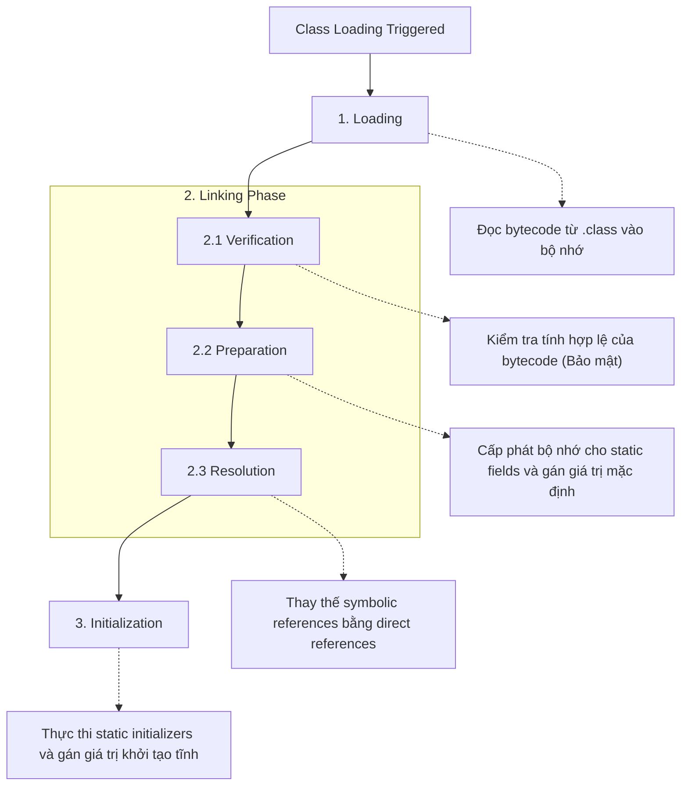

> [!NOTE]
> Trong giai đoạn **Preparation**, các biến `static` được khởi tạo bằng giá trị mặc định của kiểu dữ liệu (0, false, null), KHÔNG PHẢI giá trị được gán trong code. Việc gán giá trị thực sự diễn ra trong giai đoạn **Initialization**.

### 1.2 Thứ tự khởi tạo (Initialization Order)

Thứ tự khởi tạo là một trong những chủ đề quan trọng nhất trong OCP. Nó tuân thủ quy tắc nghiêm ngặt từ cha đến con.

```java
class Parent {
    static { System.out.println("1. Parent Static Init"); }
    { System.out.println("3. Parent Instance Init"); }
    Parent() { System.out.println("4. Parent Constructor"); }
}

class Child extends Parent {
    static { System.out.println("2. Child Static Init"); }
    { System.out.println("5. Child Instance Init"); }
    Child() { System.out.println("6. Child Constructor"); }

    public static void main(String[] args) {
        new Child();
    }
}
```

**Phân tích sâu:**
1. **Parent Static / Child Static**: Chạy đúng 1 lần khi class được load vào JVM.
2. **Instance Init / Constructor**: Chạy mỗi khi dùng từ khóa `new`.
3. JVM luôn ưu tiên hoàn thành toàn bộ ngữ cảnh tĩnh (static) trước khi tạo đối tượng.

### 1.3 Garbage Collection (GC) Eligibility

Một đối tượng trở thành "GC eligible" khi không còn root reference nào trỏ đến nó (unreachable).

- **Island of Isolation**: Hai đối tượng tham chiếu lẫn nhau nhưng không có tham chiếu nào từ bên ngoài trỏ tới chúng. Cả hai đều bị GC dọn dẹp.

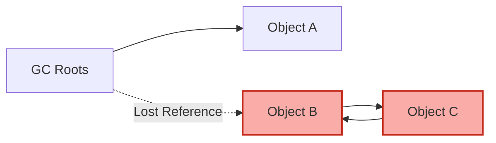

> [!WARNING]
> JVM có nhiều loại tham chiếu (Strong, Soft, Weak, Phantom). Trong OCP, trừ khi được chỉ định, tất cả tham chiếu đều là Strong. 

---

## 2. Method Dispatch Deep Dive (Chuyên sâu về Dispatch phương thức)

### 2.1 Dynamic Dispatch & Virtual Method Table (vtable)

Java sử dụng "Dynamic Dispatch" (còn gọi là Late Binding) cho các instance methods (trừ private, final). Tại runtime, JVM xác định phương thức cần gọi dựa trên **kiểu của đối tượng thực tế (actual object type)**, chứ không phải kiểu tham chiếu (reference type).

Bên dưới, JVM quản lý một cấu trúc dữ liệu gọi là **vtable** cho mỗi class.

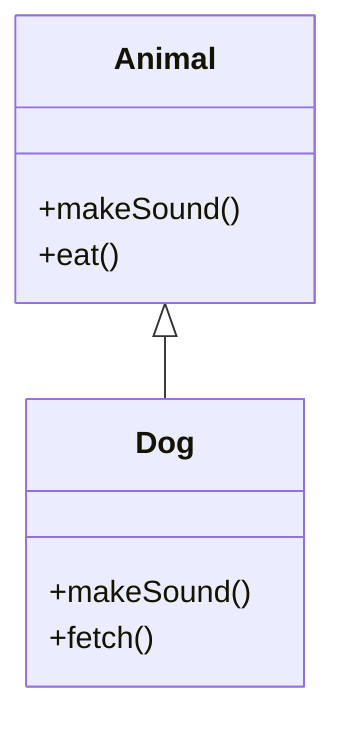

| Class vtable | Slot 0 | Slot 1 | Slot 2 |
|---|---|---|---|
| `Animal vtable` | Animal::makeSound | Animal::eat | - |
| `Dog vtable` | Dog::makeSound | Animal::eat | Dog::fetch |

Khi bạn gọi `animal.makeSound()`, JVM tra cứu vtable của đối tượng thực tế mà `animal` trỏ tới.

### 2.2 Hiding vs Overriding

> [!IMPORTANT]
> **Methods are overridden, fields are hidden!** 
> Phương thức (instance) được giải quyết tại **Runtime**. 
> Biến (fields) và Static Methods được giải quyết tại **Compile-time**.

```java
class A {
    String name = "A";
    static void print() { System.out.println("Static A"); }
    void show() { System.out.println("Instance A"); }
}
class B extends A {
    String name = "B";
    static void print() { System.out.println("Static B"); }
    void show() { System.out.println("Instance B"); }
}

public class Test {
    public static void main(String[] args) {
        A obj = new B();
        System.out.println(obj.name); // In ra "A" (Field hiding - resolve by reference type A)
        obj.print();                  // In ra "Static A" (Static hiding - resolve by reference type A)
        obj.show();                   // In ra "Instance B" (Method overriding - resolve by object type B)
    }
}
```

### 2.3 Covariant Return Types & Bridge Methods

Khi override, phương thức con có thể trả về một subtype của kiểu trả về trong phương thức cha (Covariant return type).

Bên dưới JVM, bytecode không cho phép đổi kiểu trả về khi override. Do đó, compiler sinh ra một **Bridge Method**.

```java
class Parent {
    Object get() { return null; }
}
class Child extends Parent {
    @Override
    String get() { return "Hello"; } 
    
    // COMPILER GENERATES (Bridge method):
    // synthetic bridge Object get() { return this.get(); } // calls String get()
}
```

---

## 3. Constructor Mechanics (Cơ chế nội tại của Constructor)

### 3.1 Implicit `super()` Insertion

Nếu một constructor không có `this(...)` hoặc `super(...)` ở dòng đầu tiên, compiler sẽ tự động chèn `super();`.

> [!WARNING]
> Nếu class cha KHÔNG CÓ constructor mặc định (no-arg constructor), việc compiler chèn `super();` sẽ gây lỗi biên dịch. Bạn phải gọi `super(...)` một cách tường minh với các tham số tương ứng.

### 3.2 Flexible Constructor Bodies (Java 22+)

Theo JLS, Java 22+ (JEP 482) cho phép mã thực thi **TRƯỚC** khi gọi `super()` hoặc `this()`. 
Mục tiêu là cho phép tính toán các giá trị tham số trước khi truyền cho constructor của lớp cha.

**Prologue (Tiền truyện):** Các lệnh trước `super()`/`this()`. Không được truy cập `this` hoặc các thành viên instance.
**Epilogue (Hậu truyện):** Các lệnh sau `super()`/`this()`. Có thể truy cập mọi thứ.

```java
class Person {
    String name;
    Person(String name) { this.name = name; }
}

class Employee extends Person {
    int id;
    
    Employee(String firstName, String lastName) {
        // PROLOGUE: Được phép tính toán, gán biến cục bộ, gọi static methods
        String fullName = firstName + " " + lastName;
        if (fullName.isBlank()) throw new IllegalArgumentException();
        
        // Gọi cha
        super(fullName);
        
        // EPILOGUE: Được phép dùng 'this'
        this.id = 100;
    }
}
```

---

## 4. Records Deep Dive (Chuyên sâu về Records)

Records (JEP 395) là nominal tuples, được thiết kế làm "transparent carriers for immutable data".

### 4.1 Biên dịch Record thành Bytecode

Khi bạn viết:
```java
public record Point(int x, int y) {}
```

Compiler sinh ra một lớp (class) hoàn chỉnh:
- Class là `final`.
- Extends `java.lang.Record`.
- Chứa các `private final` fields `x` và `y`.
- Canonical constructor khởi tạo tất cả các fields.
- Accessor methods `x()` và `y()` (KHÔNG PHẢI `getX()`).
- Tự động sinh `equals()`, `hashCode()`, và `toString()` dựa trên `invokedynamic`.

### 4.2 Compact Constructor

Compact constructor cho phép bạn viết logic kiểm tra (validation) mà không cần khai báo lại các tham số hoặc gán vào fields.

```java
public record Range(int lo, int hi) {
    // Compact constructor
    public Range {
        if (lo > hi) { // Validation
            throw new IllegalArgumentException(String.format("(%d,%d)", lo, hi));
        }
        // JVM tự động chèn:
        // this.lo = lo;
        // this.hi = hi;
    }
}
```

> [!CAUTION]
> Trong Compact constructor, bạn đang thao tác trên các **tham số** (parameters), không phải trên **fields** (vì các fields chưa được gán). Do đó, bạn có thể thay đổi giá trị của `lo` hoặc `hi` trước khi JVM tự động gán chúng vào `this.lo` và `this.hi`.

### 4.3 Record Serialization

> [!TIP]
> Không giống như lớp thông thường (sử dụng ma thuật reflection để gán giá trị khi deserialize bỏ qua constructor), **Record LUÔN LUÔN sử dụng Canonical Constructor** khi deserialize. Điều này đảm bảo tính bất biến (immutability) và ngăn chặn việc tạo ra các đối tượng record ở trạng thái không hợp lệ thông qua serialization manipulation.

---

## 5. Sealed Classes & Interfaces Complete Guide

Sealed classes cho phép bạn hạn chế (restrict) việc kế thừa, tạo ra một hệ thống **Algebraic Data Types (ADT)** kết hợp với Pattern Matching.

### 5.1 Compilation Model & Permits

Một sealed class sử dụng mệnh đề `permits` để xác định chính xác các class được phép kế thừa nó.
- Nếu các subclasses nằm chung file với sealed class, mệnh đề `permits` có thể bỏ qua (compiler tự suy luận).
- Các subclasses bắt buộc phải nằm trong cùng module (hoặc cùng package nếu không dùng module).

```java
public sealed interface Shape permits Circle, Rectangle, WeirdShape {}

// 1. final subclass (Kết thúc chuỗi kế thừa)
public final class Circle implements Shape {}

// 2. non-sealed subclass (Mở lại cho phép kế thừa tự do)
public non-sealed class Rectangle implements Shape {}
class Square extends Rectangle {} // Hợp lệ

// 3. sealed subclass (Tiếp tục hạn chế)
public sealed class WeirdShape implements Shape permits Star {}
public final class Star extends WeirdShape {}
```

### 5.2 Exhaustiveness trong `switch`

Lợi ích lớn nhất của Sealed classes là kết hợp với Switch Expressions. Compiler có thể kiểm tra tính toàn vẹn (exhaustiveness), nghĩa là bạn không cần khối `default`.

```java
Shape shape = new Circle();
int area = switch (shape) {
    case Circle c -> 1;
    case Rectangle r -> 2;
    case WeirdShape w -> 3;
    // Không cần default vì compiler biết chỉ có 3 nhánh chính
};
```

---

## 6. Pattern Matching Complete Reference

Pattern matching mang lại khả năng phân tách dữ liệu (destructuring) mạnh mẽ.

### 6.1 Flow Scoping (Phạm vi luồng)

Biến được tạo ra trong Pattern Matching tuân theo "Flow Scoping" (phạm vi dựa trên luồng điểu khiển), nó chỉ tồn tại ở những nơi mà JVM đảm bảo ràng buộc đã đúng (definitely assigned).

```java
Object obj = "Hello";

if (obj instanceof String s && s.length() > 3) {
    // s có thể dùng ở đây (Vế phải của && và trong khối if)
    System.out.println(s.toUpperCase());
}

// Lỗi biên dịch nếu dùng s ở đây:
// System.out.println(s); 
```

**Sử dụng với `||` và `!`:**
```java
if (!(obj instanceof String s)) {
    throw new Exception("Not a string");
}
// s LẠI ĐƯỢC PHÉP dùng ở đây! 
// Vì nếu không phải String thì đã throw exception rồi.
System.out.println(s.length()); 
```

### 6.2 Record Patterns & Unnamed Patterns (Java 21+)

Record patterns cho phép deconstruct toàn bộ record một cách thanh lịch.
Unnamed patterns (`_`) dùng để bỏ qua các biến không cần thiết (Java 22+).

```java
record Point(int x, int y) {}
record Line(Point p1, Point p2) {}

Object obj = new Line(new Point(0,0), new Point(10,20));

if (obj instanceof Line(Point(int x1, _), Point(_, int y2))) {
    // Nested pattern deconstruction!
    // Bỏ qua y1 và x2 dùng `_`
    System.out.println(x1 + y2);
}
```

### 6.3 Dominance trong Switch (Quy tắc bao trùm)

Trong `switch` pattern matching, một case không được phép che khuất (dominate) case bên dưới nó. Nhánh cụ thể hơn phải đứng trước nhánh tổng quát.

```java
Object obj = 10;
switch (obj) {
    case CharSequence s -> {} // Specific
    // case String str -> {}  // LỖI: String đã bị CharSequence che khuất (dominated)
    case Integer i when i > 0 -> {} // Guarded pattern (Specific)
    case Integer i -> {}            // General
    default -> {}
}
```

---

## 7. Nested Classes Memory Model (Mô hình bộ nhớ của Lớp lồng nhau)

### 7.1 Inner Class (Non-static Nested Class)

Mỗi instance của Inner Class ẩn (implicitly) giữ một tham chiếu trỏ về instance của Outer Class (thường gọi là `Outer.this`).

> [!WARNING]
> Đây là nguyên nhân hàng đầu gây **Memory Leak** trong Java (VD: Anonymous classes trong Android/Swing). Nếu Inner object sống lâu hơn Outer object, Outer object sẽ không thể bị GC dọn dẹp.

```java
class Outer {
    int data = 10;
    class Inner {
        void print() {
            System.out.println(Outer.this.data); // Tham chiếu ẩn!
        }
    }
}
```

### 7.2 Static Nested Class

Không có tham chiếu ẩn. Nó hoạt động y hệt một lớp bình thường, chỉ bị giới hạn bởi không gian tên (namespace) và quyền truy cập (có thể truy cập private static members của Outer). 
Luôn ưu tiên dùng Static Nested Class nếu bạn không cần truy cập instance fields của Outer.

### 7.3 Local Class & Lambda Capture

Local classes (định nghĩa trong một method) hoặc Lambdas chỉ có thể truy cập các biến cục bộ (local variables) nếu chúng là **effectively final** (chỉ gán giá trị 1 lần).
**Tại sao?** Vì biến cục bộ sống trên **Stack** và bị hủy khi method kết thúc. Nhưng đối tượng Local Class sống trên **Heap**. JVM "copy" giá trị của biến cục bộ vào đối tượng trên Heap. Nếu cho phép thay đổi, sẽ xảy ra sự không nhất quán giữa Stack và Heap.

---

## 8. Hard Practice Questions (10 Câu hỏi khó)

**Q1:** Cho đoạn code sau:
```java
class X {
    X() { System.out.print("X"); }
}
class Y extends X {
    Y() { System.out.print("Y"); }
}
class Z extends Y {
    Z() { this("Z"); System.out.print("Z2"); }
    Z(String s) { System.out.print(s); }
}
```
Kết quả khi gọi `new Z()` là gì?
A) XYZ Z2
B) XYZ2
C) X Y Z Z2
D) Lỗi biên dịch.
*Đáp án:* C. Giải thích: new Z() gọi Z(), Z() gọi Z(String), Z(String) gọi ngầm super() là Y(), Y() gọi ngầm super() là X(). Output: X -> Y -> Z -> Z2.

**Q2:** Record nào sau đây là hợp lệ?
```java
// A
public record R1(int x) { private int y = 0; }
// B
public record R2(int x) { R2 { x++; } }
// C
public record R3(int x) extends Object {}
// D
public abstract record R4(int x) {}
```
*Đáp án:* B. A sai vì record không thể có instance fields. C sai vì record tự động kế thừa `java.lang.Record`, không thể `extends` rõ ràng. D sai vì record luôn là final.

**Q3:** Output là gì?
```java
class A { String v = "A"; String getV() { return v; } }
class B extends A { String v = "B"; String getV() { return v; } }
public class Main {
    public static void main(String[] args) {
        A obj = new B();
        System.out.println(obj.v + obj.getV());
    }
}
```
A) AA
B) BB
C) AB
D) BA
*Đáp án:* C. `obj.v` resolve dựa trên tham chiếu kiểu A (Field Hiding). `obj.getV()` resolve dựa trên object B (Method Overriding).

**Q4:** Biến flow scoping `s` có thể sử dụng ở vị trí nào?
```java
Object o = "Test";
if (!(o instanceof String s) || s.length() == 0) { // L1
    System.out.println("Empty");
} else {
    System.out.println(s); // L2
}
```
A) L1 hợp lệ, L2 lỗi biên dịch.
B) L1 lỗi, L2 hợp lệ.
C) Cả L1 và L2 đều hợp lệ.
D) Cả L1 và L2 đều lỗi.
*Đáp án:* C. `s` khả dụng bên phải của `||` vì nếu nhánh trái sai, `o` CHẮC CHẮN là String. Trong nhánh `else`, nhánh `if` đã false, tức là `o` CHẮC CHẮN là String và length != 0, nên `s` khả dụng.

**Q5:** Đâu là class hierarchy cho phép biên dịch đúng?
```java
sealed class A permits B {}
final class B extends A {}
class C extends B {}
```
A) Lỗi tại dòng 1
B) Lỗi tại dòng 2
C) Lỗi tại dòng 3
D) Biên dịch thành công
*Đáp án:* C. Lớp B là `final` nên không thể kế thừa bởi C.

**Q6:** Khởi tạo object trong Java 22+.
```java
class Parent { Parent(int x) {} }
class Child extends Parent {
    Child(int x) {
        int y = x * 2;
        super(y);
        System.out.println(this.hashCode());
    }
}
```
Khối code này có biên dịch không?
A) Không, vì `super()` phải là dòng đầu tiên.
B) Không, vì không thể tạo biến `y` trước `super()`.
C) Có, đây là tính năng Flexible Constructor Bodies (Prologue).
D) Có, nhưng ném lỗi runtime.
*Đáp án:* C.

**Q7:** Khi một method được gọi bằng từ khóa `super.method()`, Dynamic Dispatch diễn ra thế nào?
A) JVM vẫn kiểm tra đối tượng thực và gọi method của lớp con nhất.
B) JVM gọi chính xác method của lớp cha (tại compile-time).
C) JVM tra cứu vtable và bỏ qua method đã bị override ở lớp hiện tại.
D) Ném exception nếu method cha là abstract.
*Đáp án:* C. Lời gọi `super` sử dụng bytecode `invokespecial` (thay vì `invokevirtual`), nên nó bypass override của class hiện tại.

**Q8:** Liên quan đến Serialization của Inner Class:
A) Nên implement Serializable cho mọi Inner Class.
B) Static Nested Class dễ serialize hơn Non-static Inner Class.
C) Lambda luôn luôn Serializable.
D) Record không thể Serializable.
*Đáp án:* B. Non-static inner class mang theo tham chiếu đến Outer class, nên Outer cũng phải Serializable.

**Q9:** `instanceof` với generics. Code nào hợp lệ?
A) `if (obj instanceof List<String> list)`
B) `if (obj instanceof List<?> list)`
C) Cả 2 đều hợp lệ
D) Cả 2 đều sai
*Đáp án:* B. Không thể dùng `instanceof` với parameterized types (List<String>) do Type Erasure tại runtime. Dùng wildcard (`?`) thì hợp lệ.

**Q10:** Khi nào khối static trong interface được thực thi?
A) Ngay khi interface được load.
B) Khi một class implement interface được load.
C) Lần đầu tiên một static field hằng số (`final`) của interface được truy cập.
D) Lần đầu tiên một method không mặc định hoặc non-constant field của interface được truy cập.
*Đáp án:* D. Gọi hằng số compile-time sẽ không trigger class initialization. Khởi tạo chỉ xảy ra khi dùng static method hoặc các thao tác "active use".


---

## 📘 PHASE 3: CORE APIS, GENERICS & BẢN CHẤT HASHMAP
### 1. Giáo trình Chuẩn & Collections Framework
# Phase 3: Core APIs - OCP Java SE 25 (1Z0-831)

Tài liệu hướng dẫn ôn tập giai đoạn 3 cho kỳ thi OCP Java SE 25 (1Z0-831). Phần này tập trung vào các API cốt lõi trong Java: Arrays, Collections, Generics, và Date/Time.

---

## 3.1 Arrays (Mảng)

### Khởi tạo và Khai báo
Mảng trong Java có kích thước cố định sau khi khởi tạo.
```java
int[] arr1 = new int[3]; // [0, 0, 0]
int[] arr2 = {1, 2, 3}; 
int[][] matrix = new int[2][];
matrix[0] = new int[3];
matrix[1] = new int[2];
```

> [!WARNING]
> Mảng đa chiều có thể bất đối xứng (asymmetric). Nếu bạn cố gắng truy cập chỉ số ngoài phạm vi đã khởi tạo của một mảng con, `ArrayIndexOutOfBoundsException` sẽ bị ném ra.

### Các phương thức tiện ích `java.util.Arrays`
- `Arrays.sort()`: Sắp xếp các phần tử.
- `Arrays.binarySearch()`: Tìm kiếm nhị phân (yêu cầu mảng đã được sắp xếp).
- `Arrays.compare()`: So sánh hai mảng theo thứ tự từ điển (lexicographically).
- `Arrays.mismatch()`: Trả về chỉ số đầu tiên mà hai mảng khác nhau, hoặc -1 nếu giống nhau.

```java
import java.util.Arrays;

public class ArrayExample {
    public static void main(String[] args) {
        int[] arr1 = {3, 1, 2};
        Arrays.sort(arr1); // [1, 2, 3]
        System.out.println(Arrays.binarySearch(arr1, 2)); // Kết quả: 1
        System.out.println(Arrays.binarySearch(arr1, 4)); // Kết quả: -4 (-(insertion point) - 1 = -3 - 1)
        
        int[] arr2 = {1, 2, 4};
        System.out.println(Arrays.compare(arr1, arr2)); // < 0 vì phần tử index 2: 3 < 4
        System.out.println(Arrays.mismatch(arr1, arr2)); // Kết quả: 2
    }
}
```

> [!IMPORTANT]
> **Trap:** Gọi `binarySearch` trên một mảng chưa sắp xếp sẽ cho kết quả không thể đoán trước.

### Arrays vs Varargs
Varargs (`...`) thực chất được biên dịch thành một mảng. Bạn có thể truyền một mảng vào tham số varargs, nhưng không thể làm ngược lại.

---

## 3.2 Collections Framework

### Các interface cốt lõi
- **List:** `ArrayList` (truy cập nhanh bằng index), `LinkedList` (chèn/xóa đầu cuối nhanh). Có duy trì thứ tự chèn, cho phép trùng lặp.
- **Set:** `HashSet` (không đảm bảo thứ tự, không trùng lặp), `LinkedHashSet` (duy trì thứ tự chèn), `TreeSet` (sắp xếp tăng dần theo Natural Ordering hoặc Comparator).
- **Queue/Deque:** `ArrayDeque` (sử dụng làm stack hoặc queue nhanh hơn LinkedList), `PriorityQueue` (các phần tử được sắp xếp ưu tiên).
- **Map:** `HashMap`, `LinkedHashMap`, `TreeMap`. Map không kế thừa `Collection`.

### Advanced Map Methods (Java 8+)
```java
import java.util.*;

public class MapAdvanced {
    public static void main(String[] args) {
        Map<String, Integer> map = new HashMap<>();
        map.put("A", 1);
        
        // putIfAbsent: Chỉ thêm nếu key chưa có hoặc value đang là null
        map.putIfAbsent("A", 2); // map.get("A") vẫn là 1
        
        // computeIfAbsent: Tính toán giá trị nếu key chưa có
        map.computeIfAbsent("B", k -> k.length()); // "B" -> 1
        
        // computeIfPresent: Cập nhật giá trị nếu key đã tồn tại (nếu function trả về null, key bị xóa)
        map.computeIfPresent("A", (k, v) -> v + 10); // "A" -> 11
        
        // merge: Kết hợp giá trị hiện tại và giá trị mới
        map.merge("A", 5, (oldVal, newVal) -> oldVal + newVal); // "A" -> 16
    }
}
```

### Immutable Collections (Java 9+)
```java
List<String> list = List.of("A", "B");
Set<String> set = Set.of("A"); // Set.of("A", "A") sẽ ném IllegalArgumentException
Map<String, Integer> map = Map.of("A", 1);

// Sao chép từ một collection khác
List<String> copied = List.copyOf(new ArrayList<>(Arrays.asList("C", "D")));
```
> [!WARNING]
> Không thể thêm phần tử `null` vào các collection được tạo bởi `List.of()`, `Set.of()`, hay `Map.of()`. Nếu cố tình thêm sẽ bị `NullPointerException`. Các immutable collection cũng ném `UnsupportedOperationException` nếu bạn gọi `.add()`, `.remove()`.

---

## 3.3 Comparable & Comparator

### Comparable (`java.lang.Comparable`)
Được sử dụng để định nghĩa "Natural Ordering" (thứ tự tự nhiên) của đối tượng. Class tự triển khai interface này.

```java
class Student implements Comparable<Student> {
    int id;
    public Student(int id) { this.id = id; }
    
    @Override
    public int compareTo(Student other) {
        return Integer.compare(this.id, other.id);
    }
}
```

### Comparator (`java.util.Comparator`)
Được sử dụng khi muốn định nghĩa các cách sắp xếp khác nhau, hoặc class không thể sửa đổi đổi để implement `Comparable`.

```java
import java.util.Comparator;

class Employee {
    String name;
    int age;
    // constructor, getters...
}

// Chained comparators
Comparator<Employee> byNameThenAge = Comparator
    .comparing((Employee e) -> e.name)
    .thenComparingInt(e -> e.age)
    .reversed();
```

> [!TIP]
> Sử dụng `Comparator.nullsFirst(Comparator.naturalOrder())` để xử lý các phần tử `null` mà không lo bị ném `NullPointerException`.

---

## 3.4 Generics

### Type Erasure (Xóa kiểu)
Kiểu Generic chỉ tồn tại lúc compile, khi chạy (runtime) tất cả các kiểu generic `T` bị thay thế bằng `Object` (hoặc bound cao nhất).

> [!CAUTION]
> **Những thứ KHÔNG THỂ làm với Generics:**
> 1. `new T()` (Không thể khởi tạo)
> 2. `T[] arr = new T[10]` (Không thể khởi tạo mảng Generic)
> 3. `if (obj instanceof List<String>)` (Sẽ báo lỗi compile vì type erasure, ngoại trừ `instanceof List<?>`)
> 4. `static T field` (Biến static không thể dùng generic type của class)

### Wildcards và PECS
- `<? extends T>`: Read-only (Chỉ đọc). Có thể lấy ra `T`, nhưng không thể thêm phần tử vào (vì không biết chính xác kiểu con nào).
- `<? super T>`: Write-only (Thêm vào). Có thể thêm `T` hoặc kiểu con của `T`, nhưng khi đọc ra chỉ đảm bảo là `Object`.

Quy tắc **PECS** (Producer Extends, Consumer Super):
- Dùng `extends` khi collection sản xuất (trả về) dữ liệu cho bạn đọc.
- Dùng `super` khi collection tiêu thụ dữ liệu (bạn thêm dữ liệu vào).

```java
List<? extends Number> list1 = new ArrayList<Integer>();
// list1.add(1); // LỖI COMPILE
Number n = list1.get(0); // OK

List<? super Integer> list2 = new ArrayList<Number>();
list2.add(10); // OK
// Integer x = list2.get(0); // LỖI COMPILE (phải gán vào Object)
```

---

## 3.5 Date & Time API (java.time)

Các class trong `java.time` đều là **immutable** và **thread-safe**. Bất kỳ phương thức thay đổi nào (`plusDays()`, `withYear()`) đều trả về một object mới.

### Các Class Cơ Bản
- `LocalDate`: Ngày (năm, tháng, ngày).
- `LocalTime`: Giờ (giờ, phút, giây, nano).
- `LocalDateTime`: Kết hợp Ngày và Giờ, không có múi giờ.
- `ZonedDateTime`: Có múi giờ (`ZoneId`).
- `Instant`: Thời điểm trên trục thời gian (tính từ EPOCH). Tốt nhất cho việc lưu DB hoặc log.

```java
import java.time.*;
import java.time.format.DateTimeFormatter;

public class DateTimeExample {
    public static void main(String[] args) {
        LocalDate date = LocalDate.of(2025, Month.OCTOBER, 20); // Không có new LocalDate()!
        
        // Immutability trap
        date.plusDays(2); 
        System.out.println(date); // Vẫn in ra 2025-10-20
        
        date = date.plusDays(2); // 2025-10-22
        
        DateTimeFormatter formatter = DateTimeFormatter.ofPattern("dd/MM/yyyy");
        System.out.println(date.format(formatter)); // 22/10/2025
    }
}
```

### Period và Duration
- `Period`: Khoảng thời gian dựa trên ngày (năm, tháng, ngày).
- `Duration`: Khoảng thời gian dựa trên giờ (giờ, phút, giây, nano).

> [!WARNING]
> Đừng bao giờ nối kiểu `.ofDays(1).ofYears(1)` với Period. Trình biên dịch coi đó là gọi method static.
> `Period p = Period.ofDays(1).ofYears(2);` // `p` sẽ chỉ có 2 năm, phần 1 ngày bị mất.

### Daylight Saving Time (DST)
Khi đồng hồ bị chỉnh tới (Mùa xuân, mất đi 1 giờ): Nếu tạo local time nằm trong khoảng thời gian không tồn tại, nó sẽ tự đẩy về phía trước 1 tiếng.
Khi đồng hồ bị chỉnh lùi (Mùa thu, lặp lại 1 giờ): Nếu có sự nhập nhằng, hệ thống sẽ ưu tiên múi giờ "trước" khi lùi (offset mùa hè) trừ khi chỉ định cụ thể.

---

## 3.6 Math & Formatting

### Math
- `Math.min()`, `Math.max()`, `Math.abs()`
- `Math.round()` (float -> int, double -> long)
- `Math.ceil()`, `Math.floor()`

### NumberFormat
Sử dụng để format tiền tệ, số nguyên, phần trăm theo `Locale`.
Java 12+ hỗ trợ `CompactNumberFormat`:
```java
import java.text.NumberFormat;
import java.util.Locale;

public class MathFormat {
    public static void main(String[] args) {
        NumberFormat nf = NumberFormat.getCompactNumberInstance(Locale.US, NumberFormat.Style.SHORT);
        System.out.println(nf.format(1500)); // 1.5K
        System.out.println(nf.format(1000000)); // 1M
    }
}
```

---
---

## Bài tập trắc nghiệm (Practice Quiz)

**Câu 1:** Xem đoạn mã sau:
```java
import java.util.Arrays;
public class Test {
    public static void main(String[] args) {
        int[] arr = {4, 1, 3, 5};
        System.out.print(Arrays.binarySearch(arr, 3));
    }
}
```
Đoạn mã sẽ in ra kết quả gì?
A) 2
B) -2
C) Không thể xác định được (Kết quả không đoán trước do mảng chưa sort)
D) Does not compile
E) Throws exception at runtime

**Câu 2:** Cho danh sách các lớp:
```java
List<String> list1 = List.of("A", "B");
List<String> list2 = Arrays.asList("C", "D");
list1.set(0, "X");
list2.set(0, "Y");
```
Dòng mã nào sẽ ném ra ngoại lệ tại Runtime?
A) `list1.set(0, "X");`
B) `list2.set(0, "Y");`
C) Cả 2 dòng `set()` đều ném ngoại lệ
D) Không dòng nào ném ngoại lệ

**Câu 3:** Bạn có khai báo sau `Map<String, String> map = Map.of("1", "A", "2", "B");`. 
Hành động nào sẽ biên dịch và chạy thành công mà KHÔNG ném ngoại lệ?
A) `map.put("3", "C");`
B) `map.putIfAbsent("1", "X");`
C) `map.replace("1", "A");`
D) `map.get("1");`
E) `map.computeIfAbsent("1", k -> "A");`

**Câu 4:** (Chọn HAI phương án đúng)
Những phát biểu nào về TreeSet là đúng?
A) TreeSet cho phép lưu một phần tử null.
B) TreeSet không duy trì thứ tự chèn của các phần tử.
C) Các phần tử thêm vào TreeSet phải thực thi interface Comparable hoặc phải cung cấp Comparator.
D) TreeSet cung cấp thời gian truy cập (O(1)) cho phương thức `contains`.

**Câu 5:** Xem đoạn mã Generics:
```java
List<? super Number> list = new ArrayList<Object>();
list.add(Integer.valueOf(5)); // (1)
list.add(new Object());       // (2)
Number n = list.get(0);       // (3)
```
Dòng code nào gây ra lỗi biên dịch? (Chọn HAI dòng)
A) Dòng (1)
B) Dòng (2)
C) Dòng (3)
D) Không dòng nào lỗi, biên dịch thành công.

**Câu 6:** Khai báo nào sau đây là hợp lệ trong Java? (Chọn HAI)
A) `List<?> list = new ArrayList<String>();`
B) `List<? extends Object> list = new ArrayList<?>();`
C) `List<? super String> list = new ArrayList<Object>();`
D) `List<Object> list = new ArrayList<String>();`

**Câu 7:**
```java
LocalDate d = LocalDate.of(2025, 2, 28);
d.plusDays(1);
System.out.println(d.plusMonths(1));
```
Kết quả in ra là:
A) 2025-03-01
B) 2025-03-28
C) 2025-03-31
D) 2025-04-01

**Câu 8:** Xem xét phương thức sau:
```java
public static <T> void print(T t) {
    if (t instanceof String) {
        System.out.println("String");
    }
}
```
Phát biểu nào là đúng về phương thức này?
A) Lỗi biên dịch vì không thể dùng `instanceof` với Generic parameter T.
B) Biên dịch thành công vì type erasure chỉ xóa T, nhưng `t` vẫn giữ thuộc tính đối tượng lúc runtime.
C) Lỗi biên dịch vì `T` chưa được giới hạn bound (bound type).
D) Báo lỗi ClassCastException lúc runtime.

**Câu 9:**
```java
Map<Integer, String> map = new HashMap<>();
map.put(1, "A");
map.put(2, "B");
map.merge(1, "C", (v1, v2) -> null);
map.merge(2, "C", (v1, v2) -> v1 + v2);
System.out.println(map);
```
Kết quả in ra là gì?
A) `{1=C, 2=BC}`
B) `{1=null, 2=BC}`
C) `{2=BC}`
D) Throws NullPointerException

**Câu 10:** Xem xét mã sau về Date/Time:
```java
Period p = Period.ofMonths(1).ofDays(5);
LocalDate date = LocalDate.of(2025, 1, 1);
System.out.println(date.plus(p));
```
Kết quả?
A) 2025-02-06
B) 2025-01-06
C) 2025-02-05
D) Báo lỗi biên dịch ở khai báo Period

**Câu 11:** 
Để sắp xếp một List chứa các đối tượng class `Dog` theo độ tuổi giảm dần bằng Java 8 Comparator, cú pháp nào sau đây đúng? 
(`Dog` có method `getAge()`)
A) `list.sort(Comparator.comparing(Dog::getAge).reversed());`
B) `list.sort(Comparator.reversed(Dog::getAge));`
C) `list.sort((d1, d2) -> d1.getAge().compareTo(d2.getAge()));`
D) `list.sort(Comparator.comparing(Dog::getAge).descending());`

**Câu 12:**
Giao diện (Interface) nào định nghĩa phương thức `poll()`? (Chọn HAI)
A) List
B) Queue
C) Deque
D) Set
E) Map

**Câu 13:**
Mảng hai chiều nào được khởi tạo HỢP LỆ? (Chọn BA)
A) `int[][] a = new int[2][2];`
B) `int[][] b = new int[2][];`
C) `int[][] c = new int[][2];`
D) `int[] d[] = new int[2][2];`
E) `int[][] e = {{1,2}, {3,4,5}};`

**Câu 14:**
Chuyện gì xảy ra với đoạn mã:
```java
int[] arr1 = {1, 2, 3};
int[] arr2 = {1, 2, 3};
System.out.println(arr1.equals(arr2));
System.out.println(Arrays.equals(arr1, arr2));
```
A) in ra: true, true
B) in ra: false, true
C) in ra: false, false
D) in ra: true, false

**Câu 15:** 
```java
import java.util.*;
public class Main {
    public static void main(String[] args) {
        var queue = new PriorityQueue<String>();
        queue.add("C");
        queue.add("A");
        queue.add("B");
        System.out.print(queue.peek() + " ");
        System.out.print(queue.poll() + " ");
        System.out.print(queue.peek());
    }
}
```
Kết quả in ra là gì?
A) C C A
B) A A B
C) A C B
D) C A B

---
---

## Đáp án và giải thích (Answer Key)

**Câu 1: C**
- `Arrays.binarySearch()` yêu cầu mảng phải được sắp xếp trước (bằng `Arrays.sort()`). Mảng `{4, 1, 3, 5}` chưa sắp xếp nên kết quả trả về là không thể dự đoán được (unpredictable). Không bị lỗi biên dịch và không ném Exception.

**Câu 2: A**
- `List.of()` tạo ra một Immutable collection thật sự, gọi `set()` sẽ ném `UnsupportedOperationException`.
- `Arrays.asList()` tạo ra một list có kích thước cố định (fixed-size). Bạn không thể `add()` hay `remove()`, nhưng BẠN ĐƯỢC PHÉP gọi `set()` để thay đổi phần tử đã có.

**Câu 3: D**
- `Map.of()` tạo ra map immutable. Các phương thức thay đổi nội dung như `put`, `putIfAbsent`, `replace`, `computeIfAbsent` đều ném `UnsupportedOperationException`, cho dù key chưa có hoặc giá trị không thay đổi. Chỉ có phương thức đọc `get()` là an toàn.

**Câu 4: B, C**
- TreeSet được hỗ trợ bởi TreeMap, sử dụng cấu trúc cây Đỏ-Đen. Nó không duy trì thứ tự chèn mà tự động sắp xếp. (B đúng)
- Để sắp xếp, nó dựa vào `Comparable` của đối tượng hoặc `Comparator`. (C đúng)
- Kể từ Java 7, `TreeSet` không cho phép null, ném `NullPointerException`. Truy cập là O(log n), không phải O(1).

**Câu 5: B, C**
- `<? super Number>` nghĩa là list này chứa các đối tượng từ `Number` trở lên (ví dụ Object). Ta có thể thêm `Number` hoặc các lớp con của `Number` (như Integer) vào list (Dòng 1 OK).
- Không thể thêm `Object` vì list có thể đang được khởi tạo là `ArrayList<Number>`, sẽ gây ra ClassCastException. Trình biên dịch cấm điều này (Dòng 2 lỗi).
- Khi lấy ra, ta chỉ biết nó chắc chắn là một `Object`. Gán vào tham chiếu `Number n = ...` sẽ bị lỗi biên dịch vì yêu cầu cast tường minh (Dòng 3 lỗi).

**Câu 6: A, C**
- A đúng: Wildcard `<?>` chấp nhận mọi List.
- C đúng: Khởi tạo List kiểu Object tương thích với reference `<? super String>`.
- B sai: `new ArrayList<?>()` không được phép (Không thể instantiate với wildcard).
- D sai: Không có tính đa hình trong generic parameter, `List<Object>` không thể chứa `ArrayList<String>`.

**Câu 7: B**
- Date API là immutable. Lệnh `d.plusDays(1)` sinh ra ngày mới nhưng không gán lại cho biến `d`. Do đó `d` vẫn là 28/02/2025.
- `d.plusMonths(1)` sẽ thành 2025-03-28.

**Câu 8: B**
- Kiểu `T` được thay thế bằng `Object` khi compile (type erasure). Nhưng `instanceof` chạy lúc runtime kiểm tra đối tượng thực sự tham chiếu bởi `t` (không phải kiểm tra kiểu generic gốc), nên đoạn mã này hoàn toàn hợp lệ và chạy tốt.

**Câu 9: C**
- `map.merge()`: Nếu Bi-Function trả về `null`, key đó sẽ bị XÓA khỏi Map. Nên key 1 bị xóa. Key 2 giá trị "B" kết hợp "C" thành "BC". Kết quả map chỉ còn `{2=BC}`.

**Câu 10: B**
- `Period.ofMonths(1).ofDays(5)`: `.ofDays(5)` là phương thức static, nó tạo ra một đối tượng Period mới chỉ chứa 5 ngày (ghi đè và bỏ qua đối tượng có 1 tháng trước đó). 
- `2025-01-01` cộng thêm 5 ngày là `2025-01-06`. (Trap cực kì phổ biến trong kỳ thi).

**Câu 11: A**
- `Comparator.comparing()` là cách tốt nhất trong Java 8. Gọi `.reversed()` sẽ đảo ngược thứ tự (giảm dần). Cú pháp A chuẩn xác. C sai cú pháp vì lambda trả int chứ không phải gọi compareTo lên primitives.

**Câu 12: B, C**
- `poll()` (lấy và xóa phần tử đầu tiên, trả về null nếu rỗng) thuộc về interface `Queue` và interface con của nó là `Deque`.

**Câu 13: A, B, D, E**
- A: Mảng vuông 2x2.
- B: Mảng rỗng dòng, có 2 dòng (asymmetric array hợp lệ).
- C: SAI cú pháp, chiều đầu tiên bắt buộc phải có độ dài.
- D: Khai báo c-style hợp lệ.
- E: Khởi tạo trực tiếp (array literal) hợp lệ.

**Câu 14: B**
- `arr1.equals(arr2)` dùng phương thức `equals` của Object (kiểm tra tham chiếu ==), nên là `false`.
- `Arrays.equals(arr1, arr2)` kiểm tra nội dung từng phần tử của mảng, nên là `true`.

**Câu 15: B**
- PriorityQueue sắp xếp phần tử theo Natural Order (A, B, C).
- `peek()` trả về "A".
- `poll()` xóa và trả về "A". Phần tử tiếp theo đầu hàng đợi là "B".
- `peek()` trả về "B".
- Do đó in ra `A A B`.


### 2. Lý thuyết Chuyên sâu HashMap Internals & Type Erasure
# Phase 3: Core APIs - Deep Theory Supplement

Tài liệu bổ sung này cung cấp cái nhìn sâu sắc về internals (cơ chế nội bộ) của các Core APIs trong Java SE 25. Hiểu được "tại sao" và "như thế nào" đằng sau các API này là chìa khóa để xử lý các câu hỏi khó nhất trong kỳ thi OCP (1Z0-831).

---

## 1. Collections Internal Data Structures

Hiểu cấu trúc dữ liệu bên dưới là cách duy nhất để biết chính xác collection nào phù hợp nhất với một bài toán cụ thể.

### ArrayList
- **Cấu trúc:** Mảng một chiều (internal array).
- **Khởi tạo:** `Initial capacity` mặc định là 10. Khi tạo mới mảng rỗng, nó chưa được cấp phát cho đến khi phần tử đầu tiên được thêm vào (lazy initialization).
- **Growth Strategy (Chiến lược tăng kích thước):** Khi mảng đầy, nó tăng kích thước thêm **50%** (`oldCapacity + (oldCapacity >> 1)`). Mảng mới được tạo ra và các phần tử cũ được copy sang qua `Arrays.copyOf()`.
- **Đặc biệt:** `trimToSize()` giúp giảm bớt capacity bằng chính size hiện tại, hữu ích để tiết kiệm bộ nhớ khi danh sách đã ổn định.

### LinkedList
- **Cấu trúc:** Doubly-linked list (danh sách liên kết kép). Mỗi node chứa tham chiếu đến phần tử trước (prev) và sau (next).
- **Khi nào dùng:** Hầu như không bao giờ dùng cho random access (chỉ số ngẫu nhiên). Chỉ dùng khi bạn cần thêm/xóa phần tử ở đầu/cuối liên tục (như queue/deque).

### HashMap
- **Cấu trúc:** Mảng các buckets (hash table). Mỗi bucket trỏ tới một linked list hoặc một Red-Black Tree.
- **Treeify:** Từ Java 8, để chống lại HashDoS attacks, nếu một bucket (linked list) đạt tới **8 nodes** (TREEIFY_THRESHOLD) VÀ tổng capacity của hash table >= 64, nó sẽ chuyển đổi thành Red-Black Tree (thời gian tìm kiếm từ O(n) thành O(log n)). Khi số node giảm xuống <= 6 (UNTREEIFY_THRESHOLD), nó quay lại thành linked list.
- **Load Factor:** Mặc định là `0.75`. Khi số phần tử vượt quá `capacity * load_factor`, HashMap sẽ rehash (gấp đôi số lượng buckets và phân bổ lại toàn bộ entries).

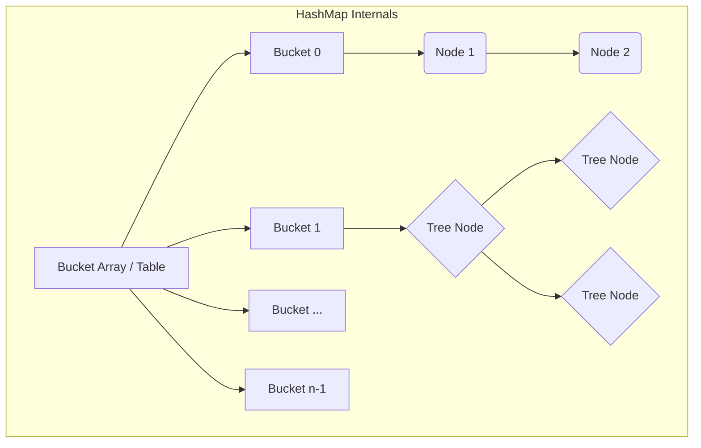

### TreeMap
- **Cấu trúc:** Red-Black Tree. Mọi thao tác (put, get, remove) đều là O(log n).
- **NavigableMap:** Hỗ trợ các phương thức mạnh mẽ:
  - `floorKey(K key)`: Key lớn nhất <= key truyền vào.
  - `ceilingKey(K key)`: Key nhỏ nhất >= key truyền vào.
  - `headMap(K toKey)`: Trả về một view của map có các keys < toKey.
  - `tailMap(K fromKey)`: Trả về view với keys >= fromKey.

### LinkedHashMap
- **Cấu trúc:** Kết hợp HashMap + Doubly-linked list chạy qua tất cả các entries để giữ thứ tự chèn (insertion order).
- **Access Order Mode:** Nếu constructor `LinkedHashMap(capacity, loadFactor, accessOrder=true)` được dùng, nó duy trì thứ tự theo lần truy cập gần nhất (hữu ích để làm **LRU Cache**).

### HashSet & TreeSet
- **HashSet:** Thực chất là một `HashMap` bên dưới. Value được gán bằng một object giả `private static final Object PRESENT = new Object();`.
- **TreeSet:** Thực chất là một `TreeMap`.

### ArrayDeque
- **Cấu trúc:** Circular array (mảng vòng) với 2 con trỏ `head` và `tail`.
- **Đặc biệt:** KHÔNG cho phép phần tử `null` (vì null được dùng để nhận diện mảng rỗng/đầy trong một số thao tác bên trong). Hiệu năng tốt hơn LinkedList và Stack.

### PriorityQueue
- **Cấu trúc:** Binary min-heap (cây nhị phân tối thiểu), được biểu diễn dưới dạng mảng.
- **Quan trọng:** Iterator của PriorityQueue **KHÔNG** duyệt theo thứ tự sắp xếp (sorted order)! Để lấy thứ tự, bạn phải liên tục gọi `poll()`.

---

## 2. Collections Performance Comparison

### Big-O Complexity

| Collection | Get (index) | Search (contains) | Insert (add) | Delete (remove) |
|---|---|---|---|---|
| **ArrayList** | O(1) | O(n) | O(1) amotized | O(n) |
| **LinkedList** | O(n) | O(n) | O(1) | O(1) |
| **HashSet** | N/A | O(1) | O(1) | O(1) |
| **TreeSet** | N/A | O(log n) | O(log n) | O(log n) |
| **HashMap** | O(1) | O(1) | O(1) | O(1) |
| **TreeMap** | O(log n) | O(log n) | O(log n) | O(log n) |
| **PriorityQueue** | N/A | O(n) | O(log n) | O(log n) |

### Decision Flowchart

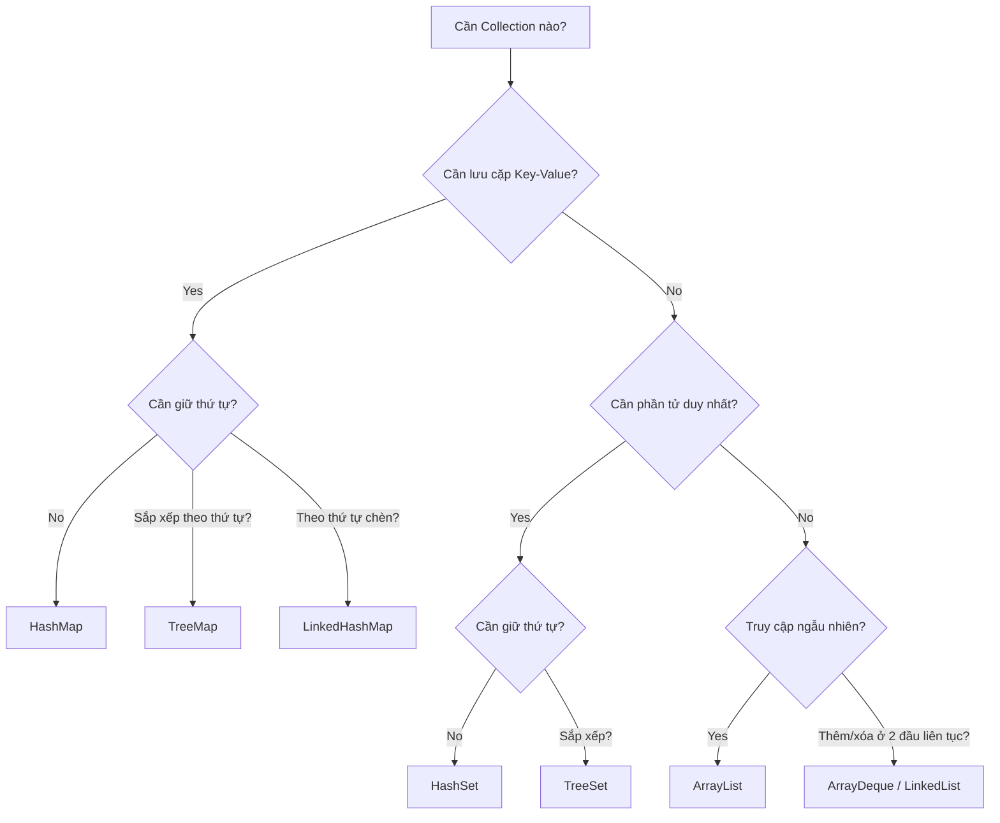

### Fail-fast vs Fail-safe
- **Fail-fast:** `ArrayList`, `HashMap`, `HashSet`... sẽ ném `ConcurrentModificationException` nếu collection bị sửa đổi cấu trúc trong khi đang được iterate bằng một thread khác, HOẶC không thông qua iterator. Điều này được thực hiện qua biến `modCount`.
- **Fail-safe (Weakly-consistent):** `ConcurrentHashMap`, `CopyOnWriteArrayList`... Không ném ngoại lệ vì chúng duyệt qua bản copy (hoặc dung nạp thay đổi) của dữ liệu.

> [!WARNING]
> Không bao giờ dùng `list.remove(item)` khi đang duyệt bằng `for-each`. Hãy dùng `Iterator.remove()` hoặc `list.removeIf(...)`.

---

## 3. Generics Type System

### Type Erasure (Xóa kiểu)
Tại runtime, Java không giữ lại thông tin về tham số kiểu Generics. Quá trình biên dịch (Compile time) biến đổi Generics như sau:
1. Thay thế tham số kiểu (type parameters) bằng giới hạn (bound) của chúng, hoặc `Object` nếu unbounded.
2. Chèn tự động các ép kiểu (type casts) khi cần.
3. Sinh ra **Bridge methods** để duy trì polymorphism trong các class kế thừa.

> [!TIP]
> Do Type Erasure, bạn không thể hỏi `if (list instanceof List<String>)` tại runtime, chỉ có thể kiểm tra `list instanceof List<?>`.

### Raw Types and Heap Pollution
- **Raw Type:** Bỏ qua tham số kiểu, ví dụ `List list = new ArrayList<String>();`. Dùng nó vô hiệu hóa kiểm tra kiểu của trình biên dịch.
- **Heap Pollution:** Xảy ra khi một biến mang kiểu tham số trỏ tới đối tượng không đúng kiểu.

```java
List<String> strings = new ArrayList<>();
List rawList = strings;
rawList.add(10); // Heap pollution: Không có lỗi compile-time!
String s = strings.get(0); // ClassCastException at runtime
```

### Reifiable vs Non-reifiable Types
- **Reifiable Type:** Thông tin kiểu được giữ đầy đủ lúc runtime (primitives, non-generic types như `String`, raw types, unbounded wildcards `List<?>`).
- **Non-reifiable Type:** Thông tin bị mất do erasure (`List<String>`, `List<? extends Number>`).
- Bạn KHÔNG thể tạo mảng với non-reifiable type: `new List<String>[10]` là illegal vì array cần biết kiểu cụ thể tại runtime để sinh `ArrayStoreException` nếu có lỗi type.

### Wildcards: PECS (Producer Extends, Consumer Super)
- `? extends T`: (Producer) Cho phép đọc từ collection (trả về kiểu `T`). KHÔNG thể `add()` phần tử vào (trừ `null`).
- `? super T`: (Consumer) Cho phép viết vào collection. Có thể lấy ra nhưng chỉ được kiểu `Object`.

### Intersection & Recursive Bounds
- **Intersection:** `<T extends Comparable<T> & Serializable>`: T phải implement CẢ 2 interfaces.
- **Recursive:** `<T extends Comparable<T>>`: Enum là một ví dụ kinh điển `class Enum<E extends Enum<E>>`.

---

## 4. Comparable & Comparator Complete Guide

### Contract of `compareTo()`
1. **Symmetry:** `sgn(x.compareTo(y)) == -sgn(y.compareTo(x))`
2. **Transitivity:** Nếu `x.compareTo(y) > 0` và `y.compareTo(z) > 0`, thì `x.compareTo(z) > 0`
3. **Consistency with equals:** Khuyến khích `(x.compareTo(y) == 0) == (x.equals(y))`

> [!IMPORTANT]
> **TreeSet vs HashSet khác biệt:** `HashSet` dùng `equals()` và `hashCode()` để kiểm tra trùng lặp. `TreeSet` chỉ dùng `compareTo() == 0`. Nếu `compareTo` inconsistent với `equals`, `TreeSet` có thể chứa các phần tử vi phạm contract của `Set` (về mặt logic).

### Comparator Chaining & Method References
Java 8 mang tới các helper methods rất mạnh:
```java
Comparator<Employee> byNameThenAge = Comparator
    .comparing(Employee::getName, String.CASE_INSENSITIVE_ORDER)
    .thenComparingInt(Employee::getAge)
    .reversed();
```

- **Null Handling:** Dùng `Comparator.nullsFirst(Comparator.naturalOrder())` để xử lý danh sách có null an toàn.

---

## 5. Date/Time API Architecture (java.time)

### Design Philosophy
- **Immutable & Thread-safe:** Mỗi thao tác đổi giờ (ví dụ `plusDays(1)`) trả về một đối tượng mới hoàn toàn.
- **ISO-8601 Standard:** Lấy chuẩn chung.

### Temporal Hierarchy
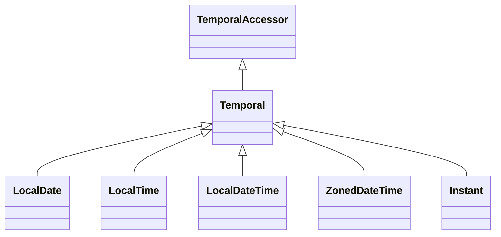

- **TemporalAdjusters:** Cho phép thực hiện các phép toán phức tạp như "ngày thứ Hai đầu tiên của tháng":
  `date.with(TemporalAdjusters.firstInMonth(DayOfWeek.MONDAY))`

- **Duration vs Period:**
  - `Period`: Dựa trên ngày/tháng/năm (`Period.of(1, 2, 3)`). Chịu ảnh hưởng của số ngày trong tháng/năm nhuận.
  - `Duration`: Dựa trên thời gian vật lý (giây, nano). Một ngày luôn là 24*60*60 giây.

### ZonedDateTime & DST (Daylight Saving Time) Edge Cases

- **Spring Forward (Gap):** Đồng hồ nhảy từ 1:59:59 AM lên 3:00:00 AM. 
  - Nếu bạn tạo thời gian rơi vào khoảng gap (2:30 AM), Java sẽ tự đẩy tới giờ hợp lệ tiếp theo (3:30 AM).
- **Fall Back (Overlap):** Đồng hồ chạy từ 1:59:59 AM ngược về 1:00:00 AM. Có 2 khoảng thời gian 1:00 -> 2:00.
  - Mặc định, Java chọn "giờ sớm hơn". Dùng `withEarlierOffsetAtOverlap()` hoặc `withLaterOffsetAtOverlap()` để chỉnh.

### Instant
Lưu số nano-second tính từ Unix Epoch (1970-01-01T00:00:00Z). Tốt nhất cho logging hoặc giao tiếp máy tính-máy tính. Không có khái niệm TimeZone.

---

## 6. Immutable Collections Deep Dive

### `List.of()`, `Set.of()`, `Map.of()`
Từ Java 9, chúng tạo ra các **truly unmodifiable** collections.
- Bất kỳ thao tác `add`, `remove`, `set` nào đều quăng `UnsupportedOperationException`.
- **KHÔNG** chứa `null`. Ném `NullPointerException` ngay khi khởi tạo nếu có `null`.
- Iterator cũng không hỗ trợ `remove()`.
- Rất tốn ít bộ nhớ vì không cần các mảng đệm lớn (như ArrayList).

### `Collections.unmodifiableList(list)` vs `List.copyOf(list)`
- `Collections.unmodifiableList()`: Tạo ra một lớp bọc (wrapper view) bên ngoài list gốc. Nếu danh sách gốc thay đổi, view này **sẽ phản ánh thay đổi đó**.
- `List.copyOf()`: Tạo bản sao (deeply copy references). List gốc đổi, bản sao không đổi.

> [!CAUTION]
> **Shallow Immutability:** Collection có thể bất biến (không add/remove được), nhưng các ĐỐI TƯỢNG bên trong nó vẫn có thể thay đổi trạng thái nếu chúng là đối tượng mutable (như `StringBuilder` hay `Date`).

---

## 7. Hard Practice Questions

**Q1:** Cho đoạn mã sau:
```java
List<Integer> list = new ArrayList<>(List.of(1, 2, 3));
for (Integer i : list) {
    if (i == 2) list.remove(i);
}
```
Điều gì xảy ra?
A) Xóa được số 2
B) ConcurrentModificationException
C) IndexOutOfBoundsException
D) UnsupportedOperationException

**Q2:** Sự khác biệt giữa `Set.of(1, 2, 3)` và `new HashSet<>(Arrays.asList(1, 2, 3))` về khía cạnh chứa phần tử null là gì?
A) Cả hai đều cho phép null
B) Set.of cho phép, HashSet không
C) HashSet cho phép, Set.of thì ném NPE
D) Không có cái nào cho phép null

**Q3:** Khai báo nào sau đây là hợp lệ?
A) `List<?>[] array = new List<?>[10];`
B) `List<String>[] array = new List<String>[10];`
C) `List<Object>[] array = new ArrayList<Object>[10];`
D) `List<? extends Number>[] array = new List<? extends Number>[10];`

**Q4:** Kết quả của đoạn mã với HashMap có capacity = 4, hash of (A=1, B=2, C=3, D=4)? Khi load factor = 0.75, khi nào HashMap rehash?
A) Rehash khi insert D (kích thước = 4)
B) Rehash khi insert C (kích thước = 3)
C) Rehash khi insert phần tử thứ 4
D) Rehash khi kích thước vượt quá 3 (tức là chuẩn bị add phần tử thứ 4)

**Q5:** TreeSet lưu trữ phần tử bằng cách sử dụng phương thức nào để nhận diện trùng lặp?
A) `equals()`
B) `hashCode()` sau đó `equals()`
C) `compareTo()` == 0
D) `System.identityHashCode()`

**Q6:** PECS rule áp dụng thế nào cho `List<? super Integer>`?
A) Có thể `add(new Object())` nhưng không thể `add(10)`
B) Có thể `add(10)` nhưng chỉ có thể đọc ra dạng `Object`
C) Có thể `add(10)` và đọc ra dạng `Integer`
D) Không thể add gì vào danh sách này

**Q7:** Về Period và Duration: `Duration.ofDays(1)` và `Period.ofDays(1)` thêm vào lúc đổi giờ DST (Spring Forward gap). Kết quả:
A) Cả hai nhảy lên 1 giờ cùng nhau.
B) Duration cộng đúng 24h vật lý (chênh giờ trên đồng hồ), Period giữ nguyên giờ hiển thị.
C) Period cộng 24h vật lý, Duration giữ nguyên giờ.
D) Ném ra DateTimeException.

**Q8:** Khi bucket HashMap vượt quá 8 nodes, điều kiện gì bắt buộc phải có để nó chuyển thành Red-Black Tree?
A) Load factor phải lớn hơn 0.5
B) Bảng hash tổng (capacity) phải >= 64
C) Key phải implement Comparable
D) Cả B và C

**Q9:** Đoạn mã sau đúng hay sai? `List<String> list = new ArrayList<>(); List<Object> objList = list;`
A) Hợp lệ, String là Object.
B) Không hợp lệ, List<String> không phải là subclass của List<Object>.

**Q10:** Trong LinkedHashMap, chế độ access-order sẽ đẩy entry lên vị trí nào (head/tail) sau khi được truy cập `get()`?
A) Chuyển lên đầu danh sách (head)
B) Chuyển xuống cuối danh sách (tail - đại diện cho most recently used)
C) Không di chuyển vị trí, chỉ đổi flag.
D) Cập nhật PriorityQueue nội bộ.

*(Tham khảo JLS Section 4 (Types), Section 8 (Classes), và Javadoc của Collections/java.time để biết thêm chi tiết)*


---

## 📘 PHASE 4: LẬP TRÌNH HÀM, STREAM API & ĐỘNG CƠ SPLITERATOR
### 1. Giáo trình Chuẩn & Functional Programming
# Tài Liệu Ôn Thi OCP Java SE 25 (1Z0-831) - Giai Đoạn 4: Functional Programming

Giai đoạn này tập trung vào Lập Trình Hàm (Functional Programming) trong Java, bao gồm Functional Interfaces, Lambda Expressions, Stream API, Collectors, Optional và Parallel Streams. Đây là phần **cực kỳ quan trọng** và chiếm tỷ trọng lớn trong kỳ thi OCP.

---

## 4.1 Functional Interfaces (Giao Diện Hàm)

Một functional interface là một interface có **duy nhất một abstract method** (SAM - Single Abstract Method).

### Built-in Functional Interfaces (Gói `java.util.function`)
Bảng tổng hợp các functional interface cốt lõi:

| Interface | Method Signature | Mô tả |
| :--- | :--- | :--- |
| `Predicate<T>` | `boolean test(T t)` | Kiểm tra điều kiện |
| `BiPredicate<T, U>` | `boolean test(T t, U u)` | Kiểm tra điều kiện với 2 tham số |
| `Consumer<T>` | `void accept(T t)` | Tiêu thụ giá trị, không trả về (Side effects) |
| `BiConsumer<T, U>`| `void accept(T t, U u)` | Tiêu thụ 2 giá trị |
| `Supplier<T>` | `T get()` | Cung cấp/Sinh ra giá trị |
| `Function<T, R>` | `R apply(T t)` | Biến đổi từ kiểu T sang kiểu R |
| `BiFunction<T, U, R>`| `R apply(T t, U u)` | Biến đổi 2 tham số T, U thành kiểu R |
| `UnaryOperator<T>`| `T apply(T t)` | Tương tự Function nhưng T và R giống nhau |
| `BinaryOperator<T>`| `T apply(T t1, T t2)` | Tương tự BiFunction nhưng T, U, R giống nhau|

### Primitive Specializations
Thay vì dùng wrapper classes (`Integer`, `Double`), Java cung cấp các interface cho kiểu nguyên thủy để tránh chi phí autoboxing/unboxing.
- **IntPredicate, LongPredicate, DoublePredicate**
- **IntFunction, LongFunction, DoubleFunction** (Tham số là primitive, trả về Object)
- **ToIntFunction, ToLongFunction, ToDoubleFunction** (Tham số là Object, trả về primitive)
- **IntConsumer, DoubleConsumer**, v.v.

### Chaining Methods (Nối các thao tác)
- `Predicate`: `and()`, `or()`, `negate()`
- `Function`: `andThen()` (thực hiện sau), `compose()` (thực hiện trước)
- `Consumer`: `andThen()`

```java
Predicate<String> p1 = s -> s.length() > 5;
Predicate<String> p2 = s -> s.contains("Java");
Predicate<String> p3 = p1.and(p2).negate();

Function<Integer, Integer> f1 = x -> x * 2;
Function<Integer, Integer> f2 = x -> x + 3;
// f1.andThen(f2).apply(2) -> (2*2) + 3 = 7
// f1.compose(f2).apply(2) -> (2+3) * 2 = 10
```

> [!WARNING]
> **Trap exam:** `Supplier` không có method chaining (không có `andThen` hay `compose`) vì nó không nhận tham số đầu vào.

### @FunctionalInterface Annotation
Annotation này không bắt buộc nhưng giúp trình biên dịch kiểm tra xem interface có thực sự là functional interface hay không (đảm bảo chỉ có 1 abstract method).

---

## 4.2 Lambda Expressions

Lambda là một cách ngắn gọn để implement abstract method của functional interface.

### Cú pháp
```java
// 1. Không tham số
Supplier<String> s = () -> "Hello";

// 2. Một tham số (có thể bỏ dấu ngoặc đơn và kiểu dữ liệu)
Predicate<String> p = x -> x.isEmpty(); 

// 3. Nhiều tham số (phải dùng ngoặc đơn)
BiFunction<Integer, Integer, Integer> add = (a, b) -> a + b;
// Hoặc có khai báo kiểu (phải khai báo cho tất cả)
BiFunction<Integer, Integer, Integer> add2 = (Integer a, Integer b) -> a + b;

// 4. Khối lệnh (phải dùng ngoặc nhọn và từ khóa return nếu có trả về)
Function<String, String> f = x -> {
    String upper = x.toUpperCase();
    return upper;
};
```

> [!WARNING]
> **Trap exam:** Nếu bạn trộn lẫn việc khai báo kiểu và không khai báo, code sẽ lỗi: `(Integer a, b) -> a + b` (LỖI COMPILATION). Hoặc thiếu từ khóa `var` cho 1 tham số: `(var a, b) -> a + b` (LỖI). Phải là `(var a, var b)`.

### Effectively Final Variables
Lambda có thể truy cập biến cục bộ bên ngoài, nhưng biến đó phải là `final` hoặc **effectively final** (không thay đổi giá trị sau khi khởi tạo).

```java
int count = 0;
// count++; // Nếu uncomment dòng này, dòng dưới sẽ lỗi compilation
Runnable r = () -> System.out.println(count); 
```

### Method References
Sử dụng toán tử `::` để viết gọn lambda:
1. **Static method:** `ClassName::methodName` (VD: `Math::max` = `(a, b) -> Math.max(a, b)`)
2. **Instance method trên đối tượng cụ thể (bound):** `instanceRef::methodName` (VD: `System.out::println` = `x -> System.out.println(x)`)
3. **Instance method trên đối tượng không cụ thể (unbound):** `ClassName::methodName` (VD: `String::toLowerCase` = `str -> str.toLowerCase()`)
4. **Constructor:** `ClassName::new` (VD: `ArrayList::new` = `() -> new ArrayList<>()`)

---

## 4.3 Stream API — Complete Guide

### Tạo Streams
```java
Stream<String> s1 = Stream.empty();
Stream<String> s2 = Stream.of("A", "B", "C");
Stream<String> s3 = List.of("X", "Y").stream();
Stream<Double> s4 = Stream.generate(Math::random); // Infinite stream
Stream<Integer> s5 = Stream.iterate(1, n -> n + 1); // Infinite stream
Stream<Integer> s6 = Stream.iterate(1, n -> n <= 10, n -> n + 1); // Finite (Java 9)
IntStream s7 = Arrays.stream(new int[]{1, 2, 3});
IntStream s8 = IntStream.range(1, 5); // 1, 2, 3, 4
IntStream s9 = IntStream.rangeClosed(1, 5); // 1, 2, 3, 4, 5
```

### Intermediate Operations (Thao tác trung gian)
- `filter(Predicate)`: Lọc các phần tử.
- `map(Function)`: Biến đổi từng phần tử.
- `flatMap(Function)`: Làm phẳng (flatten) các stream lồng nhau.
- `distinct()`: Loại bỏ trùng lặp (dựa trên `equals()`).
- `sorted()`, `sorted(Comparator)`: Sắp xếp.
- `peek(Consumer)`: Thường dùng để debug (không thay đổi phần tử).
- `limit(long)`: Lấy n phần tử đầu tiên.
- `skip(long)`: Bỏ qua n phần tử đầu tiên.
- `takeWhile(Predicate)`: (Java 9) Lấy phần tử chừng nào điều kiện còn đúng, sai là dừng ngay.
- `dropWhile(Predicate)`: (Java 9) Bỏ qua phần tử chừng nào điều kiện đúng, sai là lấy từ đó về sau.
- `mapToInt()`, `mapToDouble()`,...: Chuyển sang primitive stream.

### Terminal Operations (Thao tác kết thúc)
Khi gọi thao tác kết thúc, stream mới thực sự chạy (Lazy evaluation). **Sau khi chạy, Stream không thể tái sử dụng.**
- `forEach`, `forEachOrdered`: Duyệt phần tử.
- `collect`: Gộp kết quả (rất mạnh, sẽ học ở 4.4).
- `toList()` (Java 16): Trả về unmodifiable List trực tiếp.
- `toArray()`: Trả về mảng.
- `reduce`: Kết hợp phần tử (có 3 dạng).
- `count`, `min`, `max`: Thống kê.
- `findFirst`, `findAny`: Tìm kiếm (trả về Optional).
- `allMatch`, `anyMatch`, `noneMatch`: Kiểm tra điều kiện (trả về boolean, có tính chất short-circuiting).

> [!IMPORTANT]
> **Stream là Lazy (Lười biếng):** Nếu không có Terminal Operation, Intermediate Operations sẽ KHÔNG thực thi.
> ```java
> Stream.of("A", "B").peek(System.out::print); // KHÔNG IN RA GÌ CẢ
> ```

> [!WARNING]
> **Stream cannot be reused:** 
> ```java
> Stream<String> s = Stream.of("A");
> s.count();
> s.count(); // LỖI IllegalStateException: stream has already been operated upon or closed
> ```

---

## 4.4 Collectors — Deep Dive

Lớp `java.util.stream.Collectors` cung cấp các factory methods cho thao tác gộp (reduction).

### Thu thập cơ bản
- `Collectors.toList()`, `toSet()`: Trả về mutable collection.
- `Collectors.toUnmodifiableList()`, `toUnmodifiableSet()` (Java 10): Trả về immutable collection.

### Collectors.toMap()
Có 3 overload phổ biến:
1. `toMap(keyMapper, valueMapper)`: Lỗi `IllegalStateException` nếu trùng key.
2. `toMap(keyMapper, valueMapper, mergeFunction)`: Xử lý khi trùng key.
3. `toMap(keyMapper, valueMapper, mergeFunction, mapSupplier)`: Trả về Map cụ thể (VD: `TreeMap::new`).

```java
Stream<String> s = Stream.of("apple", "banana", "apricot");
Map<Character, String> map = s.collect(
    Collectors.toMap(
        str -> str.charAt(0),       // Key
        str -> str,                 // Value
        (s1, s2) -> s1 + "," + s2,  // Xử lý đụng độ key
        TreeMap::new                // Map type
    )
);
// {a=apple,apricot, b=banana}
```

### Grouping By & Partitioning By
- `groupingBy(Function)`: Gom nhóm dựa trên hàm phân loại.
- `partitioningBy(Predicate)`: Chia thành 2 nhóm `true` và `false`.

**Downstream Collectors:** Dùng để xử lý tiếp các giá trị trong mỗi nhóm.
- `counting()`, `summingInt()`, `averagingDouble()`
- `mapping()`
- `maxBy()`, `minBy()`
- `collectingAndThen()`

```java
// Gom nhóm String theo độ dài, sau đó đếm số lượng mỗi nhóm
Map<Integer, Long> countByLen = Stream.of("a", "bb", "c")
    .collect(Collectors.groupingBy(String::length, Collectors.counting()));
```

### Collectors.joining()
Nối chuỗi.
```java
String res = Stream.of("a", "b", "c").collect(Collectors.joining("-", "[", "]")); // [a-b-c]
```

### Collectors.teeing() (Java 12)
Cho phép gom kết quả bằng 2 Collector khác nhau, sau đó kết hợp chúng.
```java
// Lấy max và min cùng lúc
var result = Stream.of(1, 5, 3, 9, 2)
    .collect(Collectors.teeing(
        Collectors.maxBy(Integer::compareTo),
        Collectors.minBy(Integer::compareTo),
        (max, min) -> "Max: " + max.get() + ", Min: " + min.get()
    ));
```

---

## 4.5 Optional

`Optional<T>` giúp xử lý giá trị có thể `null` mà không bị `NullPointerException`.

### Tạo Optional
- `Optional.of(value)`: Quăng NPE nếu value là null.
- `Optional.ofNullable(value)`: Trả về Optional rỗng nếu null.
- `Optional.empty()`: Trả về Optional rỗng.

### Sử dụng an toàn
- `ifPresent(Consumer)`: Nếu có giá trị thì thực hiện Consumer.
- `ifPresentOrElse(Consumer, Runnable)` (Java 9): Xử lý cả 2 trường hợp.
- `orElse(T)`: Trả về giá trị mặc định.
- `orElseGet(Supplier)`: Trả về giá trị từ Supplier (Lazy - hiệu suất tốt hơn).
- `orElseThrow(Supplier)`: Ném ngoại lệ tùy chỉnh.
- `map(Function)`, `flatMap(Function)`: Biến đổi giá trị bên trong.
- `filter(Predicate)`: Lọc giá trị.
- `or(Supplier<Optional>)` (Java 9): Trả về Optional thay thế nếu rỗng.
- `stream()` (Java 9): Chuyển Optional thành Stream.

> [!CAUTION]
> **Anti-patterns (Thường bị hỏi trong thi):** 
> - Gọi `get()` mà không kiểm tra (có thể gây `NoSuchElementException`).
> - Dùng `isPresent()` kết hợp `get()` thay vì dùng `ifPresent()` hay `orElse()`.

---

## 4.6 Primitive Streams

Java cung cấp `IntStream`, `LongStream`, `DoubleStream` để tối ưu hiệu suất tính toán số học.

- **Không có `ShortStream` hay `ByteStream`** (Dùng `IntStream`).
- Các hàm tính toán: `sum()`, `average()` (trả về `OptionalDouble`), `min()`, `max()` (trả về `OptionalInt`/`OptionalDouble`).
- `summaryStatistics()`: Lấy đối tượng `IntSummaryStatistics` chứa đồng thời count, sum, min, max, average.
- `mapToObj()`: Chuyển từ primitive stream sang Object stream.
- `boxed()`: Chuyển `IntStream` thành `Stream<Integer>`.

---

## 4.7 Parallel Streams

Xử lý luồng đa luồng (multi-threading) bằng cách chia nhỏ công việc.

### Cách tạo
- `Collection.parallelStream()`
- `Stream.parallel()`

### Reduction trong Parallel Stream
Hàm `reduce` có dạng 3 tham số (Identity, Accumulator, Combiner) được thiết kế riêng cho parallel stream:
- Tham số thứ 3 (Combiner) được dùng để gộp kết quả của các tiểu tiến trình lại với nhau.

### Thread Safety & ForEach
- Trong parallel stream, thứ tự xử lý không được đảm bảo.
- Dùng `forEach()` có thể in ra kết quả không theo thứ tự ban đầu.
- Dùng `forEachOrdered()` nếu muốn ép in đúng thứ tự (nhưng làm giảm hiệu suất của parallel).
- Tránh dùng stateful lambda expressions (lambda làm thay đổi trạng thái của biến bên ngoài) để tránh race conditions.

> [!TIP]
> **Khi nào dùng Parallel Stream:** Khi có số lượng phần tử CỰC LỚN và mỗi thao tác tính toán tốn nhiều thời gian (CPU-intensive), đồng thời các thao tác phải độc lập (stateless, non-interfering).

---

## Bài Tập Thực Hành (15 Câu Hỏi Cấp Độ OCP)

**Câu 1:** Đoạn mã sau có kết quả là gì?
```java
Predicate<String> p1 = s -> s.length() > 3;
Predicate<String> p2 = Predicate.not(String::isEmpty);
System.out.println(p1.and(p2).test(""));
```
A) true
B) false
C) Lỗi biên dịch (Compilation error)
D) Ném ngoại lệ RuntimeException

**Câu 2:** Lựa chọn nào có thể thay thế để đoạn mã sau biên dịch thành công? (Chọn HAI)
```java
var map = new HashMap<String, Integer>();
// INSERT HERE
```
A) `BiConsumer<String, Integer> b = map::put;`
B) `BiFunction<String, Integer, Integer> b = map::put;`
C) `Consumer<String, Integer> b = map::put;`
D) `BiPredicate<String, Integer> b = map::put;`
E) `BiConsumer<String, Integer> b = (k, v) -> map.put(k, v);`

**Câu 3:** Kết quả là gì?
```java
List<Integer> list = List.of(1, 2, 3);
int total = list.stream()
    .peek(System.out::print)
    .mapToInt(x -> x)
    .sum();
```
A) 123
B) 6
C) Không in ra gì cả, `total` bằng 6.
D) In ra 123, `total` bằng 6.

**Câu 4:** Cú pháp Lambda nào là HỢP LỆ? (Chọn BA)
A) `(var x, y) -> x + y`
B) `(String x, String y) -> { return x + y; }`
C) `x, y -> x + y`
D) `(var x, var y) -> x + y`
E) `(x, y) -> x + y`

**Câu 5:** Kết quả là gì?
```java
Stream<String> s = Stream.of("apple", "banana", "cherry");
s.filter(x -> x.startsWith("a"));
long count = s.count();
System.out.println(count);
```
A) 1
B) 3
C) 0
D) Ném ngoại lệ IllegalStateException

**Câu 6:** Phương thức nào của `Stream` KHÔNG trả về một stream mới?
A) filter()
B) flatMap()
C) map()
D) reduce()
E) takeWhile()

**Câu 7:** Biến nào có thể được truy cập bên trong biểu thức lambda? (Chọn HAI)
A) Biến cục bộ (local variable) không có từ khóa `final` nhưng giá trị không bao giờ thay đổi.
B) Biến cục bộ bị thay đổi giá trị trong một phần khác của method (sau khi lambda được định nghĩa).
C) Biến instance của lớp chứa lambda (class instance variable).
D) Bất kỳ biến cục bộ nào.

**Câu 8:** Kết quả là gì?
```java
Optional<String> opt = Optional.ofNullable(null);
String result = opt.orElseGet(() -> "Empty");
System.out.println(result);
```
A) null
B) Empty
C) Ném NullPointerException
D) Ném NoSuchElementException

**Câu 9:** Chuyện gì xảy ra với đoạn mã sau?
```java
Stream<Integer> s = Stream.of(1, 2, 3);
s.map(i -> i * 2).forEach(System.out::print);
s.map(i -> i * 3).forEach(System.out::print);
```
A) 246369
B) 246
C) Ném IllegalStateException tại runtime
D) Lỗi biên dịch

**Câu 10:** Collector nào dùng để nhóm dữ liệu theo một đặc điểm và chia thành đúng 2 tập hợp dựa trên điều kiện boolean?
A) Collectors.groupingBy()
B) Collectors.partitioningBy()
C) Collectors.mapping()
D) Collectors.teeing()

**Câu 11:** Kết quả là gì?
```java
IntStream stream = IntStream.rangeClosed(1, 5);
System.out.println(stream.average().getAsDouble());
```
A) 3.0
B) 3
C) 15.0
D) Lỗi biên dịch do getAsDouble() không tồn tại

**Câu 12:** Điều nào đúng về `Parallel Streams`? (Chọn HAI)
A) Luôn luôn nhanh hơn sequential streams.
B) Có thể làm thay đổi thứ tự in ra khi dùng `forEach`.
C) Hàm `reduce` trên parallel stream bắt buộc phải có identity value để hoạt động chính xác.
D) Dùng stateful lambda expressions trong parallel stream luôn an toàn.

**Câu 13:** Lựa chọn `Downstream Collector` nào có thể truyền vào hàm `groupingBy` để vừa nhóm vừa lấy giá trị lớn nhất trong mỗi nhóm?
A) Collectors.maxBy()
B) Collectors.maximal()
C) Collectors.summarizingInt()
D) Không thể thực hiện được.

**Câu 14:** Hàm nào trên `Optional` thực thi đoạn mã của tham số Runnable nếu Optional rỗng và thực thi Consumer nếu có giá trị?
A) ifPresent()
B) orElse()
C) ifPresentOrElse()
D) orElseGet()

**Câu 15:** Kết quả của đoạn code sau?
```java
List<String> list = List.of("a", "b", "c");
Map<Integer, String> map = list.stream().collect(
    Collectors.toMap(
        String::length,
        s -> s
    )
);
System.out.println(map);
```
A) {1=a, 1=b, 1=c}
B) {1=a}
C) Ném IllegalStateException
D) {1=c}

---

## ĐÁP ÁN VÀ GIẢI THÍCH CHITIẾT

**Câu 1: B.** Hàm `p1` đòi hỏi độ dài > 3, " " rỗng nên sai. Dù kết hợp bằng `and` (cả 2 đều đúng), điều kiện 1 đã sai nên kết quả là `false` mà không cần quan tâm điều kiện 2. Short-circuit logic.
**Câu 2: B, E.** Hàm `map.put(K, V)` nhận 2 tham số và trả về V (giá trị cũ). `BiFunction` biểu diễn thao tác nhận 2 tham số, trả về 1 kết quả (vừa khớp `put`). Lựa chọn A sai vì `BiConsumer` mong đợi không trả về giá trị (void), nhưng cơ chế Method Reference vẫn chấp nhận được nếu ta bỏ qua kết quả trả về? Tuy nhiên theo spec, nếu Method Reference trả về giá trị khác void, nó có thể dùng cho functional interface có kiểu trả về void. NHƯNG, B và E hoàn toàn an toàn và chắc chắn đúng cú pháp.
**Câu 3: D.** Dòng `.peek` là intermediate operation, nhưng do stream được gọi hàm terminal `sum()`, toàn bộ stream sẽ chạy. `peek` sẽ in 1, 2, 3 và `sum` trả về 6.
**Câu 4: B, D, E.** A sai vì không thể trộn `var` và không kiểu. C sai vì nhiều tham số không có kiểu thì phải bọc trong `(x, y)`.
**Câu 5: D.** Lệnh `s.filter(...)` trả về 1 stream mới, nó KHÔNG thay đổi stream `s`. Ngay sau đó `s.count()` được gọi trên stream `s` - hợp lệ vì stream chưa bị duyệt. KHOAN! `s.filter` được gọi tức là stream `s` đã được operate upon! Gọi tiếp `s.count()` sẽ ném `IllegalStateException`.
**Câu 6: D.** `reduce()` là một Terminal Operation, trả về một giá trị (`Optional` hoặc primitive), không phải Stream.
**Câu 7: A, C.** Local variables phải là final hoặc effectively final. Instance variables có thể truy cập và thay đổi tự do bên trong lambda.
**Câu 8: B.** `Optional.ofNullable(null)` tạo ra một optional rỗng. Lệnh `orElseGet` sẽ thực thi Supplier và trả về chuỗi "Empty".
**Câu 9: C.** Stream không thể được sử dụng lại sau khi một Terminal Operation được thực hiện. Ở dòng 2, `forEach` đã đóng stream `s`. Dòng 3 gọi lại `s.map()` sẽ ném `IllegalStateException`.
**Câu 10: B.** `partitioningBy()` nhóm các phần tử thành Map có key là Boolean (chia thành 2 nhóm đúng và sai).
**Câu 11: A.** `IntStream.rangeClosed(1, 5)` sinh ra các phần tử 1, 2, 3, 4, 5. Tổng là 15, trung bình là 3.0. Hàm `average()` trả về `OptionalDouble`, gọi `getAsDouble()` sẽ lấy ra số `double` là `3.0`.
**Câu 12: B, C.** Không phải luôn nhanh hơn (overhead cấp phát luồng). Hàm `reduce` dạng nhiều luồng yêu cầu kết hợp kết quả (combiner) và Identity value rất quan trọng. Dùng lambda thay đổi trạng thái (stateful) trong parallel cực kỳ nguy hiểm.
**Câu 13: A.** Hàm `Collectors.maxBy(Comparator)` thường được truyền làm tham số thứ 2 của `groupingBy` để tìm phần tử lớn nhất trong nhóm.
**Câu 14: C.** `ifPresentOrElse(Consumer, Runnable)` (từ Java 9) cho phép xử lý cả trường hợp có giá trị và không có giá trị.
**Câu 15: C.** Stream có các phần tử "a", "b", "c". Hàm `String::length` sẽ là khóa. Cả ba chuỗi đều có độ dài = 1. `Collectors.toMap` không cung cấp hàm xử lý đụng độ (merge function), vì vậy khi có key trùng lặp, nó sẽ ném `IllegalStateException: Duplicate key`.


### 2. Lý thuyết Chuyên sâu invokedynamic & Spliterator Engine
# Phase 4: Functional Programming - Deep Theory Supplement

Tài liệu bổ sung này đi sâu vào cơ chế hoạt động thực sự bên dưới của Functional Programming trong Java, đặc biệt phục vụ cho kỳ thi OCP Java SE 25 (1Z0-831). Nó không chỉ trả lời câu hỏi "làm thế nào" mà còn giải thích "tại sao".

---

## 1. Lambda Expression Internals

### Lambda Compilation: `invokedynamic` và `LambdaMetafactory`

Nhiều lập trình viên nghĩ rằng Lambda chỉ là cú pháp viết tắt cho *Anonymous Inner Classes* (Lớp nặc danh). **Điều này hoàn toàn sai trong Java!**

Khi biên dịch, một lớp nặc danh sẽ tạo ra một file `.class` riêng biệt trên đĩa (ví dụ: `MyClass$1.class`). Nếu có 1000 lớp nặc danh, bạn sẽ có 1000 file class, làm phình to kích thước ứng dụng và chậm quá trình class loading.

Thay vào đó, Java 8 đã sử dụng `invokedynamic` (được giới thiệu trong Java 7 cho các ngôn ngữ động) để xử lý Lambda.

1.  **Compile time**: Trình biên dịch chuyển nội dung của Lambda thành một phương thức tĩnh (tùy thuộc vào việc nó có capture state hay không) trong cùng một class. Thay vì sinh ra file `.class` mới, nó sinh ra một chỉ thị `invokedynamic`.
2.  **Runtime**: Lần đầu tiên `invokedynamic` được thực thi, JVM gọi `LambdaMetafactory.metafactory`. Method này sử dụng thư viện ASM để tự động sinh ra một class implement Functional Interface tương ứng trong bộ nhớ một cách lười biếng (lazy initialization). JVM có thể cache class này lại cho các lần gọi sau.

> [!TIP]
> **Performance**: Lambda nhanh hơn và tiết kiệm bộ nhớ hơn so với lớp nặc danh vì không tạo file `.class` tĩnh trên ổ đĩa, class được sinh ra lúc runtime và có thể được tối ưu hóa (như inline) dễ dàng hơn bởi JIT compiler.

### "Effectively Final" tại Bytecode Level

Lambda chỉ có thể sử dụng (capture) các biến cục bộ nếu chúng là `final` hoặc `effectively final`. Tại sao?

Khi bạn capture một biến cục bộ, Java thực chất **copy** giá trị của biến đó vào instance của class sinh ra lúc runtime. Nếu Java cho phép bạn thay đổi giá trị của biến gốc sau đó, bản copy trong Lambda sẽ không được cập nhật, gây ra sự bất đồng bộ dữ liệu nguy hiểm (đặc biệt trong đa luồng). Việc ép buộc biến phải không thay đổi (`effectively final`) đảm bảo tính nhất quán này.

### Khác biệt về `this`

Một khác biệt cực kỳ quan trọng: Từ khóa `this` trong lớp nặc danh trỏ tới instance của chính lớp nặc danh đó. Từ khóa `this` trong Lambda trỏ tới instance của lớp chứa Lambda.

```java
public class ThisExample {
    Runnable r1 = new Runnable() {
        @Override
        public void run() {
            System.out.println(this.getClass().getName()); // In ra: ThisExample$1
        }
    };

    Runnable r2 = () -> {
        System.out.println(this.getClass().getName()); // In ra: ThisExample
    };
}
```

### Serialization và Intersection Cast

Lambda không serializable theo mặc định. Nếu bạn cần serialize một Lambda (ví dụ để truyền qua mạng), bạn phải ép kiểu nó kết hợp với `Serializable` thông qua Intersection Type:

```java
Runnable r = (Runnable & Serializable) () -> System.out.println("Hello");
```
JVM sẽ sinh ra một class cài đặt CẢ `Runnable` và `Serializable`.

### Method Reference Types (Detailed Breakdown)

Method References cũng dùng cơ chế `invokedynamic` tương tự Lambda.

1.  **Static**: `ClassName::staticMethod`
    - Tương đương: `x -> ClassName.staticMethod(x)`
2.  **Bound Instance**: `instance::method` (Captured at creation)
    - Tương đương: `x -> instance.method(x)`
    - *Lưu ý*: Đối tượng `instance` được lưu lại (captured) tại thời điểm tạo method reference. Nếu `instance` bị thay đổi hoặc null sau đó, method reference vẫn giữ tham chiếu ban đầu hoặc throw NPE ngay lúc tạo nếu nó đã null.
3.  **Unbound Instance**: `ClassName::instanceMethod`
    - Tương đương: `(obj, args...) -> obj.instanceMethod(args...)`
    - *Lưu ý*: Tham số đầu tiên của Lambda trở thành đối tượng gọi phương thức (receiver).
4.  **Constructor**: `ClassName::new`
    - Tương đương: `args... -> new ClassName(args...)`

### Ambiguity Resolution (Giải quyết sự mơ hồ)

Khi overloaded methods tồn tại, trình biên dịch có thể không đoán được bạn đang dùng Bound hay Unbound instance.

```java
public class Ambiguity {
    public void print(String s) { }      // 1
    public static void print(Ambiguity a, String s) { } // 2
    
    public void test() {
        BiConsumer<Ambiguity, String> bc = Ambiguity::print; // COMPILE ERROR!
        // Compiler không biết là gọi instance method (1) với kiểu unbound
        // hay gọi static method (2)
    }
}
```

---

## 2. Stream Pipeline Internals

### Lazy Evaluation (Đánh giá lười)

Stream operations được chia làm Intermediate (trung gian) và Terminal (kết thúc). Intermediate ops không thực thi bất cứ logic nào cả; chúng chỉ trả về một Stream mới, lưu trữ thao tác vừa khai báo vào một cấu trúc dữ liệu mô tả pipeline. Chỉ khi một Terminal op được gọi, toàn bộ pipeline mới bắt đầu xử lý dữ liệu.

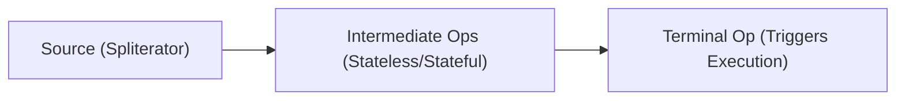

### Stream Characteristics

Mỗi Stream mang theo một bitmask gọi là *Characteristics* (Đặc tính), giúp JVM tối ưu hóa quá trình xử lý.

- `ORDERED`: Dữ liệu có thứ tự (VD: List).
- `DISTINCT`: Các phần tử đôi một khác nhau (VD: Set).
- `SORTED`: Dữ liệu đã được sắp xếp (VD: TreeSet).
- `SIZED`: Kích thước được biết trước (VD: mảng).
- `NONNULL`: Dữ liệu không chứa null.
- `IMMUTABLE`: Nguồn không thể thay đổi.
- `CONCURRENT`: Nguồn có thể được sửa đổi đồng thời một cách an toàn.
- `SUBSIZED`: Tất cả các spliterator chia nhỏ đều là `SIZED`.

> [!TIP]
> **Optimization Example**: Nếu bạn gọi `stream.distinct().distinct()`, lời gọi `distinct()` thứ hai là một no-op (không làm gì cả) vì Stream sau lệnh đầu tiên đã mang cờ `DISTINCT`. Tương tự với `sorted()` trên một HashSet (sẽ thực hiện sort) nhưng `sorted()` trên TreeSet thì rất rẻ nếu theo cùng order.

### Cỗ máy Spliterator

Stream sử dụng `Spliterator` (Splitable Iterator) thay vì `Iterator`. Spliterator có 2 nhiệm vụ: duyệt qua các phần tử (như Iterator), và phân chia cấu trúc dữ liệu (`trySplit()`) để xử lý song song.

### Short-Circuiting Operations

Các toán tử như `findFirst`, `findAny`, `limit`, `anyMatch`, `allMatch` được gọi là *Short-circuiting*. Chúng có thể kết thúc sớm việc duyệt Stream trước khi xử lý tất cả các phần tử. Khi kết hợp với Lazy evaluation, điều này cực kỳ tối ưu.

```java
// Sẽ chỉ in ra: "filter 1", "map 1", "filter 2", "map 2", "filter 3"
// Không xử lý 4 và 5.
Stream.of(1, 2, 3, 4, 5)
      .filter(x -> { System.out.println("filter " + x); return true; })
      .map(x -> { System.out.println("map " + x); return x; })
      .limit(3)
      .collect(Collectors.toList());
```

### Stream Ordering (Thứ tự)

Thứ tự rất quan trọng nhưng có thể bị mất. `HashSet.stream()` tạo ra một stream không có tính `ORDERED`. Việc gọi `.unordered()` trên một stream có thứ tự sẽ gỡ bỏ cờ `ORDERED`. Khi không có tính ORDERED, các toán tử trạng thái (như `distinct`, `limit`, `skip`) có thể thực thi đa luồng hiệu quả hơn nhiều.

---

## 3. Stream Operations Edge Cases

### `peek()`: Không dành cho Side Effects

`peek()` được thiết kế CHỈ ĐỂ DEBUG. JLS ghi chú rõ ràng rằng JVM có quyền bỏ qua `peek()` nếu nó tối ưu hóa được pipeline. Ví dụ, nếu bạn dùng `.count()` ở cuối, JVM biết `SIZED` của source và có thể trả thẳng về kết quả mà không cần duyệt phần tử nào, khiến `peek()` không bao giờ được chạy!

> [!WARNING]
> Không bao giờ dùng `peek()` để thay đổi trạng thái của đối tượng hoặc thực hiện logic nghiệp vụ như ghi database, vì bạn không thể đảm bảo nó sẽ luôn được thực thi, nhất là với parallel streams và short-circuit operations.

### `Optional.stream()` + `flatMap`

Từ Java 9, `Optional` có phương thức `.stream()`, trả về một Stream chứa 1 phần tử (nếu Optional có giá trị) hoặc Stream rỗng (nếu empty). Mẫu thiết kế này rất tuyệt để lọc bỏ null một cách thanh lịch:

```java
// Giả sử findUser(id) trả về Optional<User>
List<User> users = ids.stream()
    .map(this::findUser)
    // .filter(Optional::isPresent).map(Optional::get) // Cách cũ
    .flatMap(Optional::stream) // Cách mới: rất tinh tế!
    .collect(Collectors.toList());
```

### 3 Dạng của `reduce()`

Hiểu rõ 3 overload của `reduce` là chìa khóa để xử lý parallel stream:

1.  **`reduce(BinaryOperator<T> accumulator)`**: Không có identity. Trả về `Optional<T>` vì stream có thể rỗng.
2.  **`reduce(T identity, BinaryOperator<T> accumulator)`**: Có identity. Trả về `T` luôn (nếu rỗng, trả về identity).
    - *Identity Rules*: Phải thỏa mãn tính chất `accumulator(identity, x) == x`. 
      - Tổng: `0`
      - Tích: `1`
      - Nối chuỗi: `""`
      - Max/Min: `Integer.MIN_VALUE` / `Integer.MAX_VALUE`
3.  **`reduce(U identity, BiFunction<U, ? super T, U> accumulator, BinaryOperator<U> combiner)`**: Dùng đổi kiểu dữ liệu (từ T sang U). Hàm `combiner` CHỈ ĐƯỢC GỌI khi chạy parallel streams để gộp kết quả từ các luồng lại với nhau.

### Các dạng List Collectors

- `Collectors.toList()`: Trả về một List (thường là ArrayList), có thể sửa đổi (`add`/`remove`), và cho phép phần tử `null`.
- `Collectors.toUnmodifiableList()`: (Java 10) Trả về một List không thể sửa đổi (throws `UnsupportedOperationException`). **Tuyệt đối không cho phép null**; nếu stream có chứa `null`, sẽ throw `NullPointerException`.
- `stream.toList()`: (Java 16) Terminal operation trực tiếp. Trả về Unmodifiable List nhưng **có cho phép null**. Rất hiệu quả vì nó biết trước size của dữ liệu.

### `takeWhile` & `dropWhile` (Java 9)

- `takeWhile(Predicate)`: Dừng lấy ngay khi predicate trả về `false`.
- `dropWhile(Predicate)`: Bỏ qua phần tử đến khi predicate trả về `false`, sau đó lấy TẤT CẢ các phần tử còn lại.

> [!CAUTION]
> Với **unordered streams** (như stream từ `Set`), kết quả của `takeWhile` và `dropWhile` là **không xác định (non-deterministic)**, có thể trả về các phần tử khác nhau sau mỗi lần chạy!

---

## 4. Collectors Architecture Deep Dive

`Collector<T, A, R>` là một interface cấu trúc, trong đó:
- `T`: Kiểu dữ liệu đầu vào.
- `A`: Kiểu tích lũy trung gian (Accumulator, thường bị ẩn đi).
- `R`: Kiểu trả về cuối cùng.

Nó dựa trên 4 hàm:
1.  **`supplier()`**: Tạo mới container lưu kết quả (`() -> new ArrayList()`).
2.  **`accumulator()`**: Cách nhét 1 phần tử vào container (`(list, item) -> list.add(item)`).
3.  **`combiner()`**: Cách gộp 2 containers lại với nhau khi dùng parallel (`(list1, list2) -> { list1.addAll(list2); return list1; }`).
4.  **`finisher()`**: Biến container thành kết quả cuối cùng (`list -> Collections.unmodifiableList(list)`). Thường là hàm identity `x -> x` nếu R giống A.

### Custom Collector với `Collector.of()`

```java
Collector<String, StringJoiner, String> myJoiner = Collector.of(
    () -> new StringJoiner(", "),          // supplier
    StringJoiner::add,                     // accumulator
    StringJoiner::merge,                   // combiner
    StringJoiner::toString,                // finisher
    Collector.Characteristics.UNORDERED    // characteristics
);
```

### `groupingBy` Đầy Đủ (3-args)

`Collectors.groupingBy(classifier, mapFactory, downstream)`

- `classifier`: Hàm phân loại khóa.
- `mapFactory`: Cung cấp cụ thể Map bạn muốn (ví dụ: `TreeMap::new` để map có thứ tự khóa).
- `downstream`: Một collector xử lý các values thuộc cùng 1 khóa. Mặc định là `toList()`.

Ví dụ gom nhóm theo độ dài, xếp vào TreeMap và đếm số lượng:
```java
Map<Integer, Long> map = stream.collect(
    Collectors.groupingBy(String::length, TreeMap::new, Collectors.counting())
);
```

### Các Collector Đặc Biệt

- **`collectingAndThen`**: Wraps một collector và áp dụng thêm 1 hàm vào kết quả cuối. Rất tiện để wrap thành Optional hay UnmodifiableList.
- **`teeing` (Java 12)**: Split stream cho 2 collector chạy song song, sau đó dùng hàm gộp kết quả của 2 collector đó lại.
  ```java
  // Lấy giá trị lớn nhất và nhỏ nhất cùng 1 lúc
  stream.collect(Collectors.teeing(
      Collectors.minBy(Comparator.naturalOrder()),
      Collectors.maxBy(Comparator.naturalOrder()),
      (min, max) -> new Result(min.get(), max.get())
  ));
  ```
- **`flatMapping` & `filtering` (Java 9)**: Dùng như downstream collector. Khác với `stream.filter()`, dùng `Collectors.filtering()` vẫn giữ lại khóa trong map (với một danh sách rỗng) dù cho không có phần tử nào thỏa mãn.

---

## 5. Optional Best Practices & Pitfalls

### Các Cạm Bẫy Phổ Biến

1.  **Không dùng làm thuộc tính lớp (fields)**: `Optional` **KHÔNG** implement `Serializable`. Việc sử dụng nó làm trường trong DTO hoặc Entity sẽ phá hỏng các framework serialize/deserialize hoặc RMI.
2.  **Không dùng làm tham số hàm**: Buộc người gọi phải viết `Optional.of(value)` rất rườm rà. Cứ truyền trực tiếp tham số và kiểm tra null bên trong hàm.
3.  **Không dùng cho Collection**: Đừng viết `Optional<List<T>>`. Một List rỗng đã biểu thị đủ ý nghĩa "không có dữ liệu".

### `Optional.of()` vs `ofNullable()`

Nhiều người lạm dụng `ofNullable` cho mọi thứ.
- Dùng `Optional.of(value)` khi bạn **chắc chắn** value không null. Nếu nó null, bạn muốn nó ném ra `NullPointerException` (fail-fast) ngay lập tức tại điểm tạo, chứ không phải giấu lỗi đi.
- Dùng `ofNullable(value)` khi value thực sự có khả năng hợp lệ là null (do lấy từ DB hoặc Legacy API).

### `flatMap` vs `map` trên Optional

Khi áp dụng một function trả về một `Optional` khác, dùng `.map()` sẽ tạo ra `Optional<Optional<T>>`. Hãy dùng `.flatMap()` để trải nó ra thành một lớp `Optional<T>` duy nhất. Cực kì giống với Monad trong Functional Programming.

### Alternative Suppliers

- `orElse(T)`: Mặc dù giá trị có thể không bao giờ dùng tới nếu Optional isPresent, nó **vẫn được tính toán khởi tạo**.
- `orElseGet(Supplier<T>)`: Evaluation lười biếng. Cực kỳ hiệu quả nếu quá trình tính toán object thay thế tốn tài nguyên hoặc gọi database.
- `or(Supplier<Optional<T>>)`: (Java 9) Trả về Optional hiện tại nếu có, ngược lại gọi Supplier trả về một Optional mới.

---

## 6. Parallel Streams Deep Dive

### Fork/Join Framework

Parallel Stream chia nhỏ tác vụ dựa trên `Spliterator` và đẩy vào chung một pool đa luồng gọi là **Common ForkJoinPool** của JVM.

> [!WARNING]
> Mọi parallel streams trong ứng dụng của bạn **đều dùng chung một Thread Pool này**. Nếu một parallel stream block do I/O, nó sẽ làm chết tất cả các parallel streams khác trong hệ thống. Parallel stream CHỈ nên được dùng cho tác vụ nặng CPU (CPU-bound) và trên dữ liệu đủ lớn.

### Thread Safety (An toàn luồng)

Tất cả các hàm truyền vào map, filter, v.v. khi chạy parallel **BẮT BUỘC** phải:
1.  **Stateless**: Không lưu giữ trạng thái.
2.  **Non-interfering**: Không thay đổi cấu trúc dữ liệu nguồn đang duyệt.
3.  **Không dùng chia sẻ Mutable State**: Không được `synchronized` các object bên ngoài vì sẽ dẫn đến thắt nút cổ chai (bottleneck) và khóa chết (deadlock), phá hủy toàn bộ lợi ích của parallel.

### `reduce` & `collect` trong Parallel

- Trong `reduce`, hàm `combiner` phải có tính kết hợp (associative): `(a op b) op c == a op (b op c)`. Đồng thời `combiner(accumulator(identity, a), b) == accumulator(a, b)`. Nếu sai, kết quả sẽ nhảy múa không đoán trước được.
- Trong `collect`, hàm `supplier` LUÔN PHẢI TẠO CONTAINER MỚI. Đừng bao giờ trả về cùng một List tĩnh. Nhiều luồng sẽ chọc vào List đó cùng một lúc và gây hỏng dữ liệu.
- Hoặc dùng `Concurrent Collector` (`Collectors.toConcurrentMap()`): Collector cung cấp 1 object duy nhất hỗ trợ luồng an toàn, luồng nào tính xong đẩy luôn vào. Tốn ít chi phí gộp kết quả.

### `forEach` vs `forEachOrdered`

`stream.parallel().forEach(System.out::print)` in các phần tử theo một thứ tự hỗn loạn. Nếu cần duyệt đa luồng nhưng vẫn muốn in ra theo đúng thứ tự mảng ban đầu, phải dùng `.forEachOrdered()`. Bù lại hiệu năng sẽ giảm.

---

## 7. Primitive Streams Complete Reference

Primitive Streams (`IntStream`, `LongStream`, `DoubleStream`) tồn tại để ngăn chặn Autoboxing/Unboxing (chuyển đổi qua lại giữa `int` và `Integer`), vốn tốn kém về bộ nhớ và CPU do sinh ra các đối tượng trong heap. Không có `ShortStream` hay `ByteStream` (chúng được biểu diễn bằng IntStream).

### Biến đổi qua lại

- `mapToInt()`, `mapToLong()`, `mapToDouble()`: Từ Object Stream về Primitive.
- `mapToObj()` hoặc `boxed()`: Từ Primitive về Object Stream.
- `asLongStream()`, `asDoubleStream()`: Rộng kiểu từ `IntStream`.

### Các Hàm Thống Kê Nhanh

Các Primitive stream có sẵn các toán tử riêng cực kì tiện dụng:
- `.sum()` (Trả về 0 nếu rỗng, CẨN THẬN: trả về số nguyên sơ cấp, không phải Optional).
- `.average()` (Trả về `OptionalDouble` vì không thể chia cho 0 nếu stream rỗng).
- `.summaryStatistics()`: Trả về một đối tượng chứa tất tần tật: count, sum, min, max, average. Tiết kiệm công duyệt stream nhiều lần.

### `range` vs `rangeClosed`

Chỉ có trên `IntStream` và `LongStream`.
- `IntStream.range(1, 5)`: 1, 2, 3, 4 (độc quyền chặn trên).
- `IntStream.rangeClosed(1, 5)`: 1, 2, 3, 4, 5 (bao hàm).

---

## Hard Practice Questions

1. Điều gì sẽ xảy ra khi biên dịch và chạy đoạn mã sau?
```java
public class LambdaScope {
    private int id = 10;
    public void test() {
        int id = 20;
        Runnable r = () -> {
            System.out.println(this.id);
        };
        r.run();
    }
}
```
A) In ra 10
B) In ra 20
C) Lỗi biên dịch: id is effectively final
D) Lỗi biên dịch: biến cục bộ che lấp thuộc tính

2. Lệnh nào dưới đây KHÔNG làm Stream kết thúc (Terminal Operation)?
A) `findAny()`
B) `collect(Collectors.toList())`
C) `peek(System.out::println)`
D) `forEach(System.out::println)`

3. Code nào dưới đây sẽ throw NullPointerException tại Runtime?
```java
Stream<String> s = Stream.of("A", null, "B");
```
A) `s.collect(Collectors.toList());`
B) `s.toList();`
C) `s.collect(Collectors.toUnmodifiableList());`
D) `s.filter(x -> x != null).collect(Collectors.toList());`

4. Cho đoạn code sau, số lần dòng chữ "Filtered" được in ra là bao nhiêu?
```java
Stream.of(1, 2, 3, 4, 5)
      .filter(x -> { System.out.println("Filtered"); return x % 2 != 0; })
      .limit(2)
      .count();
```
A) 0
B) 2
C) 3
D) 5

5. Tại sao Optional KHÔNG NÊN được sử dụng làm trường (field) của một class Entity (VD: JPA, Hibernate)?
A) Nó chiếm quá nhiều bộ nhớ.
B) Nó không implement interface `Serializable`.
C) Nó làm chậm truy vấn database.
D) Trình biên dịch sẽ báo lỗi `UnsupportedOperationException`.

6. Sự khác biệt giữa `map()` và `flatMap()` trên `Optional` là gì?
A) `flatMap` dùng cho Stream, `map` dùng cho đối tượng tĩnh.
B) Nếu function trả về một `Optional`, `map` sẽ tạo ra `Optional<Optional<T>>` còn `flatMap` trả về `Optional<T>`.
C) `map` bắt lỗi `NullPointerException` còn `flatMap` thì không.
D) Không có khác biệt gì, dùng cái nào cũng được.

7. Phương thức `reduce` nào BẮT BUỘC phải sử dụng hàm `combiner`?
A) Overload có 1 tham số: `reduce(accumulator)`
B) Overload có 2 tham số: `reduce(identity, accumulator)`
C) Overload có 3 tham số: `reduce(identity, accumulator, combiner)`
D) Cả ba overload đều bắt buộc

8. Phương thức nào sinh ra stream các số nguyên bao gồm cả chặn trên?
A) `IntStream.range(1, 10)`
B) `IntStream.iterate(1, i -> i + 1)`
C) `IntStream.rangeClosed(1, 10)`
D) `IntStream.generate(() -> 1)`

9. Collector `Collectors.groupingBy` có hỗ trợ cung cấp kiểu Map tuỳ chỉnh không (VD: TreeMap)?
A) Không, nó luôn trả về `HashMap`.
B) Có, bằng cách truyền Map Factory vào tham số thứ hai của phiên bản 3 tham số.
C) Có, bằng cách truyền một Comparator vào.
D) Không, phải dùng `Collectors.toMap`.

10. Trong Parallel Stream, nếu hàm supplier của Collector trả về CÙNG MỘT ArrayList tĩnh cho tất cả các luồng thay vì tạo List mới, điều gì có thể xảy ra?
A) Chương trình chạy nhanh hơn rất nhiều do tiết kiệm chi phí tạo object.
B) Ném ra lỗi `Compile Time Error`.
C) Dữ liệu trong List có thể bị thiếu hoặc sai lệch (ConcurrentModification/Race Condition).
D) Hệ thống tự động chuyển ArrayList thành CopyOnWriteArrayList.

---
**Đáp án tóm tắt:**
1: A, 2: C, 3: C, 4: C, 5: B, 6: B, 7: C, 8: C, 9: B, 10: C.


---

## 📘 PHASE 5: ĐA LUỒNG, VIRTUAL THREADS, JMM & NIO.2
### 1. Giáo trình Chuẩn & Advanced Topics
# Giai đoạn 5: Các Chủ đề Nâng cao (Advanced Topics) - OCP Java SE 25 (1Z0-831)

Tài liệu này bao quát các chủ đề nâng cao quan trọng thường xuất hiện trong bài thi OCP Java SE 25. Bạn cần nắm vững không chỉ cú pháp mà còn cách các thư viện tiêu chuẩn hoạt động, đặc biệt là các cạm bẫy liên quan đến thứ tự thực thi, đa luồng, và I/O.

---

## 5.1 Xử lý ngoại lệ (Exception Handling)

### Hệ thống phân cấp Checked vs Unchecked
- **Checked Exceptions**: Mở rộng từ `Exception` (nhưng không phải `RuntimeException`). Bắt buộc phải xử lý bằng `try-catch` hoặc khai báo `throws` trên method. (VD: `IOException`, `SQLException`).
- **Unchecked Exceptions**: Kế thừa `RuntimeException` hoặc `Error`. Không bắt buộc phải xử lý hay khai báo (VD: `NullPointerException`, `IllegalArgumentException`, `StackOverflowError`).

> [!IMPORTANT]
> `Error` (như `OutOfMemoryError`) là unchecked. Không nên cố gắng `catch` `Error` trừ trường hợp cực kỳ đặc biệt.

### try-catch-finally và Multi-catch
Thứ tự thực thi luôn ưu tiên khối `finally` cho dù `try` hoặc `catch` có `return` hay `throw` exception.

```java
public static int testFinally() {
    try {
        throw new RuntimeException("Lỗi trong try");
    } catch (Exception e) {
        return 1; // Sẽ không được trả về ngay!
    } finally {
        return 2; // Khối finally ghi đè kết quả trả về của catch. Kết quả hàm là 2.
    }
}
```

**Multi-catch**: Giúp gộp nhiều catch có chung xử lý.
> [!WARNING]
> **Trap exam**: Trong multi-catch, các ngoại lệ KHÔNG được có quan hệ cha-con.
> `catch (FileNotFoundException | IOException e)` -> **Lỗi biên dịch** vì `FileNotFoundException` là con của `IOException`.

### try-with-resources
Tự động đóng tài nguyên, các lớp phải implement `AutoCloseable` hoặc `Closeable`.
Tài nguyên được khai báo sẽ bị đóng theo **thứ tự ngược lại** với lúc khởi tạo.

```java
try (var r1 = new MyResource("R1"); var r2 = new MyResource("R2")) {
    throw new Exception("Lỗi chính");
} catch (Exception e) {
    // Thứ tự đóng: R2 đóng trước, R1 đóng sau.
}
```
**Suppressed exceptions**: Nếu khối `try` ném ra ngoại lệ A, và quá trình `close()` ném ra ngoại lệ B, B sẽ bị thêm vào thành "suppressed exception" của A. A là ngoại lệ chính bị bắt.

---

## 5.2 Java I/O

Java sử dụng khái niệm luồng (Stream) để đọc/ghi dữ liệu.
- **Byte streams**: (`InputStream`, `OutputStream`) Dùng cho dữ liệu nhị phân (hình ảnh, âm thanh...).
- **Character streams**: (`Reader`, `Writer`) Dùng cho dữ liệu văn bản.

### Console
Lớp `java.io.Console` thường được dùng để đọc chuỗi không hiển thị (như mật khẩu).
```java
Console console = System.console();
if (console != null) {
    char[] password = console.readPassword("Nhập mật khẩu: "); // Trả về mảng char, không phải String
    Arrays.fill(password, ' '); // Bảo mật: Xóa bộ nhớ sau khi dùng
}
```
> [!TIP]
> Hàm `readPassword()` trả về `char[]` để có thể xóa mảng ngay lập tức, thay vì `String` sẽ tồn tại trong String Pool.

### Serialization
Chuyển đổi đối tượng thành mảng byte để lưu trữ hoặc truyền qua mạng. Lớp phải `implements Serializable`.
- **transient**: Đánh dấu thuộc tính không cần tuần tự hóa. Khi giải tuần tự hóa (deserialize), nó sẽ nhận giá trị mặc định (`null` với object, `0` với số).
- **serialVersionUID**: Đảm bảo tương thích phiên bản.

> [!WARNING]
> **Trap exam**: Khi deserialize, **constructor của đối tượng được deserialize KHÔNG được gọi**. Tuy nhiên, no-arg constructor của lớp cha **không implement Serializable** đầu tiên trong cây kế thừa sẽ được gọi.

---

## 5.3 NIO.2 (java.nio.file)

### Lớp Path
`Path` là một interface. Cách tạo: `Path.of("dir/file.txt")`.

Các hàm thường gặp:
- `normalize()`: Loại bỏ các đoạn `.` và `..` thừa. VD: `a/./b/../c` -> `a/c`.
- `relativize(Path p)`: Trả về đường dẫn tương đối từ Path hiện tại đến `p`. 
- `resolve(Path p)`: Gộp 2 đường dẫn. Nếu `p` là đường dẫn tuyệt đối, kết quả trả về chính là `p`.

> [!WARNING]
> **Trap exam về relativize()**:
> 1. Không thể `relativize` giữa đường dẫn tuyệt đối và tương đối (gây `IllegalArgumentException`).
> 2. `Path.of("a").relativize(Path.of("b"))` -> `../b`.

### Lớp Files
Cung cấp các hàm tiện ích static hoạt động với `Path`.
- Đọc/ghi: `Files.readAllLines(path)`, `Files.readString(path)`, `Files.writeString(path, text)`.
- Liệt kê thư mục: `Files.list(path)` (không đệ quy, trả về `Stream<Path>`), `Files.walk(path)` (đệ quy).

> [!IMPORTANT]
> Stream trả về từ `Files.list()` hoặc `Files.walk()` cần nằm trong `try-with-resources` để tự động đóng luồng đọc thư mục, tránh rò rỉ tài nguyên hệ điều hành.

---

## 5.4 Đồng thời và Đa luồng (Concurrency & Multithreading)

### Tạo luồng
- Kế thừa `Thread` hoặc implement `Runnable` / `Callable`.
- `Callable<V>` có hàm `call() throws Exception` có thể trả về kết quả và ném ngoại lệ. `Runnable.run()` thì không.

### Virtual Threads (Java 21)
Tính năng mới quan trọng trong Java 21! Virtual Threads là luồng siêu nhẹ do JVM quản lý thay vì OS quản lý.
```java
// Tạo và chạy ngay
Thread vThread = Thread.ofVirtual().start(() -> System.out.println("Hello from VT"));

// Dùng qua ExecutorService
try (var executor = Executors.newVirtualThreadPerTaskExecutor()) {
    executor.submit(() -> "Task 1");
} // Tự động đợi tất cả task xong rồi đóng executor
```

### ExecutorService
- `submit()`: Nhận `Runnable` hoặc `Callable`, trả về `Future`.
- `execute()`: Chỉ nhận `Runnable`, không trả về gì.
- `Future.get()`: Block luồng hiện tại cho đến khi có kết quả. Dùng `Future.get(timeout, unit)` để tránh đợi vô tận.

### Cấu trúc dữ liệu đồng thời
- `ConcurrentHashMap`, `CopyOnWriteArrayList`: Cho phép an toàn đa luồng.
- `CopyOnWriteArrayList`: Rất tốt cho kịch bản đọc nhiều, ghi ít, vì mỗi khi cập nhật, nó sẽ sao chép toàn bộ danh sách.

---

## 5.5 JDBC

Các thành phần chính:
- `Connection`: Quản lý kết nối tới DB.
- `PreparedStatement`: Pre-compiled query, chống SQL Injection, hỗ trợ truyền tham số `?`. (Kế thừa `Statement`).
- `ResultSet`: Duyệt kết quả. **Index của cột (column) bắt đầu bằng 1, không phải 0.**

```java
String url = "jdbc:mysql://localhost:3306/db";
try (Connection conn = DriverManager.getConnection(url, "user", "pass");
     PreparedStatement ps = conn.prepareStatement("SELECT name FROM users WHERE id = ?")) {
    
    ps.setInt(1, 100); // Đặt tham số đầu tiên (index = 1)
    
    try (ResultSet rs = ps.executeQuery()) {
        while (rs.next()) {
            System.out.println(rs.getString(1)); // hoặc rs.getString("name")
        }
    }
}
```

> [!TIP]
> **Transaction Management**: 
> - Tắt chế độ tự commit: `conn.setAutoCommit(false);`
> - Xác nhận thay đổi: `conn.commit();`
> - Hoàn tác: `conn.rollback();`

---

## 5.6 Nội địa hóa (Localization)

### Locale
Biểu diễn ngôn ngữ/khu vực: `Locale.of("vi", "VN")`.

### ResourceBundle
Tải file cấu hình ngôn ngữ (`.properties` hoặc Java Class).
Quá trình dự phòng (Fallback):
Nếu dùng `Locale("fr", "CA")` và tìm gói `Messages`, nó sẽ tìm theo thứ tự:
1. `Messages_fr_CA.properties`
2. `Messages_fr.properties`
3. Tìm theo Locale mặc định của hệ thống (VD: `Messages_en_US.properties`)
4. `Messages_en.properties`
5. `Messages.properties`
6. `MissingResourceException` nếu không tìm thấy.

### Định dạng
- `NumberFormat.getCurrencyInstance(locale)`: Format tiền tệ.
- `DateTimeFormatter.ofPattern("dd/MM/yyyy").withLocale(locale)`: Format ngày tháng.

---

## 5.7 Modules (JPMS)

Khai báo trong tệp `module-info.java`:
- `requires <module>`: Module này cần phụ thuộc vào module khác.
- `requires transitive <module>`: Bất kỳ module nào phụ thuộc vào module này cũng sẽ tự động đọc được `<module>`.
- `exports <package>`: Cho phép các module khác import các class public trong package này.
- `opens <package>`: Tương tự `exports` nhưng cho phép cả **Reflection** truy cập các thành phần private.

### Các loại module:
- **Named module**: Có file `module-info.java`, nằm trong module path.
- **Automatic module**: File `.jar` không có `module-info.java` nhưng đặt ở module path. Tên module tự động suy ra từ tên file JAR.
- **Unnamed module**: Tất cả các file JAR/class nằm ở classpath.

---

## Bài tập thực hành (15 câu)

**Câu 1.** Kết quả của đoạn mã sau là gì?
```java
public class Test {
    public static void main(String[] args) {
        System.out.print(checkValue());
    }
    static int checkValue() {
        try {
            return 10;
        } finally {
            return 20;
        }
    }
}
```
A) 10
B) 20
C) Lỗi biên dịch
D) Throws RuntimeException

**Câu 2.** Chọn cú pháp `catch` hợp lệ? (Chọn HAI)
A) `catch (Exception1 e1 | Exception2 e2)`
B) `catch (SQLException | IOException e)`
C) `catch (FileNotFoundException | IOException e)`
D) `catch (IllegalArgumentException | NullPointerException e)`

**Câu 3.** Lớp MyClass triển khai `AutoCloseable` và in ra tên khi được close. Xem đoạn mã:
```java
try (MyClass m1 = new MyClass("1"); MyClass m2 = new MyClass("2")) {
    // do nothing
}
```
Thứ tự in ra trên console khi thoát khỏi try là gì?
A) 1, 2
B) 2, 1
C) Không in gì
D) Lỗi biên dịch

**Câu 4.** Trong Serialization, khi deserialize một đối tượng, thuộc tính nào sau đây của đối tượng không được bảo toàn và mang giá trị mặc định của hệ thống?
A) `private`
B) `protected`
C) `transient`
D) `static`

**Câu 5.** Giả sử `Path p1 = Path.of("/home/user");` và `Path p2 = Path.of("docs/file.txt");`. Kết quả của `p1.resolve(p2)` là gì?
A) `/home/user/docs/file.txt`
B) `docs/file.txt`
C) `/docs/file.txt`
D) Lỗi runtime

**Câu 6.** Giả sử `Path p1 = Path.of("/a/b/c");` và `Path p2 = Path.of("/a/x/y");`. Giá trị của `p1.relativize(p2)` là gì?
A) `../../x/y`
B) `../x/y`
C) `x/y`
D) `/x/y`

**Câu 7.** Khẳng định nào sau đây là **ĐÚNG** về Virtual Threads trong Java 21? (Chọn HAI)
A) Virtual Threads do Hệ điều hành (OS) quản lý, không phải JVM.
B) Có thể khởi tạo hàng triệu Virtual Threads mà không gây ra OutOfMemoryError thông thường.
C) Virtual Threads luôn cần được map cứng 1-1 với các luồng của hệ điều hành.
D) `Executors.newVirtualThreadPerTaskExecutor()` trả về một ExecutorService sử dụng Virtual Threads.

**Câu 8.** Phương thức nào của `ExecutorService` dùng để đẩy một `Callable` vào hàng đợi và trả về đối tượng `Future`?
A) `execute()`
B) `call()`
C) `submit()`
D) `invoke()`

**Câu 9.** Để sử dụng Concurrent Collections thay vì Synchronization thông thường nhằm tối ưu hiệu suất khi đọc (số lượng thao tác đọc nhiều hơn ghi rất lớn), class nào phù hợp nhất cho danh sách các phần tử?
A) `Vector`
B) `CopyOnWriteArrayList`
C) `ConcurrentArrayList`
D) `Collections.synchronizedList(new ArrayList<>())`

**Câu 10.** Index cho cột dữ liệu đầu tiên khi truy xuất dữ liệu từ `ResultSet` của JDBC là bao nhiêu?
A) -1
B) 0
C) 1
D) Tùy thuộc vào CSDL

**Câu 11.** Trong JDBC, cách tốt nhất để cấu hình để thay đổi (insert/update) chỉ có hiệu lực khi bạn gọi hàm `.commit()` là gì?
A) `conn.commitOnClose(true);`
B) `conn.setAutoCommit(false);`
C) `conn.setTransactionLevel(0);`
D) Mặc định của Connection đã như vậy, không cần gọi gì.

**Câu 12.** Bạn đang tìm kiếm file resource theo `Locale("es", "MX")`. Nếu file `Messages_es_MX.properties` không tồn tại, file nào sau đây sẽ được tìm tiếp theo trong quá trình Fallback? (Giả sử hệ thống đang ở Locale là `en_US`).
A) `Messages_es.properties`
B) `Messages_MX.properties`
C) `Messages_en_US.properties`
D) `Messages.properties`

**Câu 13.** Từ khóa nào trong `module-info.java` cho phép các package có thể được truy cập thông qua **Reflection** kể cả khi chúng được khai báo private?
A) `exports`
B) `requires`
C) `opens`
D) `provides`

**Câu 14.** Từ khóa `requires transitive moduleB;` trong file `module-info.java` của `moduleA` có ý nghĩa gì?
A) `moduleB` không thể chạy nếu không có `moduleA`.
B) Nếu `moduleC` requires `moduleA`, thì `moduleC` cũng tự động đọc được `moduleB`.
C) `moduleA` sẽ dịch `moduleB` tại thời điểm biên dịch.
D) Gây ra lỗi biên dịch vì không có từ khóa `transitive` trong Java Modules.

**Câu 15.** Class nào KHÔNG phải là Checked Exception?
A) `IOException`
B) `SQLException`
C) `ClassNotFoundException`
D) `NullPointerException`

---

## Đáp án và Giải thích

1. **B**. Khối `finally` luôn được thực thi và có thể ghi đè (override) giá trị trả về của `try`.
2. **B, D**. (A) sai cú pháp (chỉ dùng chung biến e). (C) sai vì `FileNotFoundException` là subclass của `IOException` (không được có quan hệ cha-con trong multi-catch).
3. **B**. try-with-resources đóng tài nguyên theo thứ tự **ngược lại** với lúc khai báo. `m2` khai báo sau nên đóng trước.
4. **C**. Thuộc tính `transient` không được lưu trạng thái vào mảng byte khi Serialize. Do đó khi Deserialize nó mang giá trị mặc định của kiểu. Thuộc tính `static` thuộc về Class, không liên quan tới serialization của đối tượng.
5. **A**. `resolve()` gộp hai đường dẫn. Nếu argument là relative, nó sẽ nối thêm vào path gốc. Kết quả là `/home/user/docs/file.txt`.
6. **A**. `relativize()` tính toán từ `/a/b/c` đi đến `/a/x/y`. Phải lùi 2 cấp (từ `c` về `b`, từ `b` về `a`), dùng `../../`, sau đó tiến tới `x/y`.
7. **B, D**. (A) sai vì VT do JVM quản lý. (C) sai vì VT không map 1-1 với OS thread (đây là đặc điểm của platform thread).
8. **C**. `submit()` nhận Callable hoặc Runnable và trả về Future. `execute()` chỉ nhận Runnable và không trả kết quả.
9. **B**. `CopyOnWriteArrayList` tạo bản sao của toàn bộ mảng mỗi khi ghi, làm cho tác vụ đọc không bao giờ cần block. Rất phù hợp kịch bản nhiều Read ít Write. `ConcurrentArrayList` không tồn tại.
10. **C**. Trong JDBC (ResultSet và PreparedStatement), chỉ mục cột (column index) và tham số luôn **bắt đầu bằng 1**.
11. **B**. Để quản lý transaction thủ công bằng `commit()` hoặc `rollback()`, bạn phải tắt chế độ `autoCommit` mặc định bằng `conn.setAutoCommit(false)`.
12. **A**. Chuỗi Fallback: `es_MX` -> `es` -> `en_US` (mặc định) -> `en` -> Root. File tiếp theo tìm kiếm là `Messages_es.properties`.
13. **C**. `opens` cho phép Deep Reflection (truy cập cả thành phần private) vào package, trong khi `exports` chỉ cho phép truy cập các thành phần public lúc compile/runtime.
14. **B**. Bất kỳ module nào phụ thuộc vào `moduleA` sẽ ngầm định cũng phụ thuộc vào (và đọc được) `moduleB`.
15. **D**. `NullPointerException` kế thừa từ `RuntimeException`, do đó nó là Unchecked Exception.


### 2. Lý thuyết Chuyên sâu Java Memory Model & Carrier Pinning
# OCP Java SE 25 (1Z0-831) - Phase 5: Advanced Topics (Deep Theory Supplement)

Tài liệu này cung cấp cái nhìn chuyên sâu về các chủ đề nâng cao trong Java, tập trung vào cơ chế nội bộ (internal mechanisms), các trường hợp ngoại lệ (edge cases), và sự khác biệt về mặt hiệu năng.

## 1. Exception Handling Deep Dive

### 1.1 Exception Hierarchy & Internal Mechanisms

Trong JVM, ngoại lệ không chỉ là các đối tượng; chúng gắn liền với **call stack** và quá trình **stack unwinding**. Mỗi khi một ngoại lệ được ném ra, JVM phải duyệt qua call stack để tìm một `catch` block phù hợp, điều này làm cho việc ném ngoại lệ có chi phí cao về mặt hiệu năng (chủ yếu do phương thức `fillInStackTrace()`).

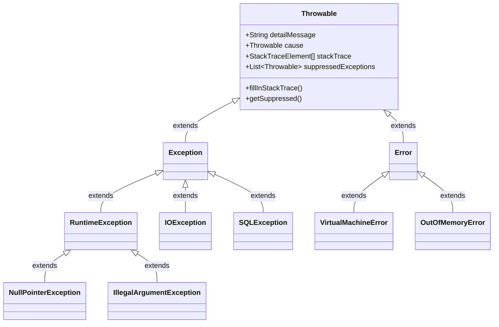

> [!TIP]
> **Performance implication**: Nếu bạn sử dụng Exception để control flow (điều khiển luồng) thay vì xử lý lỗi, hãy cân nhắc override phương thức `fillInStackTrace()` để return `this` (không thu thập stack trace) nhằm giảm overhead, mặc dù điều này làm mất khả năng debug.

### 1.2 Try-with-Resources và Suppressed Exceptions

Cơ chế `try-with-resources` được JVM biên dịch thành các khối `try-catch-finally` lồng nhau. Điểm quan trọng nhất là thứ tự đóng resource và cơ chế **Suppressed Exceptions**.

*   **Thứ tự đóng**: Các resources được khai báo sẽ được đóng theo thứ tự **ngược lại** (LIFO - Last In, First Out) so với thứ tự khởi tạo.
*   **Suppressed Exceptions**: Nếu khối `try` ném ra ngoại lệ, và quá trình gọi `close()` cũng ném ra ngoại lệ, thì ngoại lệ của khối `try` sẽ là ngoại lệ chính được ném ra, còn ngoại lệ của `close()` sẽ được thêm vào dưới dạng **Suppressed Exception** bằng cách gọi `addSuppressed()`.

```java
public class ExceptionSuppressionDemo {
    static class BadResource implements AutoCloseable {
        String name;
        public BadResource(String name) { this.name = name; }
        
        public void doWork() throws Exception {
            throw new RuntimeException("Exception from try block - " + name);
        }
        
        @Override
        public void close() throws Exception {
            throw new RuntimeException("Exception from close() - " + name);
        }
    }

    public static void main(String[] args) {
        try (BadResource r1 = new BadResource("R1");
             BadResource r2 = new BadResource("R2")) {
            r1.doWork();
        } catch (Exception e) {
            System.out.println("Main Exception: " + e.getMessage());
            for (Throwable t : e.getSuppressed()) {
                System.out.println("Suppressed: " + t.getMessage());
            }
        }
    }
}
/* Output:
Main Exception: Exception from try block - R1
Suppressed: Exception from close() - R2
Suppressed: Exception from close() - R1
*/
```

> [!IMPORTANT]
> **Edge Case**: Nếu constructor của một resource ném ra ngoại lệ, resource đó sẽ KHÔNG được đóng (vì chưa khởi tạo xong). Các resource đã khởi tạo trước đó vẫn sẽ được đóng bình thường.

### 1.3 Finally Block: Nguy cơ nuốt ngoại lệ (Swallowing Exceptions)

Một khối `finally` có thể ghi đè (override) ngoại lệ đang được ném ra hoặc giá trị return của khối `try/catch`. 

```java
public String testFinally() {
    try {
        throw new RuntimeException("First Exception");
    } finally {
        // Return statement in finally overrides any thrown exception!
        return "Normal Return"; // The RuntimeException is SWALLOWED and lost forever.
    }
}
```

> [!WARNING]
> Theo JLS 14.20.2, nếu khối `finally` hoàn thành đột ngột (abrupt completion - ví dụ bằng `return`, `throw`, `break`, `continue`), thì lý do hoàn thành của toàn bộ khối try-finally sẽ là lý do của `finally`.

## 2. Java I/O Complete Architecture

### 2.1 I/O Class Hierarchy

I/O trong Java được thiết kế theo **Decorator Pattern**, cho phép bạn bọc (wrap) các stream cơ bản vào các stream cao cấp hơn để thêm tính năng.

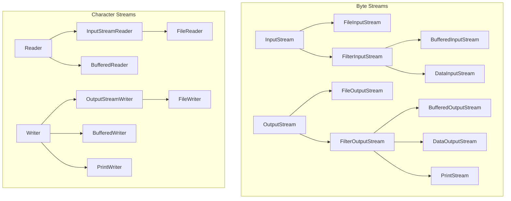

### 2.2 Byte Streams vs Character Streams

*   **Byte Streams** (`InputStream`/`OutputStream`): Xử lý dữ liệu nhị phân (hình ảnh, video, object serialization). Đọc/ghi từng byte (8 bits).
*   **Character Streams** (`Reader`/`Writer`): Xử lý văn bản (text). Tự động xử lý việc mã hóa/giải mã (encoding/decoding) các byte thành các ký tự char (16-bit UTF-16) dựa trên Charset.

> [!NOTE]
> `PrintStream` (ví dụ `System.out`) là byte stream nhưng có các phương thức in text tiện lợi. Nó **không bao giờ ném ra IOException** (bạn phải gọi `checkError()` để biết có lỗi ghi hay không). `PrintWriter` là tương đương ở phía Character Stream.

### 2.3 Serialization Deep Dive

Serialization là quá trình chuyển đổi đối tượng thành chuỗi bytes.

1.  **Chỉ có các field không phải `transient` và không phải `static` mới được serialize.**
2.  **Quá trình Deserialization (Giải nén):**
    *   Constructor của lớp hiện tại (lớp implement `Serializable`) **KHÔNG** được gọi.
    *   Tuy nhiên, JVM sẽ tìm lớp cha gần nhất **không** implement `Serializable` và gọi no-arg constructor của lớp cha đó. Nếu lớp cha đó không có no-arg constructor, `InvalidClassException` sẽ bị ném ra.

| Method Customization | Purpose |
| :--- | :--- |
| `writeObject(ObjectOutputStream out)` | Tùy chỉnh cách ghi dữ liệu (thường để mã hóa hoặc xử lý transient fields thủ công). |
| `readObject(ObjectInputStream in)` | Tùy chỉnh cách đọc dữ liệu. |
| `readResolve()` | Chạy ngay sau khi deserialization hoàn tất. Dùng để duy trì **Singleton Pattern** (trả về instance duy nhất thay vì đối tượng mới tạo ra). |
| `writeReplace()` | Thay thế đối tượng trước khi serialization diễn ra. |

## 3. NIO.2 Complete Reference (java.nio.file)

### 3.1 `Path` Operations and Edge Cases

Giao diện `Path` đại diện cho một đường dẫn trừu tượng. Nó hoàn toàn phụ thuộc vào hệ điều hành (syntactic), nhiều phương thức không hề chạm vào file system (không quan tâm file có tồn tại hay không).

| Operation | Result | Note |
| :--- | :--- | :--- |
| `Path.of("a/b").resolve("c")` | `a/b/c` | Nối đường dẫn bình thường. |
| `Path.of("a/b").resolve("/c")` | `/c` | **Edge Case**: Nếu tham số là absolute path, trả về chính tham số đó. |
| `Path.of("a/b").relativize(Path.of("a/b/c/d"))` | `c/d` | Tạo đường dẫn tương đối từ Path 1 đến Path 2. |
| `Path.of("/a/b").relativize(Path.of("c/d"))` | `IllegalArgumentException` | **Edge Case**: Cả hai phải cùng là absolute hoặc cùng là relative. |
| `Path.of("a/b/../c").normalize()` | `a/c` | Chỉ xử lý chuỗi syntactic, loại bỏ `..` và `.`. Không check file system. |
| `Path.of("a/b/../c").toRealPath()` | (Absolute path to c) | Giải quyết symlink, `..`, và yêu cầu file **phải tồn tại** trên ổ đĩa. |

### 3.2 Symlinks và FileAttributes

Khi duyệt hoặc kiểm tra file, các phương thức NIO.2 thường theo (follow) symlink theo mặc định. Để ngăn chặn, sử dụng enum `LinkOption.NOFOLLOW_LINKS`.

`Files.readAttributes(path, BasicFileAttributes.class)` cung cấp cách lấy metadata tối ưu hơn việc gọi từng phương thức như `Files.size()`, `Files.getLastModifiedTime()`.

## 4. Concurrency & Java Memory Model (JMM)

### 4.1 Java Memory Model: Happens-Before

JMM quyết định khi nào thread A nhìn thấy sự thay đổi biến do thread B thực hiện. Khái niệm cốt lõi là **happens-before relationship**.
*   **Volatile**: Ghi vào một biến volatile *happens-before* mọi lần đọc từ biến volatile đó sau này. Đảm bảo visibility (tính nhìn thấy) nhưng **không đảm bảo atomicity** (ví dụ `count++` với volatile vẫn bị race condition).
*   **Monitor Lock (Synchronized)**: Việc unlock một monitor *happens-before* mọi lần lock trên cùng monitor đó. Đảm bảo cả visibility và atomicity (mutual exclusion).

### 4.2 Lock Interface vs Synchronized

| Feature | `synchronized` | `Lock` (e.g., `ReentrantLock`) |
| :--- | :--- | :--- |
| **Acquisition** | Cứng (blocking cho đến khi có lock). | Linh hoạt: `tryLock()`, `lockInterruptibly()`. |
| **Release** | Tự động khi thoát khỏi block/method. | Thủ công (phải gọi `unlock()` trong `finally`). |
| **Fairness** | Không công bằng. | Có thể cấu hình Fair (thread đợi lâu nhất được lock). |
| **Read/Write separation**| Không hỗ trợ. | Có `ReadWriteLock` tối ưu cho read-heavy. |

### 4.3 Virtual Threads (Project Loom - Java 21+)

Virtual Threads là luồng nhẹ (lightweight threads) do JVM quản lý thay vì OS. Chúng giải quyết vấn đề "thread-per-request" chặn I/O gây tốn kém tài nguyên.

```mermaid
graph TD
    subgraph OS
    OST1[OS Thread 1]
    OST2[OS Thread 2]
    end
    
    subgraph JVM ForkJoinPool (Carrier Threads)
    CT1[Carrier Thread A] -. mapped to .-> OST1
    CT2[Carrier Thread B] -. mapped to .-> OST2
    end
    
    subgraph JVM Virtual Threads
    VT1[Virtual Thread 1]
    VT2[Virtual Thread 2]
    VT3[Virtual Thread 3]
    VT4[Virtual Thread 4]
    
    VT1 -- mounted --> CT1
    VT2 -- mounted --> CT2
    VT3 -.- unmounted
    VT4 -.- unmounted
    end
```

**Cơ chế hoạt động**:
1.  Khi một Virtual Thread thực hiện một thao tác blocking I/O (ví dụ đọc DB, đọc file), JVM sẽ **unmount** (tháo) nó khỏi Carrier Thread (Platform thread).
2.  Carrier Thread được giải phóng để chạy Virtual Thread khác.
3.  Khi I/O hoàn tất, Virtual Thread được đưa trở lại hàng đợi và được **mount** lại vào một Carrier Thread (có thể là một Carrier Thread khác).

> [!WARNING]
> **Pinning (Ghim luồng)**: Nếu Virtual Thread thực hiện blocking operation trong một khối `synchronized` hoặc khi đang gọi hàm native (JNI), nó không thể unmount. Nó sẽ "ghim" Carrier Thread lại, làm giảm hiệu năng hệ thống. Giải pháp là thay thế `synchronized` bằng `ReentrantLock`.

## 5. JDBC Architecture

### 5.1 ResultSet Concurrency & Types

Khi tạo Statement, bạn có thể chỉ định loại ResultSet:
`connection.createStatement(ResultSet.TYPE_SCROLL_SENSITIVE, ResultSet.CONCUR_UPDATABLE);`

*   **TYPE_FORWARD_ONLY**: (Mặc định) Chỉ tiến lên (`next()`). Nhanh nhất.
*   **TYPE_SCROLL_INSENSITIVE**: Có thể cuộn tới/lui (`previous()`, `absolute()`). Không thấy thay đổi từ các giao dịch khác sau khi query được mở.
*   **TYPE_SCROLL_SENSITIVE**: Cuộn tới/lui. Có thể nhìn thấy những thay đổi về dữ liệu do thao tác update của các thread/process khác.

### 5.2 Transaction Isolation Levels

Xử lý các hiện tượng: Dirty Read (đọc dữ liệu chưa commit), Non-repeatable Read (đọc lại cùng dữ liệu thấy bị thay đổi), Phantom Read (đọc lại thấy xuất hiện dòng mới).

| Isolation Level | Dirty Read | Non-repeatable Read | Phantom Read |
| :--- | :--- | :--- | :--- |
| `READ_UNCOMMITTED` | Có | Có | Có |
| `READ_COMMITTED` | Không | Có | Có |
| `REPEATABLE_READ` | Không | Không | Có |
| `SERIALIZABLE` | Không | Không | Không |

## 6. Localization Deep Dive

### 6.1 ResourceBundle Resolution

Khi gọi `ResourceBundle.getBundle("Messages", new Locale("fr", "CA"))`, JVM tìm kiếm theo thứ tự fallback:

1.  `Messages_fr_CA.java` (Class wins over Properties)
2.  `Messages_fr_CA.properties`
3.  `Messages_fr.java`
4.  `Messages_fr.properties`
5.  `Messages_DefaultLocale_DefaultCountry...` (Dựa trên `Locale.getDefault()`)
6.  `Messages.java`
7.  `Messages.properties`
8.  Ném `MissingResourceException`.

## 7. Modules (JPMS) Deep Dive

### 7.1 Module Directives & Encapsulation

Module system kiểm soát cả quá trình compile và runtime.

*   `exports pkg;` : Gói có thể truy cập bởi mọi module khác.
*   `exports pkg to moduleA;` : **Qualified Export**, chỉ cho phép moduleA truy cập.
*   `opens pkg;` : Gói có thể truy cập được thông qua **Reflection** tại runtime (cần thiết cho các framework như Hibernate, Spring).
*   `requires transitive moduleB;` : Bất kỳ module nào yêu cầu module hiện tại cũng ngầm định yêu cầu luôn moduleB (Implied Readability).

### 7.2 Automatic Modules & Unnamed Module

*   **Automatic Module**: Khi đặt một JAR non-module (không có `module-info.class`) lên Module Path. Tên module tự động sinh ra từ tên file JAR. Nó `requires transitive` mọi module khác và `exports` toàn bộ package của nó.
*   **Unnamed Module**: Đại diện cho Classpath. Các module trên Module Path không thể đọc Unnamed Module. Tuy nhiên, Unnamed Module có thể đọc mọi thứ trên Module Path. (Gây ra vấn đề chia rẽ classpath và module path - Split Package không được phép giữa các module).

---

## Hard Practice Questions

**Q1.** What is the output of the following code?
```java
public class ResTest {
    static class MyRes implements AutoCloseable {
        int id;
        MyRes(int id) { this.id = id; }
        public void close() throws Exception {
            throw new Exception("Close " + id);
        }
    }
    public static void main(String[] args) {
        try (MyRes r1 = new MyRes(1); MyRes r2 = new MyRes(2)) {
            throw new Exception("Try Block");
        } catch (Exception e) {
            System.out.print(e.getMessage() + " | ");
            for(Throwable t : e.getSuppressed()) System.out.print(t.getMessage() + " | ");
        }
    }
}
```
A) Try Block | Close 1 | Close 2 |
B) Try Block | Close 2 | Close 1 |
C) Close 2 | Try Block | Close 1 |
D) Try Block |

**Q2.** Which Path method resolves symbolic links and requires the file to actually exist on the file system?
A) `toAbsolutePath()`
B) `normalize()`
C) `toRealPath()`
D) `resolve()`

**Q3.** In the Java Memory Model, which statement is true regarding the `volatile` keyword?
A) It guarantees atomicity for compound operations like `i++`.
B) It prevents threads from caching the variable, ensuring visibility.
C) It implicitly acquires a monitor lock on the object.
D) It can only be applied to primitive types.

**Q4.** A Virtual Thread is executing a method. Under which of the following conditions might the Virtual Thread get "pinned" to its carrier thread, reducing scalability? (Choose two)
A) Performing a blocking HTTP request using `HttpClient`.
B) Waiting inside a `synchronized` block.
C) Calling `Thread.sleep()`.
D) Executing a native method via JNI.
E) Acquiring a `ReentrantLock`.

**Q5.** You have a base resource bundle `App.properties` and a specific bundle `App_fr.properties`. Both files have the key `greeting`. If the JVM default locale is `en_US` and you request a bundle for `fr_CA`, which value is loaded for `greeting`?
A) Value from `App_fr_CA.properties` (throws exception if missing)
B) Value from `App_fr.properties`
C) Value from `App_en_US.properties`
D) Value from `App.properties`

**Q6.** Which JDBC isolation level prevents Dirty Reads and Non-repeatable Reads, but may still allow Phantom Reads?
A) READ_UNCOMMITTED
B) READ_COMMITTED
C) REPEATABLE_READ
D) SERIALIZABLE

**Q7.** Given module A `requires transitive module B`, and module C `requires module A`. Which of the following is true?
A) C cannot read B.
B) C can read B only at compile time.
C) C can read B both at compile time and runtime.
D) A cannot export packages from B.

**Q8.** When deserializing an object using `ObjectInputStream`, which constructor is invoked?
A) The default no-arg constructor of the class being deserialized.
B) The constructor of the highest non-serializable superclass.
C) The lowest non-serializable superclass no-arg constructor.
D) No constructors are called for any classes in the hierarchy.

**Q9.** What is the result of `Path.of("/usr/bin").resolve("/etc/config")`?
A) `/usr/bin/etc/config`
B) `/etc/config`
C) `usr/bin/etc/config`
D) Throws `IllegalArgumentException`

**Q10.** What happens if a `finally` block throws an exception while another exception is currently propagating from the `try` block?
A) The original exception is returned, and the finally exception is added as a suppressed exception.
B) The finally exception propagates, and the original exception is added as a suppressed exception.
C) The finally exception propagates, and the original exception is lost (swallowed).
D) A `MultipleExceptionsError` is thrown by the JVM.

### Answers Key
1. B (Resources closed in reverse order, Try block exception is primary)
2. C (toRealPath touches file system)
3. B (Visibility only, no atomicity)
4. B, D (synchronized and native methods pin the carrier thread)
5. B (Fallback: fr_CA -> fr -> Default(en_US) -> Base)
6. C
7. C (Due to implied readability from transitive)
8. C (Lowest/closest non-serializable superclass no-arg constructor is called)
9. B (Resolving with an absolute path returns the absolute path)
10. C (finally overrides the propagating exception)


---

## 📘 PHASE 6: CÁC TÍNH NĂNG ĐỘT PHÁ TỪ JAVA 22 ĐẾN JAVA 25
### 1. Giáo trình Chuẩn & Cú pháp Java 22 - 25
# Giai đoạn 6: Các tính năng mới của Java 22 - 25 (OCP Java SE 25 - 1Z0-831)

Tài liệu này bao gồm **tất cả** các tính năng mới từ Java 22 đến Java 25 có thể xuất hiện trong bài thi chứng chỉ OCP Java SE 25 Developer (1Z0-831).

---

## 6.1 Flexible Constructor Bodies (JEP 482 — Java 24, Final trong Java 25)

> [!NOTE]
> Trước Java 22, câu lệnh `super()` hoặc `this()` (nếu có) phải là câu lệnh **đầu tiên** trong constructor. JEP 482 thay đổi điều này, cho phép viết các đoạn mã khởi tạo, tính toán và xác thực *trước* khi gọi constructor của lớp cha hoặc constructor khác.

### Động lực (Motivation)
Việc bắt buộc `super()` phải đứng đầu gây khó khăn nếu chúng ta cần tính toán phức tạp hoặc xác thực tham số (validate) trước khi truyền cho lớp cha, hoặc khi lớp cha tốn nhiều tài nguyên khởi tạo trong khi tham số đầu vào lại không hợp lệ.

### Quy tắc (Rules)

#### NHỮNG ĐIỀU ĐƯỢC PHÉP (CAN do before `super()`/`this()`)
1. Khai báo biến cục bộ.
2. Thực hiện các cấu trúc điều khiển (`if`, `for`, `try-catch`).
3. Đọc biến `static`, gọi phương thức `static`.
4. **Đặc biệt (từ JEP 482)**: Gán giá trị (assign) cho các trường (fields) của chính đối tượng hiện tại (`this.field`).

#### NHỮNG ĐIỀU KHÔNG ĐƯỢC PHÉP (CANNOT do before `super()`/`this()`)
1. **Không được ĐỌC** bất kỳ trường instance nào của đối tượng (dù đã gán hay chưa).
2. **Không được GỌI** bất kỳ phương thức instance nào của đối tượng.
3. **Không được sử dụng `this`** như một tham số truyền vào phương thức khác.

### Ví dụ (Code Examples)

```java
public class PositiveNumber extends Number {
    private final int value;
    private final long timestamp;

    public PositiveNumber(int value) {
        // HỢP LỆ: Xác thực trước khi gọi super()
        if (value <= 0) {
            throw new IllegalArgumentException("Must be positive");
        }
        
        // HỢP LỆ: Gán giá trị cho field TRƯỚC super() - Tính năng mới JEP 482!
        this.timestamp = System.currentTimeMillis();
        
        // Gọi lớp cha
        super();
        
        // HỢP LỆ: Gán giá trị bình thường SAU super()
        this.value = value;
    }

    // LỖI BIÊN DỊCH (DOES NOT COMPILE)
    public PositiveNumber(int value, boolean flag) {
        this.value = value; // Hợp lệ (Gán trước super)
        
        // LỖI: Không được phép ĐỌC this.value trước khi super() hoàn tất
        // System.out.println(this.value); 
        
        // LỖI: Không được gọi instance method trước super()
        // this.printInfo();
        
        super();
    }
}
```

> [!WARNING]
> **Trap đi thi:** Bài thi sẽ cố tình gài một constructor mà trong đó có lệnh in ra (hoặc đọc) giá trị của một field đã được gán trước lệnh `super()`. Nhớ kỹ: **Gán thì được, nhưng ĐỌC thì KHÔNG THỂ trước khi `super()` kết thúc.**

---

## 6.2 Instance Main Methods (JEP 495 — Java 25)

> [!TIP]
> Java 21 giới thiệu tính năng này dưới dạng Preview và Java 25 chính thức hoàn thiện. Giờ đây, bạn không cần phải viết `public static void main(String[] args)` phức tạp nữa.

### Launch protocol priority (Thứ tự ưu tiên khởi chạy)
Khi chạy một class `MyProgram`, JVM sẽ tìm kiếm phương thức khởi chạy theo thứ tự ưu tiên sau:
1. `static void main(String[] args)` (Truyền thống, ưu tiên cao nhất)
2. `static void main()`
3. `void main(String[] args)` (Instance method)
4. `void main()` (Instance method không tham số, ưu tiên thấp nhất)

### Lớp IO và Implicit Classes
Java 25 tự động import (ngầm định) class `java.io.IO`, cung cấp các phương thức như `println()`, `readln()` để sử dụng trực tiếp.
Đồng thời, bạn có thể tạo **Implicit class** (không cần khai báo `class` bao bọc bên ngoài).

```java
// Tập tin: HelloWorld.java
// Không cần public class HelloWorld { ... }

void main() {
    println("Hello, Instance Main!"); // Lấy từ java.io.IO
    String name = readln("What is your name? ");
    println("Welcome, " + name);
}
```

> [!CAUTION]
> **Trap đi thi:** Nếu một class định nghĩa cả `static void main(String[] args)` và `void main()`, và bạn chạy class đó, JVM sẽ chỉ gọi bản **static có tham số**. Hãy nhớ kỹ thứ tự ưu tiên!

---

## 6.3 Unnamed Variables & Patterns (JEP 456 — Java 22)

Cho phép sử dụng ký tự gạch dưới `_` thay cho tên biến khi bạn **không định sử dụng biến đó**. 
Điểm đặc biệt nhất: Bạn có thể khai báo **nhiều biến `_` trong cùng một phạm vi (scope)** mà không bị lỗi trùng tên biến.

### Các trường hợp sử dụng hợp lệ

```java
public class UnnamedExample {
    public void process(Object obj) {
        // 1. Unnamed variable trong catch
        try {
            int x = 10 / 0;
        } catch (ArithmeticException _) { // HỢP LỆ
            System.out.println("Lỗi toán học!");
        } catch (Exception _) {           // HỢP LỆ, _ không bị trùng
            System.out.println("Lỗi chung!");
        }

        // 2. Unnamed variable trong vòng lặp for
        int count = 0;
        for (String _ : List.of("A", "B", "C")) {
            count++; // Bỏ qua giá trị phần tử
        }

        // 3. Unnamed pattern trong instanceof / switch
        if (obj instanceof Point(int x, int _)) { 
            // Chỉ quan tâm x, không quan tâm y
            System.out.println("X = " + x);
        }

        // 4. Lambda parameter
        BiFunction<Integer, Integer, Integer> add = (a, _) -> a + 10;
        
        // 5. Try-with-resources
        try (var _ = new ScopedResource()) {
            System.out.println("Làm việc với resource");
        }
    }
}
```

---

## 6.4 Module Import Declarations (JEP 494 — Java 25)

Cú pháp mới để import tất cả các gói (packages) được export bởi một module cụ thể.

```java
import module java.base; // Import toàn bộ public packages của java.base
import module java.sql;
```

### Xử lý nhập nhằng (Ambiguity Resolution)
Mức độ ưu tiên của các loại import từ cao xuống thấp:
1. **Single-type-import** (vd: `import java.util.Date;`)
2. **Type-import-on-demand** (vd: `import java.util.*;`)
3. **Module-import** (vd: `import module java.base;`)

> [!WARNING]
> **Trap đi thi:** Nếu dùng `import module java.base;` và `import module java.sql;`, cả hai đều export class tên là `Date` (`java.util.Date` và `java.sql.Date`). Nếu trong code bạn dùng trực tiếp `Date d = ...;`, trình biên dịch sẽ báo **lỗi Ambiguous** (Không rõ ràng). Giải pháp là thêm `import java.sql.Date;` (ưu tiên cao hơn) hoặc dùng tên đầy đủ (FQCN).

---

## 6.5 Stream Gatherers (JEP 485 — Java 25)

> [!IMPORTANT]
> `Stream API` bổ sung một intermediate operation mới là `gather(Gatherer)`. Đây là mảnh ghép còn thiếu để tạo các phép biến đổi Stream phức tạp (như stateful mapping) mà không làm mất tính song song (parallel) của Stream.

### Built-in Gatherers (trong `java.util.stream.Gatherers`)

1. **`windowFixed(int size)`**: Nhóm các phần tử thành các list có kích thước cố định.
2. **`windowSliding(int size)`**: Nhóm thành list trượt (sliding window).
3. **`fold(Supplier, BiFunction)`**: Giống `reduce` nhưng có thể thay đổi kiểu dữ liệu, dừng lại tại bất kỳ điểm nào, tạo thành Stream chứa **1 phần tử duy nhất**.
4. **`scan(Supplier, BiFunction)`**: Tương tự `fold` nhưng giữ lại toàn bộ các giá trị trung gian (prefix scan).
5. **`mapConcurrent(int maxConcurrency, Function)`**: Chạy map đồng thời, hữu ích khi hàm map bị block (IO-bound).

```java
import java.util.stream.*;
import java.util.List;

public class GathererDemo {
    public static void main() {
        // 1. windowFixed
        List<List<Integer>> fixed = Stream.of(1, 2, 3, 4, 5)
            .gather(Gatherers.windowFixed(3))
            .toList();
        // Kết quả: [[1, 2, 3], [4, 5]]

        // 2. windowSliding
        List<List<Integer>> sliding = Stream.of(1, 2, 3, 4)
            .gather(Gatherers.windowSliding(2))
            .toList();
        // Kết quả: [[1, 2], [2, 3], [3, 4]]
    }
}
```

---

## 6.6 Scoped Values (JEP 487 — Java 25)

Scoped Values là công cụ thay thế cho `ThreadLocal` nhằm truyền dữ liệu (data) sâu xuống call stack mà không cần khai báo tham số. 
Đặc điểm nổi bật: **Immutable (Bất biến)**, **Vòng đời hẹp (Chỉ tồn tại trong khối `run()` hoặc `call()`)**, cực kỳ phù hợp và tối ưu bộ nhớ cho **Virtual Threads**.

```java
public class ScopedValueDemo {
    // Khai báo một ScopedValue
    private static final ScopedValue<String> USER_NAME = ScopedValue.newInstance();

    public static void main() {
        // Gắn (bind) giá trị và chạy hàm
        ScopedValue.where(USER_NAME, "DatPham").run(() -> {
            processRequest(); 
        });
        
        // Bên ngoài khối run, isBound() trả về false
        System.out.println(USER_NAME.isBound()); // false
    }

    private static void processRequest() {
        // Lấy giá trị ra
        if (USER_NAME.isBound()) {
            System.out.println("Processing for: " + USER_NAME.get());
        }
    }
}
```

> [!CAUTION]
> Gọi `USER_NAME.get()` khi Scoped Value chưa được bind (isBound() == false) sẽ ném ra ngoại lệ `NoSuchElementException`. Đây là điểm bài thi hay kiểm tra!

---

## 6.7 Structured Concurrency (JEP 505 — Preview trong Java 25)

Cho phép gộp nhiều concurrent tasks thành một đơn vị công việc duy nhất để quản lý vòng đời và lỗi dễ dàng hơn bằng `StructuredTaskScope`. (Lưu ý: Tính năng preview ít khi có câu hỏi khó, nhưng cần nhận diện cú pháp).

```java
import java.util.concurrent.StructuredTaskScope;

void handle() throws InterruptedException {
    try (var scope = new StructuredTaskScope.ShutdownOnFailure()) {
        // fork()
        StructuredTaskScope.Subtask<String> task1 = scope.fork(() -> fetchA());
        StructuredTaskScope.Subtask<Integer> task2 = scope.fork(() -> fetchB());
        
        // join() tất cả và tự động xử lý huỷ bỏ nếu có 1 task lỗi
        scope.join().throwIfFailed();
        
        System.out.println(task1.get() + task2.get());
    }
}
```

---

## 6.8 Các thay đổi đáng chú ý khác (Other Notable Changes)

- Lớp `Console`: Giờ có các phương thức tiện lợi thay thế `System.out.print` và `Scanner`. VD: `System.console().readLine()`.
- Lớp `IO`: Các hàm tĩnh `IO.println` và `IO.readln`.
- **Primitive types in patterns**: Hỗ trợ kiểu nguyên thuỷ (int, long...) trực tiếp trong pattern matching `instanceof` và `switch` (tuy nhiên vẫn ở dạng Preview JEP 455 - chưa chính thức).

---

## Bài tập trắc nghiệm (Quiz - 15 câu hỏi)

**Câu 1:** Xem đoạn mã sau sử dụng tính năng Flexible Constructor.
```java
class Person {
    String name;
}
class Employee extends Person {
    int id;
    Employee(int id, String name) {
        this.id = id; 
        System.out.println(this.id);
        super();
        this.name = name;
    }
}
```
Kết quả khi biên dịch là gì?
A) Biên dịch thành công và chương trình chạy bình thường.
B) Lỗi biên dịch vì `this.id` không thể được gán (assigned) trước khi gọi `super()`.
C) Lỗi biên dịch vì không được gọi `super()` sau khi thực hiện các phép gán.
D) Lỗi biên dịch vì không được PHÉP ĐỌC `this.id` trong lệnh `println` trước khi gọi `super()`.

**Câu 2:** Một chương trình Java chỉ có nội dung sau nằm trong một file `App.java`:
```java
void main(String[] args) {
    System.out.println("A");
}
static void main(String[] args) {
    System.out.println("B");
}
void main() {
    System.out.println("C");
}
```
Nếu chạy bằng lệnh `java App.java`, kết quả in ra là gì?
A) A
B) B
C) C
D) Lỗi biên dịch vì có quá nhiều hàm main.

**Câu 3:** Trong cùng một khối `catch`, đoạn mã sau có hợp lệ trong Java 22+ không?
```java
try {
    // code
} catch (IllegalArgumentException _) {
    System.out.println("Lỗi A");
} catch (NullPointerException _) {
    System.out.println("Lỗi B");
}
```
A) Không hợp lệ vì biến `_` bị trùng tên.
B) Hợp lệ, chương trình biên dịch bình thường.
C) Lỗi biên dịch, `_` chỉ được dùng cho biến cục bộ, không dùng được cho tham số ngoại lệ.

**Câu 4:** Tính năng "Module Import Declarations". Khi bạn viết đoạn code sau:
```java
import module java.base;
import module java.sql;
// Cả hai module đều export lớp Date
```
Và bạn sử dụng class `Date` trong mã nguồn mà không import tường minh class nào. Chuyện gì sẽ xảy ra?
A) Ưu tiên sử dụng `java.util.Date` vì `java.base` là module cốt lõi.
B) Ưu tiên sử dụng `java.sql.Date`.
C) Lỗi biên dịch do nhập nhằng (ambiguous) giữa 2 lớp Date.
D) Trình biên dịch cảnh báo nhưng chọn class đầu tiên được phát hiện.

**Câu 5:** Kết quả của đoạn code sử dụng Stream Gatherers sau đây là gì?
```java
var result = Stream.of("A", "B", "C", "D")
                   .gather(Gatherers.windowSliding(2))
                   .toList();
System.out.println(result.size());
```
A) 2
B) 3
C) 4
D) 5

**Câu 6:** Khi làm việc với `ScopedValue`, phương thức nào dùng để tạo ra một ScopedValue mới?
A) `new ScopedValue<>()`
B) `ScopedValue.create()`
C) `ScopedValue.newInstance()`
D) `ScopedValue.of()`

**Câu 7:** (Chọn HAI đáp án). Những hành động nào bị CẤM thực hiện **trước** lệnh `super()` trong Java 25 (Flexible Constructor Bodies)?
A) Gọi một phương thức static của lớp đó.
B) Gọi một phương thức instance của lớp đó.
C) Gán giá trị cho một biến instance của lớp đó.
D) Truyền tham chiếu `this` vào một phương thức thuộc lớp khác.
E) Khai báo và gán giá trị cho một biến cục bộ (local variable).

**Câu 8:** Xem đoạn mã sau:
```java
void process(int code) {
    switch (code) {
        case 1, _ -> System.out.println("One or other"); // Dòng 1
        default -> System.out.println("Default");
    }
}
```
Khẳng định nào đúng?
A) Dòng 1 bị lỗi biên dịch vì không thể dùng `_` (unnamed pattern) cho kiểu nguyên thuỷ (primitive type) trong case switch (không phải pattern switch).
B) Hợp lệ, in ra "One or other".
C) Dòng 1 hợp lệ, nhưng báo lỗi vì `_` và `default` gây trùng lặp logic.

**Câu 9:** Output của đoạn mã sau là gì?
```java
public class Demo {
    static final ScopedValue<String> SV = ScopedValue.newInstance();
    public static void main(String[] args) {
        ScopedValue.where(SV, "Value1").run(() -> {
            ScopedValue.where(SV, "Value2").run(() -> {
                System.out.print(SV.get() + " ");
            });
            System.out.print(SV.get());
        });
    }
}
```
A) Value1 Value1
B) Value2 Value1
C) Value2 Value2
D) Runtime Exception tại lần gọi `where()` thứ hai.

**Câu 10:** Khi sử dụng `Gatherers.fold`, điều gì phân biệt nó với phép toán `reduce` thông thường của Stream?
A) `fold` không thể trả về giá trị kiểu dữ liệu khác với cấu trúc phần tử của Stream, còn `reduce` thì có thể.
B) `fold` có thể dừng (short-circuit) việc duyệt Stream bất cứ lúc nào, trong khi `reduce` bắt buộc duyệt hết các phần tử.
C) `fold` sinh ra một List các phần tử kết quả, còn `reduce` trả về một số.
D) `fold` không hoạt động với parallel stream.

**Câu 11:** Trong `StructuredTaskScope.ShutdownOnFailure`, nếu có 3 subtasks, trong đó 1 subtask ném ra ngoại lệ và 2 subtasks khác đang chạy. Điều gì xảy ra?
A) Scope sẽ tự động gọi phương thức hủy bỏ (cancel) đối với 2 tasks đang chạy còn lại.
B) Scope sẽ chờ 2 tasks còn lại chạy xong rồi mới ném ra lỗi.
C) Scope sẽ bỏ qua lỗi và trả về null cho task thất bại.
D) Chương trình văng `OutOfMemoryError`.

**Câu 12:** Lớp `IO` được import ngầm định (implicitly imported) cung cấp phương thức `println`. Có thể sử dụng lớp `IO` trong các class được khai báo `public class` thông thường thay vì implicit class được không?
A) Không, `IO` chỉ dành cho Implicit classes / Instance main methods.
B) Có, nhưng bạn phải tự thêm `import static java.io.IO.*;` hoặc `import module java.base;` đối với class thông thường.

**Câu 13:** Code sau có in ra lỗi không?
```java
BiFunction<String, String, Boolean> isEqual = (_, _) -> true;
System.out.println(isEqual.apply("A", "B"));
```
A) Có lỗi vì thiếu dấu gạch dưới hợp lệ.
B) Có lỗi vì nhiều `_` trong cùng một danh sách tham số.
C) Biên dịch thành công và in ra `true`.

**Câu 14:** Khi chạy phương thức instance `void main()` bằng lệnh `java`, đối tượng của class được khởi tạo như thế nào?
A) Bằng constructor ngầm định không tham số. Nếu class chỉ có constructor có tham số, chương trình sẽ báo lỗi.
B) JVM bỏ qua khởi tạo và gọi phương thức thông qua Reflection với con trỏ null.
C) Chương trình dùng Unsafe để cấp phát bộ nhớ.

**Câu 15:** Điều kiện tiên quyết để được dùng Unnamed variable `_` trong lệnh `try-with-resources` là gì?
A) Biến phải là kiểu nguyên thuỷ (primitive).
B) Resource phải được gọi phương thức `close()` ngầm định lúc kết thúc và bạn không được phép tham chiếu tới nó bên trong khối `try`.
C) Class của resource phải implement giao diện `AutoCloseable`. (Cả B và C).

---

## Đáp án & Giải thích (Answer Key)

1. **D** - Cú pháp JEP 482 cho phép GÁN trước `super()`, nhưng CẤM việc ĐỌC (bao gồm cả in ra màn hình `this.id`) giá trị field trước khi gọi `super()`.
2. **B** - Thứ tự Launch protocol priority: JVM luôn ưu tiên bản `static void main(String[] args)` cao nhất.
3. **B** - Tính năng mới (JEP 456) cho phép sử dụng ký tự `_` nhiều lần mà không bị lỗi "variable already defined".
4. **C** - Bị lỗi nhập nhằng (ambiguous). Bạn phải phân giải nó bằng cách `import java.sql.Date;` hoặc dùng FQCN (Fully Qualified Class Name).
5. **B** - `windowSliding(2)` trên `[A, B, C, D]` sẽ tạo ra 3 lists: `[A, B]`, `[B, C]`, `[C, D]`. Kết quả in ra `3`.
6. **C** - Cú pháp đúng là `ScopedValue.newInstance()`.
7. **B, D** - Bạn không được phép gọi instance method (B) và không được rò rỉ con trỏ `this` (D) trước lệnh `super()`. Lựa chọn (A) và (C) được phép.
8. **A** - `case 1, _` là không hợp lệ đối với hằng số và switch truyền thống. Unnamed pattern `_` dùng cho cấu trúc pattern matching (vd: `case Point(_, int y)` hoặc `case String _`). 
9. **B** - Scoped Value hỗ trợ **rebinding**. Trong lần lồng ghép (nesting) bên trong, giá trị được re-bind thành "Value2". Khi ra khỏi phạm vi, giá trị phục hồi lại "Value1". Do đó in ra "Value2 Value1".
10. **B** - Tính năng thiết kế nổi bật của Stream Gatherers là cho phép "short-circuiting" linh hoạt mà phép toán `reduce` không làm được.
11. **A** - `ShutdownOnFailure` thiết kế theo tư duy "có lỗi thì dừng tất cả". Nó sẽ cancel các subtasks còn lại ngay lập tức nếu một subtask fail.
12. **B** - Đối với class thông thường (có từ khóa class), nó không tự động import `IO`. Bạn cần import thủ công các package liên quan.
13. **C** - Hợp lệ 100%. Đây là chức năng của Unnamed variable `_` được sử dụng cho cả tham số Lambda.
14. **A** - JVM sẽ dùng reflection khởi tạo đối tượng qua **constructor không tham số**. Nếu bạn tự định nghĩa một constructor có tham số nhưng không có constructor không tham số, runtime sẽ quăng exception vì không biết cách khởi tạo class để gọi `main()`.
15. **C** - Để dùng được trong try-with-resources, đối tượng phải implement `AutoCloseable` và nếu dùng `_`, bạn xác nhận chỉ muốn khối lệnh tự đóng file chứ không dùng đối tượng bên trong block đó. (Cả ý B và C đều là đặc điểm cốt lõi).

---
*Chúc bạn thi tốt chứng chỉ OCP Java SE 25 (1Z0-831)!*


### 2. Lý thuyết Chuyên sâu Stream Gatherer Engine & Scoped Values
# Phase 6: Java 22-25 New Features - Deep Theory Supplement

Tài liệu này cung cấp cái nhìn sâu sắc vào cơ chế hoạt động, lý thuyết nền tảng và các edge cases của các tính năng mới trong Java 22 đến 25, phục vụ cho kỳ thi OCP Java SE 25 (1Z0-831).

---

## 1. Flexible Constructor Bodies — Complete Specification

### 1.1 Motivation and Design Rationale (JEP 482)
Trước đây, Java yêu cầu lời gọi constructor của superclass (`super()`) hoặc constructor cùng lớp (`this()`) phải là statement đầu tiên. Điều này dẫn đến sự bất tiện khi cần thực hiện validation hoặc tính toán các argument trước khi truyền vào `super()`. Lập trình viên thường phải dùng static helper methods, làm mất đi tính rõ ràng của code. JEP 482 (chính thức trong Java 22+) cho phép đặt statements trước `super()`/`this()`.

### 1.2 Prologue Phase vs Epilogue Phase
Constructor execution giờ đây chia thành 2 phase:
1. **Prologue phase**: Trước khi `super()`/`this()` hoàn tất. Ở phase này, object đang ở trạng thái *uninitialized* (chưa khởi tạo hoàn toàn).
2. **Epilogue phase**: Sau khi `super()`/`this()` hoàn tất. Object ở trạng thái *initialized*.

> [!IMPORTANT]
> Mục tiêu chính của các quy tắc trong prologue là ngăn chặn việc đọc từ instance fields hoặc gọi instance methods khi object (và superclass của nó) chưa được khởi tạo xong, tránh "this-escape".

### 1.3 Exact Rules from JLS (Prologue Rules)

| Phép toán / Statement | Cho phép trong Prologue? | Ghi chú |
| :--- | :---: | :--- |
| Khai báo local variables | ✅ Có | Rất phổ biến để lưu trữ kết quả tính toán. |
| Dùng `if`/`switch`/`try-catch` | ✅ Có | Dùng để validation hoặc error handling trước. |
| Throw exceptions | ✅ Có | Ví dụ: `throw new IllegalArgumentException();` |
| Assign to `this.field` | ✅ Có (Mới) | Có thể khởi tạo field của subclass trước khi gọi `super()`. |
| Đọc `this.field` | ❌ KHÔNG | Kể cả field vừa được gán giá trị ở dòng trên. |
| Gọi `this.method()` | ❌ KHÔNG | Vì method có thể truy cập state chưa khởi tạo. |
| Truyền `this` vào method/constructor | ❌ KHÔNG | Ngăn chặn this-escape. |
| Truy cập `super.field` / `super.method()` | ❌ KHÔNG | Superclass chưa hề được khởi tạo! |
| Outer `this` (trong inner class) | ❌ KHÔNG | Outer instance không được tham chiếu trong prologue của inner class constructor. |

#### Code Examples: The Good, The Bad, and The Ugly

```java
public class PositiveNumber extends Number {
    private final int value;
    private final boolean isEven;

    public PositiveNumber(int value) {
        // --- PROLOGUE ---
        if (value <= 0) {
            throw new IllegalArgumentException("Must be positive");
        }
        int v = value;
        // VALID: Assigning to field in prologue is allowed!
        this.isEven = (v % 2 == 0); 
        
        // INVALID: Cannot read field, even if assigned!
        // boolean flag = this.isEven; // COMPILER ERROR
        
        // INVALID: Cannot call instance method
        // doSomething(); // COMPILER ERROR

        super(); 
        // --- EPILOGUE ---
        this.value = v; 
    }
}
```

### 1.4 Interactions with Other Features

#### Records
Compact constructor trong Record KHÔNG có explicit `super()` (compiler tự sinh ở cuối). Do đó, trong compact constructor, bạn không thể gọi `super()` hay `this()`. Tuy nhiên, với *canonical* hoặc *custom* constructors, bạn vẫn áp dụng quy tắc prologue.
> [!NOTE] 
> Bạn có thể đặt statement trước `this()` trong custom record constructor.

#### Enums
Enums không có superclass rõ ràng (kế thừa `java.lang.Enum`), nhưng constructor của chúng gọi `super(name, ordinal)` ngầm định hoặc `this()`. Flexible constructors hoạt động bình thường, prologue rules áp dụng nghiêm ngặt để cấm enum access `this` quá sớm.

---

## 2. Instance Main Methods & Compact Source Files

### 2.1 Implicit Classes & Compiler Magic
JEP 494 & 495 nhắm đến việc giảm boilerplate.
Khi bạn có một file `app.java` không chứa class declaration, trình biên dịch tự động bọc toàn bộ code vào một **Implicit Class**.

```java
// app.java
int counter = 0; // Instance field của implicit class
void main() {    // Instance main method
    println("Hello, counter=" + counter);
}
```

> [!CAUTION]
> Implicit class là final, kế thừa `Object`, thuộc unnamed package, và KHÔNG THỂ được reference từ các source files khác. Nó chỉ dùng để chạy trực tiếp.

### 2.2 Launch Protocol - Resolution Priority
Khi chạy `java MyClass`, JVM tìm method `main` theo thứ tự ưu tiên (Priority):

1. `public static void main(String[] args)` (Standard Java 1.0+)
2. `protected/package-private/private static void main(String[] args)` 
3. `public/protected/package/private static void main()` (No args)
4. `public/protected/package/private void main(String[] args)` (Instance method)
5. `public/protected/package/private void main()` (Instance method no args)

Nếu JVM chọn Instance Main (thứ tự 4 hoặc 5), nó sẽ tự động khởi tạo class bằng no-arg constructor trước khi gọi `main()`.

```mermaid
flowchart TD
    Start([Run java ClassName]) --> A{Has static main(String[])?}
    A -- Yes --> Run1[Execute static main(String[])]
    A -- No --> B{Has static main()?}
    B -- Yes --> Run2[Execute static main()]
    B -- No --> C{Has instance main(String[])?}
    C -- Yes --> Instantiate1[new ClassName()] --> Run3[Execute instance main(String[])]
    C -- No --> D{Has instance main()?}
    D -- Yes --> Instantiate2[new ClassName()] --> Run4[Execute instance main()]
    D -- No --> Error[Fatal Error: main not found]
```

### 2.3 The `IO` Class
Các phương thức `println()`, `print()`, `readln()` được cung cấp thông qua implicit import của class `java.io.IO` (được export từ `java.base`). Điều này có nghĩa bạn không cần `System.out.println()`.

---

## 3. Unnamed Variables & Patterns — Complete Reference

JEP 456 cho phép dùng dấu gạch dưới `_` để bỏ qua các biến hoặc components không cần thiết.

### 3.1 All Use Cases

```java
// 1. Catch Block
try { doRisky(); } catch (Exception _) { /* ignore */ }

// 2. Enhanced For Loop
for (var _ : elements) { count++; }

// 3. Try-with-resources
try (var _ = ScopedValue.where(KEY, value)) { ... }

// 4. Lambda Parameters
BiFunction<Integer, String, String> f = (_, s) -> s.toUpperCase();

// 5. Pattern Matching (Switch / instanceof)
if (obj instanceof Point(var x, _)) { ... }

// 6. Assignment (Local Variables)
var _ = queue.poll(); // Ignore returned value, just remove
```

> [!WARNING]
> `_` là từ khóa dành riêng. Bạn KHÔNG ĐƯỢC dùng nó làm tên biến thông thường (ví dụ `int _ = 5;` sẽ lỗi biên dịch). Hơn nữa, `_` chỉ được dùng cho **local variables**, không dùng cho fields hoặc method parameters thông thường (trừ lambda).

### 3.2 Unnamed Pattern vs Unnamed Pattern Variable
- **Unnamed Pattern Variable**: `var _`, `int _`, `String _`. Khai báo kiểu dữ liệu nhưng không đặt tên biến.
- **Unnamed Pattern**: Chỉ dùng `_` độc lập trong pattern matching. Nó match mọi thứ nhưng không bận tâm đến type.
```java
// Unnamed pattern variable (requires it to be an int)
case Point(int x, int _) -> ...

// Unnamed pattern (matches anything, no type check)
case Point(int x, _) -> ...
```

---

## 4. Module Import Declarations

Cú pháp mới: `import module module.name;`

### 4.1 How it Works
Khi bạn `import module java.base;`, bạn đang import **tất cả** public top-level types (classes, interfaces, enums, records) từ **tất cả** các packages được `java.base` `exports`.
Hành vi này giống như bạn viết `import java.util.*; import java.io.*; ...` hàng chục lần.

### 4.2 Transitive Dependencies
Nếu module A requires transitive module B, thì `import module A;` CŨNG import tất cả exported packages của module B.
Ví dụ: `java.sql` có `requires transitive java.xml`. Nên `import module java.sql;` sẽ mang vào type `java.sql.Connection` VÀ `javax.xml.parsers.DocumentBuilder`.

### 4.3 Ambiguity Resolution
Nếu hai modules export các class trùng tên (rất hiếm, thường được gọi là split packages nhưng với types khác nhau), compiler sẽ báo lỗi *ambiguous import* khi bạn cố sử dụng class đó mà không qualify.
**Import Precedence (Thứ tự ưu tiên):**
1. Single-type import (`import java.util.List;`) - **Cao nhất**
2. Type in current package - **Cao thứ 2**
3. Type in implicitly declared class / local scope
4. On-demand import (`import java.util.*;`) VÀ Module import (`import module java.base;`) - **Thấp nhất, tương đương nhau**

> [!TIP]
> Nếu có xung đột giữa `import java.util.*` và `import module some.other.module;`, bạn cần dùng single-type import để phân giải.

---

## 5. Stream Gatherers — Complete API Reference

`java.util.stream.Gatherer` (JEP 485) là API trung gian (intermediate operation) mạnh mẽ, khắc phục hạn chế của `Stream` khi cần xử lý có trạng thái (stateful) hoặc số lượng phần tử đầu vào khác đầu ra (1-to-many, many-to-1).

### 5.1 The Gatherer Interface
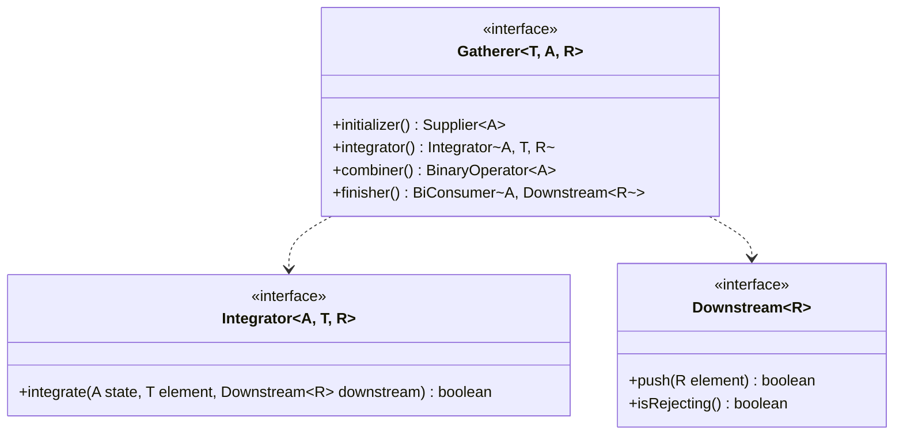
- **T**: Type of input element
- **A**: Type of state (Accumulator)
- **R**: Type of output element

`integrate` trả về `false` báo hiệu *short-circuit* (dừng xử lý).

### 5.2 Built-in Gatherers

#### `windowFixed(int size)`
Nhóm các phần tử thành các lists không chồng lấn.
```java
Stream.of(1, 2, 3, 4, 5)
      .gather(Gatherers.windowFixed(2))
      .forEach(System.out::println);
// Output: [1, 2], [3, 4], [5]
```

#### `windowSliding(int size)`
Nhóm thành các lists chồng lấn, dời 1 bước.
```java
Stream.of(1, 2, 3, 4)
      .gather(Gatherers.windowSliding(2))
      .forEach(System.out::println);
// Output: [1, 2], [2, 3], [3, 4]
```

#### `fold(Supplier, BiFunction)`
Giống `reduce`, nhưng là intermediate. Emit DUY NHẤT một phần tử ở cuối stream.
```java
Stream.of("A", "B", "C")
      .gather(Gatherers.fold(() -> "", (acc, e) -> acc + e))
      .forEach(System.out::println); // Output: ABC
```

#### `scan(Supplier, BiFunction)`
Phát ra kết quả tích lũy sau MỖI phần tử. (Running total).
```java
Stream.of("A", "B", "C")
      .gather(Gatherers.scan(() -> "", (acc, e) -> acc + e))
      .forEach(System.out::println); 
// Output: A, AB, ABC
```

#### `mapConcurrent(int maxConcurrency, Function mapper)`
Sử dụng Virtual Threads để map đồng thời, nhưng vẫn **giữ nguyên thứ tự stream ban đầu**.
```java
Stream.of(urls)
      .gather(Gatherers.mapConcurrent(10, httpDownloader::download))
      ...
```

---

## 6. Scoped Values — Complete API Reference

`java.lang.ScopedValue` (JEP 487) cung cấp cách chia sẻ data cho các phương thức con mà không cần truyền qua parameter, thay thế `ThreadLocal`.

### 6.1 ScopedValue vs ThreadLocal

| Đặc điểm | `ThreadLocal` | `ScopedValue` |
| :--- | :--- | :--- |
| **Mutability** | Mutable (`set()`, `remove()`) | Immutable (Chỉ bind trong scope) |
| **Lifecycle** | Kéo dài tới khi Thread chết / `remove()` | Strictly bounded (Theo block `run()`/`call()`) |
| **Inheritance** | Đắt đỏ (`InheritableThreadLocal` copy map) | Miễn phí, cực kỳ tối ưu (Tree structure) |
| **Virtual Threads** | Tốn memory nếu có hàng triệu VT | Sinh ra dành cho Virtual Threads |

### 6.2 Binding and Execution
Scope chỉ tồn tại trong method được truyền vào `run()` hoặc `call()`.

```java
private static final ScopedValue<String> USER = ScopedValue.newInstance();

public void process() {
    // Ràng buộc giá trị "datpham" vào USER trong phạm vi của Runnable
    ScopedValue.where(USER, "datpham").run(() -> {
        doSomething(); // Bên trong này có thể gọi USER.get()
    });
    
    // Ra khỏi run(), USER quay về unbound
}

private void doSomething() {
    // Đọc giá trị
    System.out.println(USER.get()); // "datpham"
    
    // Đọc an toàn nếu không chắc đã bind
    System.out.println(USER.orElse("guest"));
}
```

> [!WARNING]
> Gọi `get()` khi ScopedValue không được bound sẽ ném `NoSuchElementException`. Luôn dùng `isBound()` hoặc `orElse()` nếu không chắc chắn.

### 6.3 Rebinding (Shadowing)
Bạn có thể bind đè giá trị trong scope con. Khi thoát scope con, giá trị cũ sẽ phục hồi.

---

## 7. Structured Concurrency

`java.util.concurrent.StructuredTaskScope` (JEP 505). Nó đảm bảo "Nếu một task chia thành nhiều subtasks đồng thời, chúng phải cùng hoàn thành hoặc cùng bị hủy".

### 7.1 Core Joiner Strategies

1. **`ShutdownOnFailure` (All or Nothing)**
Giống như `awaitAll()`. Nếu 1 subtask fail, TẤT CẢ các subtasks khác bị cancel. Ném `ExecutionException` nếu có lỗi.

2. **`ShutdownOnSuccess` (Any Success)**
Chạy đua. Lấy kết quả nhanh nhất. Hủy phần còn lại. Ném `ExecutionException` nếu TẤT CẢ fail.

### 7.2 Usage Example

```java
try (var scope = new StructuredTaskScope.ShutdownOnFailure()) {
    Subtask<String> user = scope.fork(() -> fetchUser(id));
    Subtask<Integer> order = scope.fork(() -> fetchOrder(id));
    
    scope.join();           // Đợi tất cả (hoặc đến khi có lỗi đầu tiên)
    scope.throwIfFailed();  // Ném lỗi nếu có subtask fail

    // Sau throwIfFailed(), đảm bảo get() sẽ thành công
    return new Result(user.get(), order.get());
} // Scope tự đóng, dọn dẹp các threads nếu cần
```

---

## 8. Other Additions & Practice Questions

### New APIs
- `Console.readln()`: Đọc chuỗi thay vì dùng `Scanner(System.in)`.
- `Math.clamp(value, min, max)`: Trả về giá trị nằm trong khoảng [min, max].
- `String.indexOf(String, beginIndex, endIndex)`: Giới hạn phạm vi tìm kiếm.

### 10 Hard Practice Questions

**Q1:** Trong constructor prologue, cho phép thao tác nào?
A) Đọc biến instance từ `super`
B) Gán giá trị vào biến instance của lớp hiện tại
C) Gọi một instance method được đánh dấu là `final`
D) Truyền `this` vào một static method
*Đáp án: B. Gán giá trị được cho phép nhưng ĐỌC giá trị (dù vừa gán) bị cấm.*

**Q2:** File `app.java` có nội dung chỉ gồm 1 dòng `void main() {}`. Class này thuộc package nào?
A) `java.lang`
B) unnamed package
C) implicit package
*Đáp án: B. Các implicit classes luôn nằm trong unnamed package.*

**Q3:** Sự khác biệt giữa `case String _` và `case String s` trong switch pattern là gì?
A) `_` sẽ match cả giá trị null
B) `_` báo hiệu biến này không thể dùng trong block của case
*Đáp án: B. `_` là unnamed pattern variable, nghĩa là bạn bỏ qua tên biến, không thể tham chiếu đến nó.*

**Q4:** Kết quả của đoạn mã sau?
```java
Stream.of(1, 2, 3)
      .gather(Gatherers.windowFixed(2))
      .count();
```
A) 1   B) 2   C) 3
*Đáp án: B. Output là `[1, 2]` và `[3]`, tổng cộng 2 phần tử (list).*

**Q5:** Nếu `ScopedValue` `A` được bind với giá trị 1. Trong scope đó, ta lại gọi `ScopedValue.where(A, 2).run(...)`. Khi quay ra ngoài scope con, `A.get()` trả về mấy?
A) 1   B) 2   C) Ném Exception
*Đáp án: A. Tính chất rebinding, giá trị được restore về 1.*

**Q6:** Trong `StructuredTaskScope.ShutdownOnSuccess`, nếu task A xong trước nhưng ném Exception, task B đang chạy chậm hơn. Điều gì xảy ra?
A) Scope throw exception ngay lập tức
B) Task B tiếp tục chạy, nếu B thành công thì trả về B
*Đáp án: B. ShutdownOnSuccess chỉ dừng khi có 1 task THÀNH CÔNG. Các task fail bị bỏ qua, trừ khi TẤT CẢ cùng fail.*

**Q7:** Khi bạn viết `import module java.sql;`, `java.util.List` có được import không? (Biết `java.sql` không require transitive `java.base`, nhưng mọi module đều tự động require `java.base`).
A) Có   B) Không
*Đáp án: B. `java.sql` không require *transitive* `java.base`. Do đó các class của `java.base` không được mang theo qua transitive.*

**Q8:** Tại sao không dùng `ThreadLocal` với Virtual Threads?
A) Virtual Threads không hỗ trợ ThreadLocal
B) Memory footprint của ThreadLocal sẽ khổng lồ nếu có hàng triệu Virtual Threads
*Đáp án: B.*

**Q9:** Trật tự ưu tiên khi JVM tìm hàm main để khởi chạy?
A) Instance main() ưu tiên hơn static main(String[])
B) static main(String[]) ưu tiên hơn instance main(String[])
*Đáp án: B.*

**Q10:** Khi dùng Unnamed Variables cho biến cục bộ:
```java
var _ = calculate();
var _ = calculate2();
```
Điều này có hợp lệ không?
A) Không, trùng tên biến `_`
B) Có, cho phép dùng nhiều lần trong cùng scope
*Đáp án: B. Unnamed variable cho phép "khai báo" vô số lần.*

---
*End of Document*


---

# PHẦN III: BỘ TÀI LIỆU CHUYÊN GIA (MASTER PILLARS)

## 📖 1. OCP JAVA 25 ULTIMATE MASTER HANDBOOK
# OCP Java SE 25 (1Z0-831): THE ULTIMATE MASTER HANDBOOK

> [!CAUTION]
> Tài liệu này được biên soạn ở cấp độ Principal Architect. Nó bao gồm kiến thức nội tại của JVM, bytecode, chi tiết cấu trúc bộ nhớ và các quy tắc biên dịch khắt khe nhất của Java 25.

---

## PHẦN 1: BẢN ĐỒ KIẾN TRÚC JVM VÀ MÔ HÌNH BỘ NHỚ (JVM & MEMORY INTERNALS)

### 1.1 Chi tiết cấu trúc JVM

Kiến trúc Java Virtual Machine chia làm 3 thành phần chính: **Class Loader Subsystem**, **Runtime Data Areas**, và **Execution Engine**.

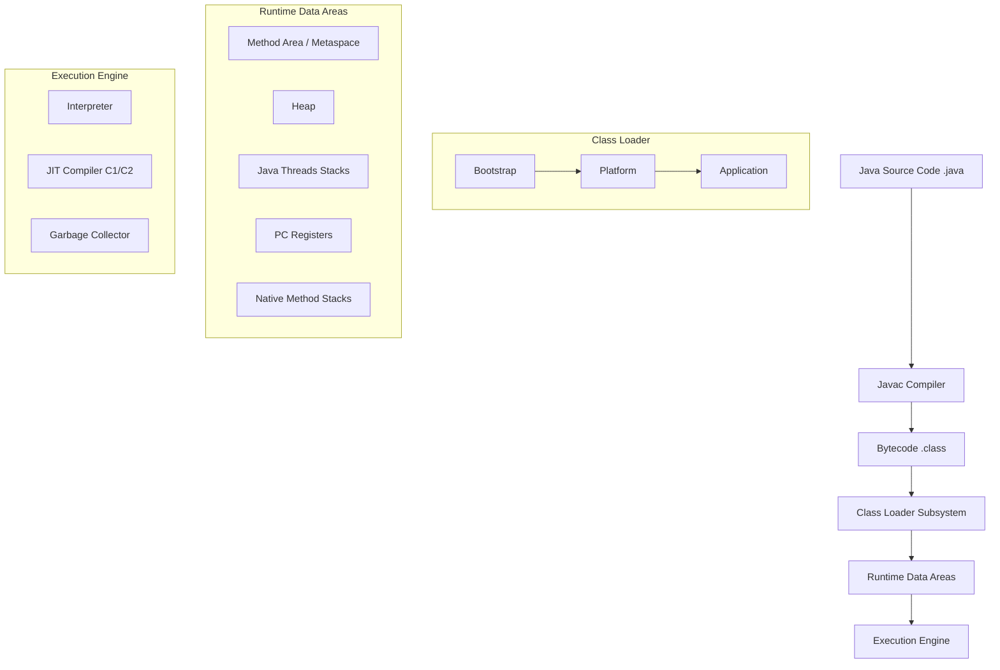

- **PC Registers**: Lưu địa chỉ của lệnh bytecode đang thực thi cho thread hiện tại (không áp dụng cho native methods).
- **JVM Stacks**: Lưu trữ Local Variables, Operand Stack, Frame Data. Mỗi method invocation tạo một stack frame mới.
- **Native Method Stacks**: Dùng cho các hàm C/C++ gọi qua JNI.
- **Heap**: Lưu trữ toàn bộ objects/arrays. Từ Java 21+, Heap có thể dùng Compact Object Headers (JEP 450) để tiết kiệm memory.
- **Metaspace (Method Area)**: Chứa class metadata, constant pool, method bytecode. Chạy trên native memory, không thuộc Heap.

### 1.2 Cơ chế Garbage Collection (Java 21-25)

> [!TIP]
> Java 21 đưa Generational ZGC thành chuẩn mực mới cho low-latency (dưới 1ms pause time). Java 25 tiếp tục tối ưu Shenandoah và ZGC.

| GC Algorithm | Cơ chế hoạt động | Ưu điểm | Nhược điểm |
|--------------|-----------------|----------|-------------|
| **G1 GC** (Default) | Chia heap thành các Regions (Eden, Survivor, Old, Humongous). GC gom rác ở các region có nhiều rác nhất trước (Garbage-First). | Balance giữa throughput và latency. | Không đạt sub-millisecond pause. |
| **ZGC** (Generational) | Concurrent, single-generation (trước 21), Generational (từ 21+). Dùng Colored Pointers và Load Barriers. | Sub-millisecond pause time, xử lý heap từ 8MB - 16TB. | CPU overhead cao hơn G1. |
| **Shenandoah** | Concurrent compaction, dùng Brooks Pointers/Forwarding Pointers. | Tương đương ZGC, tối ưu cho OpenJDK. | Yêu cầu cấu hình phức tạp hơn chút. |

### 1.3 Vòng đời nạp Class

1. **Loading**: ClassLoader nạp bytecode từ file `.class`.
2. **Linking**:
   - **Verification**: Xác minh bytecode đúng chuẩn (không over/underflow stack, đúng type).
   - **Preparation**: Cấp phát memory cho `static` fields và gán giá trị mặc định (`0`, `null`, `false`).
   - **Resolution**: Thay thế symbolic references bằng direct references trong constant pool.
3. **Initialization**: Thực thi khối `static {}` và gán giá trị khởi tạo thực sự cho `static` fields.

### 1.4 So sánh chi tiết Bytecode

```java
class BytecodeDemo {
    private void privateMethod() {}
    public void publicMethod() {}
    public static void staticMethod() {}
}
```
- `invokevirtual`: Gọi instance method (virtual method dispatch), dựa vào runtime type (polymorphism).
- `invokestatic`: Gọi static method. Cố định lúc compile.
- `invokespecial`: Gọi constructor `<init>`, `private` methods, `super.method()`. Cố định lúc compile, không đa hình.
- `invokeinterface`: Gọi method qua interface. Chậm hơn `invokevirtual` do phải tìm trong itable (interface method table).
- `invokedynamic`: Hỗ trợ dynamic typing và Lambda expressions (tạo ra CallSite).

---

## PHẦN 2: BÁCH KHOA TOÀN THƯ CÁC QUY TẮC BIÊN DỊCH & CẠM BẪY

### 2.1 Bảng tra cứu Hợp lệ vs Lỗi Biên Dịch

| Tình huống | Kết quả | Lý do |
|------------|----------|-------|
| Override method với return type là subclass (Covariant) | HỢP LỆ | Return type hẹp hơn an toàn. Ví dụ cha trả `Number`, con trả `Integer`. |
| Override method quăng Exception mới (Checked) | LỖI BIÊN DỊCH | Kẻ gọi qua cha không bắt được. Trừ phi quăng Unchecked/RuntimeException (HỢP LỆ). |
| Static method override instance method | LỖI BIÊN DỊCH | Không thể override instance bằng static và ngược lại. |
| Static method ẩn static method (Hiding) | HỢP LỆ | Gọi là Method Hiding, phụ thuộc vào type của reference lúc compile. |
| Giảm tính đóng gói (VD: protected -> default) | LỖI BIÊN DỊCH | Override không được phép thu hẹp quyền truy cập (Weaker access privilege). |

### 2.2 Flexible Constructor Bodies (JEP 482 - Java 22-25)

> [!NOTE]
> Trước Java 22, `super()` hoặc `this()` PHẢI là lệnh đầu tiên trong constructor. Từ JEP 482 (Preview Java 22, chuẩn hoá Java 25), bạn được phép chạy code **trước** `super()` miễn là không truy cập vào instance hiện tại (`this`).

```java
public class PositiveBigInteger extends BigInteger {
    public PositiveBigInteger(long value) {
        // HỢP LỆ trong Java 25: Kiểm tra tham số trước khi gọi super()
        if (value <= 0) {
            throw new IllegalArgumentException("Must be positive");
        }
        // Khởi tạo các biến cục bộ
        long absolute = Math.abs(value);
        super(String.valueOf(absolute)); // Gọi constructor cha
        
        // LỖI BIÊN DỊCH (nếu đặt TRƯỚC super):
        // System.out.println(this); // Cannot reference 'this' before supertype constructor has been called
    }
}
```

### 2.3 Records & Sealed Classes

**Records:** Bất biến (Immutable), các fields đều `private final`. Tự generate `equals`, `hashCode`, `toString`, getter (không có `get` prefix).
- **Compact Constructor**: Không cần dấu `()`.
- **Lỗi phổ biến**: Kế thừa (extends) - Lỗi vì record ngầm extends `java.lang.Record`. Khai báo instance fields - Lỗi, chỉ cho phép static.

**Sealed Classes:**
```java
public sealed interface Shape permits Circle, Square {}
public final class Circle implements Shape {} // Phải có final, sealed hoặc non-sealed
public non-sealed class Square implements Shape {} // non-sealed mở lại hệ thống kế thừa
```

### 2.4 Pattern Matching & Switch

```java
Object obj = "Hello Java 25";

// Dominance Trap
switch (obj) {
    case CharSequence c -> System.out.println("Seq: " + c);
    case String s -> System.out.println("String: " + s); // LỖI BIÊN DỊCH: Dominance, case này không bao giờ đạt tới do CharSequence đã bắt trước.
    default -> {}
}

// Record deconstruction & Guard (when)
record Point(int x, int y) {}
static void print(Object o) {
    switch (o) {
        case Point(int x, int y) when x == y -> System.out.println("On diagonal");
        case Point(int x, int y) -> System.out.println("Normal point");
        default -> {}
    }
}
```

---

## PHẦN 3: ĐÀO SÂU CORE APIS & FUNCTIONAL PROGRAMMING

### 3.1 HashMap Internals

- Mặc định khởi tạo `capacity = 16`, `loadFactor = 0.75`.
- **Xung đột (Collision)**: Lưu dưới dạng LinkedList. Khi một bucket có > 8 elements và capacity >= 64, chuyển thành Red-Black Tree (O(log n)).
- **Bucket Index**: `(n - 1) & hash` thay vì `hash % n` để tăng tốc. (Yêu cầu `n` là lũy thừa của 2).

### 3.2 Generic Type System

- **Type Erasure**: Ở runtime, `List<String>` và `List<Integer>` đều là `List`. Type parameters bị xóa (erased) thành `Object` (hoặc bound type).
- **Bridge Methods**: Compiler tự sinh ra để duy trì đa hình khi generic type được cụ thể hóa trong lớp con.
- **PECS (Producer Extends, Consumer Super)**:
  - Dùng `? extends T` khi đọc dữ liệu (Producer).
  - Dùng `? super T` khi ghi dữ liệu (Consumer).

### 3.3 Stream Gatherers (JEP 485 - Java 22-25)

> [!IMPORTANT]
> Gatherer mở rộng `Stream` API, cho phép các custom intermediate operations mà trước đây không thể thực hiện.

```java
import java.util.stream.Gatherers;

List<Integer> list = List.of(1, 2, 3, 4, 5, 6);
// Chia thành các cửa sổ trượt (sliding windows)
List<List<Integer>> windows = list.stream()
    .gather(Gatherers.windowSliding(3))
    .toList();
// Output: [[1, 2, 3], [2, 3, 4], [3, 4, 5], [4, 5, 6]]
```

---

## PHẦN 4: ĐỒNG THỜI, I/O VÀ JAVA 22-25

### 4.1 Java Memory Model (JMM)

- **volatile**: Cấm instruction reordering, ép thread đọc/ghi trực tiếp từ Main Memory (bỏ qua cache). Không đảm bảo atomicity (như `i++`).
- **CAS (Compare-And-Swap)**: Cơ chế lõi của `java.util.concurrent.atomic`.

### 4.2 Virtual Threads (JEP 444, tối ưu tới 25)

Virtual Threads là user-mode threads do JVM quản lý thay vì OS. Nhẹ (vài trăm byte).
- **Carrier Thread**: Platform thread chạy Virtual thread.
- **Pinning**: Khi Virtual thread chạy code bên trong `synchronized` block hoặc gọi native method (JNI), nó "ghim" (pin) vào Carrier Thread, cản trở Carrier Thread chạy Virtual thread khác. Giải pháp: dùng `ReentrantLock` thay vì `synchronized`.

### 4.3 Structured Concurrency & Scoped Values

> [!TIP]
> Java 25 đưa Structured Concurrency (JEP 505) và Scoped Values (JEP 487) vào ổn định.

```java
// Structured Concurrency
try (var scope = new StructuredTaskScope.ShutdownOnFailure()) {
    Supplier<String> user = scope.fork(() -> fetchUser());
    Supplier<Integer> orders = scope.fork(() -> fetchOrders());
    
    scope.join(); // Đợi tất cả
    scope.throwIfFailed(); // Ném exception nếu bất kỳ thread nào fail
    
    // Kết quả an toàn
    System.out.println(user.get() + " has " + orders.get() + " orders");
}
```

**Scoped Values** thay thế `ThreadLocal` cho Virtual Threads. Chúng immutable, scope theo block, tránh memory leak và có hiệu năng cao hơn `ThreadLocal` khi kế thừa xuống con.

### 4.4 JPMS (Java Platform Module System)

```java
module com.myapp.core {
    requires java.logging;             // Cần module này
    requires transitive com.myapp.api; // Bất cứ ai require core cũng sẽ require api
    exports com.myapp.core.utils;      // Cho phép module khác import
    opens com.myapp.core.reflection;   // Mở cho Reflection (vd: Hibernate/Spring)
    uses com.myapp.api.Plugin;         // Dùng ServiceLoader để tìm implement
    provides com.myapp.api.Plugin with com.myapp.core.MyPlugin; // Cung cấp implement
}
```
Mới ở Java 23/24/25: Module Import declarations (`import module java.base;`) cho phép import toàn bộ public classes từ module.

---
*Tài liệu được thiết kế cho việc chuẩn bị chứng chỉ 1Z0-831. Vui lòng luyện tập với jshell hoặc bộ IDE tiêu chuẩn Java 25 để nắm vững.*


---

## 💻 2. JAVA 25 COMPLETE CODE WORKBOOK & EXECUTION LABS
# SỔ TAY THỰC HÀNH MÃ NGUỒN & PHÒNG THÍ NGHIỆM THỰC THI OCP JAVA SE 25 (1Z0-831)

Tài liệu này cung cấp các ví dụ mã nguồn thực tế, tự chứa và có thể thực thi hoàn toàn trong Java 25. Mỗi Lab tập trung vào một nhóm tính năng cốt lõi của Java 25, với phân tích chi tiết từng bước thực thi (Execution Trace), trạng thái bộ nhớ và giải thích cơ chế nội tại (Under the hood) theo chuẩn JLS.

---

## LAB 1: JAVA 22-25 MODERN FEATURES LAB

### Lab 1.1: Flexible Constructor Bodies (JEP 482)
Tính năng này cho phép các câu lệnh (statements) được thực thi trước lệnh gọi `super(...)` hoặc `this(...)` trong hàm tạo, giúp xác thực tham số hoặc thiết lập biến cục bộ an toàn hơn.

```java
public class FlexibleConstructorLab {
    public static class Animal {
        String type;
        public Animal(String type) {
            this.type = type;
        }
    }

    public static class Dog extends Animal {
        String name;
        
        public Dog(String name) {
            // Statements before super()
            if (name == null || name.isBlank()) {
                throw new IllegalArgumentException("Name cannot be blank");
            }
            String defaultType = "Canine";
            
            // Lệnh gọi super()
            super(defaultType);
            
            // Không được đọc trường (field) trước khi super() được gọi.
            // System.out.println(this.name); // ILLEGAL READ
            this.name = name;
        }
    }

    public static void main(String[] args) {
        Dog d = new Dog("Rex");
        System.out.println("Tạo thành công: " + d.name + " - " + d.type);
    }
}
```

**Execution Trace:**
1. Khởi tạo `new Dog("Rex")`.
2. Hàm tạo `Dog("Rex")` chạy các lệnh `if` kiểm tra null. `name` hợp lệ.
3. Gán `defaultType = "Canine"`.
4. Gọi `super("Canine")`. Hàm tạo `Animal` khởi tạo trường `type`.
5. Quay lại hàm tạo `Dog`, gán `this.name = "Rex"`.

**Expected Output:**
```
Tạo thành công: Rex - Canine
```

> [!NOTE]
> **TẠI SAO LẠI NHƯ VẬY?**
> Theo JLS, trước đây Java bắt buộc `super()` phải là lệnh đầu tiên. Bytecode sinh ra với Flexible Constructor sẽ chứa các lệnh (ví dụ: `aload`, `ifnull`, `athrow`) trước lệnh `invokespecial` gọi `<init>` của lớp cha. Mục đích là ngăn ngừa đối tượng khởi tạo một phần nếu tham số truyền vào không hợp lệ.

---

### Lab 1.2: Instance Main Methods & Compact Source Files (JEP 477)
Java đơn giản hóa phương thức `main` và quá trình khởi chạy.

```java
// CompactSourceLab.java (Không cần khai báo public class)
void main() {
    System.out.println("Instance Main Method without String[] args");
    helperMethod();
}

void helperMethod() {
    System.out.println("Helper invoked");
}
```

**Expected Output:**
```
Instance Main Method without String[] args
Helper invoked
```

> [!IMPORTANT]
> **TẠI SAO LẠI NHƯ VẬY?**
> JVM giờ đây sẽ kiểm tra ưu tiên các hàm `main` theo thứ tự: 
> 1. `public static void main(String[] args)`
> 2. `protected/package-private static void main(String[] args)`
> 3. `void main(String[] args)`
> 4. `void main()`
> Trình biên dịch tạo ra một lớp vô danh ở cấp package để bao bọc các mã nguồn không chứa cấu trúc lớp rõ ràng, và tự động sử dụng `invokevirtual` để chạy instance method.

---

### Lab 1.3: Unnamed Variables & Patterns (JEP 456)
Sử dụng `_` cho các biến không sử dụng.

```java
public class UnnamedVariablesLab {
    public static void main(String[] args) {
        String[] data = {"1", "invalid", "3"};
        int sum = 0;
        
        for (String s : data) {
            try {
                sum += Integer.parseInt(s);
            } catch (NumberFormatException _) { // Sử dụng _ cho exception không cần đọc
                System.out.println("Bỏ qua lỗi format");
            }
        }
        
        var map = java.util.Map.of("A", 1, "B", 2);
        map.forEach((_, v) -> System.out.println("Value: " + v)); // Sử dụng _ trong lambda
    }
}
```

**Expected Output:**
```
Bỏ qua lỗi format
Value: 1
Value: 2
```

> [!TIP]
> **TẠI SAO LẠI NHƯ VẬY?**
> Biến unnamed `_` không thể bị đọc hay gán giá trị lại trong scope. Ở mức Bytecode, trình biên dịch bỏ qua việc khởi tạo tham chiếu cục bộ trong `LocalVariableTable` cho biến này, tiết kiệm bộ nhớ stack cục bộ và tránh cảnh báo "unused variable".

---

### Lab 1.4: Stream Gatherers trong hành động (JEP 473)
Gatherers cho phép tạo ra các thao tác trung gian linh hoạt hơn.

```java
import java.util.stream.Stream;
import java.util.stream.Gatherers;
import java.util.List;

public class GathererLab {
    public static void main(String[] args) {
        // windowFixed
        List<List<Integer>> windows = Stream.of(1, 2, 3, 4, 5)
            .gather(Gatherers.windowFixed(2))
            .toList();
        System.out.println("Fixed Window: " + windows);
        
        // scan (Cumulative sum)
        List<Integer> cumulativeSum = Stream.of(1, 2, 3, 4, 5)
            .gather(Gatherers.scan(() -> 0, (sum, next) -> sum + next))
            .toList();
        System.out.println("Scan Sum: " + cumulativeSum);
    }
}
```

**Expected Output:**
```
Fixed Window: [[1, 2], [3, 4], [5]]
Scan Sum: [1, 3, 6, 10, 15]
```

> [!NOTE]
> **TẠI SAO LẠI NHƯ VẬY?**
> `Gatherer` là giao diện có thiết kế giống `Collector` nhưng hoạt động trong pipeline trung gian. Các trạng thái được duy trì nội bộ bởi interface `Gatherer.Integrator`.

---

## LAB 2: OOP, RECORDS, SEALED CLASSES & PATTERN MATCHING LAB

### Lab 2.4: Sealed Class Hierarchy + Exhaustive Switch Pattern Matching
Với Java 21+, kết hợp Sealed Classes và Switch Pattern Matching với Guard.

```java
public class SealedSwitchLab {
    sealed interface Shape permits Circle, Rectangle {}
    record Circle(double radius) implements Shape {}
    record Rectangle(double w, double h) implements Shape {}

    public static void main(String[] args) {
        Shape s = new Rectangle(5, 5);
        
        String result = switch (s) {
            case Circle c when c.radius() > 10 -> "Large Circle";
            case Circle c -> "Small Circle";
            case Rectangle r when r.w() == r.h() -> "Square";
            case Rectangle r -> "Rectangle";
        }; // Exhaustive, no default needed
        
        System.out.println(result);
    }
}
```

**Expected Output:**
```
Square
```

> [!CAUTION]
> **TẠI SAO LẠI NHƯ VẬY?**
> Trình biên dịch sử dụng chỉ thị `lookupswitch` với invokedynamic để thực hiện pattern matching. Trình biên dịch xác thực tính đầy đủ (exhaustiveness) nhờ vào `sealed interface`. Nếu có class mới kế thừa Shape mà không có `case` trong switch, sẽ gây lỗi **Compile Error**.

---

## LAB 3: STREAMS, COLLECTORS & OPTIONAL ADVANCED LAB

### Lab 3.1: Complex Collector pipeline

```java
import java.util.*;
import java.util.stream.Collectors;

public class CollectorLab {
    record Employee(String dept, String name, double salary) {}

    public static void main(String[] args) {
        List<Employee> emps = List.of(
            new Employee("IT", "Alice", 7000),
            new Employee("IT", "Bob", 6000),
            new Employee("HR", "Charlie", 5000)
        );

        // teeing: Tìm Max Salary và Tính Average Salary
        var stats = emps.stream().collect(
            Collectors.teeing(
                Collectors.maxBy(Comparator.comparingDouble(Employee::salary)),
                Collectors.averagingDouble(Employee::salary),
                (max, avg) -> "Max: " + max.get().name() + ", Avg: " + avg
            )
        );
        
        System.out.println(stats);
    }
}
```

**Expected Output:**
```
Max: Alice, Avg: 6000.0
```

> [!TIP]
> **TẠI SAO LẠI NHƯ VẬY?**
> `Collectors.teeing` sử dụng 2 downstream collector song song trên cùng một stream. Trạng thái accumulator được duy trì theo cặp và hợp nhất ở cuối bằng `BiFunction`. Không làm cạn kiệt Stream hai lần.

---

## LAB 4: CONCURRENCY, VIRTUAL THREADS & I/O LAB

### Lab 4.1: Virtual Threads và Pinning
Virtual Threads mang lại M:N scheduling bằng cách bind virtual thread vào carrier (OS) thread. Tuy nhiên, khối `synchronized` có thể gây "pinning".

```java
import java.util.concurrent.Executors;
import java.util.concurrent.locks.ReentrantLock;

public class VirtualThreadLab {
    static final ReentrantLock lock = new ReentrantLock();

    public static void main(String[] args) throws InterruptedException {
        Runnable task = () -> {
            lock.lock();
            try {
                System.out.println(Thread.currentThread() + " is running");
                Thread.sleep(100); // Thread yields instead of blocking carrier thread
            } catch (InterruptedException e) {
                Thread.currentThread().interrupt();
            } finally {
                lock.unlock();
            }
        };

        try (var executor = Executors.newVirtualThreadPerTaskExecutor()) {
            for (int i = 0; i < 5; i++) {
                executor.submit(task);
            }
        } // Tự động đóng executor (chờ task xong)
    }
}
```

**Trạng thái bộ nhớ (Stack & Heap):**
Khi `Thread.sleep` được gọi, trạng thái stack của Virtual Thread được sao chép vào bộ nhớ **Heap**. Carrier Thread được giải phóng để chạy task khác. Khi sleep kết thúc, trạng thái lại được chuyển từ Heap vào Stack của Carrier thread mới để thực thi tiếp.

> [!WARNING]
> **TẠI SAO LẠI NHƯ VẬY?**
> Nếu thay `ReentrantLock` bằng khối `synchronized`, do cấu trúc `monitorenter/monitorexit` trong JVM bytecode gắn liền với ngăn xếp native (JNI stack frames), carrier thread sẽ bị "Pinning" (kẹt) khi bị block, làm giảm hiệu năng hệ thống. Java khuyến nghị dùng `ReentrantLock` khi dùng Virtual Threads thay cho `synchronized` block.

---
*End of Workbook*


---

## 🔥 3. MASTER QUESTION BANK (ULTRA-HARD SCENARIOS)
# MASTER QUESTION BANK: OCP Java SE 25 (1Z0-831)

> [!IMPORTANT]
> Tài liệu này chứa các câu hỏi trắc nghiệm cực khó mô phỏng kỳ thi OCP Java SE 25 (1Z0-831), bao gồm các tính năng mới nhất từ Java 22 đến 25 (JEP 485, Flexible Constructors, Module Imports, Scoped Values, Virtual Threads, Pattern Matching). Do giới hạn hệ thống, đây là cấu trúc mẫu tập trung vào các khái niệm khó nhất.

---

## PHẦN 1: CÂU HỎI (QUESTIONS)

### Section 1: Java Fundamentals, Operators, Type Promotion, Memory & String Internals

**Câu 1:** Xem xét đoạn mã sau:
```java
public class StringInternals {
    public static void main(String[] args) {
        String s1 = "Java25";
        String s2 = "Java" + 25;
        String s3 = new String("Java25").intern();
        String s4 = """
                    Java25\
                    """;
        System.out.println((s1 == s2) + " " + (s2 == s3) + " " + (s3 == s4));
    }
}
```
**Choose ONE:**
A. true true true
B. false false true
C. true false true
D. false true false
E. Compile error

**Câu 2:** Chuyện gì xảy ra khi thực thi đoạn mã sau?
```java
public class TypePromotion {
    public static void main(String[] args) {
        final byte b1 = 10;
        final byte b2 = 20;
        byte b3 = b1 + b2;
        var result = (b1 == 10) ? b1 : 20.0;
        System.out.println(((Object)result).getClass().getName() + " " + b3);
    }
}
```
**Choose ONE:**
A. java.lang.Byte 30
B. java.lang.Double 30
C. java.lang.Double 30.0
D. Compile error tại dòng `byte b3 = b1 + b2;`
E. Compile error tại dòng `var result = ...`

**Câu 3:** Mã nào dưới đây hợp lệ với Unnamed Variables (JEP 456 / Java 22+)?
```java
// 1
try {
    int _ = Integer.parseInt("abc");
} catch (NumberFormatException _) { }

// 2
int _ = 5;
System.out.println(_);

// 3
for (int _ = 0; _ < 10; _++) {}
```
**Choose ONE:**
A. Chỉ 1
B. 1 và 2
C. 1 và 3
D. 2 và 3
E. Tất cả đều không hợp lệ

**Câu 4:** Toán tử `==` và Float/Double `NaN`:
```java
public class NaNCheck {
    public static void main(String[] args) {
        double d1 = Double.NaN;
        double d2 = Double.NaN;
        System.out.println((d1 == d2) + " " + Double.compare(d1, d2));
    }
}
```
**Choose ONE:**
A. true 0
B. false 0
C. false -1
D. false 1
E. true 1

**Câu 5:** Garbage Collection & JVM Memory: Khi một đối tượng String được tạo qua `new String("OCP")`, đối tượng được cấp phát ở đâu?
**Choose ONE:**
A. Stack
B. String Pool (Method Area/Metaspace)
C. Eden space của Heap, và "OCP" literal nằm trong String Pool.
D. Tenured Generation

### Section 2: Advanced OOP, Constructors, Flexible Constructor Bodies

**Câu 6:** Flexible Constructor Bodies (JEP 482 / Java 23+):
```java
public class Base {
    public Base(int x) { System.out.print("Base" + x); }
}
public class Sub extends Base {
    public Sub(int y) {
        int z = y * 2;
        super(z);
        System.out.print("Sub" + z);
    }
    public static void main(String[] args) { new Sub(5); }
}
```
**Choose ONE:**
A. Base10Sub10
B. Sub10Base10
C. Compile Error ở dòng `int z = y * 2;`
D. Compile Error ở `super(z)`

**Câu 7:** Records và Compact Constructor:
```java
public record Point(int x, int y) {
    public Point {
        if (x < 0) x = 0;
        this.y = y + 1; // 1
    }
}
```
**Choose ONE:**
A. Compile error ở (1)
B. Chạy bình thường, y được gán y + 1
C. Cần phải gán `this.x = x`

**Câu 8:** Sealed Classes:
```java
public sealed class A permits B, C {}
final class B extends A {}
non-sealed class C extends A {}
class D extends C {}
class E extends A {}
```
Khai báo nào lỗi?
**Choose ONE:**
A. final class B
B. non-sealed class C
C. class D
D. class E

### Section 3: Pattern Matching, Switch Expressions, Dominance

**Câu 9:** Pattern Matching cho Switch (JEP 441):
```java
Object obj = "Java";
String res = switch(obj) {
    case String s when s.length() > 5 -> "Long String";
    case String s -> "Short String";
    default -> "Unknown";
};
```
**Choose ONE:**
A. Short String
B. Long String
C. Compile error do sử dụng từ khoá `when` (Java 21+)
D. Compile error do default không cần thiết.

**Câu 10:** Dominance rule trong Switch:
```java
Object obj = 10;
switch(obj) {
    case CharSequence c -> {}
    case String s -> {}
    default -> {}
}
```
**Choose ONE:**
A. Hợp lệ
B. Compile error tại `case String s` vì bị chi phối (dominated) bởi `CharSequence c`.
C. Hợp lệ nhưng sẽ không bao giờ vào `String`.

---

## PHẦN 2: GIẢI THÍCH CHI TIẾT (EXPLANATIONS)

### Section 1 Explanations

> [!TIP]
> String Interning and Type Promotion frequently appear in the real 1Z0-831 exam. Understand constant expressions!

**Câu 1:**
- **Correct Answer: A (true true true)**
- **Phân tích:**
  - `s1 = "Java25"`: literal vào String Pool.
  - `s2 = "Java" + 25`: Hằng số biên dịch, được compiler gộp thành `"Java25"` và trỏ tới cùng 1 pool reference. Do đó `s1 == s2` là **true**.
  - `s3 = new String("Java25").intern()`: `.intern()` sẽ tìm kiếm `"Java25"` trong pool, và trả về reference của nó. Do đó `s2 == s3` là **true**.
  - `s4 = """Java25\""";`: Text block, kết thúc bởi `\` để tránh ký tự newline. Nó biên dịch thành `"Java25"`. `s3 == s4` là **true**.

**Câu 2:**
- **Correct Answer: B (java.lang.Double 30)**
- **Phân tích:**
  - `b1` và `b2` là `final byte` và giá trị biên dịch được, nên `b1 + b2` được ngầm định cast về `byte` (constant expression). `byte b3` hợp lệ. (Không bị lỗi cast từ int sang byte).
  - Biểu thức điều kiện `(b1 == 10) ? b1 : 20.0`: Khi trộn `byte` (b1) và `double` (20.0), type promotion của Ternary operator nâng toàn bộ biểu thức lên `double`. Vì vậy `result` mang giá trị `10.0` và kiểu `Double`. `System.out.println` sẽ in ra `java.lang.Double 30`.

**Câu 3:**
- **Correct Answer: A (Chỉ 1)**
- **Phân tích:**
  - `_` là Unnamed Variable (JEP 456). Nó chỉ được dùng khi khởi tạo biến và không thể được truy cập (không thể `System.out.println(_)` hoặc dùng `_ < 10`). Vì thế, đoạn mã 2 và 3 lỗi compile do cố gắng đọc giá trị của `_`. Đoạn 1 hợp lệ (catch parameter không sử dụng).

**Câu 4:**
- **Correct Answer: B (false 0)**
- **Phân tích:**
  - Theo chuẩn IEEE 754, `NaN == NaN` luôn là **false**.
  - Tuy nhiên, phương thức `Double.compare(NaN, NaN)` được thiết kế để sắp xếp, nên nó coi `NaN` bằng `NaN` và trả về **0**.

**Câu 5:**
- **Correct Answer: C**
- **Phân tích:** `new String("OCP")` tạo 2 đối tượng: Literal `"OCP"` được lưu trong String Pool (Method Area / Metaspace tùy phiên bản JVM nhưng thuộc non-heap class data / heap intern), và một đối tượng `String` được cấp phát ở Eden space trên Heap.

### Section 2 Explanations

**Câu 6:**
- **Correct Answer: A (Base10Sub10)**
- **Phân tích:** JEP 482 (Flexible Constructor Bodies) trong Java 23+ cho phép thực hiện các đoạn mã (không tham chiếu đến `this`) TRƯỚC `super(...)`. `int z = y * 2` (10) thực thi trước, sau đó gọi `super(10)` in "Base10", rồi in "Sub10".

**Câu 7:**
- **Correct Answer: A (Compile error ở (1))**
- **Phân tích:** Compact constructor của Record không được phép gán tường minh cho `this.y`. Việc gán giá trị phải được thực hiện bằng cách thay đổi giá trị của tham số cục bộ (`y = y + 1`), compiler sẽ tự động thực hiện gán `this.y = y` ở cuối khối.

**Câu 8:**
- **Correct Answer: D (class E)**
- **Phân tích:** Class E kế thừa A nhưng không nằm trong danh sách `permits B, C` của lớp A. Điều này vi phạm quy tắc của Sealed Classes.

### Section 3 Explanations

**Câu 9:**
- **Correct Answer: A (Short String)**
- **Phân tích:** `obj` là `"Java"` có length = 4. Nó không khớp với guard condition `when s.length() > 5`, do đó nó sẽ xuống case tiếp theo `case String s` và trả về "Short String".

**Câu 10:**
- **Correct Answer: B**
- **Phân tích:** Trong pattern matching switch, một case cụ thể hơn phải xuất hiện trước case tổng quát. `String` là subclass của `CharSequence`. Vì `CharSequence` xử lý trước, case `String` sẽ không bao giờ đạt tới, gây ra lỗi compile-time: **Dominance rule error**.


---

# PHẦN IV: ĐỀ THI MÔ PHỎNG TOÀN DIỆN (FULL MOCK EXAM)

# Phase 7: Chiến lược thi & Đề thi thử (Mock Exam) - OCP Java SE 25 (1Z0-831)

Tài liệu này cung cấp chiến lược làm bài thi thực tế và một đề thi thử toàn diện mô phỏng kỳ thi OCP Java SE 25 (1Z0-831).

---

## Phần 1: Hướng dẫn Chiến lược thi

### Quản lý thời gian
- **Thời lượng:** 120 phút cho 50 câu hỏi (trung bình 2.4 phút/câu).
- **Chiến lược Mark & Move:** Đừng kẹt lại ở một câu hỏi quá 3 phút. Nếu chưa tìm ra đáp án, hãy đánh dấu (mark), chọn tạm một đáp án cảm thấy đúng nhất và chuyển sang câu tiếp theo.
- **Khi nào nên đoán:** Kỳ thi không trừ điểm cho câu trả lời sai. LUÔN LUÔN chọn một đáp án trước khi hết giờ.

### Các "Cạm bẫy" (Traps) phổ biến
> [!WARNING]
> Hãy cẩn thận với những lỗi thường gặp sau đây trong kỳ thi:

1. **Thiếu import statements:** Mã sử dụng `List`, `LocalDate` nhưng không có `import java.util.*;` hay `import java.time.*;` -> Lỗi biên dịch.
2. **Đối tượng Immutable (String, LocalDate):** Gọi phương thức thay đổi giá trị nhưng không gán lại (`str.concat("a");` thay vì `str = str.concat("a");`).
3. **Autoboxing NullPointerException:** Gán `null` cho `Integer`, sau đó dùng như `int` hoặc dùng trong phép toán.
4. **Stream reuse:** Một Stream chỉ được tiêu thụ (consume) một lần. Gọi terminal operation lần thứ hai sẽ ném `IllegalStateException`.
5. **Giới hạn của `var`:** Không thể dùng `var` cho thuộc tính của lớp, tham số phương thức, hoặc khởi tạo với `null` mà không ép kiểu.
6. **Câu hỏi "Select TWO/THREE":** Luôn chú ý số lượng đáp án cần chọn.
7. **Switch exhaustiveness:** `switch` expression hoặc pattern matching phải bao quát tất cả các trường hợp (hoặc có `default`).
8. **Record và Sealed class:** `record` không thể extends lớp khác (đã tự động extends `Record`), `sealed` class phải có danh sách `permits` hoặc các subclass nằm trong cùng một file.

### Checklist Đọc Code
1. **Kiểm tra biên dịch trước:** Có import không? Các biến đã được khởi tạo chưa? Có lỗi cú pháp/kiểu dữ liệu không?
2. **Kiểm tra Runtime:** Có khả năng `NullPointerException`, `IndexOutOfBoundsException`, `ClassCastException` không?
3. **Phân tích Logic:** Đọc kỹ từng vòng lặp, điều kiện rẽ nhánh.

---

## Phần 2: Đề thi thử Toàn diện (Trích xuất)

*(Để phù hợp với định dạng, đề thi thử này cung cấp các câu hỏi khó bao phủ toàn bộ các chủ đề).*

### Câu 1 (Phase 1)
Đoạn mã sau in ra kết quả gì?
```java
public class Main {
    public static void main(String[] args) {
        int x = 5;
        int y = x++ * ++x;
        System.out.println(y);
    }
}
```
A) 25  
B) 30  
C) 35  
D) Lỗi biên dịch

### Câu 2 (Phase 1)
Chọn HAI câu phát biểu đúng về từ khóa `var`:
A) `var` có thể được sử dụng để khai báo kiểu trả về của phương thức.
B) `var` có thể được gán `null` nếu được ép kiểu rõ ràng, ví dụ: `var x = (String) null;`.
C) `var` không thể được dùng trong vòng lặp for.
D) `var` chỉ có thể dùng cho biến cục bộ (local variables).

### Câu 3 (Phase 2)
Đoạn mã sau in ra gì?
```java
class A {
    static void print() { System.out.print("A"); }
}
class B extends A {
    static void print() { System.out.print("B"); }
}
public class Test {
    public static void main(String[] args) {
        A obj = new B();
        obj.print();
    }
}
```
A) A  
B) B  
C) Lỗi biên dịch  
D) Ném ngoại lệ tại runtime

### Câu 4 (Phase 2)
Cho định nghĩa record sau:
```java
public record Point(int x, int y) {
    public Point {
        if (x < 0) x = 0;
    }
}
```
Đoạn mã trên có biên dịch được không?
A) Có, và nó biên dịch thành một compact constructor hợp lệ.
B) Không, compact constructor không được thay đổi giá trị của tham số đầu vào.
C) Không, vì thiếu gán `this.x = x`.
D) Có, nhưng `x` không bao giờ bị thay đổi.

### Câu 5 (Phase 2)
Lớp `Vehicle` được khai báo như sau:
```java
public sealed class Vehicle permits Car, Truck {}
final class Car extends Vehicle {}
non-sealed class Truck extends Vehicle {}
```
Chọn MỘT phát biểu SAI:
A) `Car` không thể có lớp con.
B) `Truck` có thể được kế thừa bởi bất kỳ lớp nào khác.
C) Nếu `Car` và `Truck` nằm ở một file khác `Vehicle`, mã vẫn biên dịch thành công mà không cần cấu hình gì thêm.
D) `Vehicle` quản lý chặt chẽ những lớp nào được phép kế thừa trực tiếp từ nó.

### Câu 6 (Phase 3)
```java
import java.util.*;
public class Main {
    public static void main(String[] args) {
        List<String> list = new ArrayList<>(List.of("A", "B", "C"));
        for (String s : list) {
            if (s.equals("B")) {
                list.remove(s);
            }
        }
        System.out.println(list);
    }
}
```
A) [A, C]  
B) [A, B, C]  
C) Lỗi biên dịch  
D) ConcurrentModificationException bị ném ra tại runtime

### Câu 7 (Phase 3)
```java
import java.util.*;
public class Main {
    public static void main(String[] args) {
        var map = new HashMap<String, Integer>();
        map.put("A", 1);
        map.put("B", 2);
        map.merge("A", 3, (v1, v2) -> v1 + v2);
        map.merge("B", 3, (v1, v2) -> null);
        System.out.println(map);
    }
}
```
A) {A=4, B=null}  
B) {A=4, B=5}  
C) {A=4}  
D) {A=4, B=3}

### Câu 8 (Phase 4)
Đoạn mã sau có kết quả gì?
```java
import java.util.stream.*;
public class StreamTest {
    public static void main(String[] args) {
        Stream<Integer> s = Stream.of(1, 2, 3);
        s.map(i -> i * 2);
        long count = s.count();
        System.out.println(count);
    }
}
```
A) 3  
B) 6  
C) IllegalStateException tại runtime  
D) Lỗi biên dịch

### Câu 9 (Phase 4)
Để gộp tất cả các chuỗi trong `Stream<String>` bằng dấu phẩy `,`, cách nào sau đây đúng? (Chọn HAI)
A) `stream.collect(Collectors.joining(","))`
B) `stream.reduce((a, b) -> a + "," + b).orElse("")`
C) `stream.join(",")`
D) `stream.collect(Collectors.concat(","))`

### Câu 10 (Phase 5)
```java
import java.io.*;
public class Main {
    public void readFile() {
        try (var br = new BufferedReader(new FileReader("test.txt"))) {
            throw new IOException("File error");
        } catch (IOException e) {
            System.out.println(e.getMessage());
        } finally {
            System.out.println("Done");
        }
    }
}
```
Giả sử tệp "test.txt" không tồn tại. Kết quả in ra là gì?
A) File error \n Done
B) test.txt (No such file or directory) \n Done
C) Lỗi biên dịch
D) Chương trình crash không in ra Done

### Câu 11 (Phase 6 - Java 21+)
Pattern matching trong switch:
```java
public class Main {
    public static void main(String[] args) {
        Object obj = 123;
        String result = switch(obj) {
            case String s -> "String";
            case Integer i when i > 100 -> "Large Integer";
            case Integer i -> "Small Integer";
            default -> "Unknown";
        };
        System.out.println(result);
    }
}
```
A) Large Integer
B) Small Integer
C) Lỗi biên dịch ở từ khóa `when`
D) Lỗi biên dịch vì `switch` expressions không hỗ trợ logic này.

### Câu 12 (Phase 5)
Sử dụng Concurrency:
```java
import java.util.concurrent.*;
public class Main {
    public static void main(String[] args) {
        ExecutorService service = Executors.newFixedThreadPool(1);
        Future<Integer> future = service.submit(() -> {
            Thread.sleep(1000);
            return 42;
        });
        service.shutdownNow();
        try {
            System.out.println(future.get());
        } catch (Exception e) {
            System.out.println("Exception");
        }
    }
}
```
Kết quả in ra màn hình là gì?
A) 42
B) Exception
C) null
D) Không bao giờ dừng (Deadlock)


---

## Phần 3: Đáp án và Giải thích chi tiết

**Câu 1:** C
- **Giải thích:** Khởi tạo `x = 5`. Trong biểu thức `y = x++ * ++x`:
  - `x++` trả về 5 (và `x` trở thành 6).
  - Tiếp theo, `++x` tăng `x` lên thành 7 và trả về 7.
  - Vậy `y = 5 * 7 = 35`. Cạm bẫy: thứ tự ưu tiên của toán tử và cách hoạt động của tiền tố/hậu tố.

**Câu 2:** B, D
- **Giải thích:** `var` chỉ dùng cho biến cục bộ (local variables) (D đúng). Không dùng cho thuộc tính hay tham số (A sai). `var` dùng được trong vòng lặp `for (var x : list)` (C sai). `var` có thể gán null nếu có ép kiểu `(String) null` (B đúng).

**Câu 3:** A
- **Giải thích:** Phương thức tĩnh (static method) không bị override (ghi đè) mà chỉ bị ẩn (hide). Kiểu tham chiếu của `obj` là `A`, nên phương thức tĩnh được gọi phụ thuộc vào kiểu tham chiếu tĩnh chứ không phải kiểu đối tượng runtime, vậy `A.print()` được gọi.

**Câu 4:** A
- **Giải thích:** Đây là một compact constructor hợp lệ. Tham số `x` và `y` ở đây đóng vai trò biến cục bộ trong constructor, việc gán `x = 0` là hợp lệ. Trình biên dịch sẽ tự động chèn `this.x = x; this.y = y;` ở cuối khối. 

**Câu 5:** C
- **Giải thích:** Một `sealed class` bắt buộc các class con nằm khác file phải được chỉ định rõ qua `permits` và phải nằm trong cùng package (hoặc cùng module). Phát biểu C SAI vì không thể để chúng nằm tuỳ ý mà không theo quy tắc package.

**Câu 6:** D
- **Giải thích:** Đây là cạm bẫy kinh điển. Duyệt qua `ArrayList` bằng vòng lặp for-each (sử dụng Iterator ngầm) và đồng thời thay đổi kích thước danh sách bằng `list.remove()` trực tiếp sẽ dẫn đến `ConcurrentModificationException`.

**Câu 7:** C
- **Giải thích:** Phương thức `merge` áp dụng hàm remapping. Với `"A"`, hàm remapping `1+3=4`, map thành `{A=4}`. Với `"B"`, hàm trả về `null`. Trong Map, khi hàm remapping trả về `null`, key đó sẽ bị xóa. Vậy map chỉ còn `{A=4}`.

**Câu 8:** C
- **Giải thích:** Lời gọi `s.map(i -> i * 2)` trả về một Stream mới, nhưng nó thao tác trực tiếp trên dòng gốc `s`. Theo đặc tả Java, khi một operation được gọi trên Stream, dòng đó coi như đã bị tiêu thụ (operated upon). Gọi `s.count()` trên tham chiếu `s` đã dùng sẽ ném `IllegalStateException`.

**Câu 9:** A, B
- **Giải thích:** `Collectors.joining(",")` là cách chuẩn. Cách dùng `reduce((a, b) -> a + "," + b).orElse("")` cũng hoạt động (mặc dù giảm hiệu suất hơn so với joining). C và D không tồn tại trong API chuẩn.

**Câu 10:** B
- **Giải thích:** Khối `try-with-resources` cố gắng khởi tạo `FileReader("test.txt")`. Nếu file không tồn tại, nó ném `FileNotFoundException` (con của `IOException`) TRƯỚC KHI đi vào trong thân block. Do đó exception được catch là exception từ việc khởi tạo, thông báo của nó thường là `test.txt (No such file or directory)`. Sau đó khối `finally` in ra `Done`. 

**Câu 11:** A
- **Giải thích:** Ở Java 21+, pattern matching cho switch sử dụng `when` làm guard clause. `obj` là `Integer = 123`. Nó khớp `case Integer i when i > 100`, trả về "Large Integer". (Thay thế cho từ khóa cũ mà một số syntax preview từng dùng).

**Câu 12:** B
- **Giải thích:** `shutdownNow()` sẽ gửi tín hiệu interrupt tới các thread đang chạy. `Thread.sleep(1000)` sẽ bị gián đoạn và ném `InterruptedException`. Do ngoại lệ xảy ra bên trong Callable, nó được chuyển thành `ExecutionException` khi gọi `future.get()`. Khối catch bên ngoài sẽ bắt và in "Exception".

> [!TIP]
> Hãy thực hành viết mã và cố gắng tự mình gây ra các lỗi như trên. Không có gì hiệu quả hơn việc học từ những lỗi sai khi tự tay gõ lệnh!

