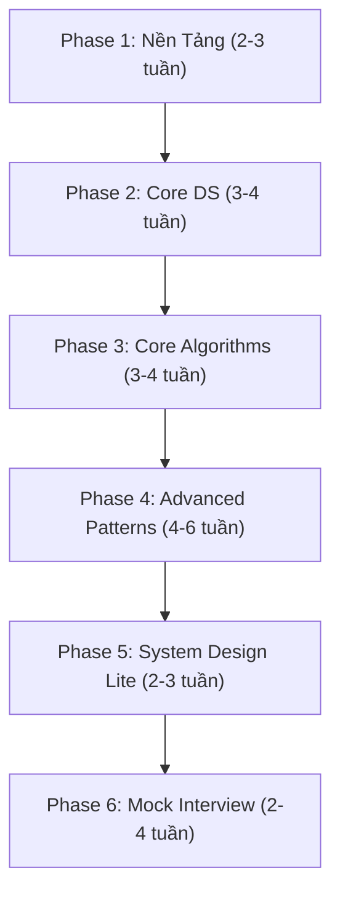

# 🗺️ Lộ Trình Nghiên Cứu DSA — Phỏng Vấn FAANG/Big Tech

> **Ngôn ngữ**: Java
> **Mục tiêu**: Vượt qua vòng phỏng vấn kỹ thuật tại các công ty Big Tech
> **Thời gian ước tính**: 3–6 tháng (2–3 giờ/ngày)

---

## 📋 Tổng Quan Lộ Trình

---

## Phase 1: Nền Tảng (2–3 tuần)

### 1.1 Big-O & Complexity Analysis
| Khái niệm | Mô tả | Ưu tiên |
|---|---|---|
| Time Complexity | O(1), O(log n), O(n), O(n log n), O(n²), O(2ⁿ) | 🔴 Bắt buộc |
| Space Complexity | Bộ nhớ phụ, stack space trong đệ quy | 🔴 Bắt buộc |
| Amortized Analysis | ArrayList resize, HashMap rehash | 🟡 Nên biết |
| Best / Worst / Average | Phân biệt 3 case | 🔴 Bắt buộc |

> [!TIP]
> **Mẹo phỏng vấn**: Luôn phân tích complexity **trước khi code**. Interviewer đánh giá cao việc bạn nêu trade-off giữa time và space.

**Bài tập**:
- [ ] Phân tích complexity của tất cả các thuật toán sort
- [ ] So sánh O(n log n) vs O(n²) với n = 10⁶

### 1.2 Java Collections Framework — Nắm vững API

| Data Structure | Java Class | Thao tác chính | Time Complexity |
|---|---|---|---|
| Dynamic Array | `ArrayList<E>` | get, add, remove | O(1), O(1)*, O(n) |
| Linked List | `LinkedList<E>` | addFirst, addLast, remove | O(1), O(1), O(1) |
| Stack | `ArrayDeque<E>` | push, pop, peek | O(1) |
| Queue | `ArrayDeque<E>` | offer, poll, peek | O(1) |
| HashMap | `HashMap<K,V>` | put, get, remove | O(1) avg |
| TreeMap | `TreeMap<K,V>` | put, get, floorKey, ceilingKey | O(log n) |
| HashSet | `HashSet<E>` | add, contains, remove | O(1) avg |
| PriorityQueue | `PriorityQueue<E>` | offer, poll, peek | O(log n), O(log n), O(1) |

> [!IMPORTANT]
> **Đừng dùng `Stack` class** trong Java — nó là legacy. Dùng `ArrayDeque` thay thế. Tương tự, ưu tiên `ArrayDeque` hơn `LinkedList` cho Queue.

---

## Phase 2: Cấu Trúc Dữ Liệu Cốt Lõi (3–4 tuần)

### 2.1 Arrays & Strings
| Pattern | Bài LeetCode tiêu biểu | Độ khó |
|---|---|---|
| Two Pointers | Two Sum II (#167), 3Sum (#15), Container With Most Water (#11) | 🟢🟡 |
| Sliding Window | Longest Substring Without Repeating (#3), Minimum Window Substring (#76) | 🟡🔴 |
| Prefix Sum | Subarray Sum Equals K (#560), Product of Array Except Self (#238) | 🟡 |
| Kadane's Algorithm | Maximum Subarray (#53) | 🟡 |
| String Manipulation | Valid Anagram (#242), Group Anagrams (#49) | 🟢🟡 |

**Số bài nên giải**: 25–30 bài

### 2.2 Hash Maps & Hash Sets
| Pattern | Bài LeetCode tiêu biểu | Độ khó |
|---|---|---|
| Frequency Count | Top K Frequent Elements (#347), First Unique Character (#387) | 🟡 |
| Two Sum Pattern | Two Sum (#1), 4Sum II (#454) | 🟢🟡 |
| Mapping/Grouping | Group Anagrams (#49), Isomorphic Strings (#205) | 🟡 |

**Số bài nên giải**: 10–15 bài

### 2.3 Linked List
| Pattern | Bài LeetCode tiêu biểu | Độ khó |
|---|---|---|
| Fast & Slow Pointers | Linked List Cycle (#141), Middle of LL (#876) | 🟢 |
| Reverse | Reverse Linked List (#206), Reverse Nodes in k-Group (#25) | 🟢🔴 |
| Merge | Merge Two Sorted Lists (#21), Merge K Sorted Lists (#23) | 🟢🔴 |
| Dummy Head | Remove Nth Node From End (#19), Partition List (#86) | 🟡 |

**Số bài nên giải**: 10–15 bài

### 2.4 Stack & Queue
| Pattern | Bài LeetCode tiêu biểu | Độ khó |
|---|---|---|
| Monotonic Stack | Next Greater Element (#496), Daily Temperatures (#739), Largest Rectangle in Histogram (#84) | 🟡🔴 |
| Matching/Validation | Valid Parentheses (#20), Decode String (#394) | 🟢🟡 |
| Min Stack | Min Stack (#155) | 🟡 |
| BFS with Queue | (xem phần Graph) | — |

**Số bài nên giải**: 10–12 bài

---

## Phase 3: Thuật Toán Cốt Lõi (3–4 tuần)

### 3.1 Sorting & Searching
| Thuật toán | Time | Space | Khi nào dùng |
|---|---|---|---|
| Merge Sort | O(n log n) | O(n) | Stable sort, linked list |
| Quick Sort | O(n log n) avg | O(log n) | In-place, general purpose |
| Counting Sort | O(n + k) | O(k) | Integers trong range nhỏ |
| Binary Search | O(log n) | O(1) | Sorted array, monotonic function |

**Binary Search Patterns (CỰC KỲ QUAN TRỌNG)**:
| Pattern | Bài LeetCode | Độ khó |
|---|---|---|
| Classic BS | Binary Search (#704) | 🟢 |
| BS on Answer | Koko Eating Bananas (#875), Split Array Largest Sum (#410) | 🟡🔴 |
| Search Rotated | Search in Rotated Sorted Array (#33) | 🟡 |
| Find Boundary | First Bad Version (#278), Find Peak Element (#162) | 🟢🟡 |

> [!IMPORTANT]
> Binary Search xuất hiện trong **~30% câu hỏi phỏng vấn**. Phải nắm thật chắc template: `while (lo < hi)` vs `while (lo <= hi)` và khi nào dùng cái nào.

**Số bài nên giải**: 15–20 bài

### 3.2 Recursion & Backtracking
| Pattern | Bài LeetCode | Độ khó |
|---|---|---|
| Subsets | Subsets (#78), Subsets II (#90) | 🟡 |
| Permutations | Permutations (#46), Permutations II (#47) | 🟡 |
| Combinations | Combination Sum (#39), Letter Combinations (#17) | 🟡 |
| Board Search | Word Search (#79), N-Queens (#51), Sudoku Solver (#37) | 🟡🔴 |

> [!TIP]
> Backtracking = DFS + Pruning. Luôn vẽ cây đệ quy (recursion tree) trước khi code.

**Số bài nên giải**: 12–15 bài

### 3.3 Trees (Binary Tree, BST)
| Pattern | Bài LeetCode | Độ khó |
|---|---|---|
| DFS Traversal | Inorder (#94), Preorder (#144), Postorder (#145) | 🟢 |
| BFS / Level Order | Level Order Traversal (#102), Zigzag (#103) | 🟡 |
| Recursive thinking | Maximum Depth (#104), Balanced BT (#110), Diameter (#543) | 🟢🟡 |
| BST Properties | Validate BST (#98), Kth Smallest (#230), LCA of BST (#235) | 🟡 |
| Path Problems | Path Sum (#112), Binary Tree Max Path Sum (#124) | 🟢🔴 |
| Construction | Construct BT from Preorder & Inorder (#105) | 🟡 |
| Serialization | Serialize and Deserialize BT (#297) | 🔴 |

> [!IMPORTANT]
> Trees là **chủ đề được hỏi nhiều nhất** trong phỏng vấn. Phải giải ít nhất 20 bài tree.

**Số bài nên giải**: 20–25 bài

### 3.4 Heap / Priority Queue
| Pattern | Bài LeetCode | Độ khó |
|---|---|---|
| Top K | Kth Largest Element (#215), Top K Frequent (#347) | 🟡 |
| Merge K Streams | Merge K Sorted Lists (#23) | 🔴 |
| Running Median | Find Median from Data Stream (#295) | 🔴 |
| Scheduling | Task Scheduler (#621), Meeting Rooms II (#253) | 🟡 |

**Số bài nên giải**: 8–10 bài

---

## Phase 4: Advanced Patterns (4–6 tuần)

### 4.1 Graph
| Pattern | Bài LeetCode | Độ khó |
|---|---|---|
| BFS | Number of Islands (#200), Rotting Oranges (#994) | 🟡 |
| DFS | Clone Graph (#133), Pacific Atlantic Water Flow (#417) | 🟡 |
| Topological Sort | Course Schedule (#207), Alien Dictionary (#269) | 🟡🔴 |
| Union-Find | Number of Connected Components (#323), Redundant Connection (#684) | 🟡 |
| Shortest Path (Dijkstra) | Network Delay Time (#743), Cheapest Flights (#787) | 🟡🔴 |

> [!TIP]
> Graph problems thường được **ngụy trang** (ví dụ: matrix = implicit graph, word ladder = BFS trên strings). Nhận diện pattern là kỹ năng then chốt.

**Số bài nên giải**: 15–20 bài

### 4.2 Dynamic Programming (DP)
| Pattern | Bài LeetCode | Độ khó |
|---|---|---|
| 1D DP | Climbing Stairs (#70), House Robber (#198), Coin Change (#322) | 🟢🟡 |
| 2D DP | Unique Paths (#62), Longest Common Subsequence (#1143), Edit Distance (#72) | 🟡🔴 |
| Knapsack | Partition Equal Subset Sum (#416), Target Sum (#494) | 🟡 |
| Interval DP | Burst Balloons (#312) | 🔴 |
| String DP | Longest Palindromic Substring (#5), Word Break (#139), Regular Expression Matching (#10) | 🟡🔴 |
| DP on Trees | House Robber III (#337) | 🟡 |
| State Machine | Best Time to Buy and Sell Stock series (#121, #122, #123, #188, #309) | 🟡🔴 |

> [!CAUTION]
> DP là chủ đề **khó nhất** và **dễ nản nhất**. Chiến lược: bắt đầu với bài dễ, vẽ bảng DP bằng tay, rồi mới code. Đừng cố nhớ solution — hãy hiểu **cách tìm ra** recurrence relation.

**Phương pháp giải DP**:
1. **Xác định state**: Bài toán con cần biến gì? → `dp[i]`, `dp[i][j]`, ...
2. **Xác định base case**: Khi nào kết quả hiển nhiên?
3. **Xác định transition**: `dp[i] = f(dp[i-1], dp[i-2], ...)`
4. **Xác định answer**: `dp[n]` hay `max(dp[...])`?
5. **(Optional) Optimize space**: Rolling array, 1D thay 2D

**Số bài nên giải**: 25–30 bài

### 4.3 Greedy
| Pattern | Bài LeetCode | Độ khó |
|---|---|---|
| Interval | Merge Intervals (#56), Non-overlapping Intervals (#435) | 🟡 |
| Two Pointers Greedy | Jump Game (#55), Gas Station (#134) | 🟡 |
| Sorting + Greedy | Assign Cookies (#455), Queue Reconstruction (#406) | 🟡 |

**Số bài nên giải**: 8–10 bài

### 4.4 Trie
| Pattern | Bài LeetCode | Độ khó |
|---|---|---|
| Basic Trie | Implement Trie (#208) | 🟡 |
| Trie + DFS | Word Search II (#212), Design Add and Search Words (#211) | 🔴 |

**Số bài nên giải**: 4–5 bài

---

## Phase 5: System Design Lite (2–3 tuần)

> [!NOTE]
> Với vị trí Junior/Mid, phần này có thể nhẹ hơn. Với Senior+, cần đầu tư nhiều hơn.

### Design-oriented DS problems
| Bài | LeetCode | Khái niệm |
|---|---|---|
| LRU Cache | #146 | HashMap + Doubly Linked List |
| LFU Cache | #460 | HashMap + TreeMap/LinkedHashSet |
| Design Twitter | #355 | OOP + Heap + HashMap |
| Insert Delete GetRandom O(1) | #380 | ArrayList + HashMap |
| Time Based Key-Value Store | #981 | TreeMap / Binary Search |

**Số bài nên giải**: 5–8 bài

---

## Phase 6: Mock Interview & Ôn Tập (2–4 tuần)

### Chiến lược phỏng vấn
1. **Clarify** (1–2 phút): Hỏi lại input/output, constraints, edge cases
2. **Approach** (3–5 phút): Nêu brute force → optimize, phân tích complexity
3. **Code** (15–20 phút): Viết code clean, đặt tên biến rõ ràng
4. **Test** (3–5 phút): Chạy dry-run với example, edge case
5. **Optimize** (nếu còn thời gian): Cải thiện space/time

### Lịch Mock Interview
- **Tuần 1–2**: Tự mock — set timer 45 phút, giải 2 bài (1 Medium + 1 Hard)
- **Tuần 3–4**: Mock với người khác (Pramp, Interviewing.io, bạn bè)

---

## 📚 Tài Liệu Tham Khảo

### Sách
| Sách | Mục đích | Ưu tiên |
|---|---|---|
| **Cracking the Coding Interview** (Gayle McDowell) | Tổng quan phỏng vấn + bài tập cơ bản | 🔴 Bắt buộc |
| **Elements of Programming Interviews in Java** (Aziz et al.) | Bài tập nâng cao, Java-specific | 🟡 Rất tốt |
| **Algorithm Design Manual** (Skiena) | Hiểu sâu thuật toán, real-world applications | 🟡 Nên đọc |
| **Introduction to Algorithms (CLRS)** | Reference cho lý thuyết | 🟢 Tra cứu |

### Online Platforms
| Platform | Dùng cho | Link |
|---|---|---|
| **LeetCode** | Luyện bài chính | leetcode.com |
| **NeetCode 150** | Danh sách bài curated cho phỏng vấn | neetcode.io |
| **Blind 75** | 75 bài kinh điển nhất | — |
| **AlgoExpert** | Video giải thích chi tiết | algoexpert.io |
| **Interviewing.io** | Mock interview với engineers thật | interviewing.io |

### Video Courses (Miễn phí)
| Kênh | Nội dung | Ngôn ngữ |
|---|---|---|
| **NeetCode** (YouTube) | Giải thích LeetCode rõ ràng, có roadmap | English |
| **Abdul Bari** (YouTube) | Thuật toán cơ bản, animation trực quan | English |
| **Back to Back SWE** (YouTube) | Deep dive từng chủ đề | English |
| **William Fiset** (YouTube) | Graph algorithms chi tiết | English |

---

## 📅 Lịch Học Gợi Ý (16 tuần)

| Tuần | Chủ đề | Số bài/tuần |
|---|---|---|
| 1–2 | Big-O, Arrays, Strings, Two Pointers | 10–12 |
| 3–4 | HashMap, Sliding Window, Linked List | 10–12 |
| 5–6 | Stack, Queue, Binary Search | 10–12 |
| 7–8 | Trees (BT + BST) | 12–15 |
| 9–10 | Graph (BFS, DFS, Topological Sort) | 10–12 |
| 11–13 | Dynamic Programming | 15–20 |
| 14 | Heap, Trie, Greedy | 8–10 |
| 15 | Design Problems (LRU Cache, etc.) | 5–8 |
| 16 | Mock Interviews, Ôn tập weak areas | — |

> **Tổng cộng: ~120–150 bài LeetCode**

---

## 🎯 Checklist Trước Phỏng Vấn

- [ ] Giải xong Blind 75 hoặc NeetCode 150
- [ ] Có thể implement từ đầu: LinkedList, HashMap, Trie, Graph (adjacency list)
- [ ] Thành thạo Binary Search template (không cần nhìn mẫu)
- [ ] Giải được bài DP trung bình trong 25 phút
- [ ] Đã mock interview ít nhất 5 lần
- [ ] Nắm vững Java Collections API (khi nào dùng gì)
- [ ] Biết đặt câu hỏi clarification tốt
- [ ] Có thể phân tích time/space complexity ngay khi nêu approach

---

> [!TIP]
> **Nguyên tắc vàng**: Chất lượng quan trọng hơn số lượng. Hiểu **tại sao** một solution hoạt động quan trọng hơn việc nhớ solution đó. Sau khi giải xong mỗi bài, hãy tự hỏi: "Mình có thể giải bài tương tự mà không cần xem lại solution không?"
