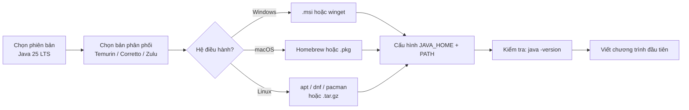
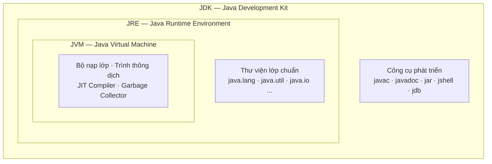
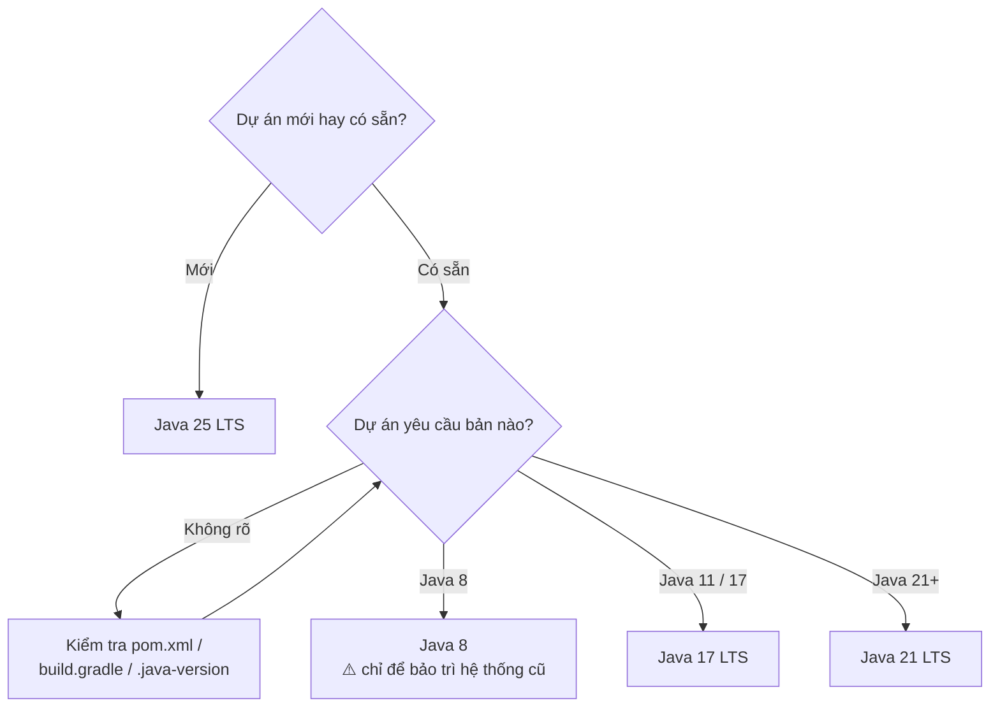
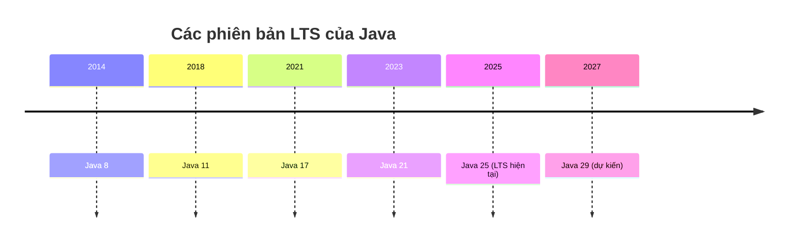

# Hướng dẫn cài đặt và cấu hình Java trên Windows, macOS và Linux

> Cập nhật: tháng 9/2026 — Phiên bản LTS mới nhất là **Java 25** (phát hành 9/2025). Java 26 là bản feature release (3/2026), chỉ được hỗ trợ 6 tháng.

---

## Toàn cảnh quá trình cài đặt



---

## Mục lục

1. [Chọn phiên bản và bản phân phối JDK](#1-chọn-phiên-bản-và-bản-phân-phối-jdk)
2. [Cài đặt trên Windows](#2-cài-đặt-trên-windows)
3. [Cài đặt trên macOS](#3-cài-đặt-trên-macos)
4. [Cài đặt trên Linux](#4-cài-đặt-trên-linux)
5. [Kiểm tra cài đặt](#5-kiểm-tra-cài-đặt)
6. [Quản lý nhiều phiên bản Java](#6-quản-lý-nhiều-phiên-bản-java)
7. [Chương trình đầu tiên](#7-chương-trình-đầu-tiên)
8. [Xử lý lỗi thường gặp](#8-xử-lý-lỗi-thường-gặp)

---

## 1. Chọn phiên bản và bản phân phối JDK

### JDK hay JRE?



| | Mô tả | Dùng khi nào |
|---|---|---|
| **JRE** (Java Runtime Environment) | Chỉ chứa môi trường chạy | Chỉ cần chạy ứng dụng Java có sẵn |
| **JDK** (Java Development Kit) | Gồm JRE + trình biên dịch `javac` và các công cụ phát triển | **Lập trình Java — hãy chọn cái này** |

Từ Java 11 trở đi, Oracle không còn phát hành JRE riêng nữa. Cứ cài JDK là đủ.

### Nên chọn phiên bản nào?

- **Java 25 (LTS)** — khuyến nghị cho dự án mới. Được hỗ trợ dài hạn.
- **Java 21 (LTS)** — vẫn rất phổ biến, nhiều framework (Spring Boot 3.x…) hỗ trợ tốt.
- **Java 17 (LTS)** — dùng nếu dự án cũ yêu cầu.
- **Java 8** — chỉ dùng khi buộc phải bảo trì hệ thống cũ.

> **Quy tắc**: dự án mới → LTS mới nhất. Dự án có sẵn → dùng đúng phiên bản dự án yêu cầu (xem file `pom.xml`, `build.gradle` hoặc `.java-version`).



### Dòng thời gian các bản LTS



### Nên chọn bản phân phối nào?

Tất cả đều dựa trên OpenJDK, khác nhau chủ yếu ở giấy phép và dịch vụ hỗ trợ:

| Bản phân phối | Ghi chú |
|---|---|
| **Eclipse Temurin (Adoptium)** | Miễn phí hoàn toàn, phổ biến nhất — **khuyến nghị** |
| **Amazon Corretto** | Miễn phí, hỗ trợ dài hạn, tối ưu cho AWS |
| **Azul Zulu** | Miễn phí, nhiều nền tảng, hỗ trợ cả macOS Apple Silicon từ sớm |
| **Microsoft Build of OpenJDK** | Miễn phí, tích hợp tốt với VS Code / Azure |
| **Oracle JDK** | Miễn phí cho phát triển & thử nghiệm, nhưng **có thể tính phí khi dùng production** |

Bài viết này dùng **Eclipse Temurin** làm ví dụ mặc định.

---

## 2. Cài đặt trên Windows

### Cách 1: Dùng bộ cài `.msi` (dễ nhất cho người mới)

1. Truy cập <https://adoptium.net/temurin/releases/>
2. Chọn:
   - **Operating System**: Windows
   - **Architecture**: x64 (hoặc aarch64 nếu dùng máy ARM)
   - **Package Type**: JDK
   - **Version**: 25 - LTS
3. Tải file `.msi` và chạy.
4. Trong màn hình **Custom Setup**, bật các tuỳ chọn sau (rất quan trọng):

```text
┌─ Eclipse Temurin JDK with Hotspot 25 (x64) Setup ──────────── ─ □ ✕ ┐
│                                                                     │
│  Custom Setup                                                       │
│  Select the way you want features to be installed.                  │
│  ─────────────────────────────────────────────────────────────────  │
│                                                                     │
│   ▼ 📦 Eclipse Temurin JDK with Hotspot                             │
│      ├─ ✅  Add to PATH               ◄── BẮT BUỘC BẬT              │
│      ├─ ✅  Associate .jar                                          │
│      ├─ ✅  Set JAVA_HOME variable    ◄── BẮT BUỘC BẬT              │
│      ├─ ✅  JavaSoft (Oracle) registry keys                         │
│      └─ ⬜  Source Archive             (tuỳ chọn)                    │
│                                                                     │
│   Location: C:\Program Files\Eclipse Adoptium\jdk-25.0.3.9-hotspot\ │
│                                                                     │
│                          [ Back ]   [ Next ]   [ Cancel ]           │
└─────────────────────────────────────────────────────────────────────┘
```

> Mặc định hai mục `Add to PATH` và `Set JAVA_HOME variable` hiển thị dấu ✕ đỏ (không cài). Nhấn vào biểu tượng và chọn **"Will be installed on local hard drive"**.

5. Nhấn **Install** và chờ hoàn tất.

<!-- Chèn ảnh chụp màn hình của bạn tại đây:

-->


Nếu bật hai tuỳ chọn đầu, bạn **không cần** cấu hình biến môi trường thủ công. Có thể bỏ qua phần dưới.

### Cách 2: Dùng winget (nhanh, cho người quen dòng lệnh)

Mở PowerShell:

```powershell
# Xem các bản có sẵn
winget search Temurin

# Cài Java 25 LTS
winget install EclipseAdoptium.Temurin.25.JDK
```

Hoặc dùng Chocolatey:

```powershell
choco install temurin25
```

### Cấu hình biến môi trường thủ công (nếu cần)

**Bước 1 — Xác định thư mục cài đặt.** Thường là:

```
C:\Program Files\Eclipse Adoptium\jdk-25.0.3.9-hotspot
```

**Bước 2 — Tạo biến `JAVA_HOME`:**

1. Nhấn `Win + S`, gõ *"environment variables"* → chọn **Edit the system environment variables**
2. Nhấn nút **Environment Variables...**
3. Ở khung **System variables**, nhấn **New...**
   - Variable name: `JAVA_HOME`
   - Variable value: đường dẫn thư mục JDK ở bước 1 (**không** kèm `\bin`)
4. Nhấn **OK**

```text
┌─ Environment Variables ──────────────────────── ✕ ┐
│  User variables for user                          │
│  ┌──────────────┬──────────────────────────────┐  │
│  │ Variable     │ Value                        │  │
│  │ TEMP         │ %USERPROFILE%\AppData\...    │  │
│  └──────────────┴──────────────────────────────┘  │
│                                                   │
│  System variables                                 │
│  ┌──────────────┬──────────────────────────────┐  │
│  │ JAVA_HOME    │ C:\Program Files\Eclipse ... │ ◄─ tạo mới
│  │ Path         │ %JAVA_HOME%\bin; C:\Wind...  │ ◄─ sửa
│  │ PATHEXT      │ .COM;.EXE;.BAT;.CMD          │  │
│  └──────────────┴──────────────────────────────┘  │
│            [ New... ] [ Edit... ] [ Delete ]      │
│                          [ OK ]  [ Cancel ]       │
└───────────────────────────────────────────────────┘
```

<!--  -->


**Bước 3 — Thêm vào `Path`:**

1. Vẫn ở khung **System variables**, chọn dòng `Path` → **Edit...**
2. Nhấn **New**, nhập:
   ```
   %JAVA_HOME%\bin
   ```
3. Nhấn **OK** ở tất cả các cửa sổ.

**Bước 4 — Mở lại Terminal/PowerShell** (cửa sổ đang mở sẽ không nhận biến mới) và kiểm tra:

```powershell
java -version
javac -version
echo $env:JAVA_HOME
```

#### Thiết lập tạm thời bằng PowerShell

Chỉ có hiệu lực trong phiên hiện tại, tiện để thử nhanh:

```powershell
$env:JAVA_HOME = "C:\Program Files\Eclipse Adoptium\jdk-25.0.3.9-hotspot"
$env:Path = "$env:JAVA_HOME\bin;$env:Path"
```

---

## 3. Cài đặt trên macOS

### Cách 1: Homebrew (khuyến nghị)

Nếu chưa có Homebrew:

```bash
/bin/bash -c "$(curl -fsSL https://raw.githubusercontent.com/Homebrew/install/HEAD/install.sh)"
```

Cài Temurin:

```bash
# Java 25 LTS
brew install --cask temurin@25

# Hoặc các phiên bản khác
brew install --cask temurin@21
brew install --cask temurin@17
```

Homebrew sẽ đặt JDK vào `/Library/Java/JavaVirtualMachines/`, và macOS tự nhận diện.

### Cách 2: Tải bộ cài `.pkg`

1. Vào <https://adoptium.net/temurin/releases/>
2. Chọn **macOS**, kiến trúc:
   - **aarch64** — máy Apple Silicon (M1/M2/M3/M4…)
   - **x64** — máy Intel
3. Tải file `.pkg` và chạy theo hướng dẫn.

> Kiểm tra chip máy: `uname -m` → `arm64` là Apple Silicon, `x86_64` là Intel.

### Cấu hình `JAVA_HOME` trên macOS

macOS có công cụ `java_home` giúp việc này rất gọn. Xác định shell đang dùng:

```bash
echo $SHELL
```

Với **zsh** (mặc định từ macOS Catalina), sửa file `~/.zshrc`:

```bash
nano ~/.zshrc
```

Thêm vào cuối file:

```bash
export JAVA_HOME=$(/usr/libexec/java_home -v 25)
export PATH="$JAVA_HOME/bin:$PATH"
```

Với **bash**, dùng file `~/.bash_profile` thay thế.

Lưu file (`Ctrl+O`, `Enter`, `Ctrl+X`) rồi nạp lại:

```bash
source ~/.zshrc
```

### Liệt kê các JDK đã cài

```bash
/usr/libexec/java_home -V
```

Kết quả mẫu:

```
Matching Java Virtual Machines (3):
    25.0.3 (arm64) "Eclipse Adoptium" - "OpenJDK 25.0.3" /Library/Java/JavaVirtualMachines/temurin-25.jdk/Contents/Home
    21.0.11 (arm64) "Eclipse Adoptium" - "OpenJDK 21.0.11" /Library/Java/JavaVirtualMachines/temurin-21.jdk/Contents/Home
    17.0.19 (arm64) "Eclipse Adoptium" - "OpenJDK 17.0.19" /Library/Java/JavaVirtualMachines/temurin-17.jdk/Contents/Home
```

Đổi phiên bản nhanh bằng cách sửa số sau `-v` trong `~/.zshrc`.

---

## 4. Cài đặt trên Linux

### Ubuntu / Debian

**Dùng kho phần mềm mặc định (đơn giản nhất):**

```bash
sudo apt update
sudo apt install openjdk-21-jdk
```

**Dùng kho Adoptium (để có Java 25 LTS mới nhất):**

```bash
# Cài các gói cần thiết
sudo apt install -y wget apt-transport-https gpg

# Thêm khoá GPG
wget -qO - https://packages.adoptium.net/artifactory/api/gpg/key/public \
  | gpg --dearmor \
  | sudo tee /etc/apt/trusted.gpg.d/adoptium.gpg > /dev/null

# Thêm repository
echo "deb https://packages.adoptium.net/artifactory/deb $(awk -F= '/^VERSION_CODENAME/{print$2}' /etc/os-release) main" \
  | sudo tee /etc/apt/sources.list.d/adoptium.list

# Cài đặt
sudo apt update
sudo apt install temurin-25-jdk
```

### Fedora / RHEL / CentOS / Rocky Linux

```bash
# Kho mặc định
sudo dnf install java-21-openjdk-devel

# Hoặc kho Adoptium
sudo tee /etc/yum.repos.d/adoptium.repo > /dev/null <<'EOF'
[Adoptium]
name=Adoptium
baseurl=https://packages.adoptium.net/artifactory/rpm/fedora/$releasever/$basearch
enabled=1
gpgcheck=1
gpgkey=https://packages.adoptium.net/artifactory/api/gpg/key/public
EOF

sudo dnf install temurin-25-jdk
```

> Với RHEL/Rocky/AlmaLinux, đổi `fedora` trong `baseurl` thành `rhel`.

### Arch Linux

```bash
sudo pacman -S jdk-openjdk       # phiên bản mới nhất
sudo pacman -S jdk21-openjdk     # phiên bản cụ thể
```

### openSUSE

```bash
sudo zypper install java-21-openjdk-devel
```

### Cài thủ công từ file `.tar.gz` (mọi distro)

```bash
# Tải JDK (thay URL bằng bản mới nhất từ adoptium.net)
cd /tmp
wget https://github.com/adoptium/temurin25-binaries/releases/download/jdk-25.0.3%2B9/OpenJDK25U-jdk_x64_linux_hotspot_25.0.3_9.tar.gz

# Giải nén vào /opt
sudo mkdir -p /opt/java
sudo tar -xzf OpenJDK25U-jdk_x64_linux_hotspot_25.0.3_9.tar.gz -C /opt/java

# Kiểm tra tên thư mục vừa tạo
ls /opt/java
```

### Cấu hình biến môi trường trên Linux

**Cho riêng người dùng hiện tại** — sửa `~/.bashrc` (hoặc `~/.zshrc`):

```bash
nano ~/.bashrc
```

Thêm vào cuối:

```bash
export JAVA_HOME=/opt/java/jdk-25.0.3+9
export PATH="$JAVA_HOME/bin:$PATH"
```

Nạp lại:

```bash
source ~/.bashrc
```

**Cho toàn hệ thống** — tạo file `/etc/profile.d/java.sh`:

```bash
sudo tee /etc/profile.d/java.sh > /dev/null <<'EOF'
export JAVA_HOME=/opt/java/jdk-25.0.3+9
export PATH="$JAVA_HOME/bin:$PATH"
EOF

sudo chmod +x /etc/profile.d/java.sh
```

Đăng xuất và đăng nhập lại để có hiệu lực.

### Chuyển đổi phiên bản bằng `update-alternatives` (Debian/Ubuntu)

```bash
# Đăng ký JDK cài thủ công
sudo update-alternatives --install /usr/bin/java java /opt/java/jdk-25.0.3+9/bin/java 1
sudo update-alternatives --install /usr/bin/javac javac /opt/java/jdk-25.0.3+9/bin/javac 1

# Chọn phiên bản mặc định
sudo update-alternatives --config java
sudo update-alternatives --config javac
```

---

## 5. Kiểm tra cài đặt

Chạy các lệnh sau trên **mọi hệ điều hành**:

```bash
java -version
javac -version
```

Kết quả mong đợi:

```
openjdk version "25.0.3" 2026-04-21
OpenJDK Runtime Environment Temurin-25.0.3+9 (build 25.0.3+9)
OpenJDK 64-Bit Server VM Temurin-25.0.3+9 (build 25.0.3+9, mixed mode, sharing)
```

Kiểm tra `JAVA_HOME`:

```bash
# macOS / Linux
echo $JAVA_HOME

# Windows PowerShell
echo $env:JAVA_HOME

# Windows CMD
echo %JAVA_HOME%
```

Xác định vị trí lệnh `java` đang được gọi:

```bash
# macOS / Linux
which java

# Windows PowerShell
Get-Command java
```

---

## 6. Quản lý nhiều phiên bản Java

Nếu bạn làm việc với nhiều dự án dùng phiên bản Java khác nhau, hãy dùng công cụ quản lý phiên bản thay vì sửa biến môi trường thủ công.

### SDKMAN! (macOS / Linux / WSL)

```bash
# Cài đặt
curl -s "https://get.sdkman.io" | bash
source "$HOME/.sdkman/bin/sdkman-init.sh"

# Xem danh sách JDK
sdk list java

# Cài đặt
sdk install java 25.0.3-tem
sdk install java 21.0.11-tem

# Chuyển đổi tạm thời (chỉ terminal hiện tại)
sdk use java 21.0.11-tem

# Đặt làm mặc định
sdk default java 25.0.3-tem

# Xem phiên bản đang dùng
sdk current java
```

Bạn có thể tạo file `.sdkmanrc` trong thư mục dự án để tự động chọn phiên bản:

```
java=21.0.11-tem
```

### jEnv (macOS / Linux)

```bash
brew install jenv

# Thêm vào ~/.zshrc
export PATH="$HOME/.jenv/bin:$PATH"
eval "$(jenv init -)"

# Đăng ký JDK
jenv add /Library/Java/JavaVirtualMachines/temurin-25.jdk/Contents/Home

# Đặt phiên bản cho riêng thư mục dự án
cd my-project
jenv local 21
```

### Scoop / winget (Windows)

Trên Windows, cách gọn nhất là cài nhiều JDK rồi tạo alias trong PowerShell profile:

```powershell
function Use-Java21 {
    $env:JAVA_HOME = "C:\Program Files\Eclipse Adoptium\jdk-21.0.11.9-hotspot"
    $env:Path = "$env:JAVA_HOME\bin;$env:Path"
    java -version
}
```

Hoặc dùng SDKMAN! trong WSL nếu bạn làm việc chủ yếu ở môi trường Linux.

---

## 7. Chương trình đầu tiên

Tạo file `HelloWorld.java`:

```java
public class HelloWorld {
    public static void main(String[] args) {
        System.out.println("Xin chào, Java!");
        System.out.println("Phiên bản: " + System.getProperty("java.version"));
        System.out.println("Vị trí JDK: " + System.getProperty("java.home"));
    }
}
```

**Cách truyền thống — biên dịch rồi chạy:**

```bash
javac HelloWorld.java   # tạo ra HelloWorld.class
java HelloWorld         # lưu ý: không có đuôi .class
```

**Cách nhanh (Java 11 trở lên) — chạy trực tiếp file nguồn:**

```bash
java HelloWorld.java
```

**JShell — thử nghiệm code nhanh (Java 9 trở lên):**

```bash
jshell
```

```
jshell> int x = 10;
jshell> System.out.println(x * 2);
20
jshell> /exit
```

---

## 8. Xử lý lỗi thường gặp

### `'java' is not recognized...` / `command not found: java`

Thư mục `bin` của JDK chưa nằm trong `PATH`.

- Kiểm tra JDK đã cài chưa: tìm thư mục cài đặt.
- Kiểm tra `PATH` có chứa `$JAVA_HOME/bin` không.
- **Mở lại terminal** sau khi sửa biến môi trường.

### `java` chạy được nhưng `javac` thì không

Bạn đang cài JRE chứ không phải JDK, hoặc `PATH` trỏ tới JRE. Hãy cài JDK.

### `java -version` trả về phiên bản khác với mong đợi

Có nhiều JDK trên máy và `PATH` đang ưu tiên bản khác:

```bash
which -a java        # macOS/Linux: liệt kê mọi đường dẫn java
```

Trên Windows, kiểm tra xem `C:\ProgramData\Oracle\Java\javapath` có đứng trước `%JAVA_HOME%\bin` trong `Path` không — nếu có, hãy đưa `%JAVA_HOME%\bin` lên trên.

### `UnsupportedClassVersionError`

File `.class` được biên dịch bằng JDK mới hơn JVM đang chạy. Cách xử lý:

- Nâng cấp JVM lên phiên bản bằng hoặc cao hơn, **hoặc**
- Biên dịch lại với tham số tương thích:
  ```bash
  javac --release 17 HelloWorld.java
  ```

Bảng đối chiếu class file version:

| Java | Class version |
|---|---|
| 8 | 52 |
| 11 | 55 |
| 17 | 61 |
| 21 | 65 |
| 25 | 69 |

### macOS: "không thể mở vì nhà phát triển chưa được xác minh"

Vào **System Settings → Privacy & Security**, cuộn xuống và nhấn **Open Anyway**.

### Maven/Gradle không nhận đúng JDK

Hai công cụ này đọc `JAVA_HOME` chứ không phải `PATH`. Kiểm tra:

```bash
mvn -version
gradle -version
```

Nếu sai, sửa lại biến `JAVA_HOME`.

---

## Tham khảo

- Eclipse Temurin: <https://adoptium.net>
- OpenJDK: <https://openjdk.org>
- Amazon Corretto: <https://aws.amazon.com/corretto/>
- SDKMAN!: <https://sdkman.io>
- Lịch phát hành Java: <https://endoflife.date/java>
