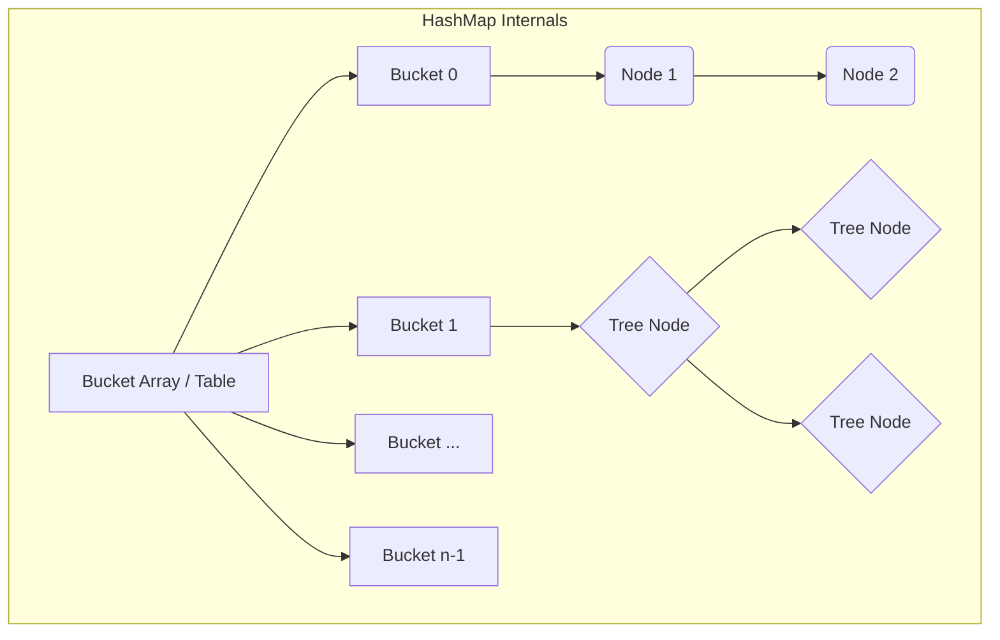
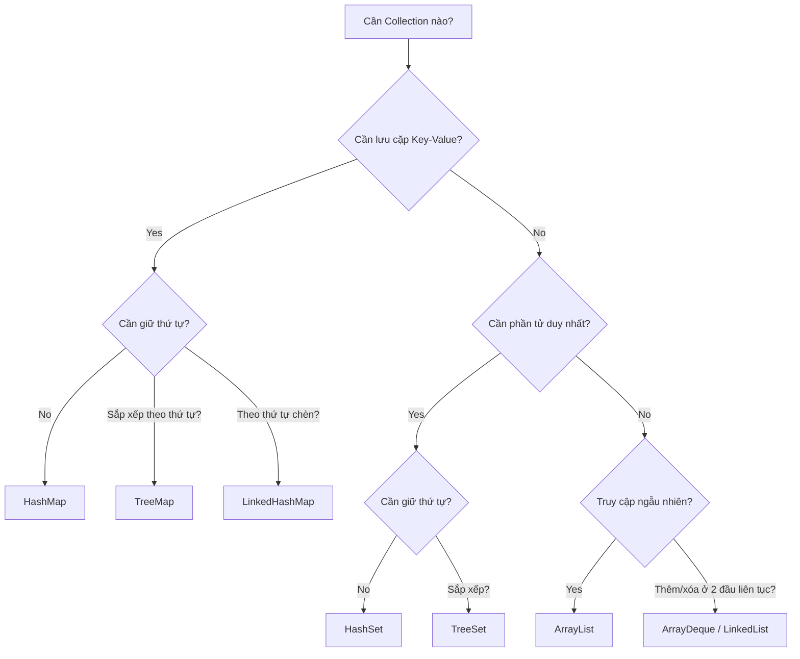
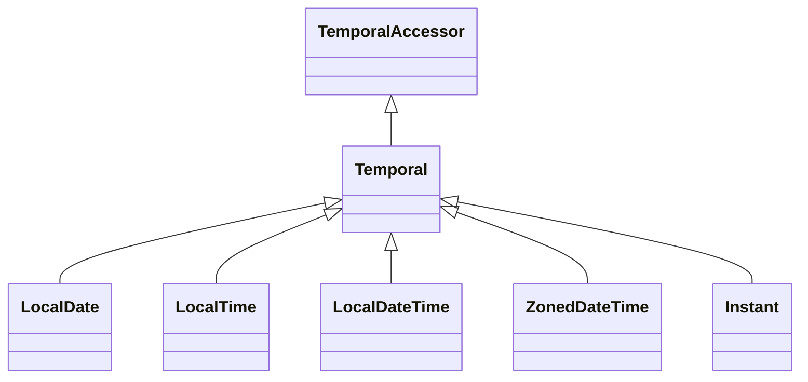

# Phase 3: Core APIs - Deep Theory Supplement

Tài liệu bổ sung này cung cấp cái nhìn sâu sắc về internals (cơ chế nội bộ) của các Core APIs trong Java SE 25. Hiểu được "tại sao" và "như thế nào" đằng sau các API này là chìa khóa để xử lý các câu hỏi khó nhất trong kỳ thi OCP (1Z0-831).

---

## 1. Collections Internal Data Structures

Hiểu cấu trúc dữ liệu bên dưới là cách duy nhất để biết chính xác collection nào phù hợp nhất với một bài toán cụ thể.

### ArrayList
- **Cấu trúc:** Mảng một chiều (internal array).
- **Khởi tạo:** `Initial capacity` mặc định là 10. Khi tạo mới mảng rỗng, nó chưa được cấp phát cho đến khi phần tử đầu tiên được thêm vào (lazy initialization).
- **Growth Strategy (Chiến lược tăng kích thước):** Khi mảng đầy, nó tăng kích thước thêm **50%** (`oldCapacity + (oldCapacity >> 1)`). Mảng mới được tạo ra và các phần tử cũ được copy sang qua `Arrays.copyOf()`.
- **Đặc biệt:** `trimToSize()` giúp giảm bớt capacity bằng chính size hiện tại, hữu ích để tiết kiệm bộ nhớ khi danh sách đã ổn định.

### LinkedList
- **Cấu trúc:** Doubly-linked list (danh sách liên kết kép). Mỗi node chứa tham chiếu đến phần tử trước (prev) và sau (next).
- **Khi nào dùng:** Hầu như không bao giờ dùng cho random access (chỉ số ngẫu nhiên). Chỉ dùng khi bạn cần thêm/xóa phần tử ở đầu/cuối liên tục (như queue/deque).

### HashMap
- **Cấu trúc:** Mảng các buckets (hash table). Mỗi bucket trỏ tới một linked list hoặc một Red-Black Tree.
- **Treeify:** Từ Java 8, để chống lại HashDoS attacks, nếu một bucket (linked list) đạt tới **8 nodes** (TREEIFY_THRESHOLD) VÀ tổng capacity của hash table >= 64, nó sẽ chuyển đổi thành Red-Black Tree (thời gian tìm kiếm từ O(n) thành O(log n)). Khi số node giảm xuống <= 6 (UNTREEIFY_THRESHOLD), nó quay lại thành linked list.
- **Load Factor:** Mặc định là `0.75`. Khi số phần tử vượt quá `capacity * load_factor`, HashMap sẽ rehash (gấp đôi số lượng buckets và phân bổ lại toàn bộ entries).



### TreeMap
- **Cấu trúc:** Red-Black Tree. Mọi thao tác (put, get, remove) đều là O(log n).
- **NavigableMap:** Hỗ trợ các phương thức mạnh mẽ:
  - `floorKey(K key)`: Key lớn nhất <= key truyền vào.
  - `ceilingKey(K key)`: Key nhỏ nhất >= key truyền vào.
  - `headMap(K toKey)`: Trả về một view của map có các keys < toKey.
  - `tailMap(K fromKey)`: Trả về view với keys >= fromKey.

### LinkedHashMap
- **Cấu trúc:** Kết hợp HashMap + Doubly-linked list chạy qua tất cả các entries để giữ thứ tự chèn (insertion order).
- **Access Order Mode:** Nếu constructor `LinkedHashMap(capacity, loadFactor, accessOrder=true)` được dùng, nó duy trì thứ tự theo lần truy cập gần nhất (hữu ích để làm **LRU Cache**).

### HashSet & TreeSet
- **HashSet:** Thực chất là một `HashMap` bên dưới. Value được gán bằng một object giả `private static final Object PRESENT = new Object();`.
- **TreeSet:** Thực chất là một `TreeMap`.

### ArrayDeque
- **Cấu trúc:** Circular array (mảng vòng) với 2 con trỏ `head` và `tail`.
- **Đặc biệt:** KHÔNG cho phép phần tử `null` (vì null được dùng để nhận diện mảng rỗng/đầy trong một số thao tác bên trong). Hiệu năng tốt hơn LinkedList và Stack.

### PriorityQueue
- **Cấu trúc:** Binary min-heap (cây nhị phân tối thiểu), được biểu diễn dưới dạng mảng.
- **Quan trọng:** Iterator của PriorityQueue **KHÔNG** duyệt theo thứ tự sắp xếp (sorted order)! Để lấy thứ tự, bạn phải liên tục gọi `poll()`.

---

## 2. Collections Performance Comparison

### Big-O Complexity

| Collection | Get (index) | Search (contains) | Insert (add) | Delete (remove) |
|---|---|---|---|---|
| **ArrayList** | O(1) | O(n) | O(1) amotized | O(n) |
| **LinkedList** | O(n) | O(n) | O(1) | O(1) |
| **HashSet** | N/A | O(1) | O(1) | O(1) |
| **TreeSet** | N/A | O(log n) | O(log n) | O(log n) |
| **HashMap** | O(1) | O(1) | O(1) | O(1) |
| **TreeMap** | O(log n) | O(log n) | O(log n) | O(log n) |
| **PriorityQueue** | N/A | O(n) | O(log n) | O(log n) |

### Decision Flowchart



### Fail-fast vs Fail-safe
- **Fail-fast:** `ArrayList`, `HashMap`, `HashSet`... sẽ ném `ConcurrentModificationException` nếu collection bị sửa đổi cấu trúc trong khi đang được iterate bằng một thread khác, HOẶC không thông qua iterator. Điều này được thực hiện qua biến `modCount`.
- **Fail-safe (Weakly-consistent):** `ConcurrentHashMap`, `CopyOnWriteArrayList`... Không ném ngoại lệ vì chúng duyệt qua bản copy (hoặc dung nạp thay đổi) của dữ liệu.

> [!WARNING]
> Không bao giờ dùng `list.remove(item)` khi đang duyệt bằng `for-each`. Hãy dùng `Iterator.remove()` hoặc `list.removeIf(...)`.

---

## 3. Generics Type System

### Type Erasure (Xóa kiểu)
Tại runtime, Java không giữ lại thông tin về tham số kiểu Generics. Quá trình biên dịch (Compile time) biến đổi Generics như sau:
1. Thay thế tham số kiểu (type parameters) bằng giới hạn (bound) của chúng, hoặc `Object` nếu unbounded.
2. Chèn tự động các ép kiểu (type casts) khi cần.
3. Sinh ra **Bridge methods** để duy trì polymorphism trong các class kế thừa.

> [!TIP]
> Do Type Erasure, bạn không thể hỏi `if (list instanceof List<String>)` tại runtime, chỉ có thể kiểm tra `list instanceof List<?>`.

### Raw Types and Heap Pollution
- **Raw Type:** Bỏ qua tham số kiểu, ví dụ `List list = new ArrayList<String>();`. Dùng nó vô hiệu hóa kiểm tra kiểu của trình biên dịch.
- **Heap Pollution:** Xảy ra khi một biến mang kiểu tham số trỏ tới đối tượng không đúng kiểu.

```java
List<String> strings = new ArrayList<>();
List rawList = strings;
rawList.add(10); // Heap pollution: Không có lỗi compile-time!
String s = strings.get(0); // ClassCastException at runtime
```

### Reifiable vs Non-reifiable Types
- **Reifiable Type:** Thông tin kiểu được giữ đầy đủ lúc runtime (primitives, non-generic types như `String`, raw types, unbounded wildcards `List<?>`).
- **Non-reifiable Type:** Thông tin bị mất do erasure (`List<String>`, `List<? extends Number>`).
- Bạn KHÔNG thể tạo mảng với non-reifiable type: `new List<String>[10]` là illegal vì array cần biết kiểu cụ thể tại runtime để sinh `ArrayStoreException` nếu có lỗi type.

### Wildcards: PECS (Producer Extends, Consumer Super)
- `? extends T`: (Producer) Cho phép đọc từ collection (trả về kiểu `T`). KHÔNG thể `add()` phần tử vào (trừ `null`).
- `? super T`: (Consumer) Cho phép viết vào collection. Có thể lấy ra nhưng chỉ được kiểu `Object`.

### Intersection & Recursive Bounds
- **Intersection:** `<T extends Comparable<T> & Serializable>`: T phải implement CẢ 2 interfaces.
- **Recursive:** `<T extends Comparable<T>>`: Enum là một ví dụ kinh điển `class Enum<E extends Enum<E>>`.

---

## 4. Comparable & Comparator Complete Guide

### Contract of `compareTo()`
1. **Symmetry:** `sgn(x.compareTo(y)) == -sgn(y.compareTo(x))`
2. **Transitivity:** Nếu `x.compareTo(y) > 0` và `y.compareTo(z) > 0`, thì `x.compareTo(z) > 0`
3. **Consistency with equals:** Khuyến khích `(x.compareTo(y) == 0) == (x.equals(y))`

> [!IMPORTANT]
> **TreeSet vs HashSet khác biệt:** `HashSet` dùng `equals()` và `hashCode()` để kiểm tra trùng lặp. `TreeSet` chỉ dùng `compareTo() == 0`. Nếu `compareTo` inconsistent với `equals`, `TreeSet` có thể chứa các phần tử vi phạm contract của `Set` (về mặt logic).

### Comparator Chaining & Method References
Java 8 mang tới các helper methods rất mạnh:
```java
Comparator<Employee> byNameThenAge = Comparator
    .comparing(Employee::getName, String.CASE_INSENSITIVE_ORDER)
    .thenComparingInt(Employee::getAge)
    .reversed();
```

- **Null Handling:** Dùng `Comparator.nullsFirst(Comparator.naturalOrder())` để xử lý danh sách có null an toàn.

---

## 5. Date/Time API Architecture (java.time)

### Design Philosophy
- **Immutable & Thread-safe:** Mỗi thao tác đổi giờ (ví dụ `plusDays(1)`) trả về một đối tượng mới hoàn toàn.
- **ISO-8601 Standard:** Lấy chuẩn chung.

### Temporal Hierarchy


- **TemporalAdjusters:** Cho phép thực hiện các phép toán phức tạp như "ngày thứ Hai đầu tiên của tháng":
  `date.with(TemporalAdjusters.firstInMonth(DayOfWeek.MONDAY))`

- **Duration vs Period:**
  - `Period`: Dựa trên ngày/tháng/năm (`Period.of(1, 2, 3)`). Chịu ảnh hưởng của số ngày trong tháng/năm nhuận.
  - `Duration`: Dựa trên thời gian vật lý (giây, nano). Một ngày luôn là 24*60*60 giây.

### ZonedDateTime & DST (Daylight Saving Time) Edge Cases

- **Spring Forward (Gap):** Đồng hồ nhảy từ 1:59:59 AM lên 3:00:00 AM. 
  - Nếu bạn tạo thời gian rơi vào khoảng gap (2:30 AM), Java sẽ tự đẩy tới giờ hợp lệ tiếp theo (3:30 AM).
- **Fall Back (Overlap):** Đồng hồ chạy từ 1:59:59 AM ngược về 1:00:00 AM. Có 2 khoảng thời gian 1:00 -> 2:00.
  - Mặc định, Java chọn "giờ sớm hơn". Dùng `withEarlierOffsetAtOverlap()` hoặc `withLaterOffsetAtOverlap()` để chỉnh.

### Instant
Lưu số nano-second tính từ Unix Epoch (1970-01-01T00:00:00Z). Tốt nhất cho logging hoặc giao tiếp máy tính-máy tính. Không có khái niệm TimeZone.

---

## 6. Immutable Collections Deep Dive

### `List.of()`, `Set.of()`, `Map.of()`
Từ Java 9, chúng tạo ra các **truly unmodifiable** collections.
- Bất kỳ thao tác `add`, `remove`, `set` nào đều quăng `UnsupportedOperationException`.
- **KHÔNG** chứa `null`. Ném `NullPointerException` ngay khi khởi tạo nếu có `null`.
- Iterator cũng không hỗ trợ `remove()`.
- Rất tốn ít bộ nhớ vì không cần các mảng đệm lớn (như ArrayList).

### `Collections.unmodifiableList(list)` vs `List.copyOf(list)`
- `Collections.unmodifiableList()`: Tạo ra một lớp bọc (wrapper view) bên ngoài list gốc. Nếu danh sách gốc thay đổi, view này **sẽ phản ánh thay đổi đó**.
- `List.copyOf()`: Tạo bản sao (deeply copy references). List gốc đổi, bản sao không đổi.

> [!CAUTION]
> **Shallow Immutability:** Collection có thể bất biến (không add/remove được), nhưng các ĐỐI TƯỢNG bên trong nó vẫn có thể thay đổi trạng thái nếu chúng là đối tượng mutable (như `StringBuilder` hay `Date`).

---

## 7. Hard Practice Questions

**Q1:** Cho đoạn mã sau:
```java
List<Integer> list = new ArrayList<>(List.of(1, 2, 3));
for (Integer i : list) {
    if (i == 2) list.remove(i);
}
```
Điều gì xảy ra?
A) Xóa được số 2
B) ConcurrentModificationException
C) IndexOutOfBoundsException
D) UnsupportedOperationException

**Q2:** Sự khác biệt giữa `Set.of(1, 2, 3)` và `new HashSet<>(Arrays.asList(1, 2, 3))` về khía cạnh chứa phần tử null là gì?
A) Cả hai đều cho phép null
B) Set.of cho phép, HashSet không
C) HashSet cho phép, Set.of thì ném NPE
D) Không có cái nào cho phép null

**Q3:** Khai báo nào sau đây là hợp lệ?
A) `List<?>[] array = new List<?>[10];`
B) `List<String>[] array = new List<String>[10];`
C) `List<Object>[] array = new ArrayList<Object>[10];`
D) `List<? extends Number>[] array = new List<? extends Number>[10];`

**Q4:** Kết quả của đoạn mã với HashMap có capacity = 4, hash of (A=1, B=2, C=3, D=4)? Khi load factor = 0.75, khi nào HashMap rehash?
A) Rehash khi insert D (kích thước = 4)
B) Rehash khi insert C (kích thước = 3)
C) Rehash khi insert phần tử thứ 4
D) Rehash khi kích thước vượt quá 3 (tức là chuẩn bị add phần tử thứ 4)

**Q5:** TreeSet lưu trữ phần tử bằng cách sử dụng phương thức nào để nhận diện trùng lặp?
A) `equals()`
B) `hashCode()` sau đó `equals()`
C) `compareTo()` == 0
D) `System.identityHashCode()`

**Q6:** PECS rule áp dụng thế nào cho `List<? super Integer>`?
A) Có thể `add(new Object())` nhưng không thể `add(10)`
B) Có thể `add(10)` nhưng chỉ có thể đọc ra dạng `Object`
C) Có thể `add(10)` và đọc ra dạng `Integer`
D) Không thể add gì vào danh sách này

**Q7:** Về Period và Duration: `Duration.ofDays(1)` và `Period.ofDays(1)` thêm vào lúc đổi giờ DST (Spring Forward gap). Kết quả:
A) Cả hai nhảy lên 1 giờ cùng nhau.
B) Duration cộng đúng 24h vật lý (chênh giờ trên đồng hồ), Period giữ nguyên giờ hiển thị.
C) Period cộng 24h vật lý, Duration giữ nguyên giờ.
D) Ném ra DateTimeException.

**Q8:** Khi bucket HashMap vượt quá 8 nodes, điều kiện gì bắt buộc phải có để nó chuyển thành Red-Black Tree?
A) Load factor phải lớn hơn 0.5
B) Bảng hash tổng (capacity) phải >= 64
C) Key phải implement Comparable
D) Cả B và C

**Q9:** Đoạn mã sau đúng hay sai? `List<String> list = new ArrayList<>(); List<Object> objList = list;`
A) Hợp lệ, String là Object.
B) Không hợp lệ, List<String> không phải là subclass của List<Object>.

**Q10:** Trong LinkedHashMap, chế độ access-order sẽ đẩy entry lên vị trí nào (head/tail) sau khi được truy cập `get()`?
A) Chuyển lên đầu danh sách (head)
B) Chuyển xuống cuối danh sách (tail - đại diện cho most recently used)
C) Không di chuyển vị trí, chỉ đổi flag.
D) Cập nhật PriorityQueue nội bộ.

*(Tham khảo JLS Section 4 (Types), Section 8 (Classes), và Javadoc của Collections/java.time để biết thêm chi tiết)*
