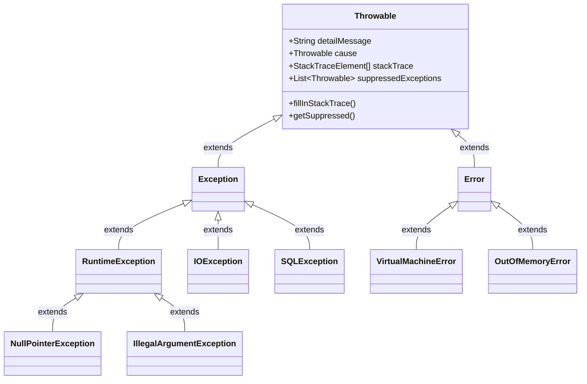
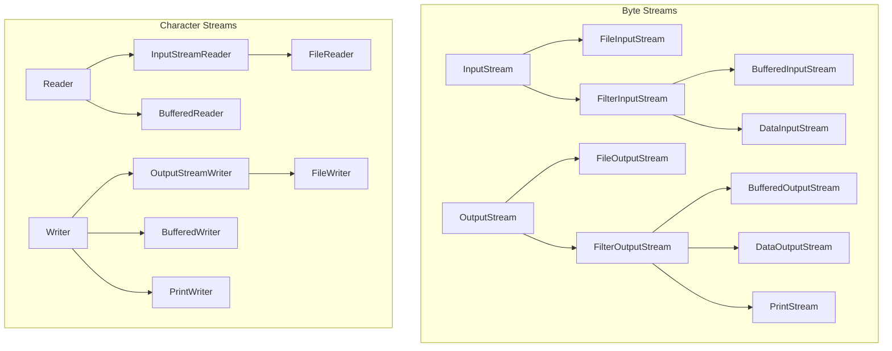

# OCP Java SE 25 (1Z0-831) - Phase 5: Advanced Topics (Deep Theory Supplement)

Tài liệu này cung cấp cái nhìn chuyên sâu về các chủ đề nâng cao trong Java, tập trung vào cơ chế nội bộ (internal mechanisms), các trường hợp ngoại lệ (edge cases), và sự khác biệt về mặt hiệu năng.

## 1. Exception Handling Deep Dive

### 1.1 Exception Hierarchy & Internal Mechanisms

Trong JVM, ngoại lệ không chỉ là các đối tượng; chúng gắn liền với **call stack** và quá trình **stack unwinding**. Mỗi khi một ngoại lệ được ném ra, JVM phải duyệt qua call stack để tìm một `catch` block phù hợp, điều này làm cho việc ném ngoại lệ có chi phí cao về mặt hiệu năng (chủ yếu do phương thức `fillInStackTrace()`).



> [!TIP]
> **Performance implication**: Nếu bạn sử dụng Exception để control flow (điều khiển luồng) thay vì xử lý lỗi, hãy cân nhắc override phương thức `fillInStackTrace()` để return `this` (không thu thập stack trace) nhằm giảm overhead, mặc dù điều này làm mất khả năng debug.

### 1.2 Try-with-Resources và Suppressed Exceptions

Cơ chế `try-with-resources` được JVM biên dịch thành các khối `try-catch-finally` lồng nhau. Điểm quan trọng nhất là thứ tự đóng resource và cơ chế **Suppressed Exceptions**.

*   **Thứ tự đóng**: Các resources được khai báo sẽ được đóng theo thứ tự **ngược lại** (LIFO - Last In, First Out) so với thứ tự khởi tạo.
*   **Suppressed Exceptions**: Nếu khối `try` ném ra ngoại lệ, và quá trình gọi `close()` cũng ném ra ngoại lệ, thì ngoại lệ của khối `try` sẽ là ngoại lệ chính được ném ra, còn ngoại lệ của `close()` sẽ được thêm vào dưới dạng **Suppressed Exception** bằng cách gọi `addSuppressed()`.

```java
public class ExceptionSuppressionDemo {
    static class BadResource implements AutoCloseable {
        String name;
        public BadResource(String name) { this.name = name; }
        
        public void doWork() throws Exception {
            throw new RuntimeException("Exception from try block - " + name);
        }
        
        @Override
        public void close() throws Exception {
            throw new RuntimeException("Exception from close() - " + name);
        }
    }

    public static void main(String[] args) {
        try (BadResource r1 = new BadResource("R1");
             BadResource r2 = new BadResource("R2")) {
            r1.doWork();
        } catch (Exception e) {
            System.out.println("Main Exception: " + e.getMessage());
            for (Throwable t : e.getSuppressed()) {
                System.out.println("Suppressed: " + t.getMessage());
            }
        }
    }
}
/* Output:
Main Exception: Exception from try block - R1
Suppressed: Exception from close() - R2
Suppressed: Exception from close() - R1
*/
```

> [!IMPORTANT]
> **Edge Case**: Nếu constructor của một resource ném ra ngoại lệ, resource đó sẽ KHÔNG được đóng (vì chưa khởi tạo xong). Các resource đã khởi tạo trước đó vẫn sẽ được đóng bình thường.

### 1.3 Finally Block: Nguy cơ nuốt ngoại lệ (Swallowing Exceptions)

Một khối `finally` có thể ghi đè (override) ngoại lệ đang được ném ra hoặc giá trị return của khối `try/catch`. 

```java
public String testFinally() {
    try {
        throw new RuntimeException("First Exception");
    } finally {
        // Return statement in finally overrides any thrown exception!
        return "Normal Return"; // The RuntimeException is SWALLOWED and lost forever.
    }
}
```

> [!WARNING]
> Theo JLS 14.20.2, nếu khối `finally` hoàn thành đột ngột (abrupt completion - ví dụ bằng `return`, `throw`, `break`, `continue`), thì lý do hoàn thành của toàn bộ khối try-finally sẽ là lý do của `finally`.

## 2. Java I/O Complete Architecture

### 2.1 I/O Class Hierarchy

I/O trong Java được thiết kế theo **Decorator Pattern**, cho phép bạn bọc (wrap) các stream cơ bản vào các stream cao cấp hơn để thêm tính năng.



### 2.2 Byte Streams vs Character Streams

*   **Byte Streams** (`InputStream`/`OutputStream`): Xử lý dữ liệu nhị phân (hình ảnh, video, object serialization). Đọc/ghi từng byte (8 bits).
*   **Character Streams** (`Reader`/`Writer`): Xử lý văn bản (text). Tự động xử lý việc mã hóa/giải mã (encoding/decoding) các byte thành các ký tự char (16-bit UTF-16) dựa trên Charset.

> [!NOTE]
> `PrintStream` (ví dụ `System.out`) là byte stream nhưng có các phương thức in text tiện lợi. Nó **không bao giờ ném ra IOException** (bạn phải gọi `checkError()` để biết có lỗi ghi hay không). `PrintWriter` là tương đương ở phía Character Stream.

### 2.3 Serialization Deep Dive

Serialization là quá trình chuyển đổi đối tượng thành chuỗi bytes.

1.  **Chỉ có các field không phải `transient` và không phải `static` mới được serialize.**
2.  **Quá trình Deserialization (Giải nén):**
    *   Constructor của lớp hiện tại (lớp implement `Serializable`) **KHÔNG** được gọi.
    *   Tuy nhiên, JVM sẽ tìm lớp cha gần nhất **không** implement `Serializable` và gọi no-arg constructor của lớp cha đó. Nếu lớp cha đó không có no-arg constructor, `InvalidClassException` sẽ bị ném ra.

| Method Customization | Purpose |
| :--- | :--- |
| `writeObject(ObjectOutputStream out)` | Tùy chỉnh cách ghi dữ liệu (thường để mã hóa hoặc xử lý transient fields thủ công). |
| `readObject(ObjectInputStream in)` | Tùy chỉnh cách đọc dữ liệu. |
| `readResolve()` | Chạy ngay sau khi deserialization hoàn tất. Dùng để duy trì **Singleton Pattern** (trả về instance duy nhất thay vì đối tượng mới tạo ra). |
| `writeReplace()` | Thay thế đối tượng trước khi serialization diễn ra. |

## 3. NIO.2 Complete Reference (java.nio.file)

### 3.1 `Path` Operations and Edge Cases

Giao diện `Path` đại diện cho một đường dẫn trừu tượng. Nó hoàn toàn phụ thuộc vào hệ điều hành (syntactic), nhiều phương thức không hề chạm vào file system (không quan tâm file có tồn tại hay không).

| Operation | Result | Note |
| :--- | :--- | :--- |
| `Path.of("a/b").resolve("c")` | `a/b/c` | Nối đường dẫn bình thường. |
| `Path.of("a/b").resolve("/c")` | `/c` | **Edge Case**: Nếu tham số là absolute path, trả về chính tham số đó. |
| `Path.of("a/b").relativize(Path.of("a/b/c/d"))` | `c/d` | Tạo đường dẫn tương đối từ Path 1 đến Path 2. |
| `Path.of("/a/b").relativize(Path.of("c/d"))` | `IllegalArgumentException` | **Edge Case**: Cả hai phải cùng là absolute hoặc cùng là relative. |
| `Path.of("a/b/../c").normalize()` | `a/c` | Chỉ xử lý chuỗi syntactic, loại bỏ `..` và `.`. Không check file system. |
| `Path.of("a/b/../c").toRealPath()` | (Absolute path to c) | Giải quyết symlink, `..`, và yêu cầu file **phải tồn tại** trên ổ đĩa. |

### 3.2 Symlinks và FileAttributes

Khi duyệt hoặc kiểm tra file, các phương thức NIO.2 thường theo (follow) symlink theo mặc định. Để ngăn chặn, sử dụng enum `LinkOption.NOFOLLOW_LINKS`.

`Files.readAttributes(path, BasicFileAttributes.class)` cung cấp cách lấy metadata tối ưu hơn việc gọi từng phương thức như `Files.size()`, `Files.getLastModifiedTime()`.

## 4. Concurrency & Java Memory Model (JMM)

### 4.1 Java Memory Model: Happens-Before

JMM quyết định khi nào thread A nhìn thấy sự thay đổi biến do thread B thực hiện. Khái niệm cốt lõi là **happens-before relationship**.
*   **Volatile**: Ghi vào một biến volatile *happens-before* mọi lần đọc từ biến volatile đó sau này. Đảm bảo visibility (tính nhìn thấy) nhưng **không đảm bảo atomicity** (ví dụ `count++` với volatile vẫn bị race condition).
*   **Monitor Lock (Synchronized)**: Việc unlock một monitor *happens-before* mọi lần lock trên cùng monitor đó. Đảm bảo cả visibility và atomicity (mutual exclusion).

### 4.2 Lock Interface vs Synchronized

| Feature | `synchronized` | `Lock` (e.g., `ReentrantLock`) |
| :--- | :--- | :--- |
| **Acquisition** | Cứng (blocking cho đến khi có lock). | Linh hoạt: `tryLock()`, `lockInterruptibly()`. |
| **Release** | Tự động khi thoát khỏi block/method. | Thủ công (phải gọi `unlock()` trong `finally`). |
| **Fairness** | Không công bằng. | Có thể cấu hình Fair (thread đợi lâu nhất được lock). |
| **Read/Write separation**| Không hỗ trợ. | Có `ReadWriteLock` tối ưu cho read-heavy. |

### 4.3 Virtual Threads (Project Loom - Java 21+)

Virtual Threads là luồng nhẹ (lightweight threads) do JVM quản lý thay vì OS. Chúng giải quyết vấn đề "thread-per-request" chặn I/O gây tốn kém tài nguyên.

```mermaid
graph TD
    subgraph OS
    OST1[OS Thread 1]
    OST2[OS Thread 2]
    end
    
    subgraph JVM ForkJoinPool (Carrier Threads)
    CT1[Carrier Thread A] -. mapped to .-> OST1
    CT2[Carrier Thread B] -. mapped to .-> OST2
    end
    
    subgraph JVM Virtual Threads
    VT1[Virtual Thread 1]
    VT2[Virtual Thread 2]
    VT3[Virtual Thread 3]
    VT4[Virtual Thread 4]
    
    VT1 -- mounted --> CT1
    VT2 -- mounted --> CT2
    VT3 -.- unmounted
    VT4 -.- unmounted
    end
```

**Cơ chế hoạt động**:
1.  Khi một Virtual Thread thực hiện một thao tác blocking I/O (ví dụ đọc DB, đọc file), JVM sẽ **unmount** (tháo) nó khỏi Carrier Thread (Platform thread).
2.  Carrier Thread được giải phóng để chạy Virtual Thread khác.
3.  Khi I/O hoàn tất, Virtual Thread được đưa trở lại hàng đợi và được **mount** lại vào một Carrier Thread (có thể là một Carrier Thread khác).

> [!WARNING]
> **Pinning (Ghim luồng)**: Nếu Virtual Thread thực hiện blocking operation trong một khối `synchronized` hoặc khi đang gọi hàm native (JNI), nó không thể unmount. Nó sẽ "ghim" Carrier Thread lại, làm giảm hiệu năng hệ thống. Giải pháp là thay thế `synchronized` bằng `ReentrantLock`.

## 5. JDBC Architecture

### 5.1 ResultSet Concurrency & Types

Khi tạo Statement, bạn có thể chỉ định loại ResultSet:
`connection.createStatement(ResultSet.TYPE_SCROLL_SENSITIVE, ResultSet.CONCUR_UPDATABLE);`

*   **TYPE_FORWARD_ONLY**: (Mặc định) Chỉ tiến lên (`next()`). Nhanh nhất.
*   **TYPE_SCROLL_INSENSITIVE**: Có thể cuộn tới/lui (`previous()`, `absolute()`). Không thấy thay đổi từ các giao dịch khác sau khi query được mở.
*   **TYPE_SCROLL_SENSITIVE**: Cuộn tới/lui. Có thể nhìn thấy những thay đổi về dữ liệu do thao tác update của các thread/process khác.

### 5.2 Transaction Isolation Levels

Xử lý các hiện tượng: Dirty Read (đọc dữ liệu chưa commit), Non-repeatable Read (đọc lại cùng dữ liệu thấy bị thay đổi), Phantom Read (đọc lại thấy xuất hiện dòng mới).

| Isolation Level | Dirty Read | Non-repeatable Read | Phantom Read |
| :--- | :--- | :--- | :--- |
| `READ_UNCOMMITTED` | Có | Có | Có |
| `READ_COMMITTED` | Không | Có | Có |
| `REPEATABLE_READ` | Không | Không | Có |
| `SERIALIZABLE` | Không | Không | Không |

## 6. Localization Deep Dive

### 6.1 ResourceBundle Resolution

Khi gọi `ResourceBundle.getBundle("Messages", new Locale("fr", "CA"))`, JVM tìm kiếm theo thứ tự fallback:

1.  `Messages_fr_CA.java` (Class wins over Properties)
2.  `Messages_fr_CA.properties`
3.  `Messages_fr.java`
4.  `Messages_fr.properties`
5.  `Messages_DefaultLocale_DefaultCountry...` (Dựa trên `Locale.getDefault()`)
6.  `Messages.java`
7.  `Messages.properties`
8.  Ném `MissingResourceException`.

## 7. Modules (JPMS) Deep Dive

### 7.1 Module Directives & Encapsulation

Module system kiểm soát cả quá trình compile và runtime.

*   `exports pkg;` : Gói có thể truy cập bởi mọi module khác.
*   `exports pkg to moduleA;` : **Qualified Export**, chỉ cho phép moduleA truy cập.
*   `opens pkg;` : Gói có thể truy cập được thông qua **Reflection** tại runtime (cần thiết cho các framework như Hibernate, Spring).
*   `requires transitive moduleB;` : Bất kỳ module nào yêu cầu module hiện tại cũng ngầm định yêu cầu luôn moduleB (Implied Readability).

### 7.2 Automatic Modules & Unnamed Module

*   **Automatic Module**: Khi đặt một JAR non-module (không có `module-info.class`) lên Module Path. Tên module tự động sinh ra từ tên file JAR. Nó `requires transitive` mọi module khác và `exports` toàn bộ package của nó.
*   **Unnamed Module**: Đại diện cho Classpath. Các module trên Module Path không thể đọc Unnamed Module. Tuy nhiên, Unnamed Module có thể đọc mọi thứ trên Module Path. (Gây ra vấn đề chia rẽ classpath và module path - Split Package không được phép giữa các module).

---

## Hard Practice Questions

**Q1.** What is the output of the following code?
```java
public class ResTest {
    static class MyRes implements AutoCloseable {
        int id;
        MyRes(int id) { this.id = id; }
        public void close() throws Exception {
            throw new Exception("Close " + id);
        }
    }
    public static void main(String[] args) {
        try (MyRes r1 = new MyRes(1); MyRes r2 = new MyRes(2)) {
            throw new Exception("Try Block");
        } catch (Exception e) {
            System.out.print(e.getMessage() + " | ");
            for(Throwable t : e.getSuppressed()) System.out.print(t.getMessage() + " | ");
        }
    }
}
```
A) Try Block | Close 1 | Close 2 |
B) Try Block | Close 2 | Close 1 |
C) Close 2 | Try Block | Close 1 |
D) Try Block |

**Q2.** Which Path method resolves symbolic links and requires the file to actually exist on the file system?
A) `toAbsolutePath()`
B) `normalize()`
C) `toRealPath()`
D) `resolve()`

**Q3.** In the Java Memory Model, which statement is true regarding the `volatile` keyword?
A) It guarantees atomicity for compound operations like `i++`.
B) It prevents threads from caching the variable, ensuring visibility.
C) It implicitly acquires a monitor lock on the object.
D) It can only be applied to primitive types.

**Q4.** A Virtual Thread is executing a method. Under which of the following conditions might the Virtual Thread get "pinned" to its carrier thread, reducing scalability? (Choose two)
A) Performing a blocking HTTP request using `HttpClient`.
B) Waiting inside a `synchronized` block.
C) Calling `Thread.sleep()`.
D) Executing a native method via JNI.
E) Acquiring a `ReentrantLock`.

**Q5.** You have a base resource bundle `App.properties` and a specific bundle `App_fr.properties`. Both files have the key `greeting`. If the JVM default locale is `en_US` and you request a bundle for `fr_CA`, which value is loaded for `greeting`?
A) Value from `App_fr_CA.properties` (throws exception if missing)
B) Value from `App_fr.properties`
C) Value from `App_en_US.properties`
D) Value from `App.properties`

**Q6.** Which JDBC isolation level prevents Dirty Reads and Non-repeatable Reads, but may still allow Phantom Reads?
A) READ_UNCOMMITTED
B) READ_COMMITTED
C) REPEATABLE_READ
D) SERIALIZABLE

**Q7.** Given module A `requires transitive module B`, and module C `requires module A`. Which of the following is true?
A) C cannot read B.
B) C can read B only at compile time.
C) C can read B both at compile time and runtime.
D) A cannot export packages from B.

**Q8.** When deserializing an object using `ObjectInputStream`, which constructor is invoked?
A) The default no-arg constructor of the class being deserialized.
B) The constructor of the highest non-serializable superclass.
C) The lowest non-serializable superclass no-arg constructor.
D) No constructors are called for any classes in the hierarchy.

**Q9.** What is the result of `Path.of("/usr/bin").resolve("/etc/config")`?
A) `/usr/bin/etc/config`
B) `/etc/config`
C) `usr/bin/etc/config`
D) Throws `IllegalArgumentException`

**Q10.** What happens if a `finally` block throws an exception while another exception is currently propagating from the `try` block?
A) The original exception is returned, and the finally exception is added as a suppressed exception.
B) The finally exception propagates, and the original exception is added as a suppressed exception.
C) The finally exception propagates, and the original exception is lost (swallowed).
D) A `MultipleExceptionsError` is thrown by the JVM.

### Answers Key
1. B (Resources closed in reverse order, Try block exception is primary)
2. C (toRealPath touches file system)
3. B (Visibility only, no atomicity)
4. B, D (synchronized and native methods pin the carrier thread)
5. B (Fallback: fr_CA -> fr -> Default(en_US) -> Base)
6. C
7. C (Due to implied readability from transitive)
8. C (Lowest/closest non-serializable superclass no-arg constructor is called)
9. B (Resolving with an absolute path returns the absolute path)
10. C (finally overrides the propagating exception)
