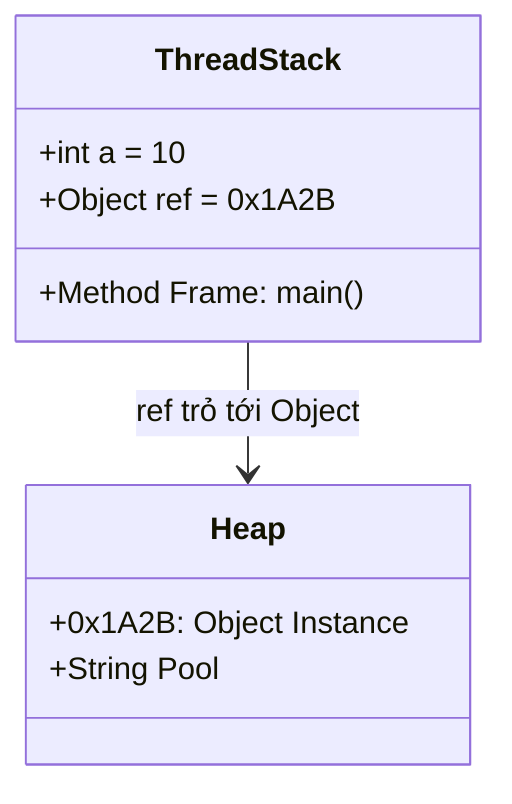

# Phase 1: Java Fundamentals - Deep Theory Supplement

Tài liệu này cung cấp kiến thức chuyên sâu (Deep Theory) cho Phase 1 của kỳ thi OCP Java SE 25 (1Z0-831). Chúng ta sẽ đi sâu vào cách JVM hoạt động dưới mảng (under the hood), lý do tại sao các quy tắc ngôn ngữ (JLS - Java Language Specification) được thiết kế như vậy, và các edge cases phức tạp nhất.

---

## 1. JVM Memory Model cho Primitives & Objects

### 1.1 Stack vs Heap

Trong Java, bộ nhớ chủ yếu được chia thành Stack và Heap:
- **Stack (Thread Stack):** Mỗi thread có một stack riêng. Stack lưu trữ các local variables (biến cục bộ) và các frame của method calls. Kích thước stack cố định và việc cấp phát/giải phóng diễn ra tự động khi vào/ra method.
- **Heap:** Là vùng nhớ dùng chung cho toàn bộ JVM, nơi tất cả các đối tượng (objects) và mảng (arrays) được khởi tạo.

> [!NOTE]
> Các biến nguyên thủy (primitives) khai báo dưới dạng local variables sẽ nằm hoàn toàn trên Stack. Các biến tham chiếu (references) cũng nằm trên Stack, nhưng bản thân đối tượng mà chúng trỏ tới sẽ nằm trên Heap. Nếu primitive là instance variable của một đối tượng, nó sẽ nằm trên Heap cùng với đối tượng đó.



### 1.2 String Pool Internals

String Pool là một vùng nhớ đặc biệt dành riêng cho các chuỗi. Trước Java 7, nó nằm ở vùng PermGen, nhưng từ Java 7 trở đi, nó đã được chuyển vào **Heap**.

Cơ chế Interning:
Khi bạn tạo một chuỗi literal (ví dụ `String s = "hello";`), JVM sẽ kiểm tra xem "hello" đã tồn tại trong String Pool chưa. Nếu có, JVM trả về tham chiếu đến chuỗi đó. Nếu chưa, JVM tạo một object mới trong Pool.
Nếu bạn tạo bằng từ khóa `new` (ví dụ `new String("hello")`), nó luôn tạo ra một object mới trên Heap, nằm ngoài Pool (tuy nhiên literal "hello" bên trong hàm tạo vẫn có thể nằm trong Pool). Bạn có thể đưa một chuỗi vào Pool thủ công thông qua phương thức `intern()`.

### 1.3 Tại sao String là Immutable?

> [!IMPORTANT]
> Immutability của String trong Java không phải là sự ngẫu nhiên mà là thiết kế cốt lõi vì 4 lý do chính:
> 1. **Security:** String được dùng làm tham số cho network connections, file paths, class loading. Nếu String là mutable, một tham số có thể bị thay đổi sau khi được validation, dẫn đến lỗ hổng bảo mật.
> 2. **String Pool:** Để String Pool hoạt động hiệu quả, nhiều tham chiếu phải trỏ cùng vào một object. Nếu object này bị thay đổi, tất cả các tham chiếu khác sẽ bị ảnh hưởng.
> 3. **Thread Safety:** Immutable objects mặc nhiên thread-safe. Các luồng không thể thay đổi giá trị của nó.
> 4. **Hash Caching:** Vì String không thay đổi, mã băm (hash code) của nó được tính một lần và cache lại. Điều này làm cho String cực kỳ hiệu quả khi dùng làm key trong `HashMap`.

### 1.4 StringBuilder vs StringBuffer Internals

Cả hai đều dùng một mảng `byte[]` (hoặc `char[]` ở các phiên bản cũ) để lưu trữ. Khi vượt quá capacity, mảng mới sẽ được tạo.
- **Capacity growth strategy:** Capacity mới thường bằng `(oldCapacity * 2) + 2`.
- `StringBuffer` có các phương thức được đồng bộ hóa (synchronized), an toàn cho đa luồng nhưng chậm.
- `StringBuilder` không đồng bộ hóa, nhanh hơn và là lựa chọn ưu tiên trong môi trường single-thread.

---

## 2. Type System Deep Dive

### 2.1 JLS Type Promotion Rules (JLS 5.6)

Khi thực hiện phép toán số học với các kiểu dữ liệu nhỏ hơn `int` (như `byte`, `short`, `char`), Java luôn **tự động thăng kiểu (promote)** chúng lên `int` trước khi thực hiện phép toán.

```java
byte b1 = 10;
byte b2 = 20;
// byte b3 = b1 + b2; // LỖI COMPILATION!
int result = b1 + b2; // Đúng. b1 và b2 được promote lên int
```

### 2.2 Compound Assignment vs Simple Assignment (JLS 15.26.2)

Tại sao `b = b + 1` lỗi nhưng `b += 1` lại hợp lệ?

> [!TIP]
> Toán tử gán phức hợp (Compound Assignment) như `+=`, `-=`, `*=` ngầm định chứa một phép ép kiểu (implicit cast).
> `E1 op= E2` tương đương với `E1 = (T) ((E1) op (E2))`, trong đó T là kiểu của E1.

```java
byte b = 10;
b = (byte) (b + 1); // Tương đương với b += 1;
```

### 2.3 Bảng Widening và Narrowing Conversions

| Từ Kiểu | Widening (Tự động) | Narrowing (Cần Cast) |
|---|---|---|
| `byte` | `short, int, long, float, double` | `char` |
| `short` | `int, long, float, double` | `byte, char` |
| `char` | `int, long, float, double` | `byte, short` |
| `int` | `long, float, double` | `byte, short, char` |
| `long` | `float, double` | `byte, short, char, int` |

> [!WARNING]
> Khi ép kiểu hẹp (Narrowing), bạn có thể mất dữ liệu (data loss) hoặc thay đổi dấu nếu giá trị vượt quá giới hạn của kiểu mục tiêu.

### 2.4 Constant Folding

```java
byte b = 10 + 20; // Hợp lệ, dù 10 + 20 là phép toán int
```
Tại sao hợp lệ? Trình biên dịch (Compiler) thực hiện **Constant Folding**. Nó tính `10 + 20` thành `30` tại compile-time. Vì `30` nằm trong giới hạn của `byte` (-128 đến 127), việc gán này hợp lệ.

### 2.5 Float vs Double Precision (IEEE 754)

`float` và `double` không thể biểu diễn chính xác một số phân số thập phân (như 0.1). Chúng sử dụng chuẩn IEEE 754 (nhị phân).
Do đó, `0.1 + 0.2` trong nhị phân sẽ tạo ra sai số làm tròn, kết quả không phải chính xác là `0.3`.

### 2.6 Char as Unsigned 16-bit Integer

`char` là kiểu nguyên thủy **duy nhất** trong Java là unsigned (không dấu). Giới hạn của nó là từ 0 đến 65535.
Có thể thực hiện các phép toán số học trên `char`:

```java
char c = 'A'; // 65
c++; // Trở thành 'B' (66)
int val = c; // Widening, val = 66
```

---

## 3. String Internals

### 3.1 Compact Strings (JEP 254 - Java 9+)

Trước Java 9, `String` lưu trữ dữ liệu trong một `char[]`, mỗi ký tự chiếm 2 bytes. Nhưng đa số các chuỗi chỉ chứa ký tự Latin-1 (chiếm 1 byte).
Từ Java 9, `String` được thay đổi:
- Dùng `byte[] value` thay vì `char[]`.
- Thêm cờ `byte coder` để đánh dấu chuỗi đang dùng **LATIN1** (1 byte/ký tự) hay **UTF16** (2 bytes/ký tự).
Điều này giúp tiết kiệm bộ nhớ đáng kể.

### 3.2 String Concatenation: `StringConcatFactory`

Trước Java 9, toán tử `+` được compiler biên dịch thành `StringBuilder.append()`.
Từ Java 9 (JEP 280), compiler dùng lệnh `invokedynamic` trỏ đến `StringConcatFactory`. Điều này cho phép JVM tối ưu hóa chiến lược nối chuỗi tại runtime mà không cần biên dịch lại mã nguồn, tăng hiệu suất đáng kể.

### 3.3 Thay đổi của `substring()` từ Java 7

Trước Java 7, `substring()` trả về một String mới chia sẻ cùng `char[]` với chuỗi gốc (nhưng offset và count khác). Điều này gây ra memory leak nếu bạn giữ `substring` nhỏ nhưng chuỗi gốc khổng lồ không thể bị garbage collected.
Từ Java 7 Update 6, `substring()` luôn sao chép dữ liệu cần thiết sang một mảng `byte[]` hoặc `char[]` mới, đảm bảo chuỗi gốc có thể bị thu gom rác.

### 3.4 String Methods Deep Dive

- `chars()`, `codePoints()`: Trả về `IntStream` của các ký tự. Quan trọng khi làm việc với các ký tự Unicode nằm ngoài BMP (cần 2 surrogate chars).
- `transform(Function)`: Hàm tiện ích (Java 12) áp dụng Function lên chuỗi.
- `translateEscapes()`: Đánh giá các escape sequence (như `\n`, `\t`) trong chuỗi.

### 3.5 Text Blocks Whitespace Algorithm (JLS 3.10.6)

Khi sử dụng Text Blocks `"""`, JVM cần phân biệt khoảng trắng ngẫu nhiên (incidental whitespace) để căn lề và khoảng trắng cần thiết.
Thuật toán:
1. Tính khoảng trắng dẫn đầu (leading whitespace) của mọi dòng không trống.
2. Lấy giá trị nhỏ nhất làm lề (margin).
3. Xóa số lượng khoảng trắng bằng lề từ mọi dòng.
4. Xóa các khoảng trắng theo sau (trailing whitespace).

---

## 4. Operator Evaluation Deep Dive

### 4.1 Evaluation Order

> [!CAUTION]
> Các toán hạng luôn được đánh giá từ **trái sang phải** trước khi toán tử được áp dụng, bất chấp mức độ ưu tiên (precedence).

```java
int[] a = {1, 2, 3};
int i = 1;
a[i] = i = 2; // a[1] được đánh giá thành tham chiếu vị trí trước, sau đó i = 2
// Kết quả a = {1, 2, 3}, không phải {1, 2, 2} như nhiều người nghĩ!
```

### 4.2 Numeric Overflow

Java không throw exception khi tràn số (overflow/underflow) đối với kiểu nguyên (integer). Thay vào đó, nó **wrap around** (cuộn vòng).

```java
int max = Integer.MAX_VALUE; // 2147483647
System.out.println(max + 1); // -2147483648
```

### 4.3 Toán tử `==`

- **Primitives:** So sánh giá trị sau khi đã promote lên kiểu lớn nhất.
- **References:** So sánh địa chỉ bộ nhớ.
- **Autoboxing:** Cẩn thận với Integer Caching. Mặc định `Integer` cache từ -128 đến 127.
```java
Integer a = 127, b = 127; System.out.println(a == b); // true (cached)
Integer c = 128, d = 128; System.out.println(c == d); // false (new objects)
```

---

## 5. Control Flow Internals

### 5.1 Switch Under the Hood

JVM dùng 2 bytecodes cho `switch`:
1. `tableswitch`: O(1) time complexity. Dùng khi các case values liên tiếp hoặc gần nhau (ví dụ 1, 2, 3, 5). JVM tạo một mảng nhảy (jump table).
2. `lookupswitch`: O(log N) time complexity. Dùng khi các values thưa thớt (ví dụ 10, 1000, 5000). JVM dùng binary search trên các keys.

### 5.2 Switch Expressions Exhaustiveness

Đối với Switch Expressions (trả về giá trị), trình biên dịch bắt buộc tính bao quát (exhaustiveness). Mọi giá trị đầu vào có thể có đều phải có một case hoặc `default` xử lý.
Nếu dùng Enum hoặc Sealed classes, nếu bạn liệt kê đủ các nhánh, bạn không cần `default`.

### 5.3 Pattern Matching & Flow Scoping (JLS 14.30.2)

Khi dùng `instanceof` với pattern matching, biến pattern chỉ nằm trong scope (phạm vi) ở những nơi mà điều kiện **chắc chắn đúng**.

```java
Object obj = "Hello";
if (!(obj instanceof String s)) {
    return; // Ở đây s KHÔNG trong scope
}
System.out.println(s.length()); // Ở đây s TRONG scope! (Vì nếu không phải String, hàm đã return)
```

### 5.4 Dominance Rules trong Switch

Thứ tự các case rất quan trọng. Một case rộng (superclass) không được che khuất một case hẹp (subclass).

```java
switch (obj) {
    case Object o -> ... // DOMINANCE ERROR nếu đặt lên trước String
    case String s -> ... // Lỗi biên dịch vì case này không bao giờ đạt tới được
}
```

### 5.5 Guard Expressions (`when`)

Trong switch pattern, từ khóa `when` dùng làm guard.
`case String s when s.length() > 0:`
Guard chỉ được đánh giá NẾU pattern match. Không có side effects nào xảy ra đối với guard của một nhánh nếu pattern của nhánh đó không khớp.

### 5.6 For-each Loop Desugaring

Compiler biến đổi (desugar) vòng lặp for-each khác nhau tùy vào loại tập hợp.
- **Mảng (Array):** Dùng vòng lặp for với index thông thường.
- **Iterable (Collections):** Dùng `Iterator`.

```java
// Mã gốc
for (String s : list) { }

// Sau khi desugar
for (Iterator<String> i = list.iterator(); i.hasNext(); ) {
    String s = i.next();
}
```

---

## 6. var Type Inference Details

### 6.1 Inference là Kiểu Chính Xác (Exact Type)

Trình biên dịch suy luận kiểu chính xác, không phải interface rộng.
```java
var list = new ArrayList<String>(); 
// Kiểu của list là ArrayList<String>, không phải List<String>.
```

### 6.2 var với Generics (Diamond Operator)

> [!WARNING]
> Nếu dùng `var` kết hợp `<>`, compiler không có đủ thông tin, nó sẽ suy luận thành `Object`.

```java
var list = new ArrayList<>(); // Kiểu là ArrayList<Object>!
```

### 6.3 var với Ternary Operator

Kiểu của biến sẽ là kiểu chung gần nhất (Common Supertype) của cả hai nhánh.

```java
var obj = (condition) ? 10 : "Hello"; // Kiểu obj được suy luận là Serializable & Comparable<?>
```

### 6.4 var Bắt Được Anonymous Classes

Đây là một khả năng đặc biệt. Khác với khai báo thông thường bị giới hạn bởi kiểu đa hình, `var` cho phép bạn gọi các method mới được định nghĩa riêng trong anonymous class!

```java
var myObj = new Object() {
    String name = "Test";
    void sayHi() { System.out.println("Hi"); }
};
myObj.sayHi(); // Gọi được bình thường! (Nếu khai báo Object myObj thì không gọi được)
```

---

## Bài Tập Thực Hành Chuyên Sâu (10 Hard Questions)

**Q1:** Đoạn mã sau in ra gì?
```java
public class Test {
    public static void main(String[] args) {
        int a = 10;
        int b = a += a -= a += 5;
        System.out.println(a);
    }
}
```
**Đáp án & Giải thích:**
In ra `5`. 
Theo JLS 15.26.2, toán hạng trái được đánh giá trước, lưu vị trí bộ nhớ.
`a += (a -= (a += 5))`
- `a += 5` -> `a = 15`, kết quả 15.
- `a -= 15` -> tương đương `a = 10 - 15 = -5`. (toán hạng trái của `-=` được đánh giá từ trước là 10)
- `a += -5` -> tương đương `a = 10 + (-5) = 5`. (toán hạng trái của `+=` ngoài cùng đánh giá từ trước là 10)
Kết quả: 5.

**Q2:** Sự khác biệt giữa `String.intern()` và lưu chuỗi bình thường?
**Giải thích:** `intern()` đẩy chuỗi vào String Pool. Nếu Pool đã có chuỗi giống hệt (theo `equals`), nó trả về tham chiếu từ Pool, nếu chưa, nó thêm chuỗi hiện tại vào Pool.

**Q3:** Tại sao đoạn mã sau sinh lỗi biên dịch?
```java
final var x;
x = 10;
```
**Giải thích:** `var` bắt buộc phải có biểu thức khởi tạo (initializer) ngay tại thời điểm khai báo để suy luận kiểu. Không thể khai báo trước rồi gán sau.

**Q4:** Biểu thức sau đúng hay sai: `"a" + "b" == "ab"`?
**Giải thích:** True. Do Constant Folding, `"a" + "b"` được compiler tính gộp thành literal `"ab"` lúc compile. Cả hai đều trỏ vào cùng một object trong String Pool.

**Q5:** Kết quả của đoạn mã này là gì?
```java
byte b = 127;
b++;
System.out.println(b);
```
**Giải thích:** `-128`. Toán tử `++` có hàm ý ép kiểu (implicit cast). 127 + 1 = 128 (kiểu int). Ép kiểu hẹp về byte sẽ bị overflow (cuộn vòng) về -128.

**Q6:** Cho cấu trúc switch sau:
```java
Object obj = 123;
switch (obj) {
    case Number n -> System.out.print("Num ");
    case Integer i -> System.out.print("Int ");
    default -> System.out.print("Def ");
}
```
**Giải thích:** LỖI BIÊN DỊCH. Dominance rule (Quy tắc áp đảo). `Integer` là một subclass của `Number`. `case Number n` đã bao phủ toàn bộ `Integer`, nên `case Integer i` bị unreachable (không thể đạt tới).

**Q7:** Output là gì?
```java
boolean flag = false;
if (flag = true) {
    System.out.println("True");
} else {
    System.out.println("False");
}
```
**Giải thích:** In ra "True". Cú pháp `flag = true` là phép gán, trả về giá trị `true`. Nó không phải phép so sánh `==`.

**Q8:** Scope của `s` trong pattern matching. Lỗi biên dịch ở đâu?
```java
if (obj instanceof String s && s.length() > 5) {
    // block 1
} else {
    System.out.println(s); // block 2
}
```
**Giải thích:** Lỗi biên dịch ở block 2. Flow scoping xác định `s` chỉ hợp lệ (in scope) khi `obj instanceof String` là true. Tại `else`, điều đó không chắc chắn đúng (hoặc bị false ở vế đầu), do đó `s` không tồn tại ở block 2.

**Q9:** Kích thước của kiểu `char` là bao nhiêu và mã hóa mặc định là gì?
**Giải thích:** 16-bit (2 byte). Mã hóa mặc định là UTF-16. Nó đại diện cho Basic Multilingual Plane (BMP) của Unicode. Các ký tự ngoài BMP yêu cầu 2 char (surrogate pair).

**Q10:** Khi khai báo `var c = 'A' + 1;`, kiểu của `c` là gì?
**Giải thích:** Kiểu của `c` là `int`. Biểu thức có `char` và `int` literal (1) -> `char` được promote lên `int`. Giá trị là 66.
