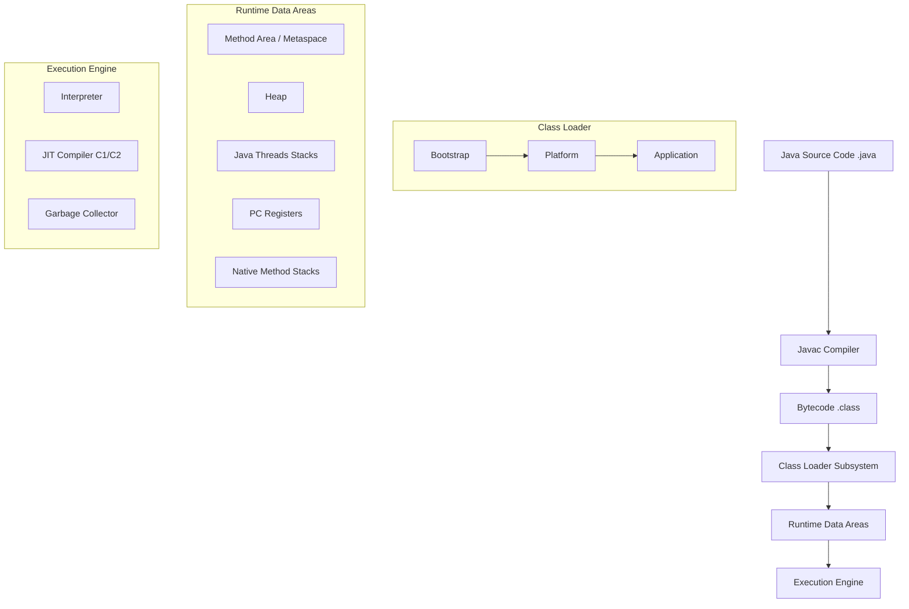

# OCP Java SE 25 (1Z0-831): THE ULTIMATE MASTER HANDBOOK

> [!CAUTION]
> Tài liệu này được biên soạn ở cấp độ Principal Architect. Nó bao gồm kiến thức nội tại của JVM, bytecode, chi tiết cấu trúc bộ nhớ và các quy tắc biên dịch khắt khe nhất của Java 25.

---

## PHẦN 1: BẢN ĐỒ KIẾN TRÚC JVM VÀ MÔ HÌNH BỘ NHỚ (JVM & MEMORY INTERNALS)

### 1.1 Chi tiết cấu trúc JVM

Kiến trúc Java Virtual Machine chia làm 3 thành phần chính: **Class Loader Subsystem**, **Runtime Data Areas**, và **Execution Engine**.



- **PC Registers**: Lưu địa chỉ của lệnh bytecode đang thực thi cho thread hiện tại (không áp dụng cho native methods).
- **JVM Stacks**: Lưu trữ Local Variables, Operand Stack, Frame Data. Mỗi method invocation tạo một stack frame mới.
- **Native Method Stacks**: Dùng cho các hàm C/C++ gọi qua JNI.
- **Heap**: Lưu trữ toàn bộ objects/arrays. Từ Java 21+, Heap có thể dùng Compact Object Headers (JEP 450) để tiết kiệm memory.
- **Metaspace (Method Area)**: Chứa class metadata, constant pool, method bytecode. Chạy trên native memory, không thuộc Heap.

### 1.2 Cơ chế Garbage Collection (Java 21-25)

> [!TIP]
> Java 21 đưa Generational ZGC thành chuẩn mực mới cho low-latency (dưới 1ms pause time). Java 25 tiếp tục tối ưu Shenandoah và ZGC.

| GC Algorithm | Cơ chế hoạt động | Ưu điểm | Nhược điểm |
|--------------|-----------------|----------|-------------|
| **G1 GC** (Default) | Chia heap thành các Regions (Eden, Survivor, Old, Humongous). GC gom rác ở các region có nhiều rác nhất trước (Garbage-First). | Balance giữa throughput và latency. | Không đạt sub-millisecond pause. |
| **ZGC** (Generational) | Concurrent, single-generation (trước 21), Generational (từ 21+). Dùng Colored Pointers và Load Barriers. | Sub-millisecond pause time, xử lý heap từ 8MB - 16TB. | CPU overhead cao hơn G1. |
| **Shenandoah** | Concurrent compaction, dùng Brooks Pointers/Forwarding Pointers. | Tương đương ZGC, tối ưu cho OpenJDK. | Yêu cầu cấu hình phức tạp hơn chút. |

### 1.3 Vòng đời nạp Class

1. **Loading**: ClassLoader nạp bytecode từ file `.class`.
2. **Linking**:
   - **Verification**: Xác minh bytecode đúng chuẩn (không over/underflow stack, đúng type).
   - **Preparation**: Cấp phát memory cho `static` fields và gán giá trị mặc định (`0`, `null`, `false`).
   - **Resolution**: Thay thế symbolic references bằng direct references trong constant pool.
3. **Initialization**: Thực thi khối `static {}` và gán giá trị khởi tạo thực sự cho `static` fields.

### 1.4 So sánh chi tiết Bytecode

```java
class BytecodeDemo {
    private void privateMethod() {}
    public void publicMethod() {}
    public static void staticMethod() {}
}
```
- `invokevirtual`: Gọi instance method (virtual method dispatch), dựa vào runtime type (polymorphism).
- `invokestatic`: Gọi static method. Cố định lúc compile.
- `invokespecial`: Gọi constructor `<init>`, `private` methods, `super.method()`. Cố định lúc compile, không đa hình.
- `invokeinterface`: Gọi method qua interface. Chậm hơn `invokevirtual` do phải tìm trong itable (interface method table).
- `invokedynamic`: Hỗ trợ dynamic typing và Lambda expressions (tạo ra CallSite).

---

## PHẦN 2: BÁCH KHOA TOÀN THƯ CÁC QUY TẮC BIÊN DỊCH & CẠM BẪY

### 2.1 Bảng tra cứu Hợp lệ vs Lỗi Biên Dịch

| Tình huống | Kết quả | Lý do |
|------------|----------|-------|
| Override method với return type là subclass (Covariant) | HỢP LỆ | Return type hẹp hơn an toàn. Ví dụ cha trả `Number`, con trả `Integer`. |
| Override method quăng Exception mới (Checked) | LỖI BIÊN DỊCH | Kẻ gọi qua cha không bắt được. Trừ phi quăng Unchecked/RuntimeException (HỢP LỆ). |
| Static method override instance method | LỖI BIÊN DỊCH | Không thể override instance bằng static và ngược lại. |
| Static method ẩn static method (Hiding) | HỢP LỆ | Gọi là Method Hiding, phụ thuộc vào type của reference lúc compile. |
| Giảm tính đóng gói (VD: protected -> default) | LỖI BIÊN DỊCH | Override không được phép thu hẹp quyền truy cập (Weaker access privilege). |

### 2.2 Flexible Constructor Bodies (JEP 482 - Java 22-25)

> [!NOTE]
> Trước Java 22, `super()` hoặc `this()` PHẢI là lệnh đầu tiên trong constructor. Từ JEP 482 (Preview Java 22, chuẩn hoá Java 25), bạn được phép chạy code **trước** `super()` miễn là không truy cập vào instance hiện tại (`this`).

```java
public class PositiveBigInteger extends BigInteger {
    public PositiveBigInteger(long value) {
        // HỢP LỆ trong Java 25: Kiểm tra tham số trước khi gọi super()
        if (value <= 0) {
            throw new IllegalArgumentException("Must be positive");
        }
        // Khởi tạo các biến cục bộ
        long absolute = Math.abs(value);
        super(String.valueOf(absolute)); // Gọi constructor cha
        
        // LỖI BIÊN DỊCH (nếu đặt TRƯỚC super):
        // System.out.println(this); // Cannot reference 'this' before supertype constructor has been called
    }
}
```

### 2.3 Records & Sealed Classes

**Records:** Bất biến (Immutable), các fields đều `private final`. Tự generate `equals`, `hashCode`, `toString`, getter (không có `get` prefix).
- **Compact Constructor**: Không cần dấu `()`.
- **Lỗi phổ biến**: Kế thừa (extends) - Lỗi vì record ngầm extends `java.lang.Record`. Khai báo instance fields - Lỗi, chỉ cho phép static.

**Sealed Classes:**
```java
public sealed interface Shape permits Circle, Square {}
public final class Circle implements Shape {} // Phải có final, sealed hoặc non-sealed
public non-sealed class Square implements Shape {} // non-sealed mở lại hệ thống kế thừa
```

### 2.4 Pattern Matching & Switch

```java
Object obj = "Hello Java 25";

// Dominance Trap
switch (obj) {
    case CharSequence c -> System.out.println("Seq: " + c);
    case String s -> System.out.println("String: " + s); // LỖI BIÊN DỊCH: Dominance, case này không bao giờ đạt tới do CharSequence đã bắt trước.
    default -> {}
}

// Record deconstruction & Guard (when)
record Point(int x, int y) {}
static void print(Object o) {
    switch (o) {
        case Point(int x, int y) when x == y -> System.out.println("On diagonal");
        case Point(int x, int y) -> System.out.println("Normal point");
        default -> {}
    }
}
```

---

## PHẦN 3: ĐÀO SÂU CORE APIS & FUNCTIONAL PROGRAMMING

### 3.1 HashMap Internals

- Mặc định khởi tạo `capacity = 16`, `loadFactor = 0.75`.
- **Xung đột (Collision)**: Lưu dưới dạng LinkedList. Khi một bucket có > 8 elements và capacity >= 64, chuyển thành Red-Black Tree (O(log n)).
- **Bucket Index**: `(n - 1) & hash` thay vì `hash % n` để tăng tốc. (Yêu cầu `n` là lũy thừa của 2).

### 3.2 Generic Type System

- **Type Erasure**: Ở runtime, `List<String>` và `List<Integer>` đều là `List`. Type parameters bị xóa (erased) thành `Object` (hoặc bound type).
- **Bridge Methods**: Compiler tự sinh ra để duy trì đa hình khi generic type được cụ thể hóa trong lớp con.
- **PECS (Producer Extends, Consumer Super)**:
  - Dùng `? extends T` khi đọc dữ liệu (Producer).
  - Dùng `? super T` khi ghi dữ liệu (Consumer).

### 3.3 Stream Gatherers (JEP 485 - Java 22-25)

> [!IMPORTANT]
> Gatherer mở rộng `Stream` API, cho phép các custom intermediate operations mà trước đây không thể thực hiện.

```java
import java.util.stream.Gatherers;

List<Integer> list = List.of(1, 2, 3, 4, 5, 6);
// Chia thành các cửa sổ trượt (sliding windows)
List<List<Integer>> windows = list.stream()
    .gather(Gatherers.windowSliding(3))
    .toList();
// Output: [[1, 2, 3], [2, 3, 4], [3, 4, 5], [4, 5, 6]]
```

---

## PHẦN 4: ĐỒNG THỜI, I/O VÀ JAVA 22-25

### 4.1 Java Memory Model (JMM)

- **volatile**: Cấm instruction reordering, ép thread đọc/ghi trực tiếp từ Main Memory (bỏ qua cache). Không đảm bảo atomicity (như `i++`).
- **CAS (Compare-And-Swap)**: Cơ chế lõi của `java.util.concurrent.atomic`.

### 4.2 Virtual Threads (JEP 444, tối ưu tới 25)

Virtual Threads là user-mode threads do JVM quản lý thay vì OS. Nhẹ (vài trăm byte).
- **Carrier Thread**: Platform thread chạy Virtual thread.
- **Pinning**: Khi Virtual thread chạy code bên trong `synchronized` block hoặc gọi native method (JNI), nó "ghim" (pin) vào Carrier Thread, cản trở Carrier Thread chạy Virtual thread khác. Giải pháp: dùng `ReentrantLock` thay vì `synchronized`.

### 4.3 Structured Concurrency & Scoped Values

> [!TIP]
> Java 25 đưa Structured Concurrency (JEP 505) và Scoped Values (JEP 487) vào ổn định.

```java
// Structured Concurrency
try (var scope = new StructuredTaskScope.ShutdownOnFailure()) {
    Supplier<String> user = scope.fork(() -> fetchUser());
    Supplier<Integer> orders = scope.fork(() -> fetchOrders());
    
    scope.join(); // Đợi tất cả
    scope.throwIfFailed(); // Ném exception nếu bất kỳ thread nào fail
    
    // Kết quả an toàn
    System.out.println(user.get() + " has " + orders.get() + " orders");
}
```

**Scoped Values** thay thế `ThreadLocal` cho Virtual Threads. Chúng immutable, scope theo block, tránh memory leak và có hiệu năng cao hơn `ThreadLocal` khi kế thừa xuống con.

### 4.4 JPMS (Java Platform Module System)

```java
module com.myapp.core {
    requires java.logging;             // Cần module này
    requires transitive com.myapp.api; // Bất cứ ai require core cũng sẽ require api
    exports com.myapp.core.utils;      // Cho phép module khác import
    opens com.myapp.core.reflection;   // Mở cho Reflection (vd: Hibernate/Spring)
    uses com.myapp.api.Plugin;         // Dùng ServiceLoader để tìm implement
    provides com.myapp.api.Plugin with com.myapp.core.MyPlugin; // Cung cấp implement
}
```
Mới ở Java 23/24/25: Module Import declarations (`import module java.base;`) cho phép import toàn bộ public classes từ module.

---
*Tài liệu được thiết kế cho việc chuẩn bị chứng chỉ 1Z0-831. Vui lòng luyện tập với jshell hoặc bộ IDE tiêu chuẩn Java 25 để nắm vững.*
