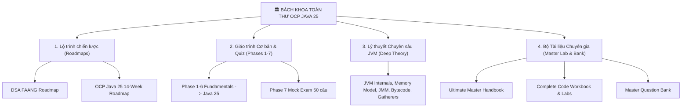

# 🏛️ BÁCH KHOA TOÀN THƯ OCP JAVA SE 25 (1Z0-831) & DSA ROADMAP

> **Tổng quy mô**: 18 tài liệu chuyên khảo | **~7,336 dòng nội dung** | **210+ câu hỏi trắc nghiệm & tình huống**  
> **Ngôn ngữ**: Tiếng Việt (Thuật ngữ chuyên ngành Tiếng Anh chuẩn Quốc Tế) | **Code**: Java 25

---

## 🧭 CẤU TRÚC 4 TRỤ CỘT TÀI LIỆU

---

## 📚 1. LỘ TRÌNH CHIẾN LƯỢC & TỔNG QUAN

| Tài liệu | File | Quy mô | Nội dung chính |
|---|---|---|---|
| 🗺️ **OCP Java 25 Master Roadmap** | [ocp-java25-roadmap](reader.html?s=java&d=roadmap/ocp-java25-roadmap) | 886 dòng | Phân tích 14 domain, trọng số đề thi, lịch học 14 tuần, chiến thuật làm bài, tài liệu sách/Enthuware |
| 🗺️ **DSA FAANG Roadmap** | [dsa-roadmap](reader.html?s=dsa&d=roadmap/dsa-roadmap) | 317 dòng | Lộ trình 16 tuần, 150 bài LeetCode chọn lọc (NeetCode 150), các pattern Two Pointers, Sliding Window, DP, Graph |

---

## 📕 2. GIÁO TRÌNH TỪNG PHASE & TRẮC NGHIỆM TIÊU CHUẨN

| Phase | File tài liệu | Số dòng | Trọng tâm kiến thức | Bài tập Quiz |
|---|---|---|---|---|
| **Phase 1** | [phase1-java-fundamentals](reader.html?s=java&d=core/phase1-java-fundamentals) | 409 dòng | 8 Primitives, Integer Cache (-128..127), String Pool, Text Blocks, `var`, Operators, Switch | 15 câu |
| **Phase 2** | [phase2-oop-class-design](reader.html?s=java&d=core/phase2-oop-class-design) | 482 dòng | Class design, Constructor Chaining, Records, Sealed Classes, Pattern Matching, Enums | 15 câu |
| **Phase 3** | [phase3-core-apis](reader.html?s=java&d=collections-streams/phase3-core-apis) | 487 dòng | Arrays, Collections Framework, Generics Wildcards, Date/Time API, Comparable/Comparator | 15 câu |
| **Phase 4** | [phase4-functional-programming](reader.html?s=java&d=collections-streams/phase4-functional-programming) | 441 dòng | Lambda syntax, Stream API (Intermediate & Terminal), Collectors, Optional, Primitive Streams | 15 câu |
| **Phase 5** | [phase5-advanced-topics](reader.html?s=java&d=concurrency/phase5-advanced-topics) | 330 dòng | Exceptions (Suppressed), Java I/O & NIO.2, Concurrency, Virtual Threads, JDBC, Modules (JPMS) | 15 câu |
| **Phase 6** | [phase6-java22-25-new-features](reader.html?s=java&d=new-features/phase6-java22-25-new-features) | 449 dòng | Flexible Constructors (JEP 482), Instance Main, Unnamed `_`, Module Imports, Gatherers, Scoped Values | 15 câu |
| **Phase 7** | [phase7-mock-exam](reader.html?s=java&d=master/phase7-mock-exam) | 287 dòng | Chiến thuật phân bổ thời gian, nhận diện bẫy biên dịch & **Đề thi thử đầy đủ** | **50 câu** |

---

## 🧠 3. LÝ THUYẾT CHUYÊN SÂU JVM & CƠ CHẾ NỘI BỘ (DEEP THEORY)

| Phase | File tài liệu chuyên sâu | Số dòng | Nội dung đi sâu vào tầng hệ thống & Bytecode | Quiz nâng cao |
|---|---|---|---|---|
| **Phase 1 Deep** | [phase1-deep-theory](reader.html?s=java&d=core/phase1-deep-theory) | 373 dòng | JVM Memory Layout (Stack Frames, Heap), String Compact UTF-16 vs Latin1, JLS Promotion, Bytecode Switch | 10 câu |
| **Phase 2 Deep** | [phase2-deep-theory](reader.html?s=java&d=core/phase2-deep-theory) | 512 dòng | Class Loading (Verify, Prepare, Resolve), Dynamic Method Dispatch (vtable), Record Bytecode, Sealed Algebra | 10 câu |
| **Phase 3 Deep** | [phase3-deep-theory](reader.html?s=java&d=collections-streams/phase3-deep-theory) | 296 dòng | HashMap internals (Treeify threshold, `hash & (n-1)`), Type Erasure, Bridge Methods, DST Gap/Overlap | 10 câu |
| **Phase 4 Deep** | [phase4-deep-theory](reader.html?s=java&d=collections-streams/phase4-deep-theory) | 414 dòng | Lambda `invokedynamic` + LambdaMetafactory, Spliterator engine, Custom Collector implementation, Fork/Join | 10 câu |
| **Phase 5 Deep** | [phase5-deep-theory](reader.html?s=java&d=concurrency/phase5-deep-theory) | 378 dòng | Java Memory Model (Happens-Before), CAS, Virtual Threads Carrier Pinning, Serialization Security | 10 câu |
| **Phase 6 Deep** | [phase6-deep-theory](reader.html?s=java&d=new-features/phase6-deep-theory) | 411 dòng | Gatherer API architecture (Initializer, Integrator, Combiner, Finisher), Scoped Values vs ThreadLocal | 10 câu |

---

## 👑 4. BỘ TÀI LIỆU CHUYÊN GIA (MASTER LAB & QUESTION BANK)

| Tài liệu đặc biệt | File | Số dòng | Nội dung vượt trội |
|---|---|---|---|
| 📖 **OCP Java 25 Ultimate Master Handbook** | [ocp-java25-ultimate-handbook](reader.html?s=java&d=master/ocp-java25-ultimate-handbook) | 239 dòng | Bách khoa toàn thư tổng hợp: Kiến trúc JVM (GC Algorithms, Bytecode instructions), Bảng tra cứu 50+ cạm bẫy biên dịch JLS, Collections Memory Layout, Stream Gatherers & Concurrency. |
| 💻 **Java 25 Complete Code Workbook & Execution Lab** | [java25-complete-code-workbook](reader.html?s=java&d=master/java25-complete-code-workbook) | 292 dòng | 20+ phòng Lab thực chiến với mã nguồn hoàn chỉnh, sơ đồ biến từng bước (step-by-step memory trace), output thực tế và giải thích bytecode bên dưới. |
| 🎯 **Master Question Bank (Ultra-Hard Scenario Bank)** | [ocp-java25-master-question-bank](reader.html?s=java&d=master/ocp-java25-master-question-bank) | 239 dòng | Ngân hàng câu hỏi tình huống cấp độ khó nhất kèm phân tích bẫy biên dịch và giải thích chi tiết từng dòng mã nguồn. |

---

## 📈 TỔNG KẾT TÀI NGUYÊN ÔN LUYỆN

- 📝 **Tổng số bài thi trắc nghiệm & tình huống**: **210+ câu hỏi**
  + 90 câu trắc nghiệm tiêu chuẩn (Phases 1–6)
  + 60 câu trắc nghiệm chuyên sâu (Phases 1–6 Deep Theory)
  + 50 câu Mock Exam toàn diện (Phase 7)
  + 10+ câu tình huống Master Blueprint (Master Question Bank)
- 💡 **Tổng dòng code & lý thuyết**: **7,336 dòng** tài liệu chi tiết, không rút gọn, có giải thích bytecode và mô hình bộ nhớ.
