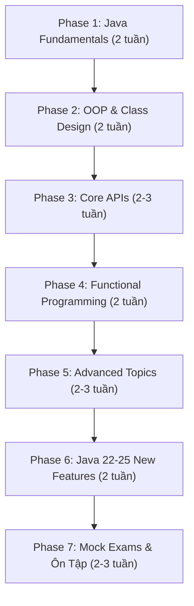
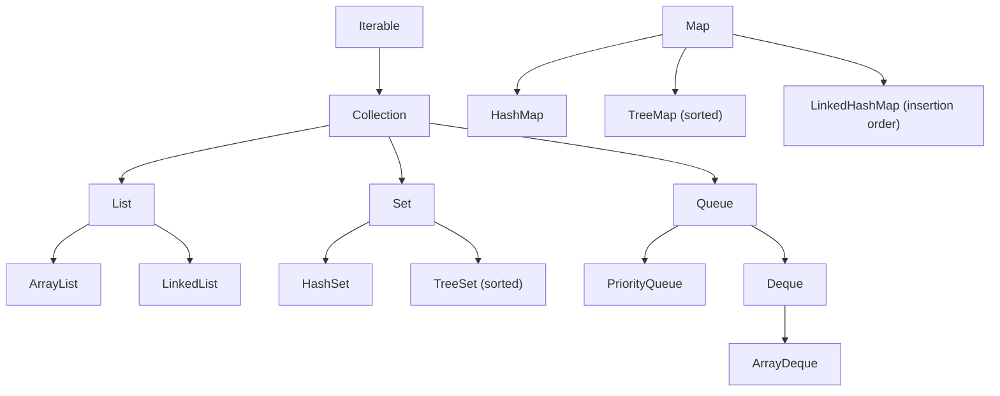
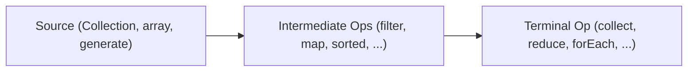

# 📜 Lộ Trình OCP Java SE 25 Developer — Exam 1Z0-831

> **Chứng chỉ**: Oracle Certified Professional: Java SE 25 Developer
> **Mã đề**: 1Z0-831
> **Số câu hỏi**: 50 (multiple-choice & scenario-based)
> **Thời gian**: 120 phút
> **Điểm đạt**: 68% (≥ 34/50 câu đúng)
> **Phí thi**: ~\$245 USD
> **Thời gian chuẩn bị**: 3–4 tháng (2–3 giờ/ngày)

---

## 📋 Tổng Quan Lộ Trình



---

## 🎯 Exam Objectives — Tổng Quan Các Domain

| # | Domain | Trọng số ước tính | Ưu tiên |
|---|---|---|---|
| 1 | Handling Date, Time, Text, Numeric, Boolean Values | ~8% | 🟡 |
| 2 | Controlling Program Flow | ~8% | 🟡 |
| 3 | Java OOP (Classes, Interfaces, Enums, Records) | ~12% | 🔴 |
| 4 | Exception Handling | ~6% | 🟡 |
| 5 | Working with Arrays & Collections | ~10% | 🔴 |
| 6 | Streams & Lambda Expressions | ~12% | 🔴 |
| 7 | Java I/O API | ~6% | 🟡 |
| 8 | JDBC | ~4% | 🟢 |
| 9 | Concurrency & Multithreading | ~10% | 🔴 |
| 10 | Localization | ~4% | 🟢 |
| 11 | Modules (JPMS) | ~6% | 🟡 |
| 12 | Sealed Classes & Pattern Matching | ~6% | 🔴 |
| 13 | Records & Advanced OOP | ~4% | 🟡 |
| 14 | **Java 22–25 New Features** | ~4–6% | 🔴 |

> [!IMPORTANT]
> Trọng số ước tính dựa trên phân tích các kỳ thi OCP trước đó và thông tin từ Enthuware/Selikoff. Oracle không công bố trọng số chính xác, nhưng **OOP, Streams, Concurrency** luôn là 3 domain chiếm nhiều câu hỏi nhất.

---

## Phase 1: Java Fundamentals (2 tuần)

### 1.1 Data Types & Variables

| Chủ đề | Chi tiết cần nắm | Mức trap question |
|---|---|---|
| Primitive types | 8 kiểu (byte, short, int, long, float, double, char, boolean), giới hạn giá trị | ⚠️ Cao |
| Wrapper classes | Autoboxing/Unboxing, `Integer.valueOf()` caching (-128 to 127) | ⚠️ Cao |
| Type Casting | Widening vs Narrowing, implicit vs explicit, overflow behavior | ⚠️ Rất cao |
| `var` (LVTI) | Local Variable Type Inference — khi nào được/không được dùng | ⚠️ Trung bình |
| Text Blocks | `"""..."""`, escaping, indentation, trailing whitespace | ⚠️ Trung bình |
| String Pool | `==` vs `.equals()`, `intern()`, immutability | ⚠️ Cao |

**Bài tập thực hành:**
```java
// Câu hỏi điển hình — output là gì?
Integer a = 127, b = 127;
Integer c = 128, d = 128;
System.out.println(a == b);   // ?
System.out.println(c == d);   // ?

// Text block indentation
String text = """
        Hello
    World
        """;
// Bao nhiêu leading spaces?
```

### 1.2 Operators & Control Flow

| Chủ đề | Chi tiết cần nắm |
|---|---|
| Operator precedence | Thứ tự ưu tiên toán tử, đặc biệt `&&` vs `\|\|` vs `&` vs `\|` |
| Switch expressions | Arrow syntax `->`, `yield`, exhaustiveness |
| Pattern matching in switch | `case Integer i`, guarded patterns `when` |
| Loop constructs | `for`, enhanced `for`, `while`, `do-while`, break/continue with labels |

> [!WARNING]
> **Trap phổ biến**: Switch expressions PHẢI exhaustive (cover tất cả cases). Thiếu `default` khi switch trên `int` → **compilation error**.

---

## Phase 2: OOP & Class Design (2 tuần)

### 2.1 Core OOP

| Chủ đề | Chi tiết | Trap level |
|---|---|---|
| Constructors | Chaining, `this()`, `super()`, default constructor | ⚠️ Rất cao |
| **Flexible Constructor Bodies** 🆕 | Statements TRƯỚC `super()`/`this()` (Java 22+) | ⚠️ Cao |
| Inheritance | Method overriding rules, covariant return types | ⚠️ Cao |
| Polymorphism | Runtime vs compile-time, virtual method invocation | ⚠️ Cao |
| Abstract classes vs Interfaces | `default` methods, `static` methods, `private` methods in interfaces | ⚠️ Trung bình |
| Access modifiers | `private`, package-private, `protected`, `public` — khi nào accessible | ⚠️ Cao |

### 2.2 Records

```java
// Record — compact, immutable data carrier
public record Point(int x, int y) {
    // Compact constructor (validation)
    public Point {
        if (x < 0 || y < 0) throw new IllegalArgumentException();
    }
    
    // Custom method
    public double distanceTo(Point other) {
        return Math.sqrt(Math.pow(x - other.x, 2) + Math.pow(y - other.y, 2));
    }
}
```

**Quy tắc quan trọng của Record:**
- ❌ Không thể `extends` class khác (implicitly extends `java.lang.Record`)
- ✅ Có thể `implements` interfaces
- ❌ Không thể có instance fields ngoài components
- ✅ Có thể có static fields, static methods, instance methods
- ✅ Compact constructor không có tham số `()`
- ✅ Tự động có `equals()`, `hashCode()`, `toString()`

### 2.3 Sealed Classes & Interfaces

```java
public sealed interface Shape permits Circle, Rectangle, Triangle {}

public final class Circle implements Shape { /*...*/ }
public non-sealed class Rectangle implements Shape { /*...*/ }
public sealed class Triangle implements Shape permits EquilateralTriangle {/*...*/}
public final class EquilateralTriangle extends Triangle { /*...*/ }
```

**Quy tắc:**
- Permitted subclass PHẢI: `final`, `sealed`, hoặc `non-sealed`
- Permitted subclass PHẢI nằm trong cùng module (hoặc cùng package nếu unnamed module)
- Switch trên sealed type có thể exhaustive mà KHÔNG cần `default`

### 2.4 Pattern Matching

```java
// instanceof pattern matching
if (obj instanceof String s && s.length() > 5) {
    System.out.println(s.toUpperCase());
}

// Switch pattern matching
String describe(Shape shape) {
    return switch (shape) {
        case Circle c    -> "Circle r=" + c.radius();
        case Rectangle r -> "Rect " + r.width() + "x" + r.height();
        case Triangle t  -> "Triangle";
    };
    // Không cần default vì Shape là sealed!
}

// Record pattern (deconstruction)
if (obj instanceof Point(int x, int y)) {
    System.out.println("x=" + x + ", y=" + y);
}

// Guarded pattern
case Integer i when i > 0 -> "positive";
```

### 2.5 Nested Classes

| Loại | Static? | Access outer? | Khởi tạo |
|---|---|---|---|
| Static nested class | ✅ | Chỉ static members | `new Outer.Inner()` |
| Inner class (non-static) | ❌ | Tất cả members | `outer.new Inner()` |
| Local class | ❌ | Effectively final vars | Trong method |
| Anonymous class | ❌ | Effectively final vars | Inline |

---

## Phase 3: Core APIs (2–3 tuần)

### 3.1 String & StringBuilder

| Method | String | StringBuilder | Lưu ý |
|---|---|---|---|
| `charAt(int)` | ✅ | ✅ | IndexOutOfBoundsException |
| `substring(int, int)` | ✅ | ✅ | endIndex exclusive |
| `indexOf(String)` | ✅ | ✅ | Returns -1 if not found |
| `replace(...)` | ✅ | ✅ | String: returns new; SB: mutates |
| `strip()` / `trim()` | ✅ | ❌ | `strip()` handles Unicode whitespace |
| `indent(int)` | ✅ | ❌ | Thêm/bớt leading spaces |
| `stripIndent()` | ✅ | ❌ | Dùng với text blocks |
| `formatted(...)` | ✅ | ❌ | Như `String.format()` nhưng instance method |

### 3.2 Date & Time API (`java.time`)

| Class | Mô tả | Ví dụ |
|---|---|---|
| `LocalDate` | Ngày (không có giờ, không timezone) | `2026-08-31` |
| `LocalTime` | Giờ (không có ngày) | `14:30:00` |
| `LocalDateTime` | Ngày + Giờ (không timezone) | `2026-08-31T14:30:00` |
| `ZonedDateTime` | Ngày + Giờ + Timezone | `2026-08-31T14:30+07:00[Asia/Ho_Chi_Minh]` |
| `Instant` | Thời điểm chính xác trên timeline (UTC) | `2026-08-31T07:30:00Z` |
| `Duration` | Khoảng thời gian (giờ/phút/giây) | `PT2H30M` |
| `Period` | Khoảng thời gian (năm/tháng/ngày) | `P1Y2M3D` |
| `DateTimeFormatter` | Format/parse | `ofPattern("dd/MM/yyyy")` |

> [!CAUTION]
> `LocalDate`, `LocalTime`, `LocalDateTime` đều **immutable**. Các method như `plusDays()`, `withMonth()` đều trả về **object mới**. Quên assign lại = bug kinh điển trong đề thi.

```java
LocalDate date = LocalDate.of(2026, 1, 31);
date.plusMonths(1);          // KHÔNG thay đổi date!
date = date.plusMonths(1);   // Đúng → 2026-02-28
```

### 3.3 Arrays & Collections

**Collections Framework — Key interfaces:**



**Các method Map quan trọng (hay ra đề):**

```java
Map<String, Integer> map = new HashMap<>();

// Merge — combine values
map.merge("key", 1, Integer::sum);

// computeIfAbsent — lazy init
map.computeIfAbsent("key", k -> new ArrayList<>()).add("value");

// computeIfPresent — update existing
map.computeIfPresent("key", (k, v) -> v + 1);

// getOrDefault
map.getOrDefault("missing", 0);

// replaceAll
map.replaceAll((k, v) -> v * 2);
```

**Comparable vs Comparator:**

```java
// Comparable — natural ordering (trong chính class)
record Student(String name, int age) implements Comparable<Student> {
    public int compareTo(Student other) {
        return Integer.compare(this.age, other.age);
    }
}

// Comparator — external ordering
Comparator<Student> byName = Comparator.comparing(Student::name)
    .thenComparingInt(Student::age)
    .reversed();
```

### 3.4 Generics

| Concept | Syntax | Khi nào dùng |
|---|---|---|
| Upper bound | `<? extends Animal>` | Read (producer) — PECS: Producer Extends |
| Lower bound | `<? super Dog>` | Write (consumer) — PECS: Consumer Super |
| Unbounded | `<?>` | Chỉ đọc, chấp nhận mọi type |
| Type erasure | — | Compile-time check → runtime `Object` |

> [!TIP]
> **PECS** (Producer Extends, Consumer Super) — quy tắc vàng cho wildcards. Nếu chỉ **đọc** từ collection → `extends`. Nếu **ghi** vào → `super`.

---

## Phase 4: Functional Programming (2 tuần)

### 4.1 Functional Interfaces & Lambda

| Interface | Method | Mô tả | Ví dụ |
|---|---|---|---|
| `Predicate<T>` | `boolean test(T)` | Kiểm tra điều kiện | `s -> s.length() > 5` |
| `Function<T,R>` | `R apply(T)` | Chuyển đổi T → R | `String::length` |
| `Consumer<T>` | `void accept(T)` | Xử lý, không trả về | `System.out::println` |
| `Supplier<T>` | `T get()` | Cung cấp, không nhận | `() -> new ArrayList<>()` |
| `UnaryOperator<T>` | `T apply(T)` | T → T | `String::toUpperCase` |
| `BinaryOperator<T>` | `T apply(T,T)` | (T,T) → T | `Integer::sum` |
| `BiFunction<T,U,R>` | `R apply(T,U)` | (T,U) → R | `String::substring` |
| `BiPredicate<T,U>` | `boolean test(T,U)` | Kiểm tra 2 tham số | `String::startsWith` |

**Chaining Functional Interfaces:**
```java
Predicate<String> notEmpty = s -> !s.isEmpty();
Predicate<String> startsWithA = s -> s.startsWith("A");

// Compose
Predicate<String> combined = notEmpty.and(startsWithA);

Function<String, String> trim = String::trim;
Function<String, String> upper = String::toUpperCase;
Function<String, String> pipeline = trim.andThen(upper);
```

### 4.2 Stream API — Mastery Level

**Stream Pipeline:**



**Intermediate Operations (Lazy):**

| Operation | Type | Ví dụ |
|---|---|---|
| `filter` | `Stream<T>→Stream<T>` | `.filter(s -> s.length() > 3)` |
| `map` | `Stream<T>→Stream<R>` | `.map(String::toUpperCase)` |
| `flatMap` | `Stream<T>→Stream<R>` | `.flatMap(Collection::stream)` |
| `distinct` | `Stream<T>→Stream<T>` | `.distinct()` |
| `sorted` | `Stream<T>→Stream<T>` | `.sorted(Comparator.reverseOrder())` |
| `peek` | `Stream<T>→Stream<T>` | `.peek(System.out::println)` |
| `limit` / `skip` | `Stream<T>→Stream<T>` | `.limit(5).skip(2)` |
| `mapToInt/Long/Double` | `Stream<T>→IntStream...` | `.mapToInt(String::length)` |
| `takeWhile` / `dropWhile` | `Stream<T>→Stream<T>` | `.takeWhile(x -> x < 5)` |

**Terminal Operations:**

| Operation | Return type | Ví dụ |
|---|---|---|
| `forEach` | `void` | `.forEach(System.out::println)` |
| `collect` | `R` | `.collect(Collectors.toList())` |
| `toList()` | `List<T>` (unmodifiable) | `.toList()` |
| `reduce` | `Optional<T>` or `T` | `.reduce(0, Integer::sum)` |
| `count` | `long` | `.count()` |
| `min` / `max` | `Optional<T>` | `.min(Comparator.naturalOrder())` |
| `findFirst` / `findAny` | `Optional<T>` | `.findFirst()` |
| `allMatch/anyMatch/noneMatch` | `boolean` | `.anyMatch(String::isEmpty)` |

**Collectors nâng cao (HAY RA ĐỀ):**

```java
// groupingBy
Map<String, List<Student>> byCity = students.stream()
    .collect(Collectors.groupingBy(Student::city));

// groupingBy + downstream collector
Map<String, Long> countByCity = students.stream()
    .collect(Collectors.groupingBy(Student::city, Collectors.counting()));

Map<String, Double> avgAgeByCity = students.stream()
    .collect(Collectors.groupingBy(Student::city,
        Collectors.averagingInt(Student::age)));

// partitioningBy
Map<Boolean, List<Student>> partition = students.stream()
    .collect(Collectors.partitioningBy(s -> s.age() >= 18));

// toMap
Map<String, Integer> nameToAge = students.stream()
    .collect(Collectors.toMap(Student::name, Student::age,
        (v1, v2) -> v1));  // merge function cho duplicate keys

// joining
String names = students.stream()
    .map(Student::name)
    .collect(Collectors.joining(", ", "[", "]"));

// teeing (combine 2 collectors)
var result = students.stream()
    .collect(Collectors.teeing(
        Collectors.minBy(Comparator.comparingInt(Student::age)),
        Collectors.maxBy(Comparator.comparingInt(Student::age)),
        (min, max) -> "Youngest: " + min + ", Oldest: " + max
    ));
```

### 4.3 Optional

```java
Optional<String> opt = Optional.ofNullable(getValue());

// ✅ Correct usage
opt.ifPresent(System.out::println);
opt.ifPresentOrElse(System.out::println, () -> System.out.println("empty"));
String result = opt.orElse("default");
String result2 = opt.orElseGet(() -> computeDefault());
String result3 = opt.orElseThrow(); // NoSuchElementException
opt.map(String::toUpperCase).filter(s -> s.length() > 3).ifPresent(...);

// ❌ Anti-patterns (thi hay bẫy)
opt.get();                    // Tránh — throws NoSuchElementException
if (opt.isPresent()) {...}    // Code smell — dùng ifPresent() thay thế
Optional.of(null);            // NullPointerException!
```

---

## Phase 5: Advanced Topics (2–3 tuần)

### 5.1 Exception Handling

```java
// Multi-catch — exceptions KHÔNG được có quan hệ kế thừa
try {
    // risky code
} catch (IOException | SQLException e) {
    // e là effectively final → không thể reassign
    logger.error(e.getMessage());
}

// try-with-resources
try (var reader = new BufferedReader(new FileReader("file.txt"));
     var writer = new BufferedWriter(new FileWriter("out.txt"))) {
    // resources auto-closed in reverse order
} // Suppressed exceptions nếu cả try và close đều throw
```

> [!WARNING]
> **Trap**: Trong `try-with-resources`, nếu cả `try` block và `close()` đều throw exception → exception từ `close()` trở thành **suppressed exception** (lấy bằng `getSuppressed()`). Đề thi hay hỏi thứ tự close và suppressed exceptions.

### 5.2 Concurrency & Multithreading

| Concept | Class/Interface | Ghi chú |
|---|---|---|
| Creating threads | `Thread`, `Runnable`, `Callable<V>` | `Callable` trả về giá trị |
| Thread pool | `ExecutorService`, `Executors` | `newFixedThreadPool()`, `newCachedThreadPool()` |
| Future | `Future<V>` | `get()` blocks, `isDone()`, `cancel()` |
| Synchronization | `synchronized`, `Lock`, `ReentrantLock` | `Lock` linh hoạt hơn `synchronized` |
| Atomic classes | `AtomicInteger`, `AtomicReference` | Lock-free thread safety |
| Concurrent collections | `ConcurrentHashMap`, `CopyOnWriteArrayList` | Thread-safe collections |
| **Virtual Threads** 🆕 | `Thread.ofVirtual()`, `Thread.startVirtualThread()` | Lightweight, managed by JVM |
| Parallel streams | `.parallelStream()`, `.parallel()` | Cẩn thận side-effects & ordering |
| `CyclicBarrier` | `CyclicBarrier(int, Runnable)` | Đồng bộ N threads |

```java
// Virtual Threads (Java 21+)
try (var executor = Executors.newVirtualThreadPerTaskExecutor()) {
    IntStream.range(0, 10_000).forEach(i -> {
        executor.submit(() -> {
            Thread.sleep(Duration.ofSeconds(1));
            return i;
        });
    });
}
// ExecutorService implements AutoCloseable → auto shutdown
```

### 5.3 Java I/O

| Class | Purpose | Byte/Char |
|---|---|---|
| `FileInputStream` / `FileOutputStream` | Đọc/ghi byte | Byte |
| `BufferedInputStream` / `BufferedOutputStream` | Buffered byte I/O | Byte |
| `FileReader` / `FileWriter` | Đọc/ghi character | Char |
| `BufferedReader` / `BufferedWriter` | Buffered character I/O | Char |
| `ObjectInputStream` / `ObjectOutputStream` | Serialization | Byte |
| `PrintWriter` | Formatted text output | Char |

**NIO.2 (`java.nio.file`):**

```java
Path path = Path.of("data", "file.txt");   // hoặc Paths.get(...)

// Đọc file
List<String> lines = Files.readAllLines(path);
String content = Files.readString(path);
Stream<String> lazyLines = Files.lines(path); // lazy!

// Ghi file
Files.writeString(path, "content");
Files.write(path, List.of("line1", "line2"));

// File operations
Files.exists(path);
Files.isDirectory(path);
Files.copy(source, target, StandardCopyOption.REPLACE_EXISTING);
Files.move(source, target);
Files.delete(path);         // throws if not exists
Files.deleteIfExists(path); // returns boolean

// Walk directory
try (Stream<Path> walk = Files.walk(path, 3)) {
    walk.filter(Files::isRegularFile)
        .filter(p -> p.toString().endsWith(".java"))
        .forEach(System.out::println);
}

// Find files
try (Stream<Path> found = Files.find(path, 5,
        (p, attrs) -> attrs.isRegularFile() && p.toString().endsWith(".java"))) {
    found.forEach(System.out::println);
}
```

### 5.4 JDBC

```java
// Modern JDBC pattern
String url = "jdbc:mysql://localhost:3306/mydb";

try (Connection conn = DriverManager.getConnection(url, user, pass);
     PreparedStatement ps = conn.prepareStatement(
         "SELECT * FROM students WHERE age > ? AND city = ?")) {
    
    ps.setInt(1, 18);
    ps.setString(2, "Hanoi");
    
    try (ResultSet rs = ps.executeQuery()) {
        while (rs.next()) {
            String name = rs.getString("name");   // by column name
            int age = rs.getInt(2);                // by column index (1-based!)
        }
    }
}
```

> [!NOTE]
> JDBC trong OCP thi không quá sâu. Nắm vững: `Connection` → `PreparedStatement` → `ResultSet`, auto-close order, column index starts at **1** (không phải 0).

### 5.5 Localization

```java
// Locale
Locale locale = Locale.of("vi", "VN");  // Java 19+
Locale locale2 = new Locale.Builder()
    .setLanguage("vi").setRegion("VN").build();

// ResourceBundle
ResourceBundle rb = ResourceBundle.getBundle("messages", locale);
String greeting = rb.getString("welcome");

// NumberFormat
NumberFormat nf = NumberFormat.getCurrencyInstance(locale);
String price = nf.format(1000000); // "1.000.000 ₫"

// DateTimeFormatter with Locale
DateTimeFormatter dtf = DateTimeFormatter
    .ofLocalizedDate(FormatStyle.FULL)
    .withLocale(locale);
```

**Resource bundle loading order** (quan trọng, hay ra đề):
1. `messages_vi_VN.properties`
2. `messages_vi.properties`
3. `messages_en_US.properties` (default locale)
4. `messages_en.properties`
5. `messages.properties`

### 5.6 Modules (JPMS)

```java
// module-info.java
module com.myapp {
    requires java.sql;              // dependency
    requires transitive java.logging; // transitive dependency
    exports com.myapp.api;          // export package
    exports com.myapp.internal to com.myapp.tests; // qualified export
    opens com.myapp.model;          // reflection access
    provides com.myapp.spi.Plugin 
        with com.myapp.impl.MyPlugin; // service provider
    uses com.myapp.spi.Plugin;      // service consumer
}
```

| Directive | Mô tả |
|---|---|
| `requires` | Phụ thuộc vào module khác |
| `requires transitive` | Phụ thuộc + truyền cho module đọc module này |
| `exports` | Cho phép access package ở compile-time & runtime |
| `opens` | Cho phép reflection access (runtime only) |
| `provides...with` | Cung cấp implementation cho service |
| `uses` | Sử dụng service |

---

## Phase 6: Java 22–25 New Features 🆕 (2 tuần)

> [!IMPORTANT]
> Phần này là "delta" giữa OCP Java 21 (1Z0-830) và OCP Java 25 (1Z0-831). Nếu đã có kiến thức Java 21, tập trung vào phase này.

### 6.1 Flexible Constructor Bodies (JEP 482)

```java
public class Student extends Person {
    private final String studentId;
    
    public Student(String name, int age, String studentId) {
        // ✅ Java 25: Có thể viết code TRƯỚC super()
        if (name == null || name.isBlank()) {
            throw new IllegalArgumentException("Name required");
        }
        this.studentId = studentId;  // ✅ Assign own fields trước super()
        
        super(name, age);  // Gọi super() sau validation
    }
}
```

**Quy tắc:**
- ✅ Có thể validate arguments trước `super()`/`this()`
- ✅ Có thể assign `this.field` trước `super()`
- ❌ KHÔNG thể đọc `this.field` trước `super()` (field chưa fully initialized)
- ❌ KHÔNG thể gọi instance methods trước `super()`

### 6.2 Instance Main Methods & Compact Source Files (JEP 495/JEP 494)

```java
// Trước Java 25 — verbose
public class Hello {
    public static void main(String[] args) {
        System.out.println("Hello World");
    }
}

// Java 25 — Compact source file
void main() {
    println("Hello World");  // IO.println() auto-imported
}
```

**Launch protocol (thứ tự ưu tiên tìm main method):**
1. `static void main(String[] args)`
2. `static void main()`
3. `void main(String[] args)` (instance)
4. `void main()` (instance)

### 6.3 Unnamed Variables & Patterns (JEP 456)

```java
// Unnamed variable _ — khi không cần dùng biến
try {
    // ...
} catch (Exception _) {  // không cần tên biến
    System.out.println("Error occurred");
}

// Trong enhanced for
for (var _ : collection) {
    count++;
}

// Trong pattern matching
if (obj instanceof Point(int x, _)) {
    System.out.println("x = " + x);  // chỉ cần x, bỏ qua y
}

// Trong lambda
map.forEach((_, value) -> System.out.println(value));
```

### 6.4 Module Import Declarations (JEP 494)

```java
// Import toàn bộ public API của module
import module java.base;    // imports java.util.*, java.io.*, java.time.*, ...
import module java.sql;     // imports java.sql.*, javax.sql.*

// Giúp giảm số lượng import statements
```

### 6.5 Stream Gatherers (JEP 485)

```java
import java.util.stream.Gatherers;

// Built-in Gatherers
List<List<Integer>> windows = Stream.of(1, 2, 3, 4, 5)
    .gather(Gatherers.windowFixed(3))
    .toList();
// [[1, 2, 3], [4, 5]]

List<List<Integer>> sliding = Stream.of(1, 2, 3, 4, 5)
    .gather(Gatherers.windowSliding(3))
    .toList();
// [[1, 2, 3], [2, 3, 4], [3, 4, 5]]

// fold — like reduce but with initial value and finisher
var sum = Stream.of(1, 2, 3)
    .gather(Gatherers.fold(() -> 0, Integer::sum))
    .findFirst().orElse(0);

// scan — running accumulation
var running = Stream.of(1, 2, 3, 4)
    .gather(Gatherers.scan(() -> 0, Integer::sum))
    .toList();
// [1, 3, 6, 10]

// mapConcurrent — parallel mapping with virtual threads
var results = urls.stream()
    .gather(Gatherers.mapConcurrent(10, this::fetchUrl))
    .toList();
```

### 6.6 Scoped Values (JEP 487)

```java
// Thay thế ThreadLocal — immutable, virtual thread friendly
private static final ScopedValue<String> USER = ScopedValue.newInstance();

void handleRequest(String username) {
    ScopedValue.runWhere(USER, username, () -> {
        processRequest();  // USER.get() → username
    });
}

void processRequest() {
    String user = USER.get();  // Đọc giá trị từ scope cha
    // Nếu gọi ngoài runWhere → NoSuchElementException
    // USER.isBound() → check trước khi get
}
```

### 6.7 Structured Concurrency (JEP 505, Preview)

```java
// Quản lý nhóm subtasks — nếu 1 fail thì cancel tất cả
try (var scope = StructuredTaskScope.open(Joiner.awaitAll())) {
    Subtask<String> user = scope.fork(() -> fetchUser());
    Subtask<String> order = scope.fork(() -> fetchOrder());
    scope.join();
    
    return new Response(user.get(), order.get());
}
```

---

## 📚 Tài Liệu Tham Khảo

### Sách (Xếp theo ưu tiên)

| # | Sách | Tác giả | Mục đích | Ưu tiên |
|---|---|---|---|---|
| 1 | **OCP Java SE 25 Developer Study Guide (1Z0-831)** | Scott Selikoff, Jeanne Boyarsky | Study guide chính thức nhất, bao quát toàn bộ exam objectives | 🔴 BẮT BUỘC |
| 2 | **OCP Java SE 21 Developer Study Guide (1Z0-830)** | Selikoff & Boyarsky | Nền tảng core (nếu chưa có sách Java 25) | 🟡 Nên có |
| 3 | **Effective Java** (3rd Edition) | Joshua Bloch | Best practices, hiểu sâu Java | 🟢 Bổ sung |
| 4 | **Java: The Complete Reference** (13th+) | Herbert Schildt | Tra cứu API chi tiết | 🟢 Tra cứu |

### Mock Tests & Practice Exams

| Platform | Mô tả | Giá | Ưu tiên |
|---|---|---|---|
| **Enthuware** (1Z0-831) | Mock tests chất lượng cao nhất, sát đề thật | ~\$10 | 🔴 BẮT BUỘC |
| **MyExamCloud** (1Z0-831) | Practice tests + study notes | ~\$20 | 🟡 Nên có |
| **Udemy Practice Tests** | Nhiều bộ đề, giá rẻ khi sale | ~\$15 | 🟡 Bổ sung |
| **Oracle MyLearn** | Official training path từ Oracle | \$\$\$ | 🟢 Nếu có budget |

> [!TIP]
> **Enthuware** là tài liệu mock test **KHÔNG THỂ THIẾU**. Hầu hết người đậu OCP đều dùng Enthuware. Giá chỉ ~\$10 nhưng chất lượng cao hơn nhiều tài liệu đắt tiền. Mua sớm và làm đi làm lại.

### Video / Online Courses

| Resource | Nội dung | Link |
|---|---|---|
| **Selikoff & Boyarsky** (YouTube/Blog) | Tips từ chính tác giả study guide | selikoff.net |
| **Coding with John** (YouTube) | Giải thích concepts dễ hiểu | YouTube |
| **Jakob Jenkov** (jenkov.com) | Tutorials Java concurrency, NIO, modules | jenkov.com |
| **Baeldung** | Tutorials chi tiết từng API | baeldung.com |
| **dev.java** | Official Java tutorials từ Oracle | dev.java |

### Community & Forums

| Forum | Mô tả |
|---|---|
| **CodeRanch** (coderanch.com) | Diễn đàn Java certification lớn nhất, tác giả sách hay trả lời |
| **r/java** (Reddit) | Tin tức và thảo luận Java |
| **r/OracleCertification** (Reddit) | Chia sẻ kinh nghiệm thi |

---

## 📅 Lịch Học Gợi Ý (14 tuần)

| Tuần | Chủ đề | Hoạt động chính |
|---|---|---|
| **1** | Data types, Operators, var, Text Blocks | Đọc Study Guide Ch.1–2, code ví dụ |
| **2** | Control flow, Switch expressions, Pattern matching in switch | Đọc Ch.3, làm review questions |
| **3** | OOP: Constructors, Inheritance, Polymorphism | Đọc Ch.4–5, focus constructor chaining |
| **4** | Records, Sealed Classes, Nested Classes | Đọc Ch.6–7, code từng pattern |
| **5** | Strings, StringBuilder, Date/Time API | Đọc Ch.8, viết utility methods |
| **6** | Arrays, Collections, Generics, Comparable/Comparator | Đọc Ch.9–10, focus Map methods |
| **7** | Lambda, Functional Interfaces, Method References | Đọc Ch.11, viết lambda chains |
| **8** | Stream API (Intermediate + Terminal ops) | Đọc Ch.12, giải 30+ bài stream |
| **9** | Stream Collectors, Optional, Parallel Streams | Focus Collectors.groupingBy, partitioning |
| **10** | Exception Handling, I/O, NIO.2 | Đọc Ch.13–14, try-with-resources drill |
| **11** | Concurrency, Virtual Threads, Atomic classes | Đọc Ch.15, viết concurrent programs |
| **12** | JDBC, Localization, Modules | Đọc Ch.16–18, JDBC + ResourceBundle drill |
| **13** | **Java 22–25 New Features** + Ôn weak areas | Focus Flexible Constructors, Gatherers, Scoped Values |
| **14** | **Mock Exams** (Enthuware full tests) | Làm 4–6 full mock tests, review từng câu sai |

> [!IMPORTANT]
> **Quy tắc 70-30**: Dành 70% thời gian cho sách + code thực hành, 30% cho mock tests. Trong 2 tuần cuối, đảo lại: 70% mock tests + review.

---

## 🧠 Chiến Lược Làm Bài Thi

### Quản lý thời gian
- **120 phút / 50 câu = ~2.4 phút/câu**
- Đọc kỹ câu hỏi — nhiều trap ở wording ("does NOT compile", "choose TWO")
- **Mark & Move**: Không stuck quá 3 phút/câu → mark lại, quay về sau

### Các dạng trap phổ biến

| Trap | Ví dụ | Tip |
|---|---|---|
| **Compilation error ẩn** | Missing import, wrong access modifier | Check `import`, access levels first |
| **Immutable objects** | `String`, `LocalDate` — method returns new object | Tìm `=` assignment |
| **Off-by-one** | `substring(1,3)` → 2 chars, not 3 | endIndex is exclusive |
| **Autoboxing NPE** | `Integer i = null; int j = i;` → NPE | Check null before unboxing |
| **Stream reuse** | Stream dùng lại → `IllegalStateException` | Stream chỉ dùng 1 lần |
| **Var limitations** | `var x = null;` → compile error | var cần inferred type |
| **try-with-resources** | Close order, suppressed exceptions | Close reverse order |
| **"Select TWO/THREE"** | Bỏ sót → mất hết điểm câu đó | Đọc kỹ số lượng đáp án |

### Mindset ngày thi
1. ✅ Đọc **TOÀN BỘ** code trong câu hỏi — kể cả import
2. ✅ Check compilation errors TRƯỚC khi nghĩ về output
3. ✅ Đếm số đáp án cần chọn
4. ✅ Loại trừ đáp án sai trước
5. ❌ ĐỪNG overthink — đáp án thường straightforward hơn bạn nghĩ

---

## 🎯 Checklist Trước Ngày Thi

### Kiến thức Core
- [ ] Nắm vững tất cả 8 primitive types và giới hạn giá trị
- [ ] Hiểu rõ autoboxing, unboxing, Integer caching
- [ ] Thuộc nằm lòng method chaining trên String, StringBuilder
- [ ] Master Date/Time API — immutability, Duration vs Period
- [ ] Phân biệt rõ `Comparable` vs `Comparator`
- [ ] Collections: biết khi nào dùng `List`, `Set`, `Map`, `Queue`

### Functional & Streams
- [ ] Viết lambda / method reference không cần suy nghĩ
- [ ] Thuộc tất cả functional interfaces (Predicate, Function, Consumer, Supplier, ...)
- [ ] Master Collectors: `groupingBy`, `partitioningBy`, `toMap`, `teeing`
- [ ] Hiểu parallel streams và pitfalls

### OOP & Modern Java
- [ ] Records: compact constructor, restrictions
- [ ] Sealed classes: `sealed`, `permits`, `non-sealed`
- [ ] Pattern matching: `instanceof`, switch, record patterns, guarded patterns
- [ ] Flexible Constructor Bodies (Java 22–25) — rules
- [ ] Unnamed variables `_`

### Advanced
- [ ] Concurrency: `ExecutorService`, `Future`, virtual threads, `synchronized`
- [ ] I/O: biết khi nào dùng byte stream vs char stream vs NIO.2
- [ ] Modules: `requires`, `exports`, `opens`, `provides...with`
- [ ] Exception: try-with-resources, suppressed exceptions, multi-catch
- [ ] Stream Gatherers: `windowFixed`, `windowSliding`, `fold`, `scan`

### Mock Tests
- [ ] Hoàn thành ít nhất **4 full mock tests** từ Enthuware
- [ ] Đạt **≥ 75%** consistently trên mock tests
- [ ] Review và hiểu **mọi câu sai** — không chỉ đáp án đúng mà cả **tại sao các đáp án khác sai**
- [ ] Thời gian hoàn thành mock ≤ 100 phút (để có buffer 20 phút review)

---

> [!TIP]
> **Lời khuyên cuối**: OCP không phải đề thi kiến thức — mà là đề thi **chi tiết và edge cases**. Người biết Java giỏi vẫn có thể trượt nếu không quen dạng câu hỏi. Làm Enthuware mock tests là cách tốt nhất để làm quen với "style" câu hỏi Oracle. Chúc bạn thi đậu! 🎉
