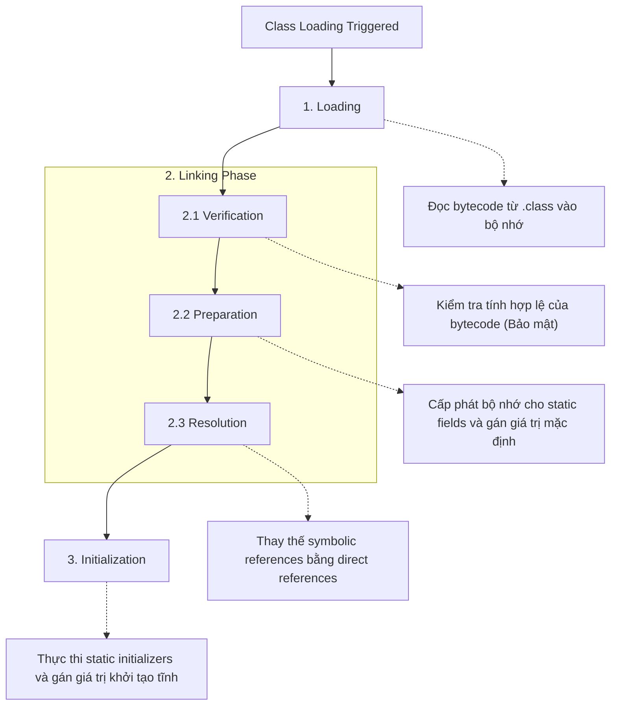
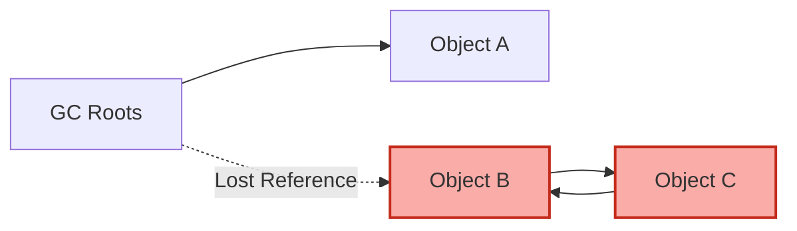
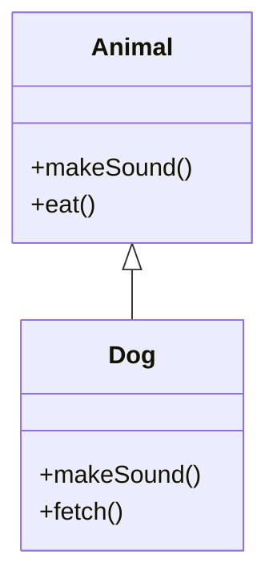

# Phase 2: OOP & Class Design — Deep Theory Supplement

Tài liệu này đi sâu vào kiến trúc bên trong (internal mechanisms) của JVM và Java Language Specification (JLS) liên quan đến OOP. Thay vì chỉ học "cái gì" (what), chúng ta sẽ khám phá "tại sao" (why) và "như thế nào" (how).

## 1. Class Loading & Object Lifecycle (Vòng đời đối tượng & Tải lớp)

### 1.1 Quá trình Class Loading

Khi một lớp được tham chiếu lần đầu tiên, JVM sẽ thực hiện quá trình Class Loading theo 3 giai đoạn chính: Loading, Linking, và Initialization.



> [!NOTE]
> Trong giai đoạn **Preparation**, các biến `static` được khởi tạo bằng giá trị mặc định của kiểu dữ liệu (0, false, null), KHÔNG PHẢI giá trị được gán trong code. Việc gán giá trị thực sự diễn ra trong giai đoạn **Initialization**.

### 1.2 Thứ tự khởi tạo (Initialization Order)

Thứ tự khởi tạo là một trong những chủ đề quan trọng nhất trong OCP. Nó tuân thủ quy tắc nghiêm ngặt từ cha đến con.

```java
class Parent {
    static { System.out.println("1. Parent Static Init"); }
    { System.out.println("3. Parent Instance Init"); }
    Parent() { System.out.println("4. Parent Constructor"); }
}

class Child extends Parent {
    static { System.out.println("2. Child Static Init"); }
    { System.out.println("5. Child Instance Init"); }
    Child() { System.out.println("6. Child Constructor"); }

    public static void main(String[] args) {
        new Child();
    }
}
```

**Phân tích sâu:**
1. **Parent Static / Child Static**: Chạy đúng 1 lần khi class được load vào JVM.
2. **Instance Init / Constructor**: Chạy mỗi khi dùng từ khóa `new`.
3. JVM luôn ưu tiên hoàn thành toàn bộ ngữ cảnh tĩnh (static) trước khi tạo đối tượng.

### 1.3 Garbage Collection (GC) Eligibility

Một đối tượng trở thành "GC eligible" khi không còn root reference nào trỏ đến nó (unreachable).

- **Island of Isolation**: Hai đối tượng tham chiếu lẫn nhau nhưng không có tham chiếu nào từ bên ngoài trỏ tới chúng. Cả hai đều bị GC dọn dẹp.



> [!WARNING]
> JVM có nhiều loại tham chiếu (Strong, Soft, Weak, Phantom). Trong OCP, trừ khi được chỉ định, tất cả tham chiếu đều là Strong. 

---

## 2. Method Dispatch Deep Dive (Chuyên sâu về Dispatch phương thức)

### 2.1 Dynamic Dispatch & Virtual Method Table (vtable)

Java sử dụng "Dynamic Dispatch" (còn gọi là Late Binding) cho các instance methods (trừ private, final). Tại runtime, JVM xác định phương thức cần gọi dựa trên **kiểu của đối tượng thực tế (actual object type)**, chứ không phải kiểu tham chiếu (reference type).

Bên dưới, JVM quản lý một cấu trúc dữ liệu gọi là **vtable** cho mỗi class.



| Class vtable | Slot 0 | Slot 1 | Slot 2 |
|---|---|---|---|
| `Animal vtable` | Animal::makeSound | Animal::eat | - |
| `Dog vtable` | Dog::makeSound | Animal::eat | Dog::fetch |

Khi bạn gọi `animal.makeSound()`, JVM tra cứu vtable của đối tượng thực tế mà `animal` trỏ tới.

### 2.2 Hiding vs Overriding

> [!IMPORTANT]
> **Methods are overridden, fields are hidden!** 
> Phương thức (instance) được giải quyết tại **Runtime**. 
> Biến (fields) và Static Methods được giải quyết tại **Compile-time**.

```java
class A {
    String name = "A";
    static void print() { System.out.println("Static A"); }
    void show() { System.out.println("Instance A"); }
}
class B extends A {
    String name = "B";
    static void print() { System.out.println("Static B"); }
    void show() { System.out.println("Instance B"); }
}

public class Test {
    public static void main(String[] args) {
        A obj = new B();
        System.out.println(obj.name); // In ra "A" (Field hiding - resolve by reference type A)
        obj.print();                  // In ra "Static A" (Static hiding - resolve by reference type A)
        obj.show();                   // In ra "Instance B" (Method overriding - resolve by object type B)
    }
}
```

### 2.3 Covariant Return Types & Bridge Methods

Khi override, phương thức con có thể trả về một subtype của kiểu trả về trong phương thức cha (Covariant return type).

Bên dưới JVM, bytecode không cho phép đổi kiểu trả về khi override. Do đó, compiler sinh ra một **Bridge Method**.

```java
class Parent {
    Object get() { return null; }
}
class Child extends Parent {
    @Override
    String get() { return "Hello"; } 
    
    // COMPILER GENERATES (Bridge method):
    // synthetic bridge Object get() { return this.get(); } // calls String get()
}
```

---

## 3. Constructor Mechanics (Cơ chế nội tại của Constructor)

### 3.1 Implicit `super()` Insertion

Nếu một constructor không có `this(...)` hoặc `super(...)` ở dòng đầu tiên, compiler sẽ tự động chèn `super();`.

> [!WARNING]
> Nếu class cha KHÔNG CÓ constructor mặc định (no-arg constructor), việc compiler chèn `super();` sẽ gây lỗi biên dịch. Bạn phải gọi `super(...)` một cách tường minh với các tham số tương ứng.

### 3.2 Flexible Constructor Bodies (Java 22+)

Theo JLS, Java 22+ (JEP 482) cho phép mã thực thi **TRƯỚC** khi gọi `super()` hoặc `this()`. 
Mục tiêu là cho phép tính toán các giá trị tham số trước khi truyền cho constructor của lớp cha.

**Prologue (Tiền truyện):** Các lệnh trước `super()`/`this()`. Không được truy cập `this` hoặc các thành viên instance.
**Epilogue (Hậu truyện):** Các lệnh sau `super()`/`this()`. Có thể truy cập mọi thứ.

```java
class Person {
    String name;
    Person(String name) { this.name = name; }
}

class Employee extends Person {
    int id;
    
    Employee(String firstName, String lastName) {
        // PROLOGUE: Được phép tính toán, gán biến cục bộ, gọi static methods
        String fullName = firstName + " " + lastName;
        if (fullName.isBlank()) throw new IllegalArgumentException();
        
        // Gọi cha
        super(fullName);
        
        // EPILOGUE: Được phép dùng 'this'
        this.id = 100;
    }
}
```

---

## 4. Records Deep Dive (Chuyên sâu về Records)

Records (JEP 395) là nominal tuples, được thiết kế làm "transparent carriers for immutable data".

### 4.1 Biên dịch Record thành Bytecode

Khi bạn viết:
```java
public record Point(int x, int y) {}
```

Compiler sinh ra một lớp (class) hoàn chỉnh:
- Class là `final`.
- Extends `java.lang.Record`.
- Chứa các `private final` fields `x` và `y`.
- Canonical constructor khởi tạo tất cả các fields.
- Accessor methods `x()` và `y()` (KHÔNG PHẢI `getX()`).
- Tự động sinh `equals()`, `hashCode()`, và `toString()` dựa trên `invokedynamic`.

### 4.2 Compact Constructor

Compact constructor cho phép bạn viết logic kiểm tra (validation) mà không cần khai báo lại các tham số hoặc gán vào fields.

```java
public record Range(int lo, int hi) {
    // Compact constructor
    public Range {
        if (lo > hi) { // Validation
            throw new IllegalArgumentException(String.format("(%d,%d)", lo, hi));
        }
        // JVM tự động chèn:
        // this.lo = lo;
        // this.hi = hi;
    }
}
```

> [!CAUTION]
> Trong Compact constructor, bạn đang thao tác trên các **tham số** (parameters), không phải trên **fields** (vì các fields chưa được gán). Do đó, bạn có thể thay đổi giá trị của `lo` hoặc `hi` trước khi JVM tự động gán chúng vào `this.lo` và `this.hi`.

### 4.3 Record Serialization

> [!TIP]
> Không giống như lớp thông thường (sử dụng ma thuật reflection để gán giá trị khi deserialize bỏ qua constructor), **Record LUÔN LUÔN sử dụng Canonical Constructor** khi deserialize. Điều này đảm bảo tính bất biến (immutability) và ngăn chặn việc tạo ra các đối tượng record ở trạng thái không hợp lệ thông qua serialization manipulation.

---

## 5. Sealed Classes & Interfaces Complete Guide

Sealed classes cho phép bạn hạn chế (restrict) việc kế thừa, tạo ra một hệ thống **Algebraic Data Types (ADT)** kết hợp với Pattern Matching.

### 5.1 Compilation Model & Permits

Một sealed class sử dụng mệnh đề `permits` để xác định chính xác các class được phép kế thừa nó.
- Nếu các subclasses nằm chung file với sealed class, mệnh đề `permits` có thể bỏ qua (compiler tự suy luận).
- Các subclasses bắt buộc phải nằm trong cùng module (hoặc cùng package nếu không dùng module).

```java
public sealed interface Shape permits Circle, Rectangle, WeirdShape {}

// 1. final subclass (Kết thúc chuỗi kế thừa)
public final class Circle implements Shape {}

// 2. non-sealed subclass (Mở lại cho phép kế thừa tự do)
public non-sealed class Rectangle implements Shape {}
class Square extends Rectangle {} // Hợp lệ

// 3. sealed subclass (Tiếp tục hạn chế)
public sealed class WeirdShape implements Shape permits Star {}
public final class Star extends WeirdShape {}
```

### 5.2 Exhaustiveness trong `switch`

Lợi ích lớn nhất của Sealed classes là kết hợp với Switch Expressions. Compiler có thể kiểm tra tính toàn vẹn (exhaustiveness), nghĩa là bạn không cần khối `default`.

```java
Shape shape = new Circle();
int area = switch (shape) {
    case Circle c -> 1;
    case Rectangle r -> 2;
    case WeirdShape w -> 3;
    // Không cần default vì compiler biết chỉ có 3 nhánh chính
};
```

---

## 6. Pattern Matching Complete Reference

Pattern matching mang lại khả năng phân tách dữ liệu (destructuring) mạnh mẽ.

### 6.1 Flow Scoping (Phạm vi luồng)

Biến được tạo ra trong Pattern Matching tuân theo "Flow Scoping" (phạm vi dựa trên luồng điểu khiển), nó chỉ tồn tại ở những nơi mà JVM đảm bảo ràng buộc đã đúng (definitely assigned).

```java
Object obj = "Hello";

if (obj instanceof String s && s.length() > 3) {
    // s có thể dùng ở đây (Vế phải của && và trong khối if)
    System.out.println(s.toUpperCase());
}

// Lỗi biên dịch nếu dùng s ở đây:
// System.out.println(s); 
```

**Sử dụng với `||` và `!`:**
```java
if (!(obj instanceof String s)) {
    throw new Exception("Not a string");
}
// s LẠI ĐƯỢC PHÉP dùng ở đây! 
// Vì nếu không phải String thì đã throw exception rồi.
System.out.println(s.length()); 
```

### 6.2 Record Patterns & Unnamed Patterns (Java 21+)

Record patterns cho phép deconstruct toàn bộ record một cách thanh lịch.
Unnamed patterns (`_`) dùng để bỏ qua các biến không cần thiết (Java 22+).

```java
record Point(int x, int y) {}
record Line(Point p1, Point p2) {}

Object obj = new Line(new Point(0,0), new Point(10,20));

if (obj instanceof Line(Point(int x1, _), Point(_, int y2))) {
    // Nested pattern deconstruction!
    // Bỏ qua y1 và x2 dùng `_`
    System.out.println(x1 + y2);
}
```

### 6.3 Dominance trong Switch (Quy tắc bao trùm)

Trong `switch` pattern matching, một case không được phép che khuất (dominate) case bên dưới nó. Nhánh cụ thể hơn phải đứng trước nhánh tổng quát.

```java
Object obj = 10;
switch (obj) {
    case CharSequence s -> {} // Specific
    // case String str -> {}  // LỖI: String đã bị CharSequence che khuất (dominated)
    case Integer i when i > 0 -> {} // Guarded pattern (Specific)
    case Integer i -> {}            // General
    default -> {}
}
```

---

## 7. Nested Classes Memory Model (Mô hình bộ nhớ của Lớp lồng nhau)

### 7.1 Inner Class (Non-static Nested Class)

Mỗi instance của Inner Class ẩn (implicitly) giữ một tham chiếu trỏ về instance của Outer Class (thường gọi là `Outer.this`).

> [!WARNING]
> Đây là nguyên nhân hàng đầu gây **Memory Leak** trong Java (VD: Anonymous classes trong Android/Swing). Nếu Inner object sống lâu hơn Outer object, Outer object sẽ không thể bị GC dọn dẹp.

```java
class Outer {
    int data = 10;
    class Inner {
        void print() {
            System.out.println(Outer.this.data); // Tham chiếu ẩn!
        }
    }
}
```

### 7.2 Static Nested Class

Không có tham chiếu ẩn. Nó hoạt động y hệt một lớp bình thường, chỉ bị giới hạn bởi không gian tên (namespace) và quyền truy cập (có thể truy cập private static members của Outer). 
Luôn ưu tiên dùng Static Nested Class nếu bạn không cần truy cập instance fields của Outer.

### 7.3 Local Class & Lambda Capture

Local classes (định nghĩa trong một method) hoặc Lambdas chỉ có thể truy cập các biến cục bộ (local variables) nếu chúng là **effectively final** (chỉ gán giá trị 1 lần).
**Tại sao?** Vì biến cục bộ sống trên **Stack** và bị hủy khi method kết thúc. Nhưng đối tượng Local Class sống trên **Heap**. JVM "copy" giá trị của biến cục bộ vào đối tượng trên Heap. Nếu cho phép thay đổi, sẽ xảy ra sự không nhất quán giữa Stack và Heap.

---

## 8. Hard Practice Questions (10 Câu hỏi khó)

**Q1:** Cho đoạn code sau:
```java
class X {
    X() { System.out.print("X"); }
}
class Y extends X {
    Y() { System.out.print("Y"); }
}
class Z extends Y {
    Z() { this("Z"); System.out.print("Z2"); }
    Z(String s) { System.out.print(s); }
}
```
Kết quả khi gọi `new Z()` là gì?
A) XYZ Z2
B) XYZ2
C) X Y Z Z2
D) Lỗi biên dịch.
*Đáp án:* C. Giải thích: new Z() gọi Z(), Z() gọi Z(String), Z(String) gọi ngầm super() là Y(), Y() gọi ngầm super() là X(). Output: X -> Y -> Z -> Z2.

**Q2:** Record nào sau đây là hợp lệ?
```java
// A
public record R1(int x) { private int y = 0; }
// B
public record R2(int x) { R2 { x++; } }
// C
public record R3(int x) extends Object {}
// D
public abstract record R4(int x) {}
```
*Đáp án:* B. A sai vì record không thể có instance fields. C sai vì record tự động kế thừa `java.lang.Record`, không thể `extends` rõ ràng. D sai vì record luôn là final.

**Q3:** Output là gì?
```java
class A { String v = "A"; String getV() { return v; } }
class B extends A { String v = "B"; String getV() { return v; } }
public class Main {
    public static void main(String[] args) {
        A obj = new B();
        System.out.println(obj.v + obj.getV());
    }
}
```
A) AA
B) BB
C) AB
D) BA
*Đáp án:* C. `obj.v` resolve dựa trên tham chiếu kiểu A (Field Hiding). `obj.getV()` resolve dựa trên object B (Method Overriding).

**Q4:** Biến flow scoping `s` có thể sử dụng ở vị trí nào?
```java
Object o = "Test";
if (!(o instanceof String s) || s.length() == 0) { // L1
    System.out.println("Empty");
} else {
    System.out.println(s); // L2
}
```
A) L1 hợp lệ, L2 lỗi biên dịch.
B) L1 lỗi, L2 hợp lệ.
C) Cả L1 và L2 đều hợp lệ.
D) Cả L1 và L2 đều lỗi.
*Đáp án:* C. `s` khả dụng bên phải của `||` vì nếu nhánh trái sai, `o` CHẮC CHẮN là String. Trong nhánh `else`, nhánh `if` đã false, tức là `o` CHẮC CHẮN là String và length != 0, nên `s` khả dụng.

**Q5:** Đâu là class hierarchy cho phép biên dịch đúng?
```java
sealed class A permits B {}
final class B extends A {}
class C extends B {}
```
A) Lỗi tại dòng 1
B) Lỗi tại dòng 2
C) Lỗi tại dòng 3
D) Biên dịch thành công
*Đáp án:* C. Lớp B là `final` nên không thể kế thừa bởi C.

**Q6:** Khởi tạo object trong Java 22+.
```java
class Parent { Parent(int x) {} }
class Child extends Parent {
    Child(int x) {
        int y = x * 2;
        super(y);
        System.out.println(this.hashCode());
    }
}
```
Khối code này có biên dịch không?
A) Không, vì `super()` phải là dòng đầu tiên.
B) Không, vì không thể tạo biến `y` trước `super()`.
C) Có, đây là tính năng Flexible Constructor Bodies (Prologue).
D) Có, nhưng ném lỗi runtime.
*Đáp án:* C.

**Q7:** Khi một method được gọi bằng từ khóa `super.method()`, Dynamic Dispatch diễn ra thế nào?
A) JVM vẫn kiểm tra đối tượng thực và gọi method của lớp con nhất.
B) JVM gọi chính xác method của lớp cha (tại compile-time).
C) JVM tra cứu vtable và bỏ qua method đã bị override ở lớp hiện tại.
D) Ném exception nếu method cha là abstract.
*Đáp án:* C. Lời gọi `super` sử dụng bytecode `invokespecial` (thay vì `invokevirtual`), nên nó bypass override của class hiện tại.

**Q8:** Liên quan đến Serialization của Inner Class:
A) Nên implement Serializable cho mọi Inner Class.
B) Static Nested Class dễ serialize hơn Non-static Inner Class.
C) Lambda luôn luôn Serializable.
D) Record không thể Serializable.
*Đáp án:* B. Non-static inner class mang theo tham chiếu đến Outer class, nên Outer cũng phải Serializable.

**Q9:** `instanceof` với generics. Code nào hợp lệ?
A) `if (obj instanceof List<String> list)`
B) `if (obj instanceof List<?> list)`
C) Cả 2 đều hợp lệ
D) Cả 2 đều sai
*Đáp án:* B. Không thể dùng `instanceof` với parameterized types (List<String>) do Type Erasure tại runtime. Dùng wildcard (`?`) thì hợp lệ.

**Q10:** Khi nào khối static trong interface được thực thi?
A) Ngay khi interface được load.
B) Khi một class implement interface được load.
C) Lần đầu tiên một static field hằng số (`final`) của interface được truy cập.
D) Lần đầu tiên một method không mặc định hoặc non-constant field của interface được truy cập.
*Đáp án:* D. Gọi hằng số compile-time sẽ không trigger class initialization. Khởi tạo chỉ xảy ra khi dùng static method hoặc các thao tác "active use".
