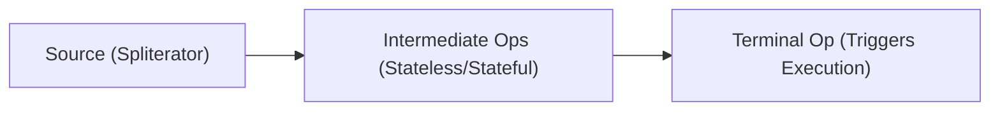

# Phase 4: Functional Programming - Deep Theory Supplement

Tài liệu bổ sung này đi sâu vào cơ chế hoạt động thực sự bên dưới của Functional Programming trong Java, đặc biệt phục vụ cho kỳ thi OCP Java SE 25 (1Z0-831). Nó không chỉ trả lời câu hỏi "làm thế nào" mà còn giải thích "tại sao".

---

## 1. Lambda Expression Internals

### Lambda Compilation: `invokedynamic` và `LambdaMetafactory`

Nhiều lập trình viên nghĩ rằng Lambda chỉ là cú pháp viết tắt cho *Anonymous Inner Classes* (Lớp nặc danh). **Điều này hoàn toàn sai trong Java!**

Khi biên dịch, một lớp nặc danh sẽ tạo ra một file `.class` riêng biệt trên đĩa (ví dụ: `MyClass$1.class`). Nếu có 1000 lớp nặc danh, bạn sẽ có 1000 file class, làm phình to kích thước ứng dụng và chậm quá trình class loading.

Thay vào đó, Java 8 đã sử dụng `invokedynamic` (được giới thiệu trong Java 7 cho các ngôn ngữ động) để xử lý Lambda.

1.  **Compile time**: Trình biên dịch chuyển nội dung của Lambda thành một phương thức tĩnh (tùy thuộc vào việc nó có capture state hay không) trong cùng một class. Thay vì sinh ra file `.class` mới, nó sinh ra một chỉ thị `invokedynamic`.
2.  **Runtime**: Lần đầu tiên `invokedynamic` được thực thi, JVM gọi `LambdaMetafactory.metafactory`. Method này sử dụng thư viện ASM để tự động sinh ra một class implement Functional Interface tương ứng trong bộ nhớ một cách lười biếng (lazy initialization). JVM có thể cache class này lại cho các lần gọi sau.

> [!TIP]
> **Performance**: Lambda nhanh hơn và tiết kiệm bộ nhớ hơn so với lớp nặc danh vì không tạo file `.class` tĩnh trên ổ đĩa, class được sinh ra lúc runtime và có thể được tối ưu hóa (như inline) dễ dàng hơn bởi JIT compiler.

### "Effectively Final" tại Bytecode Level

Lambda chỉ có thể sử dụng (capture) các biến cục bộ nếu chúng là `final` hoặc `effectively final`. Tại sao?

Khi bạn capture một biến cục bộ, Java thực chất **copy** giá trị của biến đó vào instance của class sinh ra lúc runtime. Nếu Java cho phép bạn thay đổi giá trị của biến gốc sau đó, bản copy trong Lambda sẽ không được cập nhật, gây ra sự bất đồng bộ dữ liệu nguy hiểm (đặc biệt trong đa luồng). Việc ép buộc biến phải không thay đổi (`effectively final`) đảm bảo tính nhất quán này.

### Khác biệt về `this`

Một khác biệt cực kỳ quan trọng: Từ khóa `this` trong lớp nặc danh trỏ tới instance của chính lớp nặc danh đó. Từ khóa `this` trong Lambda trỏ tới instance của lớp chứa Lambda.

```java
public class ThisExample {
    Runnable r1 = new Runnable() {
        @Override
        public void run() {
            System.out.println(this.getClass().getName()); // In ra: ThisExample$1
        }
    };

    Runnable r2 = () -> {
        System.out.println(this.getClass().getName()); // In ra: ThisExample
    };
}
```

### Serialization và Intersection Cast

Lambda không serializable theo mặc định. Nếu bạn cần serialize một Lambda (ví dụ để truyền qua mạng), bạn phải ép kiểu nó kết hợp với `Serializable` thông qua Intersection Type:

```java
Runnable r = (Runnable & Serializable) () -> System.out.println("Hello");
```
JVM sẽ sinh ra một class cài đặt CẢ `Runnable` và `Serializable`.

### Method Reference Types (Detailed Breakdown)

Method References cũng dùng cơ chế `invokedynamic` tương tự Lambda.

1.  **Static**: `ClassName::staticMethod`
    - Tương đương: `x -> ClassName.staticMethod(x)`
2.  **Bound Instance**: `instance::method` (Captured at creation)
    - Tương đương: `x -> instance.method(x)`
    - *Lưu ý*: Đối tượng `instance` được lưu lại (captured) tại thời điểm tạo method reference. Nếu `instance` bị thay đổi hoặc null sau đó, method reference vẫn giữ tham chiếu ban đầu hoặc throw NPE ngay lúc tạo nếu nó đã null.
3.  **Unbound Instance**: `ClassName::instanceMethod`
    - Tương đương: `(obj, args...) -> obj.instanceMethod(args...)`
    - *Lưu ý*: Tham số đầu tiên của Lambda trở thành đối tượng gọi phương thức (receiver).
4.  **Constructor**: `ClassName::new`
    - Tương đương: `args... -> new ClassName(args...)`

### Ambiguity Resolution (Giải quyết sự mơ hồ)

Khi overloaded methods tồn tại, trình biên dịch có thể không đoán được bạn đang dùng Bound hay Unbound instance.

```java
public class Ambiguity {
    public void print(String s) { }      // 1
    public static void print(Ambiguity a, String s) { } // 2
    
    public void test() {
        BiConsumer<Ambiguity, String> bc = Ambiguity::print; // COMPILE ERROR!
        // Compiler không biết là gọi instance method (1) với kiểu unbound
        // hay gọi static method (2)
    }
}
```

---

## 2. Stream Pipeline Internals

### Lazy Evaluation (Đánh giá lười)

Stream operations được chia làm Intermediate (trung gian) và Terminal (kết thúc). Intermediate ops không thực thi bất cứ logic nào cả; chúng chỉ trả về một Stream mới, lưu trữ thao tác vừa khai báo vào một cấu trúc dữ liệu mô tả pipeline. Chỉ khi một Terminal op được gọi, toàn bộ pipeline mới bắt đầu xử lý dữ liệu.



### Stream Characteristics

Mỗi Stream mang theo một bitmask gọi là *Characteristics* (Đặc tính), giúp JVM tối ưu hóa quá trình xử lý.

- `ORDERED`: Dữ liệu có thứ tự (VD: List).
- `DISTINCT`: Các phần tử đôi một khác nhau (VD: Set).
- `SORTED`: Dữ liệu đã được sắp xếp (VD: TreeSet).
- `SIZED`: Kích thước được biết trước (VD: mảng).
- `NONNULL`: Dữ liệu không chứa null.
- `IMMUTABLE`: Nguồn không thể thay đổi.
- `CONCURRENT`: Nguồn có thể được sửa đổi đồng thời một cách an toàn.
- `SUBSIZED`: Tất cả các spliterator chia nhỏ đều là `SIZED`.

> [!TIP]
> **Optimization Example**: Nếu bạn gọi `stream.distinct().distinct()`, lời gọi `distinct()` thứ hai là một no-op (không làm gì cả) vì Stream sau lệnh đầu tiên đã mang cờ `DISTINCT`. Tương tự với `sorted()` trên một HashSet (sẽ thực hiện sort) nhưng `sorted()` trên TreeSet thì rất rẻ nếu theo cùng order.

### Cỗ máy Spliterator

Stream sử dụng `Spliterator` (Splitable Iterator) thay vì `Iterator`. Spliterator có 2 nhiệm vụ: duyệt qua các phần tử (như Iterator), và phân chia cấu trúc dữ liệu (`trySplit()`) để xử lý song song.

### Short-Circuiting Operations

Các toán tử như `findFirst`, `findAny`, `limit`, `anyMatch`, `allMatch` được gọi là *Short-circuiting*. Chúng có thể kết thúc sớm việc duyệt Stream trước khi xử lý tất cả các phần tử. Khi kết hợp với Lazy evaluation, điều này cực kỳ tối ưu.

```java
// Sẽ chỉ in ra: "filter 1", "map 1", "filter 2", "map 2", "filter 3"
// Không xử lý 4 và 5.
Stream.of(1, 2, 3, 4, 5)
      .filter(x -> { System.out.println("filter " + x); return true; })
      .map(x -> { System.out.println("map " + x); return x; })
      .limit(3)
      .collect(Collectors.toList());
```

### Stream Ordering (Thứ tự)

Thứ tự rất quan trọng nhưng có thể bị mất. `HashSet.stream()` tạo ra một stream không có tính `ORDERED`. Việc gọi `.unordered()` trên một stream có thứ tự sẽ gỡ bỏ cờ `ORDERED`. Khi không có tính ORDERED, các toán tử trạng thái (như `distinct`, `limit`, `skip`) có thể thực thi đa luồng hiệu quả hơn nhiều.

---

## 3. Stream Operations Edge Cases

### `peek()`: Không dành cho Side Effects

`peek()` được thiết kế CHỈ ĐỂ DEBUG. JLS ghi chú rõ ràng rằng JVM có quyền bỏ qua `peek()` nếu nó tối ưu hóa được pipeline. Ví dụ, nếu bạn dùng `.count()` ở cuối, JVM biết `SIZED` của source và có thể trả thẳng về kết quả mà không cần duyệt phần tử nào, khiến `peek()` không bao giờ được chạy!

> [!WARNING]
> Không bao giờ dùng `peek()` để thay đổi trạng thái của đối tượng hoặc thực hiện logic nghiệp vụ như ghi database, vì bạn không thể đảm bảo nó sẽ luôn được thực thi, nhất là với parallel streams và short-circuit operations.

### `Optional.stream()` + `flatMap`

Từ Java 9, `Optional` có phương thức `.stream()`, trả về một Stream chứa 1 phần tử (nếu Optional có giá trị) hoặc Stream rỗng (nếu empty). Mẫu thiết kế này rất tuyệt để lọc bỏ null một cách thanh lịch:

```java
// Giả sử findUser(id) trả về Optional<User>
List<User> users = ids.stream()
    .map(this::findUser)
    // .filter(Optional::isPresent).map(Optional::get) // Cách cũ
    .flatMap(Optional::stream) // Cách mới: rất tinh tế!
    .collect(Collectors.toList());
```

### 3 Dạng của `reduce()`

Hiểu rõ 3 overload của `reduce` là chìa khóa để xử lý parallel stream:

1.  **`reduce(BinaryOperator<T> accumulator)`**: Không có identity. Trả về `Optional<T>` vì stream có thể rỗng.
2.  **`reduce(T identity, BinaryOperator<T> accumulator)`**: Có identity. Trả về `T` luôn (nếu rỗng, trả về identity).
    - *Identity Rules*: Phải thỏa mãn tính chất `accumulator(identity, x) == x`. 
      - Tổng: `0`
      - Tích: `1`
      - Nối chuỗi: `""`
      - Max/Min: `Integer.MIN_VALUE` / `Integer.MAX_VALUE`
3.  **`reduce(U identity, BiFunction<U, ? super T, U> accumulator, BinaryOperator<U> combiner)`**: Dùng đổi kiểu dữ liệu (từ T sang U). Hàm `combiner` CHỈ ĐƯỢC GỌI khi chạy parallel streams để gộp kết quả từ các luồng lại với nhau.

### Các dạng List Collectors

- `Collectors.toList()`: Trả về một List (thường là ArrayList), có thể sửa đổi (`add`/`remove`), và cho phép phần tử `null`.
- `Collectors.toUnmodifiableList()`: (Java 10) Trả về một List không thể sửa đổi (throws `UnsupportedOperationException`). **Tuyệt đối không cho phép null**; nếu stream có chứa `null`, sẽ throw `NullPointerException`.
- `stream.toList()`: (Java 16) Terminal operation trực tiếp. Trả về Unmodifiable List nhưng **có cho phép null**. Rất hiệu quả vì nó biết trước size của dữ liệu.

### `takeWhile` & `dropWhile` (Java 9)

- `takeWhile(Predicate)`: Dừng lấy ngay khi predicate trả về `false`.
- `dropWhile(Predicate)`: Bỏ qua phần tử đến khi predicate trả về `false`, sau đó lấy TẤT CẢ các phần tử còn lại.

> [!CAUTION]
> Với **unordered streams** (như stream từ `Set`), kết quả của `takeWhile` và `dropWhile` là **không xác định (non-deterministic)**, có thể trả về các phần tử khác nhau sau mỗi lần chạy!

---

## 4. Collectors Architecture Deep Dive

`Collector<T, A, R>` là một interface cấu trúc, trong đó:
- `T`: Kiểu dữ liệu đầu vào.
- `A`: Kiểu tích lũy trung gian (Accumulator, thường bị ẩn đi).
- `R`: Kiểu trả về cuối cùng.

Nó dựa trên 4 hàm:
1.  **`supplier()`**: Tạo mới container lưu kết quả (`() -> new ArrayList()`).
2.  **`accumulator()`**: Cách nhét 1 phần tử vào container (`(list, item) -> list.add(item)`).
3.  **`combiner()`**: Cách gộp 2 containers lại với nhau khi dùng parallel (`(list1, list2) -> { list1.addAll(list2); return list1; }`).
4.  **`finisher()`**: Biến container thành kết quả cuối cùng (`list -> Collections.unmodifiableList(list)`). Thường là hàm identity `x -> x` nếu R giống A.

### Custom Collector với `Collector.of()`

```java
Collector<String, StringJoiner, String> myJoiner = Collector.of(
    () -> new StringJoiner(", "),          // supplier
    StringJoiner::add,                     // accumulator
    StringJoiner::merge,                   // combiner
    StringJoiner::toString,                // finisher
    Collector.Characteristics.UNORDERED    // characteristics
);
```

### `groupingBy` Đầy Đủ (3-args)

`Collectors.groupingBy(classifier, mapFactory, downstream)`

- `classifier`: Hàm phân loại khóa.
- `mapFactory`: Cung cấp cụ thể Map bạn muốn (ví dụ: `TreeMap::new` để map có thứ tự khóa).
- `downstream`: Một collector xử lý các values thuộc cùng 1 khóa. Mặc định là `toList()`.

Ví dụ gom nhóm theo độ dài, xếp vào TreeMap và đếm số lượng:
```java
Map<Integer, Long> map = stream.collect(
    Collectors.groupingBy(String::length, TreeMap::new, Collectors.counting())
);
```

### Các Collector Đặc Biệt

- **`collectingAndThen`**: Wraps một collector và áp dụng thêm 1 hàm vào kết quả cuối. Rất tiện để wrap thành Optional hay UnmodifiableList.
- **`teeing` (Java 12)**: Split stream cho 2 collector chạy song song, sau đó dùng hàm gộp kết quả của 2 collector đó lại.
  ```java
  // Lấy giá trị lớn nhất và nhỏ nhất cùng 1 lúc
  stream.collect(Collectors.teeing(
      Collectors.minBy(Comparator.naturalOrder()),
      Collectors.maxBy(Comparator.naturalOrder()),
      (min, max) -> new Result(min.get(), max.get())
  ));
  ```
- **`flatMapping` & `filtering` (Java 9)**: Dùng như downstream collector. Khác với `stream.filter()`, dùng `Collectors.filtering()` vẫn giữ lại khóa trong map (với một danh sách rỗng) dù cho không có phần tử nào thỏa mãn.

---

## 5. Optional Best Practices & Pitfalls

### Các Cạm Bẫy Phổ Biến

1.  **Không dùng làm thuộc tính lớp (fields)**: `Optional` **KHÔNG** implement `Serializable`. Việc sử dụng nó làm trường trong DTO hoặc Entity sẽ phá hỏng các framework serialize/deserialize hoặc RMI.
2.  **Không dùng làm tham số hàm**: Buộc người gọi phải viết `Optional.of(value)` rất rườm rà. Cứ truyền trực tiếp tham số và kiểm tra null bên trong hàm.
3.  **Không dùng cho Collection**: Đừng viết `Optional<List<T>>`. Một List rỗng đã biểu thị đủ ý nghĩa "không có dữ liệu".

### `Optional.of()` vs `ofNullable()`

Nhiều người lạm dụng `ofNullable` cho mọi thứ.
- Dùng `Optional.of(value)` khi bạn **chắc chắn** value không null. Nếu nó null, bạn muốn nó ném ra `NullPointerException` (fail-fast) ngay lập tức tại điểm tạo, chứ không phải giấu lỗi đi.
- Dùng `ofNullable(value)` khi value thực sự có khả năng hợp lệ là null (do lấy từ DB hoặc Legacy API).

### `flatMap` vs `map` trên Optional

Khi áp dụng một function trả về một `Optional` khác, dùng `.map()` sẽ tạo ra `Optional<Optional<T>>`. Hãy dùng `.flatMap()` để trải nó ra thành một lớp `Optional<T>` duy nhất. Cực kì giống với Monad trong Functional Programming.

### Alternative Suppliers

- `orElse(T)`: Mặc dù giá trị có thể không bao giờ dùng tới nếu Optional isPresent, nó **vẫn được tính toán khởi tạo**.
- `orElseGet(Supplier<T>)`: Evaluation lười biếng. Cực kỳ hiệu quả nếu quá trình tính toán object thay thế tốn tài nguyên hoặc gọi database.
- `or(Supplier<Optional<T>>)`: (Java 9) Trả về Optional hiện tại nếu có, ngược lại gọi Supplier trả về một Optional mới.

---

## 6. Parallel Streams Deep Dive

### Fork/Join Framework

Parallel Stream chia nhỏ tác vụ dựa trên `Spliterator` và đẩy vào chung một pool đa luồng gọi là **Common ForkJoinPool** của JVM.

> [!WARNING]
> Mọi parallel streams trong ứng dụng của bạn **đều dùng chung một Thread Pool này**. Nếu một parallel stream block do I/O, nó sẽ làm chết tất cả các parallel streams khác trong hệ thống. Parallel stream CHỈ nên được dùng cho tác vụ nặng CPU (CPU-bound) và trên dữ liệu đủ lớn.

### Thread Safety (An toàn luồng)

Tất cả các hàm truyền vào map, filter, v.v. khi chạy parallel **BẮT BUỘC** phải:
1.  **Stateless**: Không lưu giữ trạng thái.
2.  **Non-interfering**: Không thay đổi cấu trúc dữ liệu nguồn đang duyệt.
3.  **Không dùng chia sẻ Mutable State**: Không được `synchronized` các object bên ngoài vì sẽ dẫn đến thắt nút cổ chai (bottleneck) và khóa chết (deadlock), phá hủy toàn bộ lợi ích của parallel.

### `reduce` & `collect` trong Parallel

- Trong `reduce`, hàm `combiner` phải có tính kết hợp (associative): `(a op b) op c == a op (b op c)`. Đồng thời `combiner(accumulator(identity, a), b) == accumulator(a, b)`. Nếu sai, kết quả sẽ nhảy múa không đoán trước được.
- Trong `collect`, hàm `supplier` LUÔN PHẢI TẠO CONTAINER MỚI. Đừng bao giờ trả về cùng một List tĩnh. Nhiều luồng sẽ chọc vào List đó cùng một lúc và gây hỏng dữ liệu.
- Hoặc dùng `Concurrent Collector` (`Collectors.toConcurrentMap()`): Collector cung cấp 1 object duy nhất hỗ trợ luồng an toàn, luồng nào tính xong đẩy luôn vào. Tốn ít chi phí gộp kết quả.

### `forEach` vs `forEachOrdered`

`stream.parallel().forEach(System.out::print)` in các phần tử theo một thứ tự hỗn loạn. Nếu cần duyệt đa luồng nhưng vẫn muốn in ra theo đúng thứ tự mảng ban đầu, phải dùng `.forEachOrdered()`. Bù lại hiệu năng sẽ giảm.

---

## 7. Primitive Streams Complete Reference

Primitive Streams (`IntStream`, `LongStream`, `DoubleStream`) tồn tại để ngăn chặn Autoboxing/Unboxing (chuyển đổi qua lại giữa `int` và `Integer`), vốn tốn kém về bộ nhớ và CPU do sinh ra các đối tượng trong heap. Không có `ShortStream` hay `ByteStream` (chúng được biểu diễn bằng IntStream).

### Biến đổi qua lại

- `mapToInt()`, `mapToLong()`, `mapToDouble()`: Từ Object Stream về Primitive.
- `mapToObj()` hoặc `boxed()`: Từ Primitive về Object Stream.
- `asLongStream()`, `asDoubleStream()`: Rộng kiểu từ `IntStream`.

### Các Hàm Thống Kê Nhanh

Các Primitive stream có sẵn các toán tử riêng cực kì tiện dụng:
- `.sum()` (Trả về 0 nếu rỗng, CẨN THẬN: trả về số nguyên sơ cấp, không phải Optional).
- `.average()` (Trả về `OptionalDouble` vì không thể chia cho 0 nếu stream rỗng).
- `.summaryStatistics()`: Trả về một đối tượng chứa tất tần tật: count, sum, min, max, average. Tiết kiệm công duyệt stream nhiều lần.

### `range` vs `rangeClosed`

Chỉ có trên `IntStream` và `LongStream`.
- `IntStream.range(1, 5)`: 1, 2, 3, 4 (độc quyền chặn trên).
- `IntStream.rangeClosed(1, 5)`: 1, 2, 3, 4, 5 (bao hàm).

---

## Hard Practice Questions

1. Điều gì sẽ xảy ra khi biên dịch và chạy đoạn mã sau?
```java
public class LambdaScope {
    private int id = 10;
    public void test() {
        int id = 20;
        Runnable r = () -> {
            System.out.println(this.id);
        };
        r.run();
    }
}
```
A) In ra 10
B) In ra 20
C) Lỗi biên dịch: id is effectively final
D) Lỗi biên dịch: biến cục bộ che lấp thuộc tính

2. Lệnh nào dưới đây KHÔNG làm Stream kết thúc (Terminal Operation)?
A) `findAny()`
B) `collect(Collectors.toList())`
C) `peek(System.out::println)`
D) `forEach(System.out::println)`

3. Code nào dưới đây sẽ throw NullPointerException tại Runtime?
```java
Stream<String> s = Stream.of("A", null, "B");
```
A) `s.collect(Collectors.toList());`
B) `s.toList();`
C) `s.collect(Collectors.toUnmodifiableList());`
D) `s.filter(x -> x != null).collect(Collectors.toList());`

4. Cho đoạn code sau, số lần dòng chữ "Filtered" được in ra là bao nhiêu?
```java
Stream.of(1, 2, 3, 4, 5)
      .filter(x -> { System.out.println("Filtered"); return x % 2 != 0; })
      .limit(2)
      .count();
```
A) 0
B) 2
C) 3
D) 5

5. Tại sao Optional KHÔNG NÊN được sử dụng làm trường (field) của một class Entity (VD: JPA, Hibernate)?
A) Nó chiếm quá nhiều bộ nhớ.
B) Nó không implement interface `Serializable`.
C) Nó làm chậm truy vấn database.
D) Trình biên dịch sẽ báo lỗi `UnsupportedOperationException`.

6. Sự khác biệt giữa `map()` và `flatMap()` trên `Optional` là gì?
A) `flatMap` dùng cho Stream, `map` dùng cho đối tượng tĩnh.
B) Nếu function trả về một `Optional`, `map` sẽ tạo ra `Optional<Optional<T>>` còn `flatMap` trả về `Optional<T>`.
C) `map` bắt lỗi `NullPointerException` còn `flatMap` thì không.
D) Không có khác biệt gì, dùng cái nào cũng được.

7. Phương thức `reduce` nào BẮT BUỘC phải sử dụng hàm `combiner`?
A) Overload có 1 tham số: `reduce(accumulator)`
B) Overload có 2 tham số: `reduce(identity, accumulator)`
C) Overload có 3 tham số: `reduce(identity, accumulator, combiner)`
D) Cả ba overload đều bắt buộc

8. Phương thức nào sinh ra stream các số nguyên bao gồm cả chặn trên?
A) `IntStream.range(1, 10)`
B) `IntStream.iterate(1, i -> i + 1)`
C) `IntStream.rangeClosed(1, 10)`
D) `IntStream.generate(() -> 1)`

9. Collector `Collectors.groupingBy` có hỗ trợ cung cấp kiểu Map tuỳ chỉnh không (VD: TreeMap)?
A) Không, nó luôn trả về `HashMap`.
B) Có, bằng cách truyền Map Factory vào tham số thứ hai của phiên bản 3 tham số.
C) Có, bằng cách truyền một Comparator vào.
D) Không, phải dùng `Collectors.toMap`.

10. Trong Parallel Stream, nếu hàm supplier của Collector trả về CÙNG MỘT ArrayList tĩnh cho tất cả các luồng thay vì tạo List mới, điều gì có thể xảy ra?
A) Chương trình chạy nhanh hơn rất nhiều do tiết kiệm chi phí tạo object.
B) Ném ra lỗi `Compile Time Error`.
C) Dữ liệu trong List có thể bị thiếu hoặc sai lệch (ConcurrentModification/Race Condition).
D) Hệ thống tự động chuyển ArrayList thành CopyOnWriteArrayList.

---
**Đáp án tóm tắt:**
1: A, 2: C, 3: C, 4: C, 5: B, 6: B, 7: C, 8: C, 9: B, 10: C.
