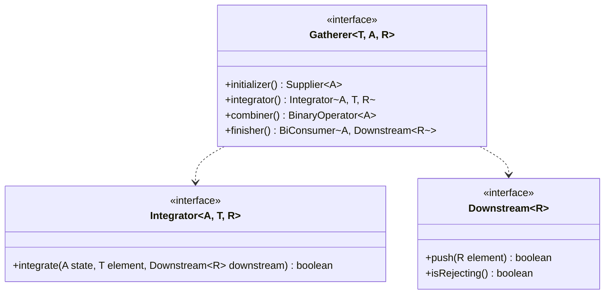

# Phase 6: Java 22-25 New Features - Deep Theory Supplement

Tài liệu này cung cấp cái nhìn sâu sắc vào cơ chế hoạt động, lý thuyết nền tảng và các edge cases của các tính năng mới trong Java 22 đến 25, phục vụ cho kỳ thi OCP Java SE 25 (1Z0-831).

---

## 1. Flexible Constructor Bodies — Complete Specification

### 1.1 Motivation and Design Rationale (JEP 482)
Trước đây, Java yêu cầu lời gọi constructor của superclass (`super()`) hoặc constructor cùng lớp (`this()`) phải là statement đầu tiên. Điều này dẫn đến sự bất tiện khi cần thực hiện validation hoặc tính toán các argument trước khi truyền vào `super()`. Lập trình viên thường phải dùng static helper methods, làm mất đi tính rõ ràng của code. JEP 482 (chính thức trong Java 22+) cho phép đặt statements trước `super()`/`this()`.

### 1.2 Prologue Phase vs Epilogue Phase
Constructor execution giờ đây chia thành 2 phase:
1. **Prologue phase**: Trước khi `super()`/`this()` hoàn tất. Ở phase này, object đang ở trạng thái *uninitialized* (chưa khởi tạo hoàn toàn).
2. **Epilogue phase**: Sau khi `super()`/`this()` hoàn tất. Object ở trạng thái *initialized*.

> [!IMPORTANT]
> Mục tiêu chính của các quy tắc trong prologue là ngăn chặn việc đọc từ instance fields hoặc gọi instance methods khi object (và superclass của nó) chưa được khởi tạo xong, tránh "this-escape".

### 1.3 Exact Rules from JLS (Prologue Rules)

| Phép toán / Statement | Cho phép trong Prologue? | Ghi chú |
| :--- | :---: | :--- |
| Khai báo local variables | ✅ Có | Rất phổ biến để lưu trữ kết quả tính toán. |
| Dùng `if`/`switch`/`try-catch` | ✅ Có | Dùng để validation hoặc error handling trước. |
| Throw exceptions | ✅ Có | Ví dụ: `throw new IllegalArgumentException();` |
| Assign to `this.field` | ✅ Có (Mới) | Có thể khởi tạo field của subclass trước khi gọi `super()`. |
| Đọc `this.field` | ❌ KHÔNG | Kể cả field vừa được gán giá trị ở dòng trên. |
| Gọi `this.method()` | ❌ KHÔNG | Vì method có thể truy cập state chưa khởi tạo. |
| Truyền `this` vào method/constructor | ❌ KHÔNG | Ngăn chặn this-escape. |
| Truy cập `super.field` / `super.method()` | ❌ KHÔNG | Superclass chưa hề được khởi tạo! |
| Outer `this` (trong inner class) | ❌ KHÔNG | Outer instance không được tham chiếu trong prologue của inner class constructor. |

#### Code Examples: The Good, The Bad, and The Ugly

```java
public class PositiveNumber extends Number {
    private final int value;
    private final boolean isEven;

    public PositiveNumber(int value) {
        // --- PROLOGUE ---
        if (value <= 0) {
            throw new IllegalArgumentException("Must be positive");
        }
        int v = value;
        // VALID: Assigning to field in prologue is allowed!
        this.isEven = (v % 2 == 0); 
        
        // INVALID: Cannot read field, even if assigned!
        // boolean flag = this.isEven; // COMPILER ERROR
        
        // INVALID: Cannot call instance method
        // doSomething(); // COMPILER ERROR

        super(); 
        // --- EPILOGUE ---
        this.value = v; 
    }
}
```

### 1.4 Interactions with Other Features

#### Records
Compact constructor trong Record KHÔNG có explicit `super()` (compiler tự sinh ở cuối). Do đó, trong compact constructor, bạn không thể gọi `super()` hay `this()`. Tuy nhiên, với *canonical* hoặc *custom* constructors, bạn vẫn áp dụng quy tắc prologue.
> [!NOTE] 
> Bạn có thể đặt statement trước `this()` trong custom record constructor.

#### Enums
Enums không có superclass rõ ràng (kế thừa `java.lang.Enum`), nhưng constructor của chúng gọi `super(name, ordinal)` ngầm định hoặc `this()`. Flexible constructors hoạt động bình thường, prologue rules áp dụng nghiêm ngặt để cấm enum access `this` quá sớm.

---

## 2. Instance Main Methods & Compact Source Files

### 2.1 Implicit Classes & Compiler Magic
JEP 494 & 495 nhắm đến việc giảm boilerplate.
Khi bạn có một file `app.java` không chứa class declaration, trình biên dịch tự động bọc toàn bộ code vào một **Implicit Class**.

```java
// app.java
int counter = 0; // Instance field của implicit class
void main() {    // Instance main method
    println("Hello, counter=" + counter);
}
```

> [!CAUTION]
> Implicit class là final, kế thừa `Object`, thuộc unnamed package, và KHÔNG THỂ được reference từ các source files khác. Nó chỉ dùng để chạy trực tiếp.

### 2.2 Launch Protocol - Resolution Priority
Khi chạy `java MyClass`, JVM tìm method `main` theo thứ tự ưu tiên (Priority):

1. `public static void main(String[] args)` (Standard Java 1.0+)
2. `protected/package-private/private static void main(String[] args)` 
3. `public/protected/package/private static void main()` (No args)
4. `public/protected/package/private void main(String[] args)` (Instance method)
5. `public/protected/package/private void main()` (Instance method no args)

Nếu JVM chọn Instance Main (thứ tự 4 hoặc 5), nó sẽ tự động khởi tạo class bằng no-arg constructor trước khi gọi `main()`.

```mermaid
flowchart TD
    Start([Run java ClassName]) --> A{Has static main(String[])?}
    A -- Yes --> Run1[Execute static main(String[])]
    A -- No --> B{Has static main()?}
    B -- Yes --> Run2[Execute static main()]
    B -- No --> C{Has instance main(String[])?}
    C -- Yes --> Instantiate1[new ClassName()] --> Run3[Execute instance main(String[])]
    C -- No --> D{Has instance main()?}
    D -- Yes --> Instantiate2[new ClassName()] --> Run4[Execute instance main()]
    D -- No --> Error[Fatal Error: main not found]
```

### 2.3 The `IO` Class
Các phương thức `println()`, `print()`, `readln()` được cung cấp thông qua implicit import của class `java.io.IO` (được export từ `java.base`). Điều này có nghĩa bạn không cần `System.out.println()`.

---

## 3. Unnamed Variables & Patterns — Complete Reference

JEP 456 cho phép dùng dấu gạch dưới `_` để bỏ qua các biến hoặc components không cần thiết.

### 3.1 All Use Cases

```java
// 1. Catch Block
try { doRisky(); } catch (Exception _) { /* ignore */ }

// 2. Enhanced For Loop
for (var _ : elements) { count++; }

// 3. Try-with-resources
try (var _ = ScopedValue.where(KEY, value)) { ... }

// 4. Lambda Parameters
BiFunction<Integer, String, String> f = (_, s) -> s.toUpperCase();

// 5. Pattern Matching (Switch / instanceof)
if (obj instanceof Point(var x, _)) { ... }

// 6. Assignment (Local Variables)
var _ = queue.poll(); // Ignore returned value, just remove
```

> [!WARNING]
> `_` là từ khóa dành riêng. Bạn KHÔNG ĐƯỢC dùng nó làm tên biến thông thường (ví dụ `int _ = 5;` sẽ lỗi biên dịch). Hơn nữa, `_` chỉ được dùng cho **local variables**, không dùng cho fields hoặc method parameters thông thường (trừ lambda).

### 3.2 Unnamed Pattern vs Unnamed Pattern Variable
- **Unnamed Pattern Variable**: `var _`, `int _`, `String _`. Khai báo kiểu dữ liệu nhưng không đặt tên biến.
- **Unnamed Pattern**: Chỉ dùng `_` độc lập trong pattern matching. Nó match mọi thứ nhưng không bận tâm đến type.
```java
// Unnamed pattern variable (requires it to be an int)
case Point(int x, int _) -> ...

// Unnamed pattern (matches anything, no type check)
case Point(int x, _) -> ...
```

---

## 4. Module Import Declarations

Cú pháp mới: `import module module.name;`

### 4.1 How it Works
Khi bạn `import module java.base;`, bạn đang import **tất cả** public top-level types (classes, interfaces, enums, records) từ **tất cả** các packages được `java.base` `exports`.
Hành vi này giống như bạn viết `import java.util.*; import java.io.*; ...` hàng chục lần.

### 4.2 Transitive Dependencies
Nếu module A requires transitive module B, thì `import module A;` CŨNG import tất cả exported packages của module B.
Ví dụ: `java.sql` có `requires transitive java.xml`. Nên `import module java.sql;` sẽ mang vào type `java.sql.Connection` VÀ `javax.xml.parsers.DocumentBuilder`.

### 4.3 Ambiguity Resolution
Nếu hai modules export các class trùng tên (rất hiếm, thường được gọi là split packages nhưng với types khác nhau), compiler sẽ báo lỗi *ambiguous import* khi bạn cố sử dụng class đó mà không qualify.
**Import Precedence (Thứ tự ưu tiên):**
1. Single-type import (`import java.util.List;`) - **Cao nhất**
2. Type in current package - **Cao thứ 2**
3. Type in implicitly declared class / local scope
4. On-demand import (`import java.util.*;`) VÀ Module import (`import module java.base;`) - **Thấp nhất, tương đương nhau**

> [!TIP]
> Nếu có xung đột giữa `import java.util.*` và `import module some.other.module;`, bạn cần dùng single-type import để phân giải.

---

## 5. Stream Gatherers — Complete API Reference

`java.util.stream.Gatherer` (JEP 485) là API trung gian (intermediate operation) mạnh mẽ, khắc phục hạn chế của `Stream` khi cần xử lý có trạng thái (stateful) hoặc số lượng phần tử đầu vào khác đầu ra (1-to-many, many-to-1).

### 5.1 The Gatherer Interface

- **T**: Type of input element
- **A**: Type of state (Accumulator)
- **R**: Type of output element

`integrate` trả về `false` báo hiệu *short-circuit* (dừng xử lý).

### 5.2 Built-in Gatherers

#### `windowFixed(int size)`
Nhóm các phần tử thành các lists không chồng lấn.
```java
Stream.of(1, 2, 3, 4, 5)
      .gather(Gatherers.windowFixed(2))
      .forEach(System.out::println);
// Output: [1, 2], [3, 4], [5]
```

#### `windowSliding(int size)`
Nhóm thành các lists chồng lấn, dời 1 bước.
```java
Stream.of(1, 2, 3, 4)
      .gather(Gatherers.windowSliding(2))
      .forEach(System.out::println);
// Output: [1, 2], [2, 3], [3, 4]
```

#### `fold(Supplier, BiFunction)`
Giống `reduce`, nhưng là intermediate. Emit DUY NHẤT một phần tử ở cuối stream.
```java
Stream.of("A", "B", "C")
      .gather(Gatherers.fold(() -> "", (acc, e) -> acc + e))
      .forEach(System.out::println); // Output: ABC
```

#### `scan(Supplier, BiFunction)`
Phát ra kết quả tích lũy sau MỖI phần tử. (Running total).
```java
Stream.of("A", "B", "C")
      .gather(Gatherers.scan(() -> "", (acc, e) -> acc + e))
      .forEach(System.out::println); 
// Output: A, AB, ABC
```

#### `mapConcurrent(int maxConcurrency, Function mapper)`
Sử dụng Virtual Threads để map đồng thời, nhưng vẫn **giữ nguyên thứ tự stream ban đầu**.
```java
Stream.of(urls)
      .gather(Gatherers.mapConcurrent(10, httpDownloader::download))
      ...
```

---

## 6. Scoped Values — Complete API Reference

`java.lang.ScopedValue` (JEP 487) cung cấp cách chia sẻ data cho các phương thức con mà không cần truyền qua parameter, thay thế `ThreadLocal`.

### 6.1 ScopedValue vs ThreadLocal

| Đặc điểm | `ThreadLocal` | `ScopedValue` |
| :--- | :--- | :--- |
| **Mutability** | Mutable (`set()`, `remove()`) | Immutable (Chỉ bind trong scope) |
| **Lifecycle** | Kéo dài tới khi Thread chết / `remove()` | Strictly bounded (Theo block `run()`/`call()`) |
| **Inheritance** | Đắt đỏ (`InheritableThreadLocal` copy map) | Miễn phí, cực kỳ tối ưu (Tree structure) |
| **Virtual Threads** | Tốn memory nếu có hàng triệu VT | Sinh ra dành cho Virtual Threads |

### 6.2 Binding and Execution
Scope chỉ tồn tại trong method được truyền vào `run()` hoặc `call()`.

```java
private static final ScopedValue<String> USER = ScopedValue.newInstance();

public void process() {
    // Ràng buộc giá trị "datpham" vào USER trong phạm vi của Runnable
    ScopedValue.where(USER, "datpham").run(() -> {
        doSomething(); // Bên trong này có thể gọi USER.get()
    });
    
    // Ra khỏi run(), USER quay về unbound
}

private void doSomething() {
    // Đọc giá trị
    System.out.println(USER.get()); // "datpham"
    
    // Đọc an toàn nếu không chắc đã bind
    System.out.println(USER.orElse("guest"));
}
```

> [!WARNING]
> Gọi `get()` khi ScopedValue không được bound sẽ ném `NoSuchElementException`. Luôn dùng `isBound()` hoặc `orElse()` nếu không chắc chắn.

### 6.3 Rebinding (Shadowing)
Bạn có thể bind đè giá trị trong scope con. Khi thoát scope con, giá trị cũ sẽ phục hồi.

---

## 7. Structured Concurrency

`java.util.concurrent.StructuredTaskScope` (JEP 505). Nó đảm bảo "Nếu một task chia thành nhiều subtasks đồng thời, chúng phải cùng hoàn thành hoặc cùng bị hủy".

### 7.1 Core Joiner Strategies

1. **`ShutdownOnFailure` (All or Nothing)**
Giống như `awaitAll()`. Nếu 1 subtask fail, TẤT CẢ các subtasks khác bị cancel. Ném `ExecutionException` nếu có lỗi.

2. **`ShutdownOnSuccess` (Any Success)**
Chạy đua. Lấy kết quả nhanh nhất. Hủy phần còn lại. Ném `ExecutionException` nếu TẤT CẢ fail.

### 7.2 Usage Example

```java
try (var scope = new StructuredTaskScope.ShutdownOnFailure()) {
    Subtask<String> user = scope.fork(() -> fetchUser(id));
    Subtask<Integer> order = scope.fork(() -> fetchOrder(id));
    
    scope.join();           // Đợi tất cả (hoặc đến khi có lỗi đầu tiên)
    scope.throwIfFailed();  // Ném lỗi nếu có subtask fail

    // Sau throwIfFailed(), đảm bảo get() sẽ thành công
    return new Result(user.get(), order.get());
} // Scope tự đóng, dọn dẹp các threads nếu cần
```

---

## 8. Other Additions & Practice Questions

### New APIs
- `Console.readln()`: Đọc chuỗi thay vì dùng `Scanner(System.in)`.
- `Math.clamp(value, min, max)`: Trả về giá trị nằm trong khoảng [min, max].
- `String.indexOf(String, beginIndex, endIndex)`: Giới hạn phạm vi tìm kiếm.

### 10 Hard Practice Questions

**Q1:** Trong constructor prologue, cho phép thao tác nào?
A) Đọc biến instance từ `super`
B) Gán giá trị vào biến instance của lớp hiện tại
C) Gọi một instance method được đánh dấu là `final`
D) Truyền `this` vào một static method
*Đáp án: B. Gán giá trị được cho phép nhưng ĐỌC giá trị (dù vừa gán) bị cấm.*

**Q2:** File `app.java` có nội dung chỉ gồm 1 dòng `void main() {}`. Class này thuộc package nào?
A) `java.lang`
B) unnamed package
C) implicit package
*Đáp án: B. Các implicit classes luôn nằm trong unnamed package.*

**Q3:** Sự khác biệt giữa `case String _` và `case String s` trong switch pattern là gì?
A) `_` sẽ match cả giá trị null
B) `_` báo hiệu biến này không thể dùng trong block của case
*Đáp án: B. `_` là unnamed pattern variable, nghĩa là bạn bỏ qua tên biến, không thể tham chiếu đến nó.*

**Q4:** Kết quả của đoạn mã sau?
```java
Stream.of(1, 2, 3)
      .gather(Gatherers.windowFixed(2))
      .count();
```
A) 1   B) 2   C) 3
*Đáp án: B. Output là `[1, 2]` và `[3]`, tổng cộng 2 phần tử (list).*

**Q5:** Nếu `ScopedValue` `A` được bind với giá trị 1. Trong scope đó, ta lại gọi `ScopedValue.where(A, 2).run(...)`. Khi quay ra ngoài scope con, `A.get()` trả về mấy?
A) 1   B) 2   C) Ném Exception
*Đáp án: A. Tính chất rebinding, giá trị được restore về 1.*

**Q6:** Trong `StructuredTaskScope.ShutdownOnSuccess`, nếu task A xong trước nhưng ném Exception, task B đang chạy chậm hơn. Điều gì xảy ra?
A) Scope throw exception ngay lập tức
B) Task B tiếp tục chạy, nếu B thành công thì trả về B
*Đáp án: B. ShutdownOnSuccess chỉ dừng khi có 1 task THÀNH CÔNG. Các task fail bị bỏ qua, trừ khi TẤT CẢ cùng fail.*

**Q7:** Khi bạn viết `import module java.sql;`, `java.util.List` có được import không? (Biết `java.sql` không require transitive `java.base`, nhưng mọi module đều tự động require `java.base`).
A) Có   B) Không
*Đáp án: B. `java.sql` không require *transitive* `java.base`. Do đó các class của `java.base` không được mang theo qua transitive.*

**Q8:** Tại sao không dùng `ThreadLocal` với Virtual Threads?
A) Virtual Threads không hỗ trợ ThreadLocal
B) Memory footprint của ThreadLocal sẽ khổng lồ nếu có hàng triệu Virtual Threads
*Đáp án: B.*

**Q9:** Trật tự ưu tiên khi JVM tìm hàm main để khởi chạy?
A) Instance main() ưu tiên hơn static main(String[])
B) static main(String[]) ưu tiên hơn instance main(String[])
*Đáp án: B.*

**Q10:** Khi dùng Unnamed Variables cho biến cục bộ:
```java
var _ = calculate();
var _ = calculate2();
```
Điều này có hợp lệ không?
A) Không, trùng tên biến `_`
B) Có, cho phép dùng nhiều lần trong cùng scope
*Đáp án: B. Unnamed variable cho phép "khai báo" vô số lần.*

---
*End of Document*
